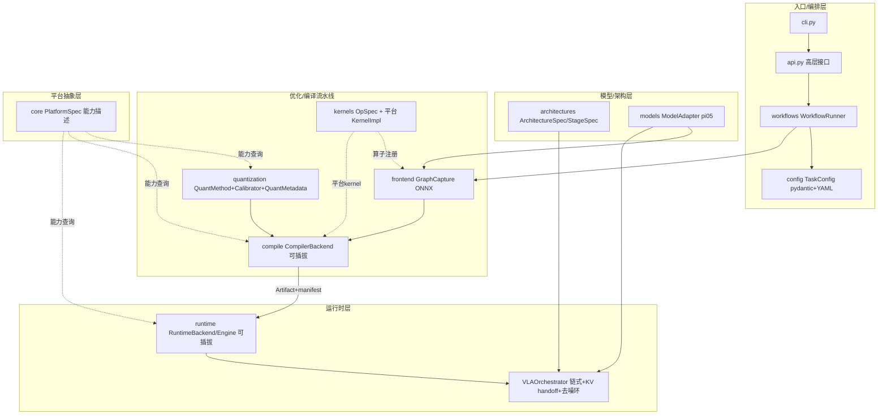
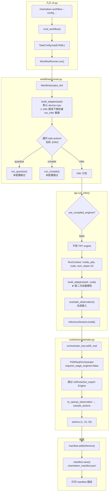
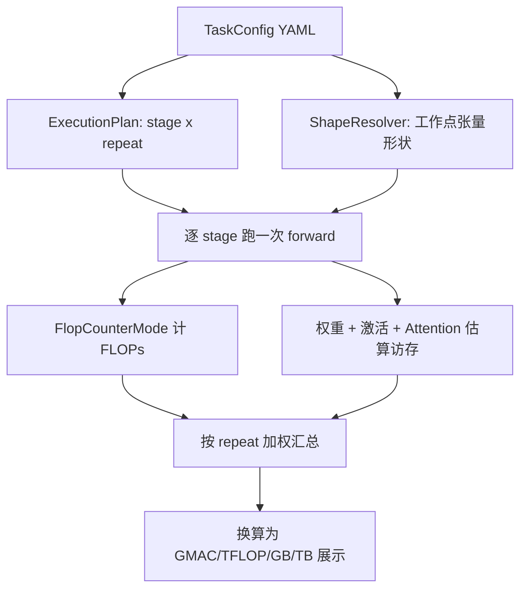

# Chameleon 架构设计文档

[English](../README.md) | [中文](../README.zh-CN.md) | 架构文档（中文）

> 跨多平台(NVIDIA / AMD / Intel / CPU / 地平线)的端侧 VLA 模型 **量化 / 编译 / 推理 / 自定义算子** 框架。
> MVP 模型为 openpi 的 **pi0.5**(`pi05`)。
> 策略:**统一前端抽象 + 可插拔原生编译后端**。

本文是面向后续开发的设计总览,包含:端侧 VLA 推理特点分析、对标业界框架的调研结论、Chameleon 的分层架构与核心抽象、数据流、扩展指南,以及分阶段路线图。

---

## 1. 端侧 VLA(pi05)推理特点

源自对 `openpi/src/openpi/models_pytorch/pi0_pytorch.py` 的分析,这些特点是整个架构的设计前提:

- **三段式计算图**:`embed_prefix`(SigLIP 视觉 + Gemma 语言)→ `paligemma_with_expert`(LLM prefix)→ `denoise_step`(Gemma action expert)。可拆为三个独立编译单元:`vit` / `llm_prefix` / `action_expert`,KV / hidden state 跨单元传递。
- **去噪循环是延迟热点**:`sample_actions` 中 prefix 只前向一次并缓存 KV(`use_cache=True`),随后 `denoise_step` 按 flow-matching 迭代 `num_steps`(默认 10)次复用 prefix KV。优化重心在 `action_expert` 去噪环。
- **静态、可预分配**:batch=1、固定 `action_horizon` / 序列长度、固定去噪步数 → 适合静态 shape + AOT 编译 + CUDA Graph,而非服务端的 paged / continuous batching。
- **跨平台差异集中在两层**:
  1. 算子 kernel(attention / gemm / 量化)
  2. 编译工具链(NVIDIA→TensorRT、Intel→OpenVINO、地平线→BPU SDK、AMD/CPU→TVM)

这意味着:**上层模型定义、量化语义、编排逻辑应当平台无关,差异收敛到「编译后端」和「算子 kernel」两层**。

---

## 2. 业界框架调研结论(可借鉴点)

### 2.1 model_optimizer(已有实现,主要参考)

位置:`model_optimizer/src/model_optimizer`。

**做得好、值得保留的抽象:**

- `ArchitectureSpec` / `StageSpec`:模型无关的 stage 概念,每个 stage 声明 `supported_backends` / `quantizable`。
- Policy 与 Backend 分离:`PolicyAdapter` 对接 openpi,`BackendInstaller` 挂载运行时。
- 分阶段后端矩阵:`ServerConfig.resolve_stages()` 支持 vit / llm / denoise 混用不同后端。
- Feature 注册表 + Artifact manifest 血缘 + 薄 Workflow 编排(复用 CLI,不重复逻辑)。

**局限性(本框架要解决的):**

| 局限 | 表现 |
|------|------|
| 无 Platform 抽象 | TRT/ORT/Native 平行实现,新增 SNPE/CoreML 需大量 fork |
| NVIDIA 强绑定 | ModelOpt / TensorRT / CuTe DSL / CUDA Graph 全栈 NVIDIA |
| 注册键仅 `(architecture, backend)` | 缺 `platform` 维度 |
| Executor 接口不统一 | TRT / Native / ORT API 不一致 |
| 校准路径分裂 | pi05 shard / YOLO collector / generic 三套,无统一 `Calibrator` |
| 配置混杂 | `.py` + JSON + argparse,无统一 schema |

### 2.2 TVM / MLC-LLM(跨平台编译范式)

- **TVM**:`DeviceAPI` / `Target` / `CodeGen` 三层分离;Relax(图 IR)+ TIR(张量 IR)双层 IRModule;**BYOC**(Bring Your Own Codegen)是接入地平线 BPU 等专用 NPU 的标准路径。
- **MLC-LLM**:在 TVM 之上的垂直 LLM 编译器。关键模式:
  - **权重(跨平台共享)/ Model Library(平台相关)/ Runtime Engine(统一 API)三分离**。
  - `auto_target.py` 的 **PRESET + build_func**:用 preset 字符串绑定 Target 配置与产物打包方式。
  - 量化策略注册表(`q4f16_1` / `q4f16_awq` / `e4m3` …)+ `op.enable + fallback`(算子级 backend 切换)。

借鉴:`PlatformSpec` 即 TVM `Target` + MLC PRESET 的思想;地平线优先走 TVM BYOC;通用 CPU/AMD 走 TVM Relax + DLight。

### 2.3 TensorRT-Edge-LLM / sglang / vLLM(端侧推理 + 算子可插拔)

- **TensorRT-Edge-LLM(最相关,端侧范式)**:
  - 三阶段硬分离:**量化 → ONNX 导出 → Engine Build → C++ Runtime**,runtime 无 PyTorch 依赖。
  - `EngineExecutor`(薄 TRT 包装)/ `DecodingStrategy`(解码循环)/ Sampling 分离;`TensorRegistry` 声明式 I/O 绑定。
  - prefill / decode **双 optimization profile**;CUDA Graph;custom op 三段式(stub → ONNX schema → C++ plugin);kernel 按 SM 链接 artifact。
  - 已有 Alpamayo VLA 示例:VLM engine + action engine 链式,KV 跨 engine 传递。
- **sglang / vLLM(算子后端可插拔的注册模式)**:
  - `@register_attention_backend` / `AttentionBackendEnum` + selector:按 `platform + phase + dtype` 选 kernel。
  - `QuantizationConfig.get_quant_method(layer)`:按层类型分发量化方法。
  - KV 类型系统(`KVCacheSpec` / `KVQuantMode`),enum dispatch 而非字符串匹配。

借鉴:`Engine.run` 统一接口源自 `EngineExecutor`;`RuntimeRegistry` / `KernelRegistry` 源自 attention backend 注册;`QuantMetadata` 契约源自 Edge-LLM metadata + vLLM `get_quant_method`。

---

## 3. 整体架构



### 分层职责

| 层 | 包 | 职责 |
|----|----|------|
| 平台抽象 | `core/platform.py` | `PlatformSpec` 描述 vendor/device/dtype/工具链/kernel_tag。量化/编译/运行时均查询它分流。**model_optimizer 缺失的核心抽象。** |
| 模型/架构 | `architectures/`、`models/` | `ArchitectureSpec`+`StageSpec`;`ModelAdapter` 暴露各 stage `nn.Module` 与 example inputs |
| 统一前端 | `frontend/` | `GraphCapture` 把 PyTorch stage 导出为平台中性图(ONNX,预留 torch.export) |
| 量化 | `quantization/` | `QuantMethod` 注册表 + `Calibrator` + `QuantMetadata` 契约 |
| 编译(核心) | `compile/` | `CompilerBackend.compile(graph, quant_meta, ctx) -> Artifact`,每平台一个实现 |
| 自定义算子 | `kernels/` | `OpSpec`(逻辑算子)+ 多平台 `KernelImpl`,三段式 |
| 运行时 | `runtime/` | `RuntimeBackend.load -> Engine.run`;`Pi05Orchestrator`(三段式) / `Pi05RealOrchestrator`(整模型 sample_actions) |
| 编排/配置 | `workflows/`、`config/`、`cli.py`、`api.py` | TaskConfig 驱动的 quantize→compile→infer |

---

## 4. 核心抽象与注册表

所有插件通过 **import 时副作用注册** 到泛型 `Registry`(`core/registry.py`),`import chameleon` 即填充全部注册表。

| 注册表 | 键 | 位置 |
|--------|----|----|
| `PLATFORM_REGISTRY` | `name` | `core/platform.py` |
| `ARCHITECTURE_REGISTRY` | `name` | `architectures/registry.py` |
| `MODEL_REGISTRY` | `name` | `models/base.py` |
| `GRAPH_CAPTURE_REGISTRY` | `name` | `frontend/base.py` |
| `QUANT_METHOD_REGISTRY` | `name` | `quantization/registry.py` |
| `CALIBRATOR_REGISTRY` | `(architecture, stage)` | `quantization/calibrate/base.py` |
| `COMPILER_REGISTRY` | `name`(= `PlatformSpec.compiler`) | `compile/base.py` |
| `RUNTIME_REGISTRY` | `name`(= `PlatformSpec.runtime`) | `runtime/base.py` |
| `KERNEL_REGISTRY` / `OP_REGISTRY` | `(op, vendor)` / `name` | `kernels/base.py` |
| `ORCHESTRATOR_REGISTRY` | `name`（如 `pi05` / `pi05_real`） | `runtime/orchestrator.py` |

### 关键接口签名

```python
# core/platform.py
@dataclass(frozen=True)
class PlatformSpec:
    name: str; vendor: str; device: str
    dtypes: tuple[str, ...]
    compiler: str          # 默认 CompilerBackend key
    runtime: str           # 默认 RuntimeBackend key
    kernel_tag: str | None # "sm_87" / "bpu_j5"
    torch_device: str      # 参考运行时的 torch.device

# compile/base.py —— 可插拔编译后端(核心扩展点)
class CompilerBackend(ABC):
    name: str
    def available(self) -> bool: ...
    @abstractmethod
    def compile(self, graph: Artifact, quant_meta: QuantMetadata | None,
                ctx: CompileContext, cfg: dict | None) -> Artifact: ...

# quantization/base.py
class QuantMethod(ABC):
    name: str
    @abstractmethod
    def quantize(self, module, calibrator: Calibrator,
                 platform: PlatformSpec, config: QuantConfig
                 ) -> tuple[Any, QuantMetadata]: ...

# kernels/base.py —— 自定义算子三段式
class KernelImpl(ABC):
    op: str; platform_vendor: str
    def frontend_stub(self): ...       # torch.library custom op
    def graph_node(self, g, *ins): ... # ONNX symbolic / 图节点
    def backend_artifact(self, kernel_tag=None): ... # plugin .so / kernel lib
    @abstractmethod
    def reference(self, *args): ...    # 正确性参考(CPU/测试)

# runtime/base.py —— 统一执行接口
class Engine(ABC):
    @abstractmethod
    def run(self, inputs: dict) -> dict: ...
class RuntimeBackend(ABC):
    name: str
    @abstractmethod
    def load(self, artifact: Artifact, ctx: RunContext) -> Engine: ...
```

### QuantMetadata 契约

量化产出不仅是量化后的 module,还包含一份描述各组件数值格式的 `QuantMetadata`(`component_dtypes`:weight/activation/kv_cache…)。编译后端据此选 kernel / build flag,运行时据此 dispatch——避免字符串硬编码。

---

## 5. 数据流(pi05 端到端)

### 5.1 参考模型 / TRT 路径（三段式 stage + Engine）

适用于 `use_reference=true` 或 `use_compiled_engines=true`（参考模型 compile→TRT）。编排器为 **`Pi05Orchestrator`**，各 stage 经统一 `Engine.run` 通信，可 stage 级后端混用。

```
openpi checkpoint / 参考模型
   │  ModelAdapter.build()           → 三个 stage nn.Module
   ├─ quantize  QuantMethod.quantize(module, Calibrator, platform, QuantConfig)
   │                                  → 量化 module + QuantMetadata
   ├─ compile   GraphCapture.capture(module, example_inputs) → ONNX Artifact
   │            CompilerBackend.compile(onnx, quant_meta, ctx) → engine Artifact
   └─ infer     InferenceSession.build()  → 每 stage 按 stage_runtimes 选 RuntimeBackend.load → Engine
                Pi05Orchestrator.infer(obs):
                   img_tokens   = vit_engine.run({"images": ...})
                   prefix_memory= llm_prefix_engine.run({...})        # KV,算一次
                   x_t = noise
                   for t in flow_matching_schedule(num_steps):        # 去噪热点
                       v_t = action_engine.run({state, prefix_memory, x_t, time_emb})
                       x_t = x_t + dt * v_t
                   return x_t                                         # [B, horizon, action_dim]
```

配置示例:`configs/pi05_cpu.yaml`、`configs/pi05_nvidia.yaml`、`configs/pi05_nvidia_trt.yaml`。

### 5.2 真实 openpi 权重路径（整模型 PyTorch + sample_actions）

适用于 `use_reference=false` + 真实 checkpoint。编排器为 **`Pi05RealOrchestrator`**（`orchestrator_key="pi05_real"`），**不拆 stage、不加载 per-stage Engine**，直接调用 `PI0Pytorch.sample_actions`（prefix KV + adaRMS + 去噪环均在 openpi 内部）。

```
真实 checkpoint (model.safetensors)
   │  Pi05Adapter.build(cuda)
   │     PI0Pytorch(pi05) → safetensors.load_model → to_bfloat16_for_selected_params
   ├─ quantize（可选，仅当 actions 含 quantize）
   │     adapter.stage_module("action_expert") → gemma_expert 子模块
   │     ModelOpt fp8 PTQ（或 metadata-only）
   ├─ compile   ❌ 真实子模块 ONNX/QDQ 尚未打通，会 compile_skipped
   └─ infer     InferenceSession.build()
                   orchestrator_key=pi05_real, requires_stage_engines=false → 跳过 Engine 加载
                Pi05RealOrchestrator.infer(obs):
                   Observation = adapter.to_openpi_observation(obs)
                   return model.sample_actions(cuda, Observation, num_steps)
                   # embed_prefix → past_key_values → denoise_step × num_steps
                   # → [B, action_horizon, action_dim]
```

配置示例:`configs/pi05_rtx4070_realweights.yaml`（平台 `nvidia_ada` / RTX 4070 sm_89）。

### 5.3 workflow 命令执行流程（`pi05_rtx4070_realweights.yaml`）

命令:

```bash
chameleon workflow --config configs/pi05_rtx4070_realweights.yaml
```

当前该 YAML 的 `actions: [infer]`，**不会执行** 文件中预置的 `quantize` 块（量化仅在 `actions` 含 `quantize` 时由 `WorkflowRunner` 调用 `run_quantize`）。



**与 `chameleon infer` 的差异**

| 项目 | `workflow` | `infer` |
|------|------------|---------|
| 写 `Manifest` | 是 | 否 |
| `build_adapter` 次数 | 2 次（workflow 先 CPU，run_infer 再 CUDA） | 1 次（直接 CUDA） |
| 按 `actions` 执行 quantize/compile | 是 | 否（仅 infer） |

**`TaskConfig.actions` 与 YAML 块的关系**

| YAML 块 | 何时执行 |
|---------|----------|
| `quantize:` | 仅 `actions` 含 `quantize` |
| `compile:` | 仅 `actions` 含 `compile` |
| `infer:` | `actions` 含 `infer` 或单独 `chameleon infer` |

**已知限制（workflow + 真实权重）**

- `run_infer` 会**重新** `build_adapter`，与 workflow 开头那次 adapter 不共享；若 `actions: [quantize, infer]`，quantize 改动的子模块不会自动带入 infer，需后续改为复用同一 adapter 实例。
- 当前 `example_observation` 为合成输入，未接入 openpi Policy 的 norm_stats / data transforms。
- 真实模型 `use_compiled_engines` 须保持 `false`（ONNX QDQ 导出未打通）。

所有 stage（参考路径）通过统一的 `Engine.run` 通信,因此可 **stage 级后端混用**(如 `vit=tensorrt, action_expert=pytorch`),由 `TaskConfig.stage_runtimes` 配置。`Manifest`(`chameleon_manifest.json`)记录每步 Artifact 血缘。

### 5.4 `chameleon stats` 实现原理

`chameleon stats` 与 `chameleon profile`（仅测延迟）互补：在**一次完整推理**的工作点下，估算 **MACs/FLOPs** 与 **理论访存量**。统计的是**静态计算/访存总量**，不是吞吐量（TFLOPS/s），也不是 TRT engine 实测 DRAM 带宽。

**命令示例**

```bash
chameleon stats --config configs/pi05_cpu.yaml
chameleon stats --config configs/pi05_libero_trt_deploy.yaml --dry-run
chameleon stats --config configs/pi05_libero_trt_deploy.yaml --format json --output output/stats.json
chameleon stats --config configs/pi05_libero_trt_deploy.yaml --measured   # CUDA profiler 校验
```

**整体流程**



**模块职责**

| 模块 | 路径 | 职责 |
|------|------|------|
| CLI | `chameleon/commands/stats.py` | `--format` / `--output` / `--measured` / `--dry-run` |
| 主入口 | `chameleon/profile/compute_stats.py` | `stats_infer()` 串联 plan → shapes → count → 格式化 |
| 执行计划 | `chameleon/profile/execution_plan.py` | 从 TaskConfig 推断 stage × repeat |
| 形状解析 | `chameleon/profile/shape_resolver.py` | 合并 `infer` 与 `build_cfg opt_shapes` |
| 计数器 | `chameleon/profile/counters.py` | FlopCounterMode + 理论访存估算 |
| pi05 stage | `chameleon/deploy/pi05/stats.py` | 复用 Export wrapper 构建 forward |
| 单位换算 | `chameleon/profile/units.py` | GMAC/TFLOP/GB/TB 可读展示 |

#### 5.4.1 执行计划（ExecutionPlan）

先决定**哪些子图跑几次**，避免与真实推理路径不一致或重复计数。

| 配置路径 | 统计的 stage | 次数 |
|---------|-------------|------|
| `deploy.backend=pi05` | vit → llm → denoise | 1 → 1 → `num_steps` |
| `use_reference=false`（真实 openpi，real 模式） | 同上（与 deploy 对齐） | 同上 |
| `use_reference=true`（参考模型） | vit → llm_prefix → action_expert | 1 → 1 → `num_steps` |

**去重规则**：配置含 `denoise` 时，去噪环**只计 `denoise×num_steps`**，**不计独立 `expert`**——denoise ONNX 已内嵌 gemma expert + action projection，与 `model_optimizer` TRT 运行时一致。

`num_steps` 来自 `infer.num_steps`（缺省 10）；`batch_size` 来自 `infer.batch_size`。

#### 5.4.2 工作点形状

每个 stage 的输入张量形状决定计算量与激活大小：

- **Deploy / Real 路径**：读 `configs/build_configs/*.py` 的 `opt_shapes`（如 vit `pixel_values: (3,3,224,224)`，llm `seq_len=818`）
- **Reference 路径**：参考模型固定尺寸（如 `action_horizon=50`）

Deploy 路径加载真实 pi05 权重，用与 ONNX 导出相同的 `Pi05VitExport` / `Pi05LlmExport` / `Pi05DenoiseExport` wrapper 做 forward；Reference 路径用 `Pi05ReferenceModel` 三 stage。

#### 5.4.3 计算量（MACs / FLOPs）

对每个 stage：

1. 按 `opt_shapes` 构造 dummy 输入（随机张量）
2. `torch.inference_mode()` 下跑一次 forward
3. PyTorch **`FlopCounterMode`** 统计 FLOPs；约定 **`MACs = FLOPs // 2`**
4. 若 FlopCounter 不可用，fallback 仅对 `nn.Linear` hook 估算（会漏 Attention/LayerNorm 等）

汇总：

```
total_macs  = vit_macs×1 + llm_macs×1 + denoise_macs×num_steps
total_flops = 2 × total_macs
```

**含义**：当前 shape 下该 stage **一次 forward 的乘加次数**；不是延迟，也不是 GFLOPS/s。若要算力利用率需自行除以实测延迟：`GFLOPs / latency_seconds`。

#### 5.4.4 访存量（理论字节数）

Roofline 风格**简化上界**，非 GPU 实测 DRAM 流量。

| 分量 | 公式 | 说明 |
|------|------|------|
| 权重 | `weight_bytes = 参数量 × dtype_bytes` | 假设每次 forward 权重至少读一遍；bf16/fp16→2B，fp32→4B |
| 激活 | `activation_bytes = Σ(输入字节)×2 + Σ(输出字节)` | 输入侧×2 近似读+写；用张量实际 `element_size()` |
| Attention 额外 | 含 `past_keys` 的 stage 按层估算 QK logits + PV | expert/denoise；`num_heads ≈ head_dim//64` |
| 单次合计 | `total_bytes_per_call = weight + activation + attention` | |
| 汇总 | `total_bytes = Σ(stage_total × repeat)` | |

**算术强度**（Roofline 参考）：

```
arithmetic_intensity = total_macs / total_bytes   (MAC/Byte)
```

#### 5.4.5 输出格式

JSON 中每个指标含 `raw`（原始整数）、`value`/`unit`/`display`（可读单位）：

| 原始量 | 展示规则 | 示例 |
|--------|---------|------|
| MACs / FLOPs | ≥10¹²→T，≥10⁹→G | 318 GMACs，636 GFLOPs |
| Bytes | ≥1 TB→TB，≥1 MB→GB 小数 | 0.835 GB |

**注意**：JSON 里的 GFLOPs/TFLOPs 表示**总操作次数**，不是每秒 TFLOPS。

#### 5.4.6 `--measured` 可选校验

CUDA 可用时，用 `torch.profiler(with_flops=True, profile_memory=True)` 再跑一遍 forward，与理论 FLOPs 对比；差异 >10% 打 WARN。不代表 TRT engine 真实访存。

#### 5.4.7 已知局限

1. **理论访存是上限近似**：未建模 cache reuse、算子融合、FlashAttention、TRT plugin 内部 traffic
2. **小算子 FLOPs 可能漏计**：Softmax、LayerNorm、SiLU 等；主耗时 MatMul/Attention 影响相对小
3. **PyTorch wrapper ≠ TRT engine**：数值接近但不保证一致
4. **`embed_prefix` 未纳入**统计
5. **权重每次 forward 读一遍**是保守假设；权重常驻显存时有效带宽需求更低

### 5.5 TRT layer profile（trtexec + draw WebUI）

对已 **compile** 产出的 `.engine` 运行 `trtexec --loadEngine=... --dumpProfile --exportProfile=...`，按 stage 写出 layer timing JSON，并用浏览器表格查看（参考 model_optimizer `draw profile`）。

```
export ONNX → compile TRT engine → trt_profile (trtexec)
  → profiles/{stage}.profile.json
  → profiles/index.html（静态 dashboard）
  → viewer=webui/both 时 workflow 末尾阻塞起 HTTP 服务
```

| 模块 | 职责 |
|------|------|
| `deploy/trt_profile.py` | 组装 trtexec argv；从 `build_cfg` 注入 `minShapes/optShapes/maxShapes` 与 `--plugins` |
| `draw/trt_profile_viewer.py` | 解析 profile JSON；单文件 / 多 stage dashboard HTML |
| `api.run_trt_profile` / `WorkflowRunner` | `actions` 含 `trt_profile` 时执行；Manifest `kind=trt_profile` |
| `commands/trt_profile.py` / `commands/draw.py` | 独立 CLI |

**与 compile 的区别**：profile **不重建** engine，避免 tactic / plugin 与 Python build 路径不一致。形状与 plugin 必须与 compile 相同（读各 stage 的 `configs/build_configs/*.py`）。

**配置**（顶层 `profile:` + `trt_profile:` 步骤列表；见 `configs/pi05_libero_trt_deploy.yaml`）：

- `profile.viewer`: `static` | `webui` | `both`（默认 `static`）
- `profile.iterations` / `warmup` / `plugin_lib_paths` / `fail_fast`
- `trt_profile` 为空时默认 profile `compile` 中全部 stage

**命令**：

```bash
chameleon workflow --config configs/pi05_libero_trt_deploy.yaml --dry-run
chameleon trt-profile --config configs/pi05_libero_trt_deploy.yaml
chameleon draw profile output/pi05_libero_trt/profiles/vit.profile.json
chameleon draw profile --config configs/pi05_libero_trt_deploy.yaml
```

**已知限制**：`trtexec` 须在 PATH 且 TensorRT 版本与 build 一致；JSON 仅含 layer timing（无 FLOPs/访存，见 §5.4 `chameleon stats`）；`denoise` 已含 expert 子图，避免与 `expert` 重复解读。

---

## 6. 当前实现状态

| 组件 | 状态 |
|------|------|
| `core` / `architectures` / `models(pi05)` / `runtime(pytorch)` / `Pi05Orchestrator` / `Pi05RealOrchestrator` / `config` / `cli` / `workflows` | **功能完整、可运行** |
| `core/platform.py` 平台 `nvidia_ada`(RTX 4070 sm_89) | **已注册** |
| `frontend/onnx_export`(dynamo→legacy 回退 + modelopt 导出模式) | 完整 |
| `quantization`(int8/int8_sq/fp8/int4_awq/w4a8_awq/nvfp4,封装 ModelOpt) | 接口完整;有 modelopt 时真实插入量化器,缺失时降级为 metadata-only |
| `compile/tensorrt` | **可用**:三 stage 真实 build engine;支持插件预加载、FP16/INT8/FP8 flag、prefill/decode 双 optimization profile |
| `runtime/tensorrt`(`TensorRegistry` 声明式绑定 + 位置绑定 + 设备缓冲 + enqueueV3 + 可选 CUDA Graph) | **可用**:已验证 compile→infer 闭环,TRT vs PyTorch cosine=1.0(FP16 精度差 ~1e-3) |
| `profile/compute_stats` + `chameleon stats` CLI | **可用**:整推理 MACs/FLOPs + 理论访存;deploy/reference/real 自动选路径;见 **§5.4** |
| `deploy/trt_profile` + `draw/trt_profile_viewer` + `trt-profile` / `draw profile` CLI | **可用**:对已 build engine 跑 trtexec layer profile + 多 stage WebUI;见 **§5.5** |
| `kernels/fmha_d256` | 三段式:真实 `torch.library` custom op(`torch.ops.chameleon.fmha_d256`,eager=SDPA)+ ONNX symbolic + nvidia plugin 占位(按 kernel_tag 选 artifact) |
| `compile/openvino` / `compile/tvm` / `compile/horizon` | Stub,含集成方案说明,`NotImplementedError` |

**鲁棒性设计**:缺 modelopt / 特定工具链 / GPU 时,量化、编译、设备选择均优雅降级(记录 `compile_skipped` 血缘并继续),保证全链路在任意机器可跑。

### 阶段二已落地(NVIDIA 深化)

- **compile→infer 闭环**:`InferConfig.use_compiled_engines=true` 时,compile 产出的 engine 经 `stage_artifacts` 注入 `InferenceSession`,推理真实运行在 TRT engine 上(非 PyTorch 参考路径)。见 `configs/pi05_nvidia_trt.yaml`。
- **数值校验**:同权重下 TRT(FP16)与 PyTorch 输出 `cosine=1.000000`、`max_abs≈1.25e-3`。
- **TensorRT runtime**:`TensorRegistry` 发现 I/O、按位置绑定(规避 ONNX 名重命名)、持久化设备缓冲(去噪环复用)、`execute_async_v3`、可选 CUDA Graph 捕获/重放。
- **双 optimization profile**:编译器支持 `cfg["profiles"]`(context/prefill + generation/decode),runtime 按 `profile_index` 选择;静态 shape 的参考路径下为 no-op。
- **fmha_d256**:升级为真实 torch custom op + ONNX symbolic,nvidia 实现按 `kernel_tag`(sm_87/sm_101)解析 plugin artifact。
- **真实 openpi 权重加载**:`use_reference=false` + `checkpoint`(`.safetensors`/`.pt`/`.pth`);`safetensors.load_model` + `to_bfloat16_for_selected_params`;按 `_OPENPI_STAGE_ATTR` 映射三 stage 子模块(量化/compile 用)。见 `configs/pi05_realweights.yaml`。
- **真实模型 PyTorch 端到端 infer**:`Pi05RealOrchestrator` 直接调用 `PI0Pytorch.sample_actions`;`InferenceSession` 在 `requires_stage_engines=false` 时跳过 per-stage Engine。**RTX 4070 已验证**(`configs/pi05_rtx4070_realweights.yaml`,输出 `(1,10,32)`,显存 ~7.6GB)。workflow 执行流程见 **§5.3**。

### 阶段二未尽事项(后续 bring-up)

- **量化模型 ONNX 导出**:modelopt 已量化模块(fake-quant 算子)经标准导出器翻译失败,当前优雅跳过 compile。需对齐 modelopt 的 ONNX QDQ 导出路径(版本敏感)。
- **真实模型 compile→TRT**:真实子模块/量化模块尚不能稳定导出 ONNX,`use_compiled_engines` 对真实权重须保持 `false`。
- **workflow quantize→infer 复用**:当前 `run_infer` 会重新 `build_adapter`,quantize 后的子模块改动不会自动带入 infer(见 §5.3)。
- **真实 observation**:未接入 openpi Policy 的 norm_stats / data transforms,当前为合成输入。
- **on-device**:Orin/Thor 实测、`fmha_d256` CuTe DSL 真实 plugin 构建与链接。

### 验证命令

```bash
chameleon platforms        # 列出平台(含 nvidia_ada / RTX 4070)
chameleon architectures    # pi05 三 stage
chameleon info             # 已注册的 compilers/runtimes/quant/kernels/orchestrators
chameleon infer    --config configs/pi05_cpu.yaml                    # 参考模型 → (1,50,32)
chameleon workflow --config configs/pi05_nvidia.yaml                 # quantize→compile→infer(参考路径)
chameleon workflow --config configs/pi05_nvidia_trt.yaml             # compile→infer,TRT engine 推理
chameleon workflow --config configs/pi05_rtx4070_realweights.yaml    # 真实权重 PyTorch E2E(§5.3)
chameleon profile  --config configs/pi05_cpu.yaml --runs 20
chameleon stats    --config configs/pi05_cpu.yaml                   # 计算量/访存量(§5.4)
chameleon stats    --config configs/pi05_libero_trt_deploy.yaml --dry-run
chameleon trt-profile --config configs/pi05_libero_trt_deploy.yaml --dry-run
chameleon draw profile --config configs/pi05_libero_trt_deploy.yaml
```

---

## 7. 扩展指南

### 新增一个平台

1. 在 `core/platform.py` 注册 `PlatformSpec`(指定 `compiler` / `runtime` / `dtypes` / `kernel_tag`)。
2. 实现并注册 `CompilerBackend`(`compile/<platform>/`)与 `RuntimeBackend`(`runtime/<platform>/`)。
3. (可选)为热点算子在 `kernels/` 注册该 vendor 的 `KernelImpl`。
4. 各 stage 在 `ArchitectureSpec.supported_platforms` 中声明可用即可。

### 新增一个量化方法

实现 `QuantMethod`,在 `quantization/methods/` 注册;`quantize()` 返回 `(module, QuantMetadata)`。

### 新增一个模型架构

1. 定义 `ArchitectureSpec`(stages + `orchestrator` key)。
2. 实现 `ModelAdapter`(`stage_module` / `example_observation` / `make_config`)。
3. 实现并注册对应 `Orchestrator`:`Pi05Orchestrator`(三段式 Engine 链)或 `Pi05RealOrchestrator`(整模型 `sample_actions`);`ModelAdapter.orchestrator_key` 可覆盖架构默认编排器。

---

## 8. 分阶段路线图

- **阶段一(已完成,本 MVP)**:全部核心抽象 + 注册表 + pi05 参考模型 + PyTorch 运行时 + VLAOrchestrator + TensorRT 编译路径,端到端跑通。
- **阶段二(NVIDIA 深化,主体已完成)**:TensorRT runtime 落地、**参考模型 compile→infer 闭环(cosine=1.0)**、`fmha_d256` custom op、真实 openpi 权重加载、**`Pi05RealOrchestrator` + RTX 4070 真实权重 PyTorch E2E 已验证**。未尽:量化 ONNX QDQ、真实模型 TRT compile、workflow quantize→infer adapter 复用、openpi Policy transforms、Orin/Thor 实测(见 §6)。
- **阶段三(通用平台)**:接入 TVM(AMD GPU / 通用 CPU,Relax + DLight)与 Intel OpenVINO(+ NNCF INT8)。
- **阶段四(专用 NPU)**:地平线 BPU 经 TVM BYOC 或 `hb_mapper` 接入;跨平台 kernel 自动调度;权重 / Model Library / Runtime 三分离以支持 OTA。

---

## 9. 关键文件索引

| 职责 | 路径 |
|------|------|
| 平台抽象 | `chameleon/core/platform.py` |
| 架构定义 | `chameleon/architectures/pi05.py` |
| pi05 适配 + 参考模型 | `chameleon/models/pi05/{adapter,reference}.py` |
| ONNX 导出 | `chameleon/frontend/onnx_export.py` |
| 量化方法 | `chameleon/quantization/methods/modelopt_ptq.py` |
| TensorRT 编译 | `chameleon/compile/tensorrt/backend.py` |
| TensorRT 运行时(TensorRegistry/CUDA Graph) | `chameleon/runtime/tensorrt/backend.py` |
| 非 NVIDIA 编译 stub | `chameleon/compile/stubs.py` |
| 自定义算子示例 | `chameleon/kernels/fmha/fmha_d256.py` |
| 编排 + Session + 真实编排器 | `chameleon/runtime/orchestrator.py`（`Pi05Orchestrator` / `Pi05RealOrchestrator` / `InferenceSession`） |
| 高层 API + workflow 调度 | `chameleon/api.py`、`chameleon/workflows/runner.py` |
| 配置 schema | `chameleon/config/schema.py` |
| RTX 4070 真实权重任务配置 | `configs/pi05_rtx4070_realweights.yaml` |
| pi05 TRT 部署 + stats 示例 | `configs/pi05_libero_trt_deploy.yaml` |
| 计算/访存统计 | `chameleon/profile/compute_stats.py`、`execution_plan.py`、`counters.py`、`units.py`；`chameleon/deploy/pi05/stats.py`；`chameleon/commands/stats.py` |
| CLI | `chameleon/cli.py` |
