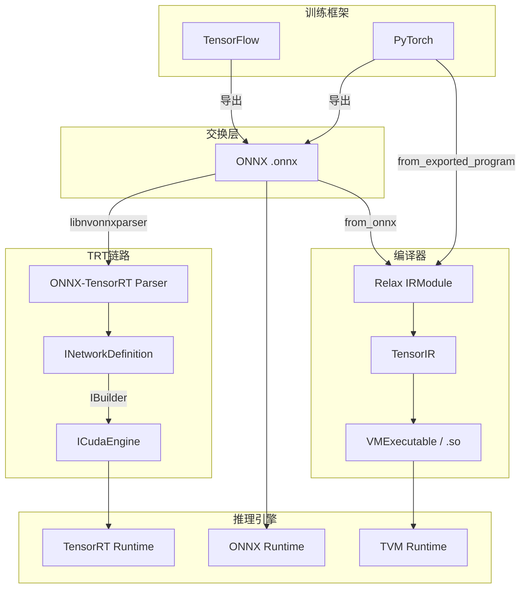
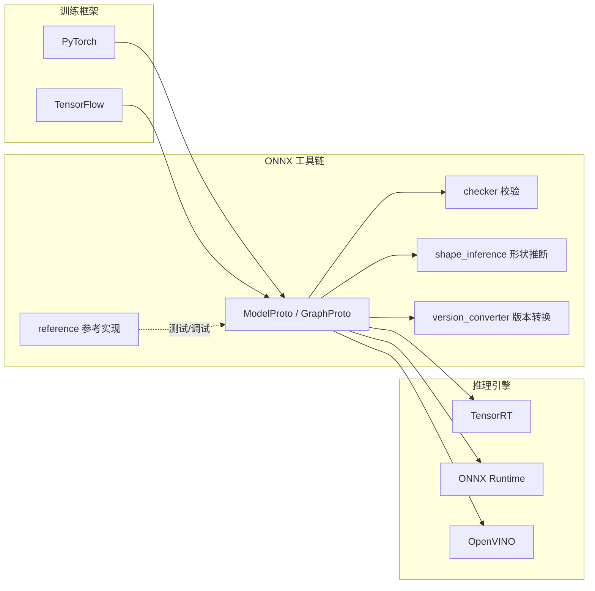
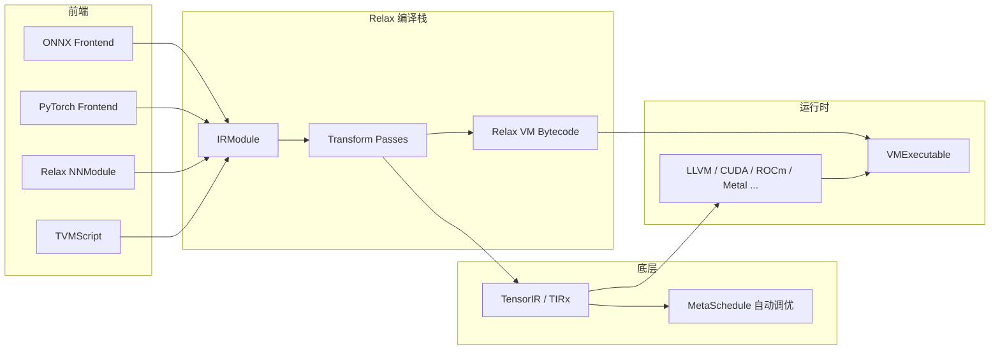
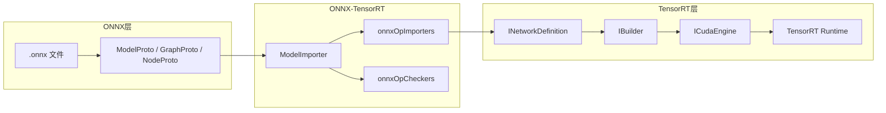

# 模型编译前端表示对比

本文对比模型编译链路中的三类组件：**ONNX**（开放交换格式）、**ONNX-TensorRT**（ONNX → TensorRT 的 Parser/导入器）、**TVM Relax**（编译器内部 IR）。三者层次不同：ONNX 是格式，ONNX-TensorRT 是面向单一后端的导入桥，Relax 是通用编译器 IR。

| 项目 | 仓库 | 版本参考 |
|------|------|----------|
| ONNX | [github.com/onnx/onnx](https://github.com/onnx/onnx) | 1.23.0 |
| ONNX-TensorRT | [github.com/onnx/onnx-tensorrt](https://github.com/onnx/onnx-tensorrt) | TensorRT 11.0 |
| TVM Relax | [github.com/apache/tvm](https://github.com/apache/tvm) | main |

## 1. 总体对比

| 维度 | ONNX | ONNX-TensorRT | TVM Relax |
|------|------|---------------|-----------|
| **定位** | 开放的模型**交换格式** | ONNX → TensorRT 的 **Parser/导入器** | ML **编译器内部 IR** |
| **层次** | 格式规范 + 工具链 | 后端专用前端（非独立 IR） | 图级 IR + 完整编译栈 |
| **输入** | 各框架导出的模型 | ONNX `ModelProto`（`.onnx`） | ONNX / PyTorch / TVMScript 等 |
| **输出** | `.onnx` 文件 | TensorRT `INetworkDefinition` | `IRModule` → `VMExecutable` |
| **序列化** | Protobuf，跨平台 | 不产出独立格式；Engine 由 TRT Builder 序列化 | IRModule 内存对象；`.so` 部署产物 |
| **图表示** | 扁平 `GraphProto` | 直接映射为 TRT Layer 图 | `SeqExpr` + `BindingBlock` |
| **算子映射** | Schema 定义语义 | `onnxOpImporters`：ONNX Op → TRT Layer | `LegalizeOps`：Relax Op → `call_tir` |
| **优化** | checker、shape inference、version converter | **不含**；交给 TensorRT Builder | 融合、内存规划、MetaSchedule 等 pass |
| **代码生成** | 不提供 | 不提供；TRT `IBuilder` 负责 | TIR → LLVM / CUDA 等 + Relax VM |
| **运行时** | Reference Evaluator（非生产） | TensorRT Runtime（`ICudaEngine`） | VirtualMachine |
| **后端绑定** | 无关 | **仅 TensorRT** | 多硬件（CUDA、ROCm、LLVM…） |
| **主要用途** | 互操作、校验、归档 | 把 ONNX 模型导入 TensorRT 编译 | 端到端编译、调优、部署 |

## 2. 在编译链路中的位置



**关系说明：**

- **ONNX** 解决「模型如何在框架与引擎之间传递」——格式稳定、生态广泛。
- **ONNX-TensorRT** 解决「ONNX 如何被 TensorRT 读懂」——把 ONNX 算子逐节点翻译为 TRT Layer，**不是**新的 IR 格式。
- **Relax** 解决「模型如何被通用编译器理解、优化并生成高效代码」——变换灵活、可深度优化。

典型路径：

```
PyTorch / TF  ──导出──▶  ONNX (.onnx)  ──libnvonnxparser──▶  INetworkDefinition  ──Builder──▶  ICudaEngine
PyTorch / TF  ──导出──▶  ONNX (.onnx)  ──from_onnx──▶  Relax IRModule  ──tvm.compile──▶  VMExecutable
PyTorch       ──直接导入──▶  Relax IRModule  ──tvm.compile──▶  VMExecutable
```

## 3. ONNX

### 3.1 定位与目标

**ONNX（Open Neural Network Exchange）** 是 AI 模型**中间表示（IR）格式与工具链**的标准实现，主要面向**推理（inference）**场景。

核心目标：定义一种开放的、可扩展的**计算图模型格式**，让 PyTorch、TensorFlow 等框架导出的模型能在不同推理引擎（TensorRT、ONNX Runtime、OpenVINO 等）之间互通。

### 3.2 架构



### 3.3 目录结构

| 目录/模块 | 作用 |
|-----------|------|
| **`onnx/onnx_pb` / `onnx/__init__.py`** | 核心 Protobuf 数据结构：`ModelProto`、`GraphProto`、`NodeProto`、`TensorProto` 等；提供 `load_model` / `save_model` 等 I/O |
| **`onnx/defs/`** (C++) | **算子规范（Schema）**：定义 Conv、MatMul、Attention 等算子的输入/输出/属性 |
| **`onnx/checker.py`** | **模型合法性校验**：检查图结构、类型、算子是否符合规范 |
| **`onnx/shape_inference.py`** | **形状/类型推断**：静态分析张量 shape，写入 `value_info` |
| **`onnx/version_converter/`** | **Opset 版本转换**：如 opset 11 → 13 |
| **`onnx/helper.py`** | **模型构建工具**：`make_node`、`make_graph`、`make_model` 等 |
| **`onnx/numpy_helper.py`** | NumPy 与 `TensorProto` 互转 |
| **`onnx/parser.py` / `onnx/printer.py`** | 文本格式解析与打印 |
| **`onnx/compose.py` / `onnx/inliner.py`** | 图组合/合并、函数内联 |
| **`onnx/external_data_helper.py`** | **外部权重**：大模型权重存于 `.onnx.data` 等外部文件 |
| **`onnx/reference/`** | **纯 Python 参考实现**：`ReferenceEvaluator` |
| **`onnx/backend/test/`** | 后端一致性测试套件（Backend Scoreboard） |
| **`onnx/tools/` / `onnx/test/`** | 辅助脚本与单元测试 |

### 3.4 核心能力

**数据结构**

ONNX 模型本质是 Protobuf 序列化的计算图：

- **Graph**：节点（算子）+ 边（张量）
- **Initializer**：权重常量
- **OpsetImport**：声明使用的算子集版本

```python
import onnx
model = onnx.load("model.onnx")
onnx.checker.check_model(model)
onnx.save_model(model, "out.onnx")
```

**主要工具**

| 能力 | 说明 |
|------|------|
| 算子规范（`defs`） | C++ 实现，是 ONNX 规范的单一事实来源；Python 通过 `onnx.defs.get_schema("Conv")` 查询 |
| 校验（`checker`） | 导出后、部署前必做，避免非法图进入推理引擎 |
| 形状推断（`shape_inference`） | 推断中间张量 shape，便于内存规划 |
| Opset 转换（`version_converter`） | 算子语义迁移，如 Upsample → Resize |
| 参考实现（`ReferenceEvaluator`） | NumPy 实现各算子，用于验证导出与 backend 测试 |
| CLI | `check-model`、`check-node`、`backend-test-tools` |

### 3.5 技术栈

- **语言**：Python 接口 + C++ 核心
- **依赖**：`numpy`、`protobuf`、`typing_extensions`、`ml_dtypes`
- **构建**：scikit-build-core + CMake；支持 abi3 wheel（Python 3.12+）

---

## 4. TVM Relax

### 4.1 定位与目标

**Relax** 是 Apache TVM 的**图级 IR**，与 **TensorIR（TIR）** 共同构成跨层级编译栈：Relax 负责计算图语义与高层优化，TIR 负责张量程序级调度与代码生成。

核心目标：提供**可编译、可变换、可优化**的中间表示，将模型一路编译到目标硬件上的可执行模块（VM 字节码 + 原生 kernel）。

### 4.2 架构



**端到端编译流程**（`tvm.compile()`）：

1. **Relax IR** — `relax.Function` 位于 `IRModule` 中
2. **编译 pipeline** — 算子 legalization、融合、内存规划等图级 pass
3. **VMCodeGen** — Relax 函数翻译为 VM 字节码
4. **TIR 编译** — 剩余 TIR 函数编译为原生 kernel
5. **VMLink** — 打包为 `VMExecutable`，由 `VirtualMachine` 执行

### 4.3 目录结构

| 目录/模块 | 作用 |
|-----------|------|
| **`include/tvm/relax/expr.h`** | 核心表达式节点：`Call`、`Var`、`Constant`、`SeqExpr`、`If`、`Function` 等 |
| **`include/tvm/relax/type.h`** | 类型系统：`TensorType`（含符号维度）、`ShapeType`、`FuncType` 等 |
| **`include/tvm/relax/transform.h`** | C++ 层 transform pass 声明 |
| **`include/tvm/relax/dataflow_pattern.h`** | 数据流模式匹配语言，用于算子融合、模式重写 |
| **`include/tvm/relax/distributed/`** | 分布式 IR 扩展（分片、通信算子） |
| **`python/tvm/relax/`** | Python API：expr、transform、pipeline、vm_build |
| **`python/tvm/relax/op/`** | 高层算子定义（nn、linear_algebra、qdq、ccl、grad 等） |
| **`python/tvm/relax/transform/`** | Python 侧 pass 与 `LegalizeOps` 实现 |
| **`python/tvm/relax/pipeline.py`** | 预定义编译 pipeline |
| **`python/tvm/relax/frontend/`** | 模型导入：ONNX、PyTorch、TFLite、StableHLO；NNModule API |
| **`python/tvm/relax/training/`** | 训练支持：Trainer、Optimizer、Loss、自动微分 |
| **`src/relax/backend/vm/`** | VM 字节码生成 |
| **`docs/arch/relax_vm.rst`** | Relax VM 架构文档 |

### 4.4 IR 设计要点

**表达式模型（A-Normal Form）**

Relax 采用 **SeqExpr + BindingBlock** 结构，而非 ONNX 的扁平 Node 列表：

| 节点 | 作用 |
|------|------|
| `VarBinding` | 将表达式绑定到变量（`lv0 = R.matmul(...)`） |
| `DataflowBlock` | 纯数据流子图，便于融合与 dead-code 消除 |
| `SeqExpr` | 多个 BindingBlock + 最终 body 表达式 |
| `If` | 条件分支，支持动态控制流 |
| `MatchCast` | 运行时类型/shape 匹配，填充符号维度 |

**跨层级表示**

同一 `IRModule` 可同时包含 Relax 函数与 TIR 函数：

```python
@I.ir_module
class Module:
    @T.prim_func
    def relu(x: T.handle, y: T.handle): ...

    @R.function
    def forward(x: R.Tensor(...)):
        lv = R.call_tir(Module.relu, x, out_sinfo)
        return lv
```

**算子体系**

| 层级 | 示例 | 说明 |
|------|------|------|
| 高层 `relax.op` | `R.nn.relu`、`R.matmul` | 前端导入、用户编写 |
| 底层 intrinsic | `call_tir`、`call_dps_packed`、`call_pure_packed` | Legalize 后，对接 TIR 或外部库 |

**Transform Pass**

| Pass | 作用 |
|------|------|
| LegalizeOps | 高层算子 → `call_tir` / 外部调用 |
| FuseOps / FuseTIR | 算子融合，减少 kernel launch |
| FoldConstant | 常量折叠 |
| StaticPlanBlockMemory | 静态内存复用规划 |
| RewriteCUDAGraph | CUDA Graph 捕获优化 |
| MetaScheduleTuneIRMod | 自动调优 TIR kernel |
| Gradient | 自动微分，生成训练用反向图 |
| RunCodegen / FuseOpsByPattern | BYOC，对接自定义后端 |
| ToMixedPrecision | 混合精度转换 |

**前端导入**

| 前端 | 入口 | 说明 |
|------|------|------|
| ONNX | `relax.frontend.onnx.from_onnx` | 保留动态 shape，注册表式算子转换 |
| PyTorch | `relax.frontend.torch` | Dynamo / ExportedProgram / FX |
| TFLite | `relax.frontend.tflite` | TFLite 模型导入 |
| StableHLO | `relax.frontend.stablehlo` | XLA/StableHLO 导入 |
| NNModule | `relax.frontend.nn` | Python 式模型定义，含 LLM 组件（KV cache 等） |

**运行时：Relax VM**

- 寄存器式字节码：仅 4 种 opcode（`Call`、`Ret`、`Goto`、`If`）
- VM 本身不做数值计算，实际计算由 TIR kernel 或 cuBLAS/cuDNN 等执行
- 可序列化为 `.so`，支持 instrumentation、CUDA Graph、多设备

### 4.5 典型用法

TVMScript 直接编写：

```python
import tvm
from tvm import relax
from tvm.script import ir as I, relax as R

@I.ir_module
class MyModule:
    @R.function
    def main(x: R.Tensor((3, 4), "float32")):
        return R.add(x, x)

ex = tvm.compile(MyModule, target="llvm")
vm = relax.VirtualMachine(ex, tvm.cpu())
result = vm["main"](input_tensor)
```

从 ONNX 导入：

```python
from tvm.relax.frontend.onnx import from_onnx
import onnx

model = onnx.load("model.onnx")
mod = from_onnx(model, keep_params_in_input=True)
ex = tvm.compile(mod, target="cuda")
```

从 PyTorch 直接导入：

```python
import torch
from torch.export import export
from tvm.relax.frontend.torch import from_exported_program

exported = export(torch_model, args=example_args)
mod = from_exported_program(exported)
ex = tvm.compile(mod, target="cuda")
```

### 4.6 技术栈

- **语言**：C++ 核心 + Python 接口（FFI）
- **依赖**：NumPy、Protobuf（ONNX 前端）、LLVM/CUDA 等后端 toolchain
- **构建**：CMake；Relax 与 TIR、Runtime 统一编译

---

## 5. ONNX-TensorRT

### 5.1 定位与目标

**ONNX-TensorRT**（`libnvonnxparser`）是 NVIDIA 提供的 **ONNX Parser for TensorRT**，源码仓库为 [github.com/onnx/onnx-tensorrt](https://github.com/onnx/onnx-tensorrt)，当前分支面向 **TensorRT 11.0**，支持 ONNX opset 9–24。

核心目标：读取 ONNX 模型（`ModelProto`），将其**逐算子翻译**为 TensorRT 内部的 `INetworkDefinition`（Layer 图），供后续 `IBuilder` 构建 `ICudaEngine`。

**重要区分**：它既不是交换格式（不像 ONNX），也不是通用编译器 IR（不像 Relax），而是 **TensorRT 专用的 ONNX 前端导入器**。

### 5.2 与 ONNX、TensorRT 的关系



| 组件 | 角色 |
|------|------|
| **ONNX** | 提供**输入格式**：Protobuf 定义的算子语义、权重、图拓扑；Parser 依赖 `onnx-ml.pb.h` 解析 |
| **ONNX-TensorRT** | **翻译层**：ONNX Node → TensorRT Layer；处理 shape、权重类型转换、控制流（Loop/If/Scan）、插件 fallback |
| **TensorRT** | **目标后端**：`INetworkDefinition` 是 TRT 内部图 IR；Builder 做层融合、精度选择、kernel 选型，产出 Engine |

Parser **不负责** Engine 构建与推理执行，只完成「ONNX → TRT 网络定义」这一步。完整链路：

```
.onnx  →  IParser::parse()  →  INetworkDefinition  →  IBuilder::buildEngine()  →  ICudaEngine  →  enqueueV3()
         ↑ onnx-tensorrt 负责                                              ↑ TensorRT 核心库负责
```

### 5.3 目录结构

| 文件/模块 | 作用 |
|-----------|------|
| **`NvOnnxParser.h` / `NvOnnxParser.cpp`** | 公开 C++ API（`IParser`、`IParserRefitter`）；入口 `createNvOnnxParser_INTERNAL` |
| **`ModelImporter.cpp/hpp`** | 主 Parser：遍历 ONNX Graph，调用各 Node 的 importer |
| **`onnxOpImporters.cpp/hpp`** | **算子导入注册表**（`getBuiltinOpImporterMap`）：每个 ONNX Op 映射到 TRT Layer 构建逻辑 |
| **`onnxOpCheckers.cpp/hpp`** | 导入前静态检查（类型、shape、属性约束） |
| **`ImporterContext.cpp/hpp`** | 导入上下文：维护 ONNX 张量 → TRT Tensor 映射、权重生命周期 |
| **`ModelRefitter.cpp/hpp`** | 权重热更新：在不重建网络结构的情况下替换 Engine 权重 |
| **`ShapeTensor.cpp/hpp`** | 动态 shape 表达式处理 |
| **`LoopHelpers` / `ConditionalHelpers` / `RNNHelpers` / `AttentionHelpers`** | 控制流与子图（Loop、If、Scan、RNN、Attention）专用导入 |
| **`onnx_tensorrt/backend.py`** | Python ONNX Backend 封装：调用 `trt.OnnxParser` 构建 Engine 并执行 |
| **`onnx_backend_test.py`** | ONNX Backend 一致性测试 |
| **`docs/operators.md`** | 算子支持矩阵（opset 9–24，含类型与限制说明） |

### 5.4 核心能力

**C++ Parser API**

```cpp
// 典型用法（C++）
auto builder = createInferBuilder(logger);
auto network = builder->createNetworkV2(flags);
auto parser = nvonnxparser::createParser(*network, logger);
parser->parseFromFile("model.onnx", verbosity);
// network 已填充 Layer，交给 builder 构建 engine
```

**Python 用法**

```python
import onnx
import onnx_tensorrt.backend as backend

model = onnx.load("model.onnx")
engine = backend.prepare(model, device='CUDA:0')
output = engine.run(input_data)[0]
```

或通过 TensorRT 原生 API（Parser 已集成进 TensorRT 发行版）：

```python
import tensorrt as trt
parser = trt.OnnxParser(network, logger)
parser.parse(model.SerializeToString())
```

**主要特性**

| 能力 | 说明 |
|------|------|
| 算子导入 | 100+ ONNX 算子映射到 TRT 原生 Layer 或 Plugin |
| 动态 Shape | 支持 `-1` 维度与 shape tensor；Parser 保留动态语义，Engine 构建时指定 profile |
| 量化 | 支持 Q/DQ、FP8/FP4、INT8/INT4 等（受 TRT 量化策略约束） |
| 控制流 | Loop / If / Scan 子图导入 |
| DLA 适配 | Parser flag（`kREPORT_CAPABILITY_DLA`、`kADJUST_FOR_DLA`） |
| 插件覆盖 | `kENABLE_PLUGIN_OVERRIDE`：自定义 Plugin 替换标准算子实现 |
| ModelRefitter | 权重更新而无需完整 re-parse（BatchNorm 合并权重等场景） |
| 子图能力查询 | `supportsModelV2`、`getNbSubgraphs`：检查哪些子图可被 TRT 支持 |

**局限**

- 只服务 **TensorRT**，无法产出给其他引擎
- 不支持或未完整支持的算子会导致 parse 失败（见 `docs/operators.md`）
- 导入后直接是 TRT Layer 图，**中间不可再做通用 IR 级变换**（优化由 TRT Builder 内部完成）

### 5.5 技术栈

- **语言**：C++ 核心 + Python 绑定
- **依赖**：TensorRT 11.0、CUDA、Protobuf（ONNX）、可选 `onnx` Python 包
- **产物**：`libnvonnxparser.so`（也随 TensorRT 发行版分发，`trt.OnnxParser` 即此库）

### 5.6 相当于 TVM 的哪部分

ONNX-TensorRT **不等于** TVM Relax 整体，而是对应 TVM 编译栈中 **「前端导入 + 目标后端 Lowering」** 的子集，且只面向 TensorRT：

| ONNX-TensorRT 模块 | TVM 对应部分 | 说明 |
|--------------------|--------------|------|
| `ModelImporter` / `parseGraph` | `relax.frontend.onnx.from_onnx` | 读取 ONNX，构建中间表示 |
| `onnxOpImporters`（Op 注册表） | `LegalizeOps` + `relax/frontend/onnx/` 算子转换 | ONNX 算子 → 后端可执行原语 |
| 输出 `INetworkDefinition` | Relax IR →（passes）→ TIR / 外部 call | TVM 先落到通用 IR，再 codegen；Parser 直接落到 TRT 专有 Layer 图 |
| `onnxOpCheckers` | `onnx.checker` + frontend 侧校验 | 导入前合法性检查 |
| `ModelRefitter` | 无直接等价 | TVM 需重新 compile；TRT 支持 Engine 权重热更新 |
| `onnx_tensorrt/backend.py` | ONNX Backend 测试 / 参考路径 | 非 TVM 生产 runtime |
| **不含** Engine 构建 | `tvm.compile()` + MetaSchedule + codegen | TVM 包含完整优化与代码生成 |
| **不含** 通用 IR 变换 | FuseOps、StaticPlanBlockMemory 等 pass | Parser 之后无法在 TRT 外部做图级 pass |

**对比示意：**

```
ONNX ──onnx-tensorrt──▶ INetworkDefinition ──TRT Builder──▶ Engine
       （单步导入，无通用 IR）        （TRT 内部优化）

ONNX ──from_onnx──▶ Relax IRModule ──passes──▶ TIR ──codegen──▶ VMExecutable
       （通用 IR，可变换）              （TVM 优化）    （多后端）
```

简言之：**ONNX-TensorRT ≈ TVM 的 `frontend/onnx` + 面向 TensorRT 的 `LegalizeOps`，但不包含 Relax IR、TIR、Pass Pipeline 和通用 Runtime**。

---

## 6. 导入路径与选型

TVM Relax **支持直接导入 PyTorch 模型**，不必经过 ONNX。常见方式：

| 方式 | 入口 | 说明 |
|------|------|------|
| ExportedProgram | `from_exported_program` | `torch.export.export()` → Relax IRModule（推荐） |
| FX Graph | `from_fx` | 对 `torch.fx.GraphModule` 转换 |
| Dynamo | `relax_dynamo` / `dynamo_capture_subgraphs` | 注册为 `torch.compile` 的 backend |
| NNModule | `relax.frontend.nn` | Python 式建模，与 PyTorch tensor 互操作 |

**为何仍常见 ONNX 路径？**

| 原因 | 说明 |
|------|------|
| 多引擎共用 | 同一份 `.onnx` 可同时给 TVM、TensorRT、ORT 使用 |
| 去 PyTorch 依赖 | 部署/CI 环境可以只有 ONNX + 推理引擎 |
| 模型归档 | `.onnx` 是冻结 artifact，便于版本管理与跨团队协作 |
| 算子覆盖互补 | 某些模型 PyTorch frontend 与 ONNX 导出各有优劣 |
| 多框架来源 | TensorFlow、JAX 等也能导出 ONNX；PyTorch frontend 只能处理 PyTorch |

**选型建议**

| 场景 | 推荐路径 |
|------|----------|
| 只用 TVM 编译部署，环境有 PyTorch | 直接 `from_exported_program` |
| 需同时给 TensorRT / ORT 和 TVM 用 | 先导出 ONNX，各引擎各自导入 |
| 部署环境不想依赖 PyTorch | ONNX，或 TVM 编译好的 `.so` |
| 模型来自非 PyTorch 框架 | ONNX / StableHLO / TFLite 等对应 frontend |
| 只需交给 TensorRT | ONNX + `libnvonnxparser`（或 `trtexec --onnx`） |
| 只需交给 ONNX Runtime | ONNX 即可 |
| 需自定义编译 pipeline、自动调优 | Relax（可直接从 PyTorch 或 ONNX 导入） |
| TensorRT 与 TVM 都要支持 | 导出 ONNX，各自导入（Parser / `from_onnx`） |

---

## 7. 小结

| | ONNX | ONNX-TensorRT | TVM Relax |
|---|------|---------------|-----------|
| **本质** | 标准交换格式 | TRT 专用 ONNX Parser | 编译器内部 IR + 完整编译栈 |
| **产出** | `.onnx` 文件 | `INetworkDefinition` | `IRModule` → `VMExecutable` |
| **核心价值** | 互操作、校验、归档 | ONNX → TensorRT 的桥梁 | 优化、调优、codegen、运行时 |

- **ONNX**：模型怎么在工具之间传递。
- **ONNX-TensorRT**：ONNX 怎么被 TensorRT 读懂（单后端、无通用 IR）。
- **Relax**：模型怎么被通用编译器编译成高效代码。

三者常串联使用：`框架 → ONNX → { Parser → TensorRT | from_onnx → TVM }`。选哪条路径取决于目标引擎、是否需要通用 IR 变换，以及是否需跨工具复用同一份 ONNX 模型。
