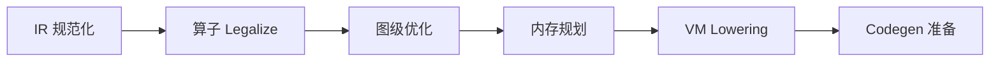
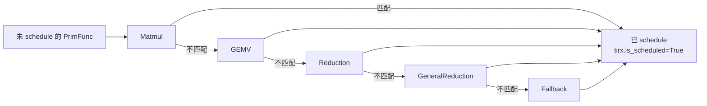
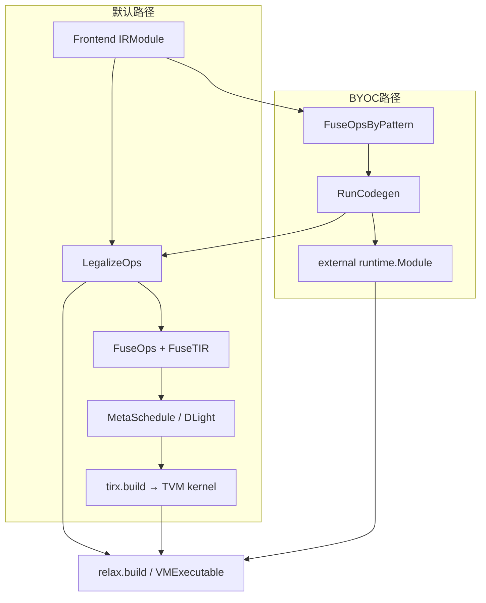
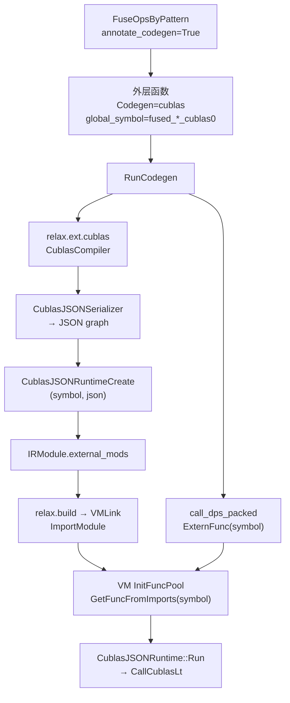
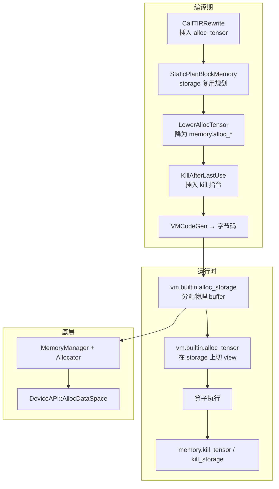

# TVM 整体架构

**Apache TVM** 是开源机器学习编译框架，源码仓库：[github.com/apache/tvm](https://github.com/apache/tvm)。设计原则：**Python-first**（编译 pipeline 可在 Python 中定制）与 **Universal Deployment**（产出最小可部署模块，跨语言、跨硬件运行）。

当前版本采用 **跨层级设计**：**Relax** 作为图级 IR，**TensorIR（TIRx + s_tir）** 作为张量程序级 IR，二者共存于同一 `IRModule` 中，联合优化后 codegen 到目标硬件。

## 概述

Apache TVM 是 **端到端 ML 编译器**，采用 **Relax（图级）+ TensorIR（算子级）** 跨层级设计，Python-first，产出可跨硬件部署的 `runtime.Module`。

### 编译四阶段

```
模型导入 → Transform (Pass) → Codegen → Runtime 执行
```

入口：`tvm.compile(mod, target="cuda")`

### 核心数据结构

| 结构 | 作用 |
|------|------|
| `IRModule` | 编译单元，含 Relax + TIR 函数 |
| `relax.Function` | 图级 IR（算子、控制流） |
| `tirx.PrimFunc` | 张量程序 IR（循环、Buffer、线程） |
| `runtime.Module` | 编译产物（`.so`） |

### 代码仓库分层

| 层 | 模块 |
|----|------|
| **Frontend** | `relax/frontend`（ONNX、PyTorch、NNModule） |
| **图级 IR** | `relax` + transform pass + VM 编译 |
| **算子级 IR** | `tirx`（IR + Lowering）+ `s_tir`（Schedule + MetaSchedule） |
| **基础设施** | `ir`（Pass 框架）、`arith`、`script`（TVMScript） |
| **Codegen** | `target`（LLVM / CUDA / BYOC） |
| **Runtime** | `runtime` + Relax VM + Disco（分布式） |

### 关键差异化

- **跨层级优化**：`LegalizeOps` → `FuseOps`/`FuseTIR` → MetaSchedule → codegen 在同一 IRModule 内完成
- **Relax VM**：字节码调度 + TIR kernel 执行，支持动态 shape 与控制流
- **Universal Deployment**：Runtime 不依赖 Python，支持 C++/Rust/Go/Java/WASM

---

## 1. 编译全流程

```mermaid
flowchart TB
    subgraph 模型导入
        FE1[Relax Frontend<br/>ONNX / PyTorch / NNModule]
        FE2[TVMScript<br/>@I.ir_module]
    end

    subgraph 核心数据结构
        IRMod[IRModule]
        RelaxFn[relax.Function]
        PrimFn[tirx.PrimFunc]
    end

    subgraph 变换 Transform
        RPass[relax.transform<br/>LegalizeOps / FuseOps / ...]
        TPass[tirx.transform + s_tir.schedule<br/>Lowering / Tiling / ...]
        MS[MetaSchedule 自动调优]
    end

    subgraph 代码生成
        VMGen[VMCodeGen → 字节码]
        TIRBuild[tirx.build → LLVM / CUDA / ...]
        BYOC[外部库 dispatch<br/>cuBLAS / CUTLASS / ...]
    end

    subgraph 运行时
        RTMod[runtime.Module]
        VM[Relax VirtualMachine]
        Disco[Disco 分布式 Runtime]
    end

    FE1 --> IRMod
    FE2 --> IRMod
    IRMod --> RelaxFn
    IRMod --> PrimFn
    RelaxFn --> RPass
    RPass --> TPass
    TPass --> MS
    RPass --> VMGen
    TPass --> TIRBuild
    RPass --> BYOC
    VMGen --> RTMod
    TIRBuild --> RTMod
    BYOC --> RTMod
    RTMod --> VM
    RTMod --> Disco
```

四个阶段（官方架构文档定义）：

| 阶段 | 说明 | 入口 |
|------|------|------|
| **Model Creation** | 构建或导入 `IRModule` | Frontend / TVMScript |
| **Transformation** | Pass 变换 IR（优化 + Lowering） | `tvm.transform` / pipeline |
| **Target Translation** | Codegen 为目标可执行格式 | `tvm.compile()` / `tirx.build()` |
| **Runtime Execution** | 加载并执行编译产物 | `runtime.load_module()` / `VirtualMachine` |

典型用法：

```python
import tvm
from tvm.relax.frontend.torch import from_exported_program

mod = from_exported_program(exported_program)
ex = tvm.compile(mod, target="cuda")          # 编译
vm = tvm.relax.VirtualMachine(ex, tvm.cuda()) # 运行
out = vm["main"](input_data)
```

---

## 2. 核心数据结构

TVM 编译栈围绕两个核心数据结构展开：

| 数据结构 | 含义 | 所在模块 |
|----------|------|----------|
| **`IRModule`** | 编译单元，包含一组函数 | `tvm/ir` |
| **`relax.Function`** | 图级 IR：算子、数据流、控制流 | `tvm/relax` |
| **`tirx.PrimFunc`** | 张量程序级 IR：循环、Buffer、线程绑定 | `tvm/tirx` |
| **`runtime.Module`** | 编译产物，封装可执行代码 | `tvm/runtime` |
| **`tvm_ffi.Function`** | 类型擦除的运行时可调用函数 | `tvm/runtime` |

变换本质上是 **IRModule 之间的转换**：Relax 算子通过 `LegalizeOps` 降级为 `call_tir`，对应 `PrimFunc` 被加入同一 `IRModule`；图级 pass 与 TIR pass 可跨层级协同（如 `FuseOps` + `FuseTIR` 算子融合）。

---

## 3. 代码仓库结构

TVM 采用 **C++ 核心 + Python 绑定** 的双层结构，`include/tvm/` 与 `src/` 一一对应，`python/tvm/` 暴露 Python API。

```
tvm/
├── include/tvm/          # C++ 头文件（IR 定义、Pass、Codegen）
├── src/                  # C++ 实现
├── python/tvm/           # Python API
├── docs/                 # 架构文档、教程
├── tests/                # Python / C++ 测试
├── web/                  # WebAssembly / JS 运行时
├── jvm/                  # Java 绑定
└── apps/                 # 示例应用
```

### 3.1 模块一览

| 模块 | 路径 | 职责 |
|------|------|------|
| **runtime** | `tvm/runtime` | 运行时基础：`Object`、`Tensor`、`Module`、设备内存、RPC；各硬件 backend（CUDA、OpenCL、Vulkan…） |
| **ir** | `tvm/ir` | 统一 IR 基础设施：`IRModule`、`Type`、`Op`、`Pass`、`PassContext` |
| **relax** | `tvm/relax` | 图级 IR、Transform Pass、Frontend、VM 编译 |
| **tirx** | `tvm/tirx` | TensorIR 核心：PrimFunc、Buffer、SBlock、Lowering Pass |
| **s_tir** | `tvm/s_tir` | 可调度 TIR：Schedule 原语、MetaSchedule、DLight |
| **target** | `tvm/target` | 目标描述与 Codegen（LLVM、CUDA C、Metal…） |
| **script** | `tvm/script` | TVMScript：Python DSL 解析 / 打印 / IR Builder |
| **arith** | `tvm/arith` | 整数分析：索引范围、变量界、迭代域 |
| **te / topi** | `tvm/te`, `tvm/topi` | Tensor Expression DSL；预定义算子库 |
| **driver** | `tvm/driver` | 高层编译入口：`tvm.compile()`、`tvm.build()` |
| **backend** | `tvm/backend` | 后端插件 autoload |
| **rpc** | `tvm/rpc` | 远程编译与 profiling |
| **contrib** | `tvm/contrib` | 扩展工具（Cutlass、CoreML、NVCC 工具等） |

---

## 4. 分层架构详解

### 4.1 Frontend（模型导入）

路径：`python/tvm/relax/frontend/`

| 前端 | 入口 | 说明 |
|------|------|------|
| ONNX | `from_onnx` | ONNX ModelProto → Relax IRModule |
| PyTorch | `from_exported_program` / `from_fx` / `relax_dynamo` | ExportedProgram / FX / torch.compile |
| TFLite | `tflite_frontend` | TFLite 模型 |
| StableHLO | `stablehlo_translator` | XLA/StableHLO |
| NNModule | `relax.frontend.nn` | Python 式建模，含 LLM 组件（KV cache 等） |
| TVMScript | `@I.ir_module` | 直接用 Python DSL 编写 IR |

### 4.2 Relax（图级 IR + 优化）

路径：`include/tvm/relax/`、`python/tvm/relax/`

- **表达式**：`SeqExpr`、`DataflowBlock`、`Call`、`If`、`MatchCast`
- **Transform**：`LegalizeOps`、`FuseOps`、`FuseTIR`、`StaticPlanBlockMemory`、`FoldConstant`、`Gradient` 等
- **Pipeline**：`relax.get_pipeline("default")` 串联 pass
- **Backend dispatch**：采样/排序算子分发、BYOC（`RunCodegen`）对接外部 codegen
- **VM 编译**：`relax.build()` → VMCodeGen → 字节码 + TIR kernel

Transform Pass 的详细分类与默认 Pipeline 见 [第 5 节](#5-relax-transform-pass-详解)。Relax IR 设计详见 [ir.md](./ir.md) 第 4 节。

### 4.3 TensorIR（张量程序级 IR）

TIR 拆为两个子模块：

**tirx**（`tvm/tirx`）— IR 定义与 Lowering

- `PrimFunc`：带 Buffer 声明、循环嵌套、SBlock 的低层函数
- `tirx/transform`：FlattenBuffer、LowerIntrin、SplitHostDevice 等 lowering pass
- `tirx/build()`：TIR → 原生代码的最终入口

**s_tir**（`tvm/s_tir`）— 调度与自动调优

- `s_tir/schedule`：Tiling、Vectorize、BindThread 等 schedule 原语
- `MetaSchedule`：搜索最优 schedule（`MetaScheduleTuneIRMod`）
- `DLight`：预定义高性能 schedule 规则（详见 [5.4.2](#542-dlight-默认-gpu-schedule)）

GPU 目标通常**必须** schedule 才能生成有效线程绑定代码；CPU 可无 schedule 运行但性能低。

### 4.4 Pass 基础设施

路径：`tvm/ir/transform`

- 统一 `Pass` / `PassContext` / `Sequential` 框架
- Relax 与 TIR 共用 Pass 基础设施
- Pass 分两类：**优化**（等价变换）与 **Lowering**（降层表示）
- 可在 Python 中组合自定义 pass pipeline

### 4.5 Target & Codegen

路径：`tvm/target`、`src/target`

编译最后阶段，将 lowered TIR 翻译为目标代码：

| Codegen 族 | 目标 | 产物 |
|------------|------|------|
| **LLVM** | x86、ARM、RISC-V 等 | 原生机器码 |
| **Source** | CUDA C、OpenCL、Metal、Vulkan | 源码 + 运行时编译 |
| **BYOC** | cuBLAS、CUTLASS、cuDNN 等 | 外部库调用 |

`Target` 描述编译目标（如 `cuda`、`llvm`、`nvidia/nvidia-a100`），影响 vectorize、thread 配置等 pass 行为。

Codegen 原则：**绝大多数优化在 codegen 之前完成**，codegen 阶段尽量轻量。

### 4.6 Runtime

路径：`tvm/runtime`

| 组件 | 说明 |
|------|------|
| `runtime.Module` | 编译产物容器，可通过 `load_module("model.so")` 加载 |
| `runtime.Tensor` | 设备张量，支持 DLPack 零拷贝互操作 |
| `tvm_ffi.Function` | 统一函数调用接口（PackedFunc） |
| **Relax VM** | 寄存器式字节码解释器，调度 TIR kernel 与外部库 |
| **Disco** | 分布式 Runtime：多 GPU / 多节点 SPMD 执行、NCCL 集合通信 |
| **RPC** | 远程设备编译与 benchmark |

Relax VM 只做控制流编排（4 种 opcode），数值计算由 TIR kernel 或外部库执行。

### 4.7 TVMScript

路径：`tvm/script`

Python DSL，三个别名：

- `I` — IRModule 级（`@I.ir_module`）
- `R` — Relax 函数（`@R.function`）
- `T` — TIR PrimFunc（`@T.prim_func`）

支持 **roundtrip**：`mod.script()` 打印为 TVMScript，可重新解析为等价 IRModule。

### 4.8 辅助模块

| 模块 | 作用 |
|------|------|
| **arith** | 整数集合分析，支撑 TIR 循环优化 |
| **te / topi** | TE 描述张量计算 → `te.create_prim_func` 转 PrimFunc；Topi 提供常用算子 |
| **node** | IR 节点反射、序列化、结构等价判定 |
| **support** | 日志、Arena 分配、Socket 等基础设施 |
| **web** | WASM / WebGPU 运行时，浏览器与 Node.js 部署 |

---

## 5. Relax Transform Pass 详解

Relax Transform 是编译链路中 **IRModule → IRModule** 的变换阶段：输入 Frontend 产出的高层 `relax.Function`，经一系列 Pass 完成降级、优化、内存规划，最终变为 VM 可编译的低层 IR。

Pass 实现在 `python/tvm/relax/transform/`，C++ 声明在 `include/tvm/relax/transform.h`。所有 Pass 基于 `tvm/ir/transform` 的统一基础设施，可在 Python 中自由组合。

### 5.1 Pass 基础设施

| 粒度 | 工厂函数 | 作用范围 |
|------|----------|----------|
| **Module Pass** | `tvm.transform.module_pass` | 整个 IRModule |
| **Function Pass** | `relax.transform.function_pass` | 单个 `relax.Function` |
| **DataflowBlock Pass** | `relax.transform.dataflowblock_pass` | 单个 `DataflowBlock` |

常用组合方式：

```python
seq = tvm.transform.Sequential([
    relax.transform.LegalizeOps(),
    relax.transform.FuseOps(),
    relax.transform.FuseTIR(),
])
mod = seq(mod)
```

预置 Pipeline 见 `relax.pipeline`：`zero`（图优化）、`default_build`（VM 编译）、`static_shape_tuning`（含 MetaSchedule）。

### 5.2 整体阶段划分

Relax Transform 的工作可按 **目的** 分为六类（实际 Pipeline 中顺序交错，见 5.8 节）：



| 阶段 | 核心目标 | 代表 Pass |
|------|----------|-----------|
| **IR 规范化** | 统一 IR 形态，便于后续分析 | `Normalize`、`CanonicalizeBindings`、`ToNonDataflow` |
| **算子 Legalize** | 高层算子 → 可执行原语 | `LegalizeOps`、`DecomposeOpsForInference` |
| **图级优化** | 融合、常量折叠、布局/精度 | `FuseOps`、`FuseTIR`、`FoldConstant`、`RunCodegen` |
| **内存规划** | 静态复用中间张量内存 | `StaticPlanBlockMemory`、`KillAfterLastUse` |
| **VM Lowering** | 降为 VM 可执行的调用形式 | `CallTIRRewrite`、`VMShapeLower`、`LowerRuntimeBuiltin` |
| **Codegen 准备** | 附加符号、调优、外部库 | `AttachGlobalSymbol`、`MetaScheduleApplyDatabase` |

---

### 5.3 IR 规范化与清理

Frontend 导入的 IR 形态各异，规范化 Pass 将其整理为 Pass 可处理的统一结构。

| Pass | 作用 |
|------|------|
| **Normalize** | 转为 A-Normal Form，补全表达式类型 |
| **NormalizeGlobalVar** | 保证 `GlobalVar` 命名唯一，public 函数名与 `global_symbol` 一致 |
| **CanonicalizeBindings** | 简化变量绑定、`MatchCast`、元组索引；消除冗余中间变量 |
| **ConvertToDataflow** | 将计算区域标记为 `DataflowBlock`（融合、常量折叠的前置） |
| **ToNonDataflow** | 编译后期去掉 Dataflow 标记，转为普通 BindingBlock |
| **RemovePurityChecking** | 关闭 purity 追踪，便于低层 codegen |
| **LambdaLift** | 嵌套函数提升为 Global 函数 |
| **InlinePrivateFunctions** | 内联私有子函数，减少调用开销 |
| **DeadCodeElimination** | 删除未使用的绑定 |
| **EliminateCommonSubexpr** | 公共子表达式消除 |
| **TopologicalSort** | 绑定拓扑排序 |
| **ExpandTupleArguments** | 展开传给内部函数的元组参数 |
| **RemoveUnusedParameters/Outputs** | 删除内部函数的无用参数/输出 |

---

### 5.4 算子 Legalize（降级）

**LegalizeOps** 是 Relax 编译中**最关键**的 Pass 之一。

**做什么：**

- 将高层 `relax.op`（如 `R.nn.conv2d`、`R.matmul`）替换为低层调用：
  - `R.call_tir(PrimFunc, ...)` — 调用 IRModule 中的 TIR 函数
  - `R.call_dps_packed(...)` / `R.call_pure_packed(...)` — 调用外部 PackedFunc / 库
- 为每个算子查找注册的 **Legalize 函数**（`FLegalize` 属性），生成对应 `PrimFunc` 并加入 IRModule
- Legalize 实现在 `python/tvm/relax/transform/legalize_ops/`（按算子类别分文件）

**输入/输出示意：**

```
R.nn.relu(x)                    call_tir(relu_primfunc, x, out_sinfo)
R.matmul(a, b)          →       call_tir(matmul_primfunc, a, b, out_sinfo)
R.nn.conv2d(...)                call_tir(conv2d_primfunc, ...)
```

**相关 Pass：**

| Pass | 作用 |
|------|------|
| **DecomposeOpsForInference** | 推理模式分解复合算子（Attention、BatchNorm 等拆成基础算子） |
| **DecomposeOpsForTraining** | 训练模式分解 |
| **AlterOpImpl** | 替换算子实现（如切换不同 conv 实现） |
| **DispatchSampling / DispatchSortScan** | 采样/排序/Scan 算子分发到专用实现 |

Legalize 之后，IRModule 中同时存在 **Relax 函数（调用图）** 和 **TIR PrimFunc（算子实现）**，为后续融合与 codegen 做准备。

#### 5.4.1 示例：CUDA / CPU 平台

**先澄清：LegalizeOps 本身不区分平台。**

`LegalizeOps` 是 **目标无关（target-agnostic）** 的 Pass：无论最终跑 CUDA 还是 LLVM CPU，Legalize 规则相同——把高层 `relax.op` 换成 `call_tir` + 新生成的 `PrimFunc`。平台差异出现在 **LegalizeOps 之后**：

| 平台 | LegalizeOps 之后的关键 Pass | 最终 codegen |
|------|---------------------------|--------------|
| **CUDA** | `FuseOps` → `FuseTIR` → `DLight.ApplyDefaultSchedule(gpu.*)` | `tirx.build(target="cuda")` → CUDA kernel |
| **CPU (LLVM)** | `FuseOps` → `FuseTIR` | `tirx.build(target="llvm")` → x86/ARM 机器码 |
| **CUDA + cuBLAS** | `FuseOpsByPattern` → `RunCodegen`（匹配 matmul 子图） | 直接调 cuBLAS，跳过自研 kernel |

CUDA 后端 `legalize_passes` 定义在 `python/tvm/relax/backend/cuda/pipeline.py`：

```
LegalizeOps → AnnotateTIROpPattern → FoldConstant → FuseOps → FuseTIR
→ DLight.ApplyDefaultSchedule(gpu.Matmul, gpu.GEMV, gpu.Reduction, ...)
```

**例子：一个小 MLP**

LegalizeOps **之前**（Frontend / NNModule 导出）：

```python
@R.function
def forward(x: R.Tensor(("n", 784), "float32"), w0, b0, w1, b1):
    with R.dataflow():
        lv0 = R.matmul(x, R.permute_dims(w0)) + b0      # 高层算子
        lv1 = R.nn.relu(lv0)                           # 高层算子
        lv2 = R.matmul(lv1, R.permute_dims(w1)) + b1   # 高层算子
        R.output(lv2)
    return lv2
```

此时 IR 里只有语义层算子（`relax.matmul`、`relax.nn.relu` 等），还没有 TIR 实现。

**LegalizeOps 内部机制：**

Pass 遍历每个 `Call`，查注册的 Legalize 函数（`register_legalize`）。典型实现：

- **ReLU**（`legalize_ops/nn.py`）：`register_legalize("relax.nn.relu", _call_topi_without_attr(topi.nn.relu))`
- **MatMul**（`legalize_ops/linear_algebra.py`）：用 TE 描述 matmul 计算，再 `bb.call_te(te_matmul, ...)`

`bb.call_te(...)` 会：（1）把 TE lowering 为 `tirx.PrimFunc`；（2）将 PrimFunc **加入 IRModule**；（3）返回 `R.call_tir(primfunc, args, out_sinfo)` 替换原高层 Call。

**LegalizeOps 之后：**

Relax 函数变为：

```python
@R.function
def forward(x, w0, b0, w1, b1):
    with R.dataflow():
        lv0 = R.call_tir(matmul, x, R.permute_dims(w0), out_sinfo=...) + b0
        lv1 = R.call_tir(relu, lv0, out_sinfo=R.Tensor((n, 128), "float32"))
        lv2 = R.call_tir(matmul, lv1, R.permute_dims(w1), out_sinfo=...) + b1
        R.output(lv2)
    return lv2
```

IRModule 中**新增** TIR 函数（示意）：

```python
@T.prim_func
def relu(x: T.handle, y: T.handle):
    # TOPI 生成的逐元素 max(x, 0) 循环

@T.prim_func
def matmul(a: T.handle, b: T.handle, c: T.handle):
    # TE 生成的 matmul 三重循环（尚未 schedule，性能很低）
```

**在 CUDA 平台上完整走一遍：**

```python
import tvm
from tvm import relax
from tvm.relax.frontend import nn

class MLP(nn.Module):
    def __init__(self):
        super().__init__()
        self.fc1 = nn.Linear(784, 128)
        self.relu = nn.ReLU()
        self.fc2 = nn.Linear(128, 10)

    def forward(self, x):
        return self.fc2(self.relu(self.fc1(x)))

mod, params = MLP().export_tvm({"forward": {"x": nn.spec.Tensor(("n", 784), "float32")}})

# ① 仅 LegalizeOps（平台无关）
mod = relax.transform.LegalizeOps()(mod)

# ② CUDA 后端完整 legalize_passes（LegalizeOps + 融合 + GPU schedule）
target = tvm.target.Target("cuda")
with target:
    mod = relax.backend.cuda.get_default_pipeline(target)(mod)

# ③ 编译 + 运行
ex = tvm.compile(mod, target=target)
vm = relax.VirtualMachine(ex, tvm.cuda())
```

CUDA 上各步作用：

```
LegalizeOps
  matmul/relu → call_tir + PrimFunc（平台无关的 TIR 草稿）

FuseOps + FuseTIR
  relu 可融合进 matmul 后的 kernel（减少一次读写）

DLight ApplyDefaultSchedule (CUDA 特有)
  给 matmul PrimFunc 加 thread binding、shared memory tiling

StaticPlanBlockMemory / VMShapeLower / ...
  内存规划、VM lowering

tirx.build(target="cuda")
  TIR → CUDA C / PTX → GPU kernel
```

**对比：CPU (LLVM) 平台**

LegalizeOps **完全相同**，差异在后续 Pass：

```python
target = tvm.target.Target("llvm")
with target:
    mod = relax.backend.cpu_generic.get_default_pipeline(target)(mod)
ex = tvm.compile(mod, target=target)
vm = relax.VirtualMachine(ex, tvm.cpu())
```

CPU pipeline 没有 `DLight gpu.*`，FuseTIR 后直接 `tirx.build(target="llvm")` 生成 CPU 机器码。

**另一种 CUDA 路径：Legalize 后 offload 到 cuBLAS**

对大矩阵乘，CUDA 还可走 **BYOC**，在 LegalizeOps **之后**用模式匹配替换：

```
LegalizeOps  →  matmul 变成 call_tir(matmul_primfunc)
FuseOpsByPattern("cublas.matmul")  →  匹配 matmul 子图
RunCodegen("cublas")  →  替换为 call_dps_packed(cublas_gemm)
```

这条路径不再用自研 matmul kernel，而是直接调 NVIDIA cuBLAS。LegalizeOps 仍是前置步骤。

**小结：**

| 问题 | 答案 |
|------|------|
| LegalizeOps 输入 | `R.matmul`、`R.nn.relu` 等高层算子 |
| LegalizeOps 输出 | `R.call_tir(PrimFunc, ...)` + IRModule 中新 PrimFunc |
| 是否区分 CUDA/CPU | **否**，Legalize 规则共用 |
| 平台差异在哪 | LegalizeOps **之后**：GPU schedule（DLight，见 **5.4.2**）、`target` codegen、或 cuBLAS BYOC |
| 核心机制 | `register_legalize` + `bb.call_te(topi.xxx)` 生成 TIR |

一句话：**LegalizeOps 把「算什么」变成「用哪个 TIR 函数算」；CUDA/CPU 的区别是「这个 TIR 函数最终怎么 schedule 和 codegen」。**

#### 5.4.2 DLight：默认 GPU Schedule

**DLight 是什么**

DLight（`python/tvm/s_tir/dlight/`）是 TVM 为深度学习 workload 提供的 **默认 TIR Schedule 规则库**——一组「开箱即用、无需 autotuning」的调度模板，把 LegalizeOps 生成的 **朴素 PrimFunc**（三重循环、无 thread binding）变成 **可高效 codegen 的 GPU TIR**（含 `blockIdx`/`threadIdx`、shared memory、vectorize 等）。

- 入口 Pass：`dl.ApplyDefaultSchedule(...)`（`dlight/base/transform.py`）
- CUDA pipeline 位置：`FuseTIR` **之后**、`CallTIRRewrite` **之前**（`backend/cuda/pipeline.py`）

**要解决的问题**

LegalizeOps 通过 TOPI/TE 生成 TIR 时只表达「算什么」，不决定「如何在 GPU 上并行」：

```python
# Legalize 后的 matmul PrimFunc（概念上）
for i, j, k:
    C[i, j] += A[i, k] * B[k, j]   # 无 blockIdx/threadIdx，无 shared mem
```

没有 DLight，GPU codegen 要么失败（缺 thread binding），要么生成极低效 kernel。`vm_build.py` 注释亦指出：GPU target 须使用含 DLight 的 target 专属 pipeline。

**核心架构：Pass + 规则链**



`ApplyDefaultSchedule` 对每个 **尚未 schedule** 的 PrimFunc 按规则链依次尝试；**第一个匹配的规则生效**：

```python
for rule in rules:
    sch = rule.apply(func, target, tunable=False)
    if sch is not None:
        return sch   # 匹配成功
# 全部不匹配 → 保持未 schedule
```

每条规则实现统一接口 `ScheduleRule.apply(func, target, tunable) → Schedule | None`（`dlight/base/schedule_rule.py`）：`None` 表示不适用，交给下一条规则。

匹配成功后标记 `tirx.is_scheduled = True`，避免重复调度。

**分析基础设施**

规则依赖 `dlight/analysis/` 做 TIR 结构分析：

| 工具 | 作用 |
|------|------|
| `normalize_prim_func` | 将 PrimFunc 规范化为 block/loop 树 |
| `SBlockInfo` / `IterInfo` | 标注循环轴类型：**S**（spatial）、**R**（reduction）、**O**（other） |
| `is_gemv` | 检测矩阵×向量模式 |
| `is_broadcast_epilogue` | 检测规约后的 broadcast epilogue |
| `get_index_map` | 分析 matmul 的 buffer index 映射 |

S/R/O 分类是 DLight 识别 matmul / GEMV / reduction / elementwise 的基础。

**CUDA 默认规则链（按优先级）**

```python
dl.ApplyDefaultSchedule(
    dl.gpu.Matmul(),            # 1. 专用 GEMM
    dl.gpu.GEMV(),              # 2. 矩阵×向量
    dl.gpu.Reduction(),         # 3. 带 broadcast epilogue 的规约
    dl.gpu.GeneralReduction(),  # 4. 通用规约（softmax、norm 等）
    dl.gpu.Fallback(),          # 5. 兜底（conv、elementwise、pool 等）
)
```

| 规则 | 匹配模式 | 典型覆盖 | Schedule 要点 |
|------|----------|----------|---------------|
| **Matmul** | `C[S,I,J] += A[S,I,K] * B[S,J,K]` | `R.matmul`、Linear | tile + shared mem + register blocking；SM≥70 可选 Tensor Core |
| **GEMV** | `[S,R] = [S,R] * [R]` | batch=1 的 matmul | rfactor + warp shuffle / shared mem 规约 |
| **Reduction** | `X = X + Y` 规约 + broadcast epilogue | 部分 reduce+elementwise | block/thread 级规约 |
| **GeneralReduction** | 更 general 的多 block 规约 | softmax、layer norm、RMS norm | 256 thread + unroll |
| **Fallback** | 上述均不匹配 | conv2d、relu、pool、逐元素 | inline + bind blockIdx/threadIdx |

仓库中还有 `RMSNorm`、`Transpose`、`LowBatchGEMV`、Adreno 专用规则等，**CUDA 默认 pipeline 未启用**，需自定义 pipeline。

**Matmul 规则原理（示意）**

```
1. 结构识别 → reindex A/B/C 为标准 matmul 布局
2. Tensor Core 路径（SM≥70，FP16/INT8，维度足够大）
   → MatmulTensorization / mma.sync
3. 通用 tiled matmul：
   pad_einsum → split(I,J,K) → bind blockIdx/threadIdx
   cache_read → shared mem（cooperative fetch）
   cache_write → local register
   decompose_reduction（K 轴分块累加）
   vectorize + unroll
```

CUDA 默认 config（`gpu/matmul.py`）：block 8×16、micro tile 4×4×16、shared mem、vectorize=2、unroll=256。

**完整流程（matmul 为例）**

```
LegalizeOps: R.matmul → call_tir + 朴素 matmul PrimFunc
    ↓
FuseTIR (可选): matmul + relu → fused PrimFunc
    ↓
DLight Matmul: 补 thread binding / tiling / shared mem → tirx.is_scheduled=True
    ↓
tirx.build(cuda): scheduled TIR → CUDA C → nvcc → cubin
```

| | Schedule 前 | DLight Matmul 后 |
|--|------------|-----------------|
| 并行 | 无 | blockIdx + threadIdx + vthread |
| 内存 | 全局内存直接读写 | shared → local register |
| K 轴 | 一次累加 | decompose_reduction 分块 |
| Tensor Core | 无 | 条件满足时用 mma intrinsics |

**DLight vs MetaSchedule**

| | DLight | MetaSchedule |
|--|--------|--------------|
| 目标 | 零 tuning 的默认 schedule | 搜索最优 schedule |
| 编译速度 | 快（固定模板） | 慢（需 profiling） |
| 性能 | 中等偏上 | 潜在最优 |
| 关系 | MetaSchedule **未覆盖** 的函数由 DLight 兜底 |

MetaSchedule 集成 pipeline（`meta_schedule/relax_integration.py`）顺序：

```
LegalizeOps → FuseOps → FuseTIR
→ MetaScheduleApplyDatabase（应用已调优 schedule）
→ DLight ApplyDefaultSchedule（兜底剩余未 schedule 函数）
→ VM Lowering
```

**小结**

| 问题 | 答案 |
|------|------|
| DLight 是什么？ | 内置默认 TIR GPU Schedule 规则库 |
| 解决什么问题？ | 朴素 TIR → 带 GPU 并行结构的 scheduled TIR |
| 怎么工作？ | 规则链模式匹配 → 应用 schedule 模板 → 标记 `tirx.is_scheduled` |
| 与 codegen 关系 | scheduled PrimFunc 经 `tirx.build(cuda)` 生成 CUDA kernel |
| 与 cuBLAS 关系 | 无关；cuBLAS 走 BYOC，绕过 DLight |

一句话：**DLight 是 GPU 上的「自动调度器」——用预写 ScheduleRule 模板，把 LegalizeOps 的朴素 TIR 变成可 codegen 的高效 GPU TIR，是默认 CUDA 路径连接「算子语义」与「自研 kernel」的关键环节。** CUDA 编译全流程见 [tvm_cuda.md](./tvm_cuda.md)。

---

### 5.5 图级优化

#### 5.5.1 常量折叠与简化

| Pass | 作用 |
|------|------|
| **FoldConstant** | 在 DataflowBlock 内编译期求值常量表达式，减少运行时计算 |
| **BindParams** | 将函数参数绑定为常量 Tensor（权重固化） |
| **BindSymbolicVars** | 将符号 shape 变量绑定为具体值（如 `n=128`） |

#### 5.5.2 算子融合（核心优化）

融合将多个算子合并为单个 kernel，减少内存读写与 kernel launch 开销。

**自动融合三件套：**

```
AnnotateTIROpPattern  →  为每个 PrimFunc 标注 OpPatternKind（elementwise、broadcast、reduce…）
FuseOps               →  基于 post-dominator 分析，将 DataflowBlock 内可融合的 binding 分组为新 Relax 函数
FuseTIR               →  将每组内的多个 PrimFunc 合并为一个 fused PrimFunc
```

| OpPatternKind | 含义 | 融合规则（简化） |
|---------------|------|------------------|
| Elementwise | 逐元素 | 可与相邻 elementwise / broadcast 融合 |
| Broadcast | 广播 | 可与 elementwise 融合 |
| Injective | 单射（reshape 等） | 可与 elementwise 融合 |
| CommReduce | 规约 | 融合受限 |
| Opaque | 不透明（conv、matmul） | 通常作为融合「锚点」 |

**模式融合（BYOC 路径）：**

| Pass | 作用 |
|------|------|
| **FuseOpsByPattern** | 按用户定义的 DataflowPattern 匹配子图，打包为 composite 函数（如 `cutlass.matmul_bias_relu`） |
| **MergeCompositeFunctions** | 合并多个 composite 函数，附加 `kCodegen` 属性 |
| **RunCodegen** | 将带 `kCodegen` 的函数 offload 到外部 codegen（CUTLASS、cuDNN 等） |

#### 5.5.2.1 RunCodegen 架构与作用

**RunCodegen 是什么**

`RunCodegen` 是 TVM Relax **BYOC（Bring Your Own Codegen）** 链路的**执行 Pass**：把已标注 `Codegen` 属性的子图交给外部后端（cuBLAS、CUTLASS、cuDNN、TensorRT 等）编译，并将 Relax 调用替换为 `call_dps_packed(ExternFunc(...))`。

- 实现：`src/relax/transform/run_codegen.cc`
- Python 入口：`relax.transform.RunCodegen()`

**在整体架构中的位置**

RunCodegen **不在**「Frontend → LegalizeOps → FuseOps → VM」默认自研 codegen 主线的必经步骤上，而是 **BYOC 分支的核心执行点**：



官方 BYOC 四阶段（`docs/arch/external_library_dispatch.rst`）：

```
IRModule（高层 Relax IR）
    │
    ▼  FuseOpsByPattern          匹配子图，打 Composite / Codegen 标记
IRModule（带 Codegen 属性的 composite 函数）
    │
    ▼  RunCodegen                 调用外部 codegen，替换为 call_dps_packed
IRModule + external_mods
    │
    ▼  LegalizeOps + FuseOps + ...   剩余算子走 TVM 自研路径
    │
    ▼  relax.build / VM 编译         链接 external_mods
Deployable artifact
```

- **RunCodegen 之前**：`FuseOpsByPattern`（或 `MergeCompositeFunctions`）负责识别并打包子图
- **RunCodegen 本身**：负责真正编译并替换调用
- **RunCodegen 之后**：未被 offload 的算子仍走 `LegalizeOps` → `FuseOps` → `tirx.build`

**具体做什么（5 步）**

源码 `run_codegen.cc` 中 `CodeGenRunner` 的流程：

| 步骤 | 动作 |
|------|------|
| 1 | 扫描 IRModule 中所有带 **`Codegen`** 属性（如 `"cublas"`、`"cutlass"`）的 Relax 函数 |
| 2 | 按 backend 分组，通过 FFI 查找 **`relax.ext.<backend>`**（如 `relax.ext.cublas`） |
| 3 | 调用 backend codegen 函数，得到 **`runtime.Module` 数组**（外部编译产物） |
| 4 | 将对 composite 函数的调用替换为 **`R.call_dps_packed(ExternFunc("..."), args)`** |
| 5 | 将 external modules 挂到 IRModule 的 **`external_mods`** 属性，供 `relax.build()` 链接 |

**变换示意：**

```python
# RunCodegen 之前（FuseOpsByPattern 产出）
@R.function
def fused_matmul_cublas0(args...):
    R.func_attr({"Codegen": "cublas", "global_symbol": "fused_matmul_cublas0"})
    @R.function(private=True)
    def composite(...):
        R.func_attr({"Composite": "cublas.matmul_bias_relu"})
        return R.nn.relu(R.add(R.matmul(x, w), bias))

# RunCodegen 之后
R.call_dps_packed(ExternFunc("fused_matmul_cublas0"), (x, w, bias), out_sinfo=...)
# + IRModule.attrs["external_mods"] 中包含 cuBLAS runtime module
```

**与相邻 Pass 的分工**

| Pass | 职责 | 产出 |
|------|------|------|
| **FuseOpsByPattern** | 模式匹配，提取子图为 composite 函数 | 带 `Composite` / `Codegen` 属性的 Relax 函数 |
| **MergeCompositeFunctions** | （可选）合并同一 backend 的多个 composite | 带 `Codegen` 的外层函数 |
| **RunCodegen** | 调用外部 codegen，替换调用方式 | `call_dps_packed` + `external_mods` |
| **LegalizeOps** | 剩余高层算子 → `call_tir` + PrimFunc | TVM 自研 TIR |
| **FuseOps + FuseTIR** | TVM 路径上的算子融合 | fused PrimFunc |

**RunCodegen vs LegalizeOps：**

- **LegalizeOps**：`relax.op` → `call_tir` + TVM 生成的 PrimFunc → `tirx.build`
- **RunCodegen**：composite 子图 → `call_dps_packed` + 外部库 runtime → 不走 TVM kernel codegen

二者**并行互补**，分别处理 IRModule 中不同部分的算子。

**CUDA 平台示例（cuBLAS）**

```python
from tvm.relax.backend.cuda.cublas import partition_for_cublas

# ① 模式匹配 + 打 Codegen 标记
mod = partition_for_cublas(mod)   # 内部：FuseOpsByPattern(patterns, annotate_codegen=True)

# ② 触发外部 codegen
mod = relax.transform.RunCodegen()(mod)
# 或带选项：RunCodegen({"cutlass": {"sm": 80, "find_first_valid": True}})

# ③ 正常编译（剩余算子 LegalizeOps + VM build，并链接 external_mods）
ex = tvm.compile(mod, target="cuda")
vm = relax.VirtualMachine(ex, tvm.cuda())
```

CUDA 常见 backend 注册：

| Backend | FFI 键 | 典型用途 |
|---------|--------|----------|
| cuBLAS | `relax.ext.cublas` | matmul、matmul+bias+relu |
| CUTLASS | `relax.ext.cutlass` | 高性能 GEMM / Attention |
| cuDNN | `relax.ext.cudnn` | conv、norm |
| TensorRT | `relax.ext.tensorrt` | 整段子图 offload |

**小结：** RunCodegen 是 BYOC 的「codegen 调度器」——在 `FuseOpsByPattern` 标记子图后，按 `Codegen` 属性调用外部编译器，把子图从 Relax 调用链换成 `call_dps_packed`，并将 `external_mods` 挂进 IRModule，最终在 `relax.build()` 时与 TVM 自研 kernel 一起打包。以 cuBLAS 为例的符号命名、端到端关联链见 **5.5.2.2**；`call_dps_packed` 的 lowering 与 VM 调度见 **5.5.2.3**。

#### 5.5.2.2 cuBLAS 示例：`fused_matmul_cublas0` 命名与端到端关联

以 `fused_matmul_cublas0`（文档/测试中亦常见 `fused_relax_matmul_cublas0`）为例，说明 BYOC 符号从 IR 到 cuBLAS API 的完整链路。

**核心结论：`fused_matmul_cublas0` 不是单独手写的 C++ kernel 函数名**，而是 Relax IR 中的 **链接符号（`global_symbol`）**。每个这样的符号对应一个 **`CublasJSONRuntime` 实例**（内含 JSON 计算图）；运行时统一由 `CallCublasLt` 调 NVIDIA cuBLAS Lt API。

**符号如何产生**

`partition_for_cublas` 内部调用 `FuseOpsByPattern(patterns, annotate_codegen=True)`，匹配 `cublas.matmul*` 等 pattern 后：

1. **内层 composite 函数**：标注 `Composite: "cublas.matmul_bias_relu"` 等，描述「算什么」
2. **`CompositeFunctionAnnotator` 包装外层函数**：读取 composite 名中 `.` 前的 backend 名作为 `Codegen`，并生成 `global_symbol`

命名规则（`src/relax/transform/fuse_ops.cc`）：

```
global_symbol = gvar->name_hint + "_" + codegen_name
              = "fused_relax_matmul" + "_" + "cublas"
              → "fused_relax_matmul_cublas"
```

- `gvar->name_hint`：由融合子图内的 op 拼接（如 `fused_relax_matmul`）
- `codegen_name`：从 `Composite` 名 `"cublas.matmul"` 取 `.` 前段（`GetCodegenName`）
- 重名时 `AddFunction` 自动加数字后缀 → `fused_relax_matmul_cublas0`

**端到端关联链**



| 阶段 | 源码位置 | 关键动作 |
|------|----------|----------|
| 模式匹配 + 标注 | `python/tvm/relax/backend/cuda/cublas.py` → `FuseOpsByPattern` | 产出带 `Codegen` / `Composite` 的 composite 函数 |
| Codegen 调度 | `src/relax/transform/run_codegen.cc` | 扫描 `Codegen` 属性，按 backend 分组 |
| cuBLAS 序列化 | `src/relax/backend/contrib/cublas/codegen.cc` | `CublasJSONSerializer` 将 composite 编为 JSON；注册为 `relax.ext.cublas` |
| Runtime 模块创建 | `src/runtime/extra/contrib/cublas/cublas_json_runtime.cc` | `CublasJSONRuntimeCreate(symbol, graph_json, const_names)` |
| IR 调用替换 | `run_codegen.cc` `CodeGenRunner` | composite 调用 → `call_dps_packed(ExternFunc(symbol), ...)` |
| 链接打包 | `python/tvm/relax/vm_build.py` → `VMLink` | 从 `external_mods` 取出 module，`LinkModules` 导入 VMExecutable |
| 符号解析 | `src/runtime/vm/vm.cc` `InitFuncPool` | `GetFuncFromImports(info.name)` 在 import 的 module 中查 `GetFunction(name)` |
| 真正算子执行 | `cublas_json_runtime.cc` → `cublas.cc` | `Run()` 按 JSON 节点 `op_name` 解析 epilogue/transpose，调 `CallCublasLt` |

**关键关联键**

| 关联键 | 左端（编译期） | 右端（运行期） |
|--------|----------------|----------------|
| `global_symbol` | Relax `ExternFunc("fused_*_cublas0")` | `CublasJSONRuntime.symbol_name_` |
| `Codegen: "cublas"` | 选择 `relax.ext.cublas` codegen | — |
| `Composite: "cublas.matmul_*"` | JSON 节点 `op_name` | `Run()` 内 epilogue / transpose 分支逻辑 |
| `external_mods` | codegen 产出的 `runtime.Module` 数组 | VM `ImportModule` 后的 import 链 |
| `call_dps_packed` | Relax IR 调用形式 | VM func pool → 外部 `PackedFunc` |

**RunCodegen 的两项核心变换**

`CodeGenRunner`（`run_codegen.cc`）对每个带 `Codegen` 的函数：

1. **VisitExpr_(FunctionNode\*)**：函数体变为 `ExternFunc(GetExtSymbol(func))`（读 `global_symbol` 属性）
2. **VisitExpr_(CallNode\*)**：将对该函数的调用替换为 `call_dps_packed(extern_func, tuple_args, out_ty)`

cuBLAS codegen（`codegen.cc`）对每个函数：

```cpp
// GetExtSymbol(func) → global_symbol，如 "fused_relax_matmul_cublas0"
CublasJSONSerializer serializer(...);
serializer.serialize(func);           // 遍历 inner composite，写出 JSON
auto graph_json = serializer.GetJSON();
pf(GetExtSymbol(func), graph_json, constant_names);  // → CublasJSONRuntimeCreate
```

**运行时：符号 → cuBLAS API**

VM 初始化 func pool 时，对 `kPackedFunc` 条目按名字查找（先 import 链，再全局 registry）：

```
InitFuncPool → GetFuncFromImports("fused_relax_matmul_cublas0")
             → CublasJSONRuntime::GetFunction(name)
             → 返回 lambda：Run(PackedArgs)
```

`CublasJSONRuntime::Run` **不按函数名分支**，而是遍历 JSON 节点，根据 `node.GetOpName()`（来自 `Composite` 属性，如 `cublas.matmul_bias_relu`）决定 `transa`/`transb`/`epilogue`，最终调用：

```
tvm::contrib::CallCublasLt(...)   // src/runtime/extra/contrib/cublas/cublas.cc
  → cublasLtMatmulDescCreate / cublasLtMatmul ...
```

JSON 类 backend（cuBLAS、cuDNN）走上述「序列化 + 通用 JSON runtime」路径；源码类 backend（CUTLASS 等）则直接链接预编译 native code。

#### 5.5.2.3 `call_dps_packed` 实现原理

`call_dps_packed` 是 BYOC 路径上连接 Relax VM 与外部 `PackedFunc` 的 **DPS（Destination-Passing Style）调用原语**：调用方显式提供输出 buffer，被调函数直接写入，无需内部分配返回值。

**IR 层**

- Op 注册：`src/relax/op/op.cc`，`relax.call_dps_packed(func, args_tuple, out_ty)`
- 语义：`func` 通常为 `ExternFunc("fused_*_cublas0")`；`args` 为输入 tensor 元组；`out_ty` 通过 `ty_args` 指定输出类型/shape
- RunCodegen 产出形态：

```python
R.call_dps_packed(ExternFunc("fused_matmul_cublas0"), (x, w, bias), out_sinfo=...)
```

**Lowering：显式分配输出 buffer**

`CallTIRRewrite` Pass（`src/relax/transform/call_tir_rewrite.cc`）对 `call_dps_packed` 与 `call_tir` 做相同处理：

```
# 变换前
lv: Tensor(n, m) = R.call_dps_packed(func, (x, w))

# 变换后
gv = R.call("relax.builtin.alloc_tensor", (n, m), dtype=...)
R.call(func, (x, w, gv))    # func 作为普通 Call 的 callee
return gv
```

即：先 `alloc_tensor` 分配输出，再把 **func + 输入 + 输出** 一并传给外部 PackedFunc（DPS 语义）。

**VM 运行时**

1. `AttachGlobalSymbol` / VM codegen 将 `ExternFunc` 的 symbol 登记到 executable 的 func table（`kPackedFunc` 类型）
2. `VirtualMachineImpl::InitFuncPool` 按 symbol 名解析函数指针：`GetFuncFromImports(name)` 遍历 `external_mods` import 链
3. VM 执行 `Call` 指令时，func pool 中的 `ffi::Function` 被直接 `CallPacked`；对 closure 场景经 `vm.builtin.invoke_closure`（`src/runtime/vm/builtin.cc`）转发

BYOC 完整调用路径：

```
VM Call 指令
  → func_pool[idx]  （InitFuncPool 时从 external_mods 解析得到）
  → CublasJSONRuntime::Run(PackedArgs)
  → CallCublasLt → cuBLAS Lt API
```

**与 `call_tir` 的对比**

| | `call_tir` | `call_dps_packed` |
|--|-----------|-------------------|
| Callee | IRModule 内 `PrimFunc`（GlobalVar） | 外部 `ExternFunc` / PackedFunc |
| 实现来源 | TVM `tirx.build` 自研 kernel | BYOC `external_mods` |
| 输出分配 | `CallTIRRewrite` 同样先 `alloc_tensor` | 同上 |
| 典型场景 | LegalizeOps 后的标准算子 | RunCodegen 后的 cuBLAS/CUTLASS 等 |

---

#### 5.5.3 算子级图重写

针对特定模式的 peephole 优化：

| Pass | 作用 |
|------|------|
| **FuseTransposeMatmul** | `transpose + matmul` 融合 |
| **CombineParallelMatmul** | 并行 matmul 合并 |
| **ExpandMatmulOfSum** | 展开 `matmul(sum(...))` 形式 |
| **ReorderTakeAfterMatmul** | 调整 take 与 matmul 顺序 |
| **ReorderPermuteDimsAfterConcat** | 调整 permute 与 concat 顺序 |
| **FoldBatchnormToConv2D** | 推理时将 BN 折叠进 Conv |
| **RemoveRedundantReshape** | 删除冗余 reshape |
| **OptimizeLayoutTransform** | 优化 layout 变换 |
| **FastMathTransform** | 快速数学近似（如 gelu 替换） |
| **AdjustMatmulOrder** | 调整 matmul operand 顺序 |
| **RewriteDataflowReshape** | reshape 类算子改为零拷贝 view（需 Dataflow 信息） |
| **RewriteCUDAGraph** | 插入 CUDA Graph 捕获点 |
| **ConvertLayout** | 布局转换 |
| **ToMixedPrecision** | 混合精度（FP16/BF16）转换 |

---

### 5.6 内存规划

TVM Relax 的内存管理采用 **编译期静态规划 + 运行时两级分配**：编译器在编译时决定哪些中间张量共用同一块 storage，运行时 VM 按 plan 分配/释放物理内存。

| Pass | 作用 |
|------|------|
| **StaticPlanBlockMemory** | **静态内存规划**：在 BindingBlock 级别分析张量生命周期，复用 storage，降低峰值内存；支持 `tir_var_lower_bound/upper_bound` 注解处理动态 shape |
| **KillAfterLastUse** | 在 tensor/storage 最后一次使用后插入 `kill_*` 指令 |
| **LowerAllocTensor** | 将剩余 `relax.builtin.alloc_tensor` 降为 `memory.alloc_storage` + `memory.alloc_tensor` |
| **AllocateWorkspace** | 为 TIR 算子分配 workspace buffer |
| **CallTIRRewrite** | 为 `call_tir` / `call_dps_packed` 插入显式 tensor 分配（内存规划的前置） |
| **DataflowUseInplaceCalls** | 识别可 inplace 执行的调用，避免额外 alloc |
| **RewriteDataflowReshape** | reshape 改为零拷贝 view，不新分配 storage |

内存规划发生在 Legalize 之后、VM codegen 之前，是 Relax 相对 ONNX 等交换格式的重要编译能力。CUDA 默认 pipeline 中相关 Pass 顺序：`StaticPlanBlockMemory` → `RewriteCUDAGraph` → `LowerAllocTensor` → `KillAfterLastUse` → `LowerRuntimeBuiltin` → `VMShapeLower`。

#### 5.6.1 总体架构



| 层次 | 职责 | 关键组件 |
|------|------|----------|
| **编译期** | 分析生命周期、复用 storage、插入 alloc/kill | `StaticPlanBlockMemory` 等 Pass |
| **VM 运行时** | 按字节码分配 Storage/Tensor、及时释放 | `vm.builtin.*`、`Storage` |
| **设备底层** | 向 GPU/CPU 申请物理内存 | `MemoryManager`、`DeviceAPI` |

#### 5.6.2 核心抽象：Storage vs Tensor

Relax 将内存分为两层（类似「堆 + 视图」）：

| 概念 | 含义 | 类比 |
|------|------|------|
| **Storage** | 一块连续物理内存（`Buffer`） | `cudaMalloc` 得到的一块 buffer |
| **Tensor** | Storage 上的一个 **view**（offset + shape + dtype） | 同一块 buffer 上的不同 shape 切片 |

运行时实现（`src/runtime/memory/memory_manager.cc`）：

```cpp
// 在 Storage 上分配 Tensor view（不重新 malloc）
tensor->data = storage_->buffer.data;
tensor->byte_offset = offset;   // 在同一块 storage 内偏移
```

**StaticPlanBlockMemory 复用的是 Storage**；多个中间 tensor 若生命周期不重叠，可共用同一块 storage 的不同 offset。

#### 5.6.3 编译期 Pass 链

**① CallTIRRewrite**（规划之前）

为 `call_tir` / `call_dps_packed` 显式插入输出 buffer，使每个中间 tensor 有明确的 `relax.builtin.alloc_tensor` 分配点：

```python
# 变换前
lv: Tensor(n, m) = R.call_tir(func, (x, w))

# 变换后
gv = R.call("relax.builtin.alloc_tensor", (n, m), dtype=...)
R.call(func, (x, w, gv))
return gv
```

**② StaticPlanBlockMemory**（核心）

实现：`src/relax/transform/static_plan_block_memory.cc`

三阶段算法：

```
Stage 1 初始化：为每个 builtin.alloc_tensor 创建 StorageToken，记录 ref_counter
Stage 2 规划：维护 available pool，尝试复用已有 storage token
Stage 3 IR 改写：插入 memory.alloc_storage + memory.alloc_tensor
```

**StorageToken** 表示一块可复用的 runtime memory，字段包括 `ref_counter`、`bytes`、`dtype`、`storage_scope`、`storage_id`。

复用策略（`RequestReuse`）：

1. 在 available pool 中按 `(storage_scope, dtype)` 分组
2. 查找大小匹配（或 `[size/match_range, size*match_range]` 范围内）的 idle token
3. 找到则复用；否则分配新 storage

**不能复用的情况**（StorageToken 会被 erase）：

- 函数参数、返回值
- 跨 BindingBlock 使用
- 用于 `if` 条件/分支
- 用于非 PrimFunc 的 Call 参数

**动态 shape：** 通过函数注解 `tir_var_upper_bound` 在规划时用上界估算 bytes：

```python
@R.function
def forward(x: R.Tensor(("n", 784), "float32")):
    R.func_attr({"tir_var_upper_bound": {"n": 1024}})
    ...
```

改写后的 IR 形态：

```python
storage = R.memory.alloc_storage(size=nbytes, device_index=0, scope="global", dtype="uint8")
tensor = R.memory.alloc_tensor(storage, offset=0, shape=(n, 128), dtype="float32", ...)
```

**③ LowerAllocTensor**

将尚未被 static plan 处理的 `relax.builtin.alloc_tensor` 展开为 `memory.alloc_storage` + `memory.alloc_tensor`（`lower_alloc_tensor.cc`）。

**④ KillAfterLastUse**

实现：`src/relax/transform/kill_after_last_use.cc`

1. `CollectLastUsage`：遍历 IR，记录每个 Var 的 **最后一次使用点**
2. 在最后使用点之后插入 `relax.memory.kill_tensor` / `relax.memory.kill_storage`

使 VM 运行时及时释放中间 tensor，storage pool 中的 token 可被后续复用。

#### 5.6.4 运行时分配与释放

**VM Builtin**（`src/runtime/vm/builtin.cc`）：

```cpp
// alloc_storage：真正向设备申请物理内存
Storage VMAllocStorage(ctx, buffer_shape, device_index, ...) {
  auto* alloc = vm->allocators[device_index];
  auto buffer = alloc->Alloc(device, buffer_shape, ...);
  return Storage(buffer, alloc);
}

// alloc_tensor：在已有 storage 上创建 view（通常不再 malloc）
vm.builtin.alloc_tensor(storage, offset, shape, dtype)
  → storage->AllocTensor(offset, shape, dtype)
```

**MemoryManager + Allocator**（`src/runtime/memory/memory_manager.cc`）：

```
MemoryManager::Global()
  └─ 按 (Device, AllocatorType) 管理 Allocator
       ├─ NaiveAllocator   — 每次 Alloc/Free 直接调 DeviceAPI
       └─ PooledAllocator  — 按 page（默认 4096B）缓存，减少 cudaMalloc 次数
```

`PooledAllocator` 逻辑：Alloc 时先查 size 对应的 pool，有则复用；Free 时放回 pool 而非立即 `cudaFree`。VirtualMachine 初始化时为每个 device 创建 allocator。

**最底层：** `Allocator::Alloc` → `DeviceAPI::AllocDataSpace`（CUDA 为 `cudaMalloc`，CPU 为 `malloc`）。

#### 5.6.5 TIR 侧内存（与 VM 层独立）

TIR PrimFunc 内部还有另一套内存层次，由 DLight schedule 与 kernel codegen 管理：

| 类型 | 作用 |
|------|------|
| **global buffer** | 输入/输出 tensor（由 VM 传入的 pointer） |
| **shared/local buffer** | DLight 插入的 on-chip 内存 |
| **workspace** | 算子临时 scratch（`workspace_pool.cc` 按大小缓存） |

VM 层的 Storage 规划与 TIR kernel 内部的 shared/local/workspace **相互独立**。

#### 5.6.6 示例：MLP 中间 tensor 生命周期

```
Forward DataflowBlock 内：

x (参数，不参与 storage 规划)
  ↓
alloc_tensor lv0  [n,128]   ← StorageToken A
  ↓ matmul + relu
alloc_tensor lv1  [n,128]   ← lv0 不再使用后，复用 StorageToken A
  ↓ matmul
alloc_tensor lv2  [n,10]    ← StorageToken B

StaticPlanBlockMemory 结果：
  storage_0 = alloc_storage(...)     # 一块 buffer 服务 lv0 + lv1
  lv0 = alloc_tensor(storage_0, offset=0, ...)
  lv1 = alloc_tensor(storage_0, offset=0, ...)   # 复用
  lv2 = alloc_tensor(storage_1, offset=0, ...)

KillAfterLastUse：
  lv0 最后使用后 → kill_tensor(lv0)
  lv1 最后使用后 → kill_tensor(lv1)
  storage_0 所有 tensor kill 后 → kill_storage(storage_0)
```

峰值内存从「所有中间 tensor 之和」降为「生命周期重叠部分的最大值」。

#### 5.6.7 小结

| 问题 | 答案 |
|------|------|
| 谁决定复用？ | **`StaticPlanBlockMemory`**（编译期，BindingBlock 级） |
| Storage vs Tensor？ | Storage = 物理 buffer；Tensor = offset + shape 的 view |
| 何时真正 malloc？ | VM 执行 `alloc_storage` → `PooledAllocator` → `cudaMalloc` |
| 何时释放？ | **`KillAfterLastUse`** 插入 kill 指令，VM 执行时 decrement ref |
| 动态 shape？ | `tir_var_upper_bound` 注解 + 运行时按实际 shape 在 storage 内 alloc view |
| reshape 会 alloc 吗？ | **`RewriteDataflowReshape`** 可改为零拷贝 view |
| 与 ONNX 对比？ | ONNX Runtime 运行时逐个 alloc；Relax **编译期静态规划 + 编译进字节码的 kill** |

**一句话：** TVM 内存管理 = 编译期用 StorageToken 做 liveness 分析与 storage 复用规划，运行时 VM 按 plan 分配 Storage、切 Tensor view，并在最后使用点 kill 释放；底层通过 PooledAllocator + DeviceAPI 对接设备 malloc。

---

### 5.7 VM Lowering 与运行时准备

将优化后的 Relax IR **降为 Relax VM 可执行的形态**（`default_build_pipeline` 后半段）：

| Pass | 作用 |
|------|------|
| **RewriteDataflowReshape** | reshape → 零拷贝 view builtin |
| **CallTIRRewrite** | 显式分配 call_tir 的输入/输出 buffer |
| **ComputePrimValue** | 编译期可求的 PrimValue 提前计算 |
| **VMShapeLower** | 将 shape 计算降为 VM shape builtin（`match_shape`、`make_shape` 等） |
| **LowerRuntimeBuiltin** | 降低运行时 builtin 调用 |
| **VMBuiltinLower** | VM 内置函数 lowering |
| **AttachGlobalSymbol** | 为 Relax/TIR 函数附加 `global_symbol`，供 codegen 与加载 |

此阶段完成后，IR 已接近 VM 字节码生成输入，随后 `VMCodeGen` 将 Relax 函数译为 bytecode，TIR 函数交给 `tirx.build`。

---

### 5.8 自动调优与参数处理

| Pass | 作用 |
|------|------|
| **MetaScheduleTuneIRMod** | 对 IRModule 中 TIR 函数搜索最优 schedule，结果写入 tuning log |
| **MetaScheduleApplyDatabase** | 从 database 应用已调优的 schedule |
| **MetaScheduleTuneTIR** | 对单个 TIR 函数调优 |
| **AttachAttrLayoutFreeBuffers** | 为 PrimFunc 附加 layout-free buffer 属性（权重预打包前置） |
| **SplitLayoutRewritePreproc** | 拆分 layout 预处理 block 为独立 PrimFunc |
| **LiftTransformParams** | 将权重 layout 变换提升为 `transform_params` 函数，运行时预处理 |
| **LazyTransformParams** | 延迟参数变换 |
| **BundleModelParams** | 打包模型参数 |

`static_shape_tuning_pipeline` 在 `zero_pipeline` 之后插入 MetaSchedule 搜索，适用于静态 shape 推理场景。

---

### 5.9 训练、分布式与设备

| Pass | 作用 |
|------|------|
| **Gradient** | 反向模式自动微分，生成 `{func}_adjoint` 函数 |
| **RealizeVDevice** | 传播虚拟设备信息到 IR |
| **UpdateVDevice** | 更新虚拟设备 placement |
| **IPCAllReduceRewrite** | GPU IPC allreduce 重写 |
| **LowerGPUIPCAllocStorage** | GPU IPC 存储分配 lowering |
| **SpecializePrimFuncBasedOnCallSite** | 按调用点特化 PrimFunc |

---

### 5.10 三条预置 Pipeline 对比

#### zero_pipeline（图优化）

```
LegalizeOps → AnnotateTIROpPattern → FoldConstant → FuseOps → FuseTIR
→ [MetaScheduleApplyDatabase]
```

用途：完成 Legalize + 融合，适合手动 schedule 或后续自定义 build。

#### default_build_pipeline（VM 编译，tvm.compile 默认）

```
DispatchSampling / DispatchSortScan
→ LegalizeOps
→ RewriteDataflowReshape → ToNonDataflow → RemovePurityChecking
→ CallTIRRewrite → StaticPlanBlockMemory → RewriteCUDAGraph
→ LowerAllocTensor → KillAfterLastUse
→ LowerRuntimeBuiltin → ComputePrimValue → VMShapeLower
→ AttachGlobalSymbol
→ [VMCodeGen + tirx.build]
```

用途：端到端推理编译，含内存规划与 VM lowering。

#### static_shape_tuning_pipeline（含自动调优）

```
DecomposeOpsForInference → CanonicalizeBindings
→ zero_pipeline
→ [AttachAttrLayoutFreeBuffers]
→ MetaScheduleTuneIRMod → MetaScheduleApplyDatabase
→ [SplitLayoutRewritePreproc → LiftTransformParams → FoldConstant]
```

用途：静态 shape 模型自动搜索 kernel schedule。

---

### 5.11 小结：Transform 在编译中的位置

```
Frontend IRModule（高层 relax.op）
    │
    ├─ 规范化 ────────────────────────── 统一 IR 形态
    ├─ LegalizeOps ───────────────────── 高层算子 → call_tir + PrimFunc
    ├─ 图优化（FuseOps/FuseTIR 等）────── 融合、折叠、布局、BYOC
    ├─ StaticPlanBlockMemory ──────────── 内存复用规划
    ├─ VM Lowering ────────────────────── shape/builtin/alloc 降低
    └─ AttachGlobalSymbol ─────────────── codegen 符号准备
    │
    ▼
VMCodeGen + tirx.build → VMExecutable
```

**核心理解：** Relax Transform 不是单一 Pass，而是 **可组合的 Pass Pipeline**。其中 **LegalizeOps**（降级）、**FuseOps + FuseTIR**（融合）、**StaticPlanBlockMemory**（内存）是推理编译的三根支柱；其余 Pass 围绕布局、精度、训练、分布式、自动调优等场景扩展。

---

## 6. 跨层级优化（Cross-Level）

TVM 的核心差异化能力：**同一 IRModule 中 Relax 与 TIR 联合优化**。

```
relax.Function (高层图)
    │  LegalizeOps
    ▼
call_tir(PrimFunc, ...)  ←  PrimFunc 被加入 IRModule
    │  FuseOps + FuseTIR
    ▼
融合后的 PrimFunc (单 kernel)
    │  MetaSchedule / s_tir.schedule
    ▼
优化后的 PrimFunc
    │  tirx.build
    ▼
CUDA / LLVM 原生代码
```

典型跨层级 pass：

- `LegalizeOps` — Relax 算子 → TIR PrimFunc
- `FuseOps` + `FuseTIR` — 多算子融合为单 kernel
- `RunCodegen` / `FuseOpsByPattern` — 子图 offload 到外部库
- `MetaScheduleTuneIRMod` — 对 IRModule 中 TIR 函数自动调优

---

## 7. 编译 Pipeline 示例

Relax 默认 build pipeline（`relax.pipeline.default_build_pipeline`）：

```
DispatchSampling / DispatchSortScan
→ LegalizeOps
→ RewriteDataflowReshape
→ ToNonDataflow / RemovePurityChecking
→ CallTIRRewrite
→ StaticPlanBlockMemory
→ RewriteCUDAGraph
→ LowerAllocTensor / KillAfterLastUse
→ LowerRuntimeBuiltin / ComputePrimValue
→ VMShapeLower
→ AttachGlobalSymbol
→ VMCodeGen + tirx.build
→ VMExecutable (.so)
```

带自动调优的 pipeline（`static_shape_tuning_pipeline`）在 `zero_pipeline`（LegalizeOps → FuseOps → FuseTIR）之后插入 MetaSchedule 搜索。

---

## 8. 部署形态

| 形态 | 说明 |
|------|------|
| **Native .so** | `ex.export_library("model.so")`，C++/Python/Rust/Go/Java 加载 |
| **Relax VM** | 字节码 + kernel 打包，适合动态 shape 与 control flow |
| **RPC** | 交叉编译到远程 ARM / 嵌入式设备 |
| **Web** | WASM + WebGPU，浏览器端推理 |
| **Disco** | 多 GPU 张量并行 / 流水线并行 |

TVM Runtime **不依赖 Python**，可在边缘设备、bare-metal 环境运行。

---

## 9. 与其他组件的关系

| 组件 | 关系 |
|------|------|
| **ONNX** | 作为 Frontend 输入格式（`from_onnx`），ONNX 本身不做 codegen |
| **ONNX-TensorRT** | TVM 的竞品路径之一；TVM 对应 `frontend/onnx` + `LegalizeOps` + 自有 codegen，而非 TRT Parser |
| **PyTorch** | 可直接 `from_exported_program` 导入，也可经 ONNX 中转 |

---

## 10. 小结

TVM 是一个 **端到端 ML 编译器**，而非单纯的 IR 或 Runtime：

| 层次 | 组件 | 职责 |
|------|------|------|
| 导入 | Frontend / TVMScript | 构建 IRModule |
| 图级 | Relax + Pass | 算子融合、内存规划、Legalize |
| 算子级 | TIRx + s_tir + MetaSchedule | Schedule、Lowering、自动调优 |
| 代码生成 | Target / Codegen / BYOC | LLVM、CUDA、外部库 |
| 运行 | Runtime / VM / Disco | 加载执行、分布式 |

设计核心：**IRModule 为中心**，Relax 与 TIR 跨层级联合优化，Python-first 可组合 Pass Pipeline，最终产出跨平台最小部署模块。
