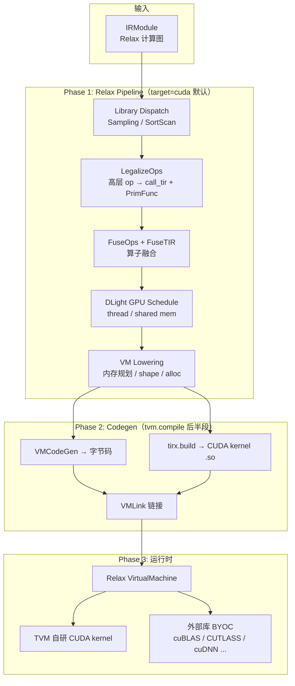

# TVM CUDA 编译路径

本文说明在 **`target=cuda`** 下，TVM 如何将 Relax 计算图编译为最终可执行代码，以及模型各层如何映射到具体算子实现（TVM 自研 CUDA kernel、cuBLAS 等 BYOC 后端）。

> 整体架构与 BYOC 细节见 [tvm.md](./tvm.md)；IR 层对比见 [ir.md](./ir.md)。

---

## 1. 总览：两条并行路径

CUDA 编译不是「一层对应一个 cuBLAS 调用」。实际是 **Relax VM 调度 + 多种算子后端** 的组合：



**核心结论：**

- 默认 CUDA pipeline **不会自动使用 cuBLAS**；matmul、conv 等走 **TVM 自研 CUDA kernel**（DLight schedule + `tirx.build`）。
- cuBLAS、CUTLASS、cuDNN 等属于 **BYOC 可选分支**，需在 `tvm.compile` 前显式插入 `partition_for_*` + `RunCodegen` Pass。

---

## 2. 编译入口：`tvm.compile(mod, target="cuda")`

```python
import tvm
from tvm import relax

ex = tvm.compile(mod, target="cuda")
vm = relax.VirtualMachine(ex, tvm.cuda())
out = vm["main"](input_data)
```

内部分两大部分（`python/tvm/relax/vm_build.py`）：

| 步骤 | 动作 | 产出 |
|------|------|------|
| **① Relax Pipeline** | `relax.get_default_pipeline(cuda)(mod)` | 优化后的 IRModule（Relax 函数 + PrimFunc） |
| **② VMCodeGen** | 将 Relax 函数译为 VM 字节码 | `ExecBuilder` |
| **③ tirx.build** | 将所有 `PrimFunc` 编译为 CUDA | `runtime.Module`（`.cu` → PTX / cubin） |
| **④ VMLink** | 链接 VM 字节码 + TIR lib + `external_mods` | 最终 `Executable` |

GPU target 且 `relax_pipeline="default"` 时，自动选用 target 专属 pipeline（含 DLight），而非通用 `default_build_pipeline`：

```python
# vm_build.py 逻辑（简化）
if relax_pipeline == "default" and "gpu" in target.keys:
    relax_pipeline = relax.get_default_pipeline(target)  # cuda → backend.cuda.pipeline
```

CUDA 默认 pipeline 定义在 `python/tvm/relax/backend/cuda/pipeline.py`：

```python
library_dispatch_passes   # DispatchSampling, DispatchSortScan
+ legalize_passes         # LegalizeOps → FuseOps → FuseTIR → DLight
+ dataflow_lower_passes   # CallTIRRewrite 等
+ finalize_passes         # StaticPlanBlockMemory → VMShapeLower → AttachGlobalSymbol
```

---

## 3. 各阶段详解

### 3.1 模型导入：层 → Relax 高层算子

Frontend（PyTorch / ONNX / NNModule）将模型层翻译为 **平台无关** 的 Relax IR：

| 模型层 | Relax IR（示意） |
|--------|------------------|
| `nn.Linear` | `R.matmul(x, W)` + `R.add(..., bias)` |
| `nn.ReLU` | `R.nn.relu(x)` |
| `nn.Conv2d` | `R.nn.conv2d(x, weight, ...)` |
| `nn.LayerNorm` | `R.nn.layer_norm(...)` |
| Attention | `R.nn.attention(...)` 或分解后的 matmul / softmax |

此时尚无 CUDA / cuBLAS 概念，仅为高层算子图。

### 3.2 LegalizeOps：高层算子 → `call_tir` + PrimFunc

`LegalizeOps` 通过 `register_legalize` 规则，将每个 `relax.op` 降为 TIR PrimFunc：

| Relax 算子 | Legalize 规则文件 | 生成的 PrimFunc 来源 |
|-----------|-------------------|---------------------|
| `R.matmul` | `legalize_ops/linear_algebra.py` | TE 生成 matmul 三重循环 |
| `R.nn.relu` | `legalize_ops/nn.py` | TOPI `topi.nn.relu` |
| `R.nn.conv2d` | `legalize_ops/nn.py` | TOPI `topi.nn.conv2d` |
| `R.nn.softmax` | `legalize_ops/nn.py` | TOPI `topi.nn.softmax` |
| `R.add` / `R.multiply` | elementwise 规则 | TOPI 逐元素算子 |

Legalize 后 Relax 函数变为：

```python
lv0 = R.call_tir(matmul_primfunc, (x, w), out_sinfo=...)
lv1 = R.call_tir(relu_primfunc, lv0, out_sinfo=...)
```

IRModule 中同时存在 **Relax 函数**（调度逻辑）和 **PrimFunc**（算子实现草稿）。LegalizeOps **不区分 CUDA / CPU**，规则共用。

### 3.3 FuseOps + FuseTIR：算子融合

| Pass | 作用 | 示例 |
|------|------|------|
| `AnnotateTIROpPattern` | 标注 PrimFunc 的 op pattern | matmul=Opaque，relu=Elementwise |
| `FuseOps` | 在 DataflowBlock 内合并相邻算子 | relu 可融入 matmul 后的 epilogue |
| `FuseTIR` | 将多个 PrimFunc 合成一个 fused PrimFunc | `matmul+relu` → 单个 kernel |

融合减少 GPU 内存读写与 kernel launch 次数。

### 3.4 DLight：GPU Schedule（CUDA 特有）

```python
dl.ApplyDefaultSchedule(
    dl.gpu.Matmul(),
    dl.gpu.GEMV(),
    dl.gpu.Reduction(),
    dl.gpu.GeneralReduction(),
    dl.gpu.Fallback(),
)
```

给 PrimFunc 添加 **thread binding、shared memory tiling、vectorization** 等，使 TIR 可被 codegen 为高效 CUDA kernel。没有此步，matmul 等 PrimFunc 只是朴素三重循环，无法正确生成 GPU 代码。

### 3.5 VM Lowering：内存 + 形状 + 调用形式

| Pass | 作用 |
|------|------|
| `CallTIRRewrite` | 为 `call_tir` / `call_dps_packed` 显式 `alloc_tensor` |
| `StaticPlanBlockMemory` | 静态内存复用，降低峰值显存 |
| `RewriteCUDAGraph` | （可选）插入 CUDA Graph 捕获点 |
| `VMShapeLower` | 动态 shape 计算降为 VM builtin |
| `AttachGlobalSymbol` | 为函数附加符号名，供 codegen / 加载 |

### 3.6 Codegen：生成可执行代码

```
VMCodeGen(mod)            → Relax VM 字节码（调度 main 函数）
tirx.build(tir_mod, cuda) → 所有 PrimFunc → CUDA C → nvcc → PTX/cubin → .so
VMLink(...)               → 打包为单一 Executable
```

最终产物是一个 **`runtime.Module`（Executable）**，内含：

- VM 字节码（控制流、算子调用顺序）
- CUDA kernel 动态库（TVM 自研算子）
- （可选）`external_mods`（BYOC 外部库 runtime）

---

## 4. 模型层 → 算子实现映射

### 4.1 默认 CUDA pipeline（无 BYOC）

| 模型层 | Relax IR | Legalize 后 | Schedule | 最终实现 |
|--------|----------|-------------|----------|----------|
| Linear / MatMul | `R.matmul` | `call_tir(matmul_pf)` | DLight `gpu.Matmul` | **TVM CUDA kernel** |
| ReLU / GELU | `R.nn.relu` | `call_tir(relu_pf)` | FuseTIR 可融入 matmul | **TVM CUDA kernel**（或 fused） |
| Conv2d | `R.nn.conv2d` | `call_tir(conv2d_pf)` | DLight `gpu.Fallback` | **TVM CUDA kernel** |
| Softmax | `R.nn.softmax` | `call_tir(softmax_pf)` | DLight Reduction | **TVM CUDA kernel** |
| LayerNorm | `R.nn.layer_norm` | `call_tir(ln_pf)` | DLight | **TVM CUDA kernel** |
| Add / Mul | `R.add` | `call_tir(add_pf)` | Elementwise 融合 | **TVM CUDA kernel** |
| Sampling | `R.multinomial` 等 | `DispatchSampling` | — | **专用 PackedFunc** |

### 4.2 启用 BYOC 后（需手动插入 Pass）

| 模型层 / 子图 | BYOC Pass | 匹配 Pattern | 最终实现 |
|--------------|-----------|--------------|----------|
| MatMul (+bias+relu) | `partition_for_cublas` + `RunCodegen` | `cublas.matmul_bias_relu` | **cuBLAS Lt**（`CallCublasLt`） |
| 高性能 GEMM / Attention | `partition_for_cutlass` + `RunCodegen` | `cutlass.*` | **CUTLASS** 预编译 kernel |
| Conv + BN + ReLU | `partition_for_cudnn` + `RunCodegen` | `cudnn.*` | **cuDNN** |

BYOC 用法（在 compile 前插入）：

```python
from tvm.relax.backend.cuda.cublas import partition_for_cublas
from tvm import relax

mod = partition_for_cublas(mod)          # FuseOpsByPattern + Codegen 标注
mod = relax.transform.RunCodegen()(mod)  # → call_dps_packed + external_mods
ex = tvm.compile(mod, target="cuda")     # VMLink 链接 cuBLAS runtime
```

cuBLAS 符号命名、端到端关联链、`call_dps_packed` 机制详见 [tvm.md §5.5.2](./tvm.md#552-runCodegen-架构与作用)。

---

## 5. 运行时：算子如何被调用

编译后的 `Executable` 由 **Relax VM** 驱动。VM 不「理解模型层」，只执行字节码中的 **`call_tir` / `call_dps_packed` 指令**；层与实现的映射在编译期 Pass 链中已完成。

```
vm["main"](input, *weights)
  │
  ├─ VM 字节码解释执行（控制流、shape 计算、内存分配）
  │
  ├─ call_tir(matmul_fused, x, w, out)
  │     → func_pool 查 PrimFunc 对应的 CUDA kernel
  │     → CUDA driver launch grid/block
  │     → TVM 自研 matmul+relu kernel 在 GPU 上执行
  │
  └─ call_dps_packed(ExternFunc("fused_*_cublas0"), x, w, out)   # 若启用 BYOC
        → func_pool 查 external_mods 中的 CublasJSONRuntime
        → CallCublasLt → NVIDIA cuBLAS Lt API
```

VM 初始化 func pool 时（`src/runtime/vm/vm.cc`）：

1. 对 `kPackedFunc` 条目按 symbol 名查找：`GetFuncFromImports(name)` 遍历 import 链
2. 对 `kVMFunc` 条目加载 Relax 函数字节码
3. TIR kernel 通过 `tirx.build` 产物的 func table 解析

---

## 6. 示例：MLP 完整走一遍

假设 `MLP: Linear(784→128) → ReLU → Linear(128→10)`，`target=cuda`：

```
Frontend
  fc1: matmul + add
  relu: nn.relu
  fc2: matmul + add

LegalizeOps（平台无关）
  4 个 call_tir + 4 个 PrimFunc（matmul×2, add×2, relu×1）

FuseOps + FuseTIR
  add 可能融入 matmul epilogue；relu 可能融入第一个 matmul 后

DLight gpu.Matmul
  2 个 matmul PrimFunc 获得 GPU schedule

VM Lowering + Codegen
  VM 字节码调度 2~3 个 kernel launch
  tirx.build 生成对应 .cu kernel

运行时
  VM 依次 launch matmul(+bias+relu?) kernel → matmul(+bias) kernel
```

**启用 cuBLAS BYOC 时：** 两个 Linear 的 matmul 子图被替换为 `call_dps_packed` → cuBLAS Lt；ReLU 及未匹配算子仍走 TVM kernel。

完整代码示例：

```python
import tvm
from tvm import relax
from tvm.relax.frontend import nn

class MLP(nn.Module):
    def __init__(self):
        super().__init__()
        self.fc1 = nn.Linear(784, 128)
        self.relu = nn.ReLU()
        self.fc2 = nn.Linear(128, 10)

    def forward(self, x):
        return self.fc2(self.relu(self.fc1(x)))

mod, params = MLP().export_tvm({"forward": {"x": nn.spec.Tensor(("n", 784), "float32")}})
target = tvm.target.Target("cuda")

# 路径 A：默认（TVM 自研 CUDA kernel）
with target:
    mod = relax.backend.cuda.get_default_pipeline(target)(mod)
ex = tvm.compile(mod, target=target)
vm = relax.VirtualMachine(ex, tvm.cuda())

# 路径 B：cuBLAS BYOC（在 pipeline 之前或之中插入）
from tvm.relax.backend.cuda.cublas import partition_for_cublas

mod, params = MLP().export_tvm({"forward": {"x": nn.spec.Tensor(("n", 784), "float32")}})
mod = partition_for_cublas(mod)
mod = relax.transform.RunCodegen()(mod)
with target:
    mod = relax.backend.cuda.get_default_pipeline(target)(mod)
ex = tvm.compile(mod, target=target)
```

---

## 7. 默认路径 vs BYOC 路径对比

| | 默认 CUDA pipeline | BYOC（cuBLAS 等） |
|--|-------------------|-------------------|
| 触发方式 | `tvm.compile(mod, target="cuda")` | 额外 `partition_for_*` + `RunCodegen` |
| MatMul 实现 | DLight + `tirx.build` → CUDA kernel | `call_dps_packed` → cuBLAS Lt |
| Conv 实现 | TOPI + DLight → CUDA kernel | （可选）cuDNN BYOC |
| IR 调用形式 | `R.call_tir(PrimFunc, ...)` | `R.call_dps_packed(ExternFunc(...), ...)` |
| 产物 | VM 字节码 + CUDA .so | 额外 `external_mods` 链接进 Executable |
| 适用场景 | 通用、可融合、动态 shape | 大 GEMM、已知 pattern、库高度优化 |

两条路径 **并行互补**：BYOC 匹配的子图走外部库，未匹配的算子仍走 LegalizeOps → FuseTIR → DLight → `tirx.build`。

---

## 8. 小结

| 问题 | 答案 |
|------|------|
| `target=cuda` 如何编译？ | Relax Pipeline（Legalize → Fusion → DLight → VM Lowering）+ `tirx.build(cuda)` + VMLink |
| 默认会用 cuBLAS 吗？ | **不会**。默认 matmul / conv 等走 **TVM 自研 CUDA kernel** |
| 如何启用 cuBLAS？ | 手动 `partition_for_cublas` + `RunCodegen`，在 compile 前插入 |
| 层如何映射到实现？ | Frontend → Relax op → LegalizeOps → PrimFunc →（可选 BYOC）→ VM 调用 kernel / 外部库 |
| 最终产物是什么？ | 单一 `Executable`：VM 字节码 + CUDA `.so` +（可选）`external_mods` |

**一句话：** `target=cuda` 决定 TIR 的 schedule 策略（DLight）和 codegen 后端（NVCC / CUDA）；模型层通过 LegalizeOps 映射到 PrimFunc，再 codegen 为 GPU kernel；cuBLAS 等外部库是可选 BYOC 分支，需显式开启，不在默认 pipeline 中。

---

## 9. 关键源码索引

| 主题 | 路径 |
|------|------|
| CUDA 默认 pipeline | `python/tvm/relax/backend/cuda/pipeline.py` |
| 编译入口 | `python/tvm/relax/vm_build.py` |
| Legalize 规则 | `python/tvm/relax/transform/legalize_ops/` |
| cuBLAS pattern / partition | `python/tvm/relax/backend/cuda/cublas.py` |
| RunCodegen | `src/relax/transform/run_codegen.cc` |
| cuBLAS codegen | `src/relax/backend/contrib/cublas/codegen.cc` |
| cuBLAS runtime | `src/runtime/extra/contrib/cublas/cublas_json_runtime.cc` |
| TIR → CUDA codegen | `src/target/codegen.cc` |
| VM 链接 | `src/relax/backend/vm/codegen_vm.cc`（`VMLink`） |
| VM 运行时 | `src/runtime/vm/vm.cc` |
