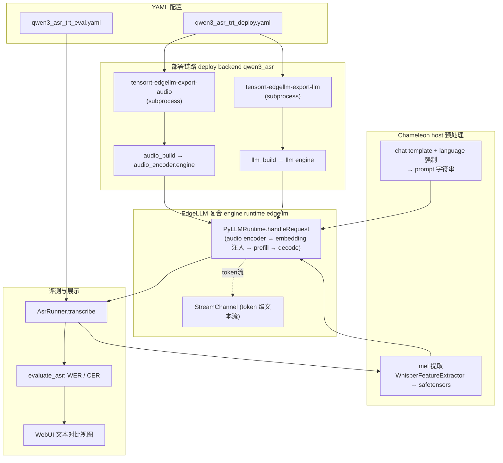
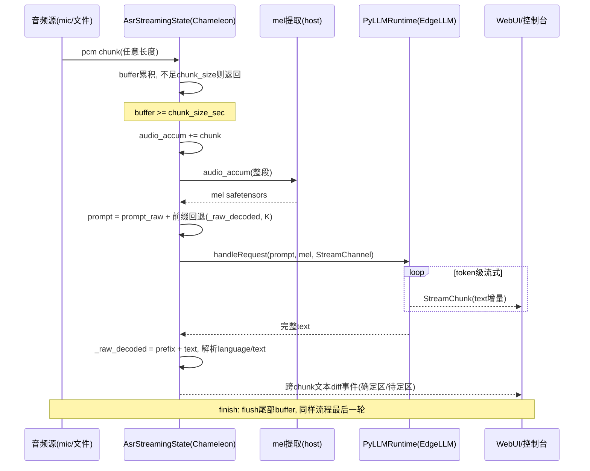

# Chameleon 接入 Qwen3-ASR 设计（基于 TensorRT-Edge-LLM）

> 状态：设计稿（未实现）。
> 关联文档：[edge_infer_arch.md](../edge_infer_arch.md)、[research/trt-edge-llm.md](../research/trt-edge-llm.md)。
> 参照实现：pi05（`chameleon/runtime/pi05_trt/`）、cosmos3（`chameleon/runtime/cosmos3_trt/`）。

---

## 1. 背景与目标

### 1.1 Qwen3-ASR 模型结构摘要

Qwen3-ASR（0.6B / 1.7B）是 Qwen3-Omni Thinker 分支裁剪出的"音频编码器 + LLM"条件生成模型：

```text
16kHz 波形 → mel(128 bins, WhisperFeatureExtractor)
  → AudioEncoder（Whisper 风格：3×Conv2d 下采样 + 32 层块对角注意力 Transformer）
  → audio embeddings [num_audio_tokens, hidden]      # ~13 token / 秒音频
  → 替换 prompt 中 <|audio_pad|> 占位 token 的 embedding
  → Qwen3 LLM（GQA + q/k_norm + MRoPE）自回归解码
  → "language {X}<asr_text>{转写文本}"
```

两个关键特性决定了部署形态：

1. **音频编码器无 KV cache、无自回归**——整段音频一次前向，天然适合独立 TRT engine；
2. **LLM 是标准 causal LM**——KV cache、采样、多模态 embedding 注入都是通用 LLM runtime 的成熟能力，不值得在 Chameleon 里重造。

### 1.2 TensorRT-Edge-LLM 已有的 ASR 支持

Edge-LLM 官方支持 Qwen3-ASR（见 `docs/source/user_guide/examples/asr.md`），pipeline 拆为双 engine：

| 阶段 | 工具 | 产物 |
|------|------|------|
| 导出 audio encoder | `tensorrt-edgellm-export-audio` | `onnx/audio/`（含 TRT 友好改造：eager attention、mask 代替 cu_seqlens、indices 代替 boolean indexing） |
| 导出 LLM | `tensorrt-edgellm-export-llm` | `onnx/llm/`（`inputs_embeds` 输入） |
| 构建 audio engine | `audio_build --minTimeSteps/--maxTimeSteps` | `engines/audio/audio_encoder.engine` |
| 构建 LLM engine | `llm_build --maxBatchSize/--maxInputLen/--maxKVCacheCapacity` | `engines/llm/` |
| 推理 | `LLMInferenceSpecDecodeRuntime::handleRequest()` | 转写文本 |

Runtime 侧串联流程（`cpp/runtime/llmInferenceSpecDecodeRuntime.cpp` + `cpp/multimodal/audioRunner.cpp`）：

1. 加载**预计算的 mel safetensors**（mel 提取必须在 host 侧 Python 完成，`audioRunner.cpp:366-374` 明确要求）；
2. GPU 侧 chunk/pad/mask 预处理 → audio encoder engine 前向 → `mAudioEmbedding`；
3. prompt 中 `<|audio_pad|>` 扩展为 N 个占位 token，`embeddingLookupMultimodal` kernel 按位置将 text token 查 embedding 表、audio token 直接取 encoder 输出；
4. LLM prefill + KV cache 自回归 decode。

**流式能力现状**：

- **文本输出流式**：已支持（`cpp/runtime/streaming.{h,cpp}` + `examples/llm/llm_stream.cpp`），pybind 暴露 `StreamChannel`（`try_pop` / `wait_pop` / `cancel` / `set_stream_interval`）；
- **音频输入流式**：**不支持**——runtime 只接受完整 mel，无 chunked audio prefill、无跨请求增量 encoder。

**Python 绑定**（`experimental/pybind/edgellm_pybind.cpp`）：

```python
rt = _edgellm_runtime.PyLLMRuntime(engine_dir, multimodal_engine_dir, lora_weights_map)
resp = rt.handleRequest(LLMGenerationRequest(...))   # messages 内含 audio safetensors 路径
rt.saveSystemPromptKVCache(prompt, lora_name)        # system prompt KV 复用
rt.getPrefillMetrics() / rt.getGenerationMetrics()   # reused/computed/generated tokens
```

### 1.3 Chameleon 现状差距

| 能力 | 现状 | ASR 需要 |
|------|------|----------|
| 自回归 token 解码 | 无先例（pi05/cosmos3 均为固定步数去噪环） | LLM decode 环 + KV cache |
| 评测契约 | `PolicyRunner.infer() → np.ndarray` 动作 chunk，`compare_actions` 数值对比 | transcript 字符串 + WER/CER |
| 数据集 | LeRobot / DROID RLDS（动作+图像） | 音频+参考文本（LibriSpeech / AISHELL） |
| 流式 | 仅 CUDA stream 与 WebUI 事件流 | 音频 chunk 状态机 + 增量文本 |
| Runtime 输入契约 | `Engine.run(dict[str, Tensor])` 张量绑定 | `{prompt, mel}` 复合请求 |

### 1.4 目标

1. `chameleon workflow --config configs/qwen3_asr_trt_deploy.yaml` 一键完成 export → compile；
2. `chameleon eval --config configs/qwen3_asr_trt_eval.yaml` 对标准数据集跑 WER/CER 并在 WebUI 展示 pred/ref 文本对比；
3. `chameleon infer` 支持单条音频离线转写与**流式转写 demo**（chunk 状态机 + 增量文本输出）；
4. 保持 Chameleon 的 Registry 范式：新增模型族不修改编排代码。

---

## 2. 路线决策

### 2.1 候选路线

| | 路线 A：原生逐 stage 接入 | **路线 B：封装 Edge-LLM（选定）** | 混合 |
|---|---|---|---|
| 导出/构建 | Chameleon 自己写 `audio_encoder` / `llm_prefill` / `llm_decode` 三个 ONNX exporter，KV cache 作为 engine I/O | 委托 `tensorrt-edgellm-export-*` + `audio_build`/`llm_build` | Edge-LLM 导出，Chameleon TensorRTEngine 驱动 |
| 自回归 runtime | host 侧手写 decode 环 + KV cache 管理 + 采样 | 复用 `handleRequest`（KV cache/采样/多模态注入/CUDA Graph/spec decode 全部现成） | Chameleon 管 KV cache |
| 流式 | 全自研 | 文本流式用 `StreamChannel`；音频流式在 Chameleon host 层做状态机 | 全自研 |
| 逐 stage TRT profile | 可以 | audio engine 可单独 trtexec profile；LLM 内部走 Edge-LLM metrics | 可以 |
| 工作量 | 很大（KV cache I/O 的 ONNX 导出、prefill/decode 双 profile、采样 kernel） | 小（subprocess 封装 + pybind 调用） | 大 |
| 风险 | 精度/性能对齐 Edge-LLM 需要长期投入 | 依赖 Edge-LLM 构建产物与 pybind ABI | KV cache 布局与 Edge-LLM kernel 耦合 |

### 2.2 决策：路线 B

**Chameleon 不重造 KV cache 自回归 runtime。** 把 Edge-LLM 的 `PyLLMRuntime` 整体封装为一个"复合 engine"（一次 `run()` = mel→encoder→prefill→decode 全过程），Chameleon 负责它不具备的部分：

- 音频输入流式状态机（Edge-LLM 不支持，而 Qwen3-ASR 官方流式语义恰好不需要 runtime 支持，见 §4）；
- mel 特征提取与 prompt 构建（Edge-LLM 本来就要求 host 侧完成）;
- 数据集 / WER 评测 / WebUI；
- workflow 编排（export/compile/eval/infer 的 yaml 驱动）。

取舍说明：牺牲 LLM 内部逐 stage 的 TRT profile 粒度（Edge-LLM 的 prefill/generation metrics 可部分弥补），换取成熟的 KV cache、采样、`embeddingLookupMultimodal`、system prompt KV cache、CUDA Graph 和未来 EAGLE 投机解码能力。audio encoder engine 是独立文件，仍可走 Chameleon 现有 `trt-profile` 动作做 layer 级分析。

---

## 3. 集成架构

### 3.1 总览

沿用 Registry 六件套范式，新增组件（均为新文件，不改动现有模型路径）：

| Registry | 新增 | 参照 |
|----------|------|------|
| `ARCHITECTURE_REGISTRY` | `chameleon/architectures/qwen3_asr.py` | `architectures/cosmos3.py` |
| `MODEL_REGISTRY` | `chameleon/models/qwen3_asr/adapter.py` | `models/cosmos3/adapter.py` |
| `DEPLOY_BACKEND_REGISTRY` | `chameleon/deploy/qwen3_asr_edgellm.py` | `deploy/cosmos3_diffusers.py` |
| `RUNTIME_REGISTRY` | `chameleon/runtime/edgellm/backend.py`（name=`edgellm`） | `runtime/tensorrt/backend.py` |
| `POLICY_RUNNER_REGISTRY` | `chameleon/evaluate/asr_runner.py`（见 §5 契约讨论） | `evaluate/cosmos3_trt_runner.py` |
| `DATASET_REGISTRY` + `LOADER_REGISTRY` | `chameleon/dataloader/asr_audio.py` + `configs/librispeech.py` | `dataloader/cosmos3_droid.py` |



### 3.2 architecture：`architectures/qwen3_asr.py`

声明性 stage 划分为 `audio_encoder` + `llm` 两个 stage。与 cosmos3 不同，这里的 stage 主要用于：

- workflow 计划展示与产物路径管理（`onnx/{audio,llm}`、`engines/{audio,llm}`）；
- `trt-profile` 动作对 `audio_encoder.engine` 单独做 trtexec layer profile；
- metadata 记录 `max_new_tokens`、`sample_rate=16000`、`mel_bins=128`、支持语言列表等。

实际 export/build 不走 per-stage exporter，整体委托 deploy backend（`uses_dedicated_build=True`）。

### 3.3 deploy backend：`deploy/qwen3_asr_edgellm.py`

实现 `DeployBackend` 协议（`chameleon/deploy/registry.py:27-51`），`name="qwen3_asr"`，`aliases=("qwen3_asr_edgellm",)`：

- `export(task, manifest)`：subprocess 调用
  - `tensorrt-edgellm-export-audio --model_dir {checkpoint} --output_dir {export_dir}/audio`
  - `tensorrt-edgellm-export-llm --model_dir {checkpoint} --output_dir {export_dir}/llm`
- `build(task, manifest)`：subprocess 调用 Edge-LLM 的 C++ 构建器
  - `audio_build --onnxDir {export_dir}/audio --engineDir {engine_dir}/audio --minTimeSteps ... --maxTimeSteps ...`
  - `llm_build --onnxDir {export_dir}/llm --engineDir {engine_dir}/llm --maxBatchSize ... --maxInputLen ... --maxKVCacheCapacity ...`
- 构建参数来自 per-stage `build_cfg`（沿用 `configs/build_configs/` 模式，如 `qwen3_asr_audio_build_cfg.py` 定义 min/max time steps）；
- Edge-LLM 二进制/CLI 路径通过 `deploy` 段新增 `edgellm_home` 字段解析（默认从 `TENSORRT_EDGELLM_HOME` 环境变量取）。

**产物目录约定**（对齐 Edge-LLM runtime 的加载约定——`multimodalEngineDir/audio` 自动发现 audio runner）：

```text
{engine_dir}/
  llm/            # llm_build 输出（engine + config.json + tokenizer）
  audio/          # audio_build 输出（audio_encoder.engine + config.json）
```

`PyLLMRuntime(engine_dir/llm, engine_dir, {})` 即可加载全部。

### 3.4 runtime backend：`runtime/edgellm/backend.py`

新增 `RUNTIME_REGISTRY` 条目 `edgellm`。与现有 `TensorRTEngine`（张量 positional 绑定，`runtime/tensorrt/backend.py:149-213`）的关键差异是输入契约：**复合请求而非张量 dict**。

`Engine.run(inputs: dict[str, Any]) -> dict[str, Any]`（`runtime/base.py:24-31`）的类型签名本来就是 `Any`，因此不需要改抽象——约定 ASR 的 engine I/O 为：

```python
class EdgeLLMAsrEngine(Engine):
    stage = "asr"   # 复合 stage：encoder+prefill+decode 一体

    def run(self, inputs: dict[str, Any]) -> dict[str, Any]:
        # inputs:
        #   prompt: str            — 已渲染好的完整 prompt（含 <|audio_pad|> 与可选 language 强制后缀）
        #   mel_path: str          — 预计算 mel 的 safetensors 路径（Edge-LLM 只接受文件）
        #   max_new_tokens: int
        #   stream: StreamChannel | None   — 传入则启用 token 级流式
        # outputs:
        #   text: str              — 原始解码文本（"language X<asr_text>..."）
        #   prefill_metrics / generation_metrics — 透传 Edge-LLM metrics
        ...
```

实现要点：

- lazy import `_edgellm_runtime`（pybind so），`RuntimeBackend.available()` 检查导入与 engine 目录存在性；
- `LLMGenerationRequest` 组装：`Message(role="user", contents=[MessageContent(type="audio", content=mel_path)])` + system context；
- mel 中转文件写入 `output_dir/tmp_mel/`，流式场景按 stream_id 复用同名文件避免碎片（V2 优化：推动 Edge-LLM pybind 接受内存 mel tensor，消除落盘）；
- 进程内单例：`PyLLMRuntime` 持有全部 engine 与 KV cache，一个任务只加载一次。

### 3.5 host 预处理：`models/qwen3_asr/adapter.py`

`ModelAdapter` 承担纯 host 逻辑（不依赖 Edge-LLM）：

- **mel 提取**：移植 Edge-LLM `tensorrt_edgellm/scripts/preprocess_audio.py` 的 `WhisperFeatureExtractor` 参数（feature_size=128, hop=160, n_fft=400, 16kHz），输入支持路径/URL/`(np.ndarray, sr)`（复用 Qwen3-ASR 包 `qwen_asr/inference/utils.py` 的 `normalize_audios` 语义，自行实现避免引入 qwen-asr 依赖）；
- **prompt 构建**：加载 HF tokenizer + chat template，`system=context, user=[audio]`，`add_generation_prompt=True`；若指定 `language` 追加 `language {X}<asr_text>` 强制纯文本输出（与 qwen_asr 官方 `_build_text_prompt` 一致）；
- **输出解析**：`parse_asr_output` 拆出 `(language, text)`；
- `example_observation()` 返回一段静音/示例音频，供 `chameleon infer` 冒烟。

---

## 4. 流式推理设计（核心）

### 4.1 三层流式拆解

"ASR 流式"实际是三个独立层次，各自有明确归属：

| 层 | 内容 | 归属 | 现状 |
|----|------|------|------|
| L1 音频输入流式 | mic/文件按 chunk 到达，buffer 满触发一次推理 | **Chameleon 状态机**（host） | 需新增 |
| L2 推理流式 | 每 chunk 如何利用历史（重算 or 增量） | V1 整段重喂（host 策略）；V3 依赖 Edge-LLM 增量 prefill | Edge-LLM 不支持音频增量 |
| L3 结果流式 | 单次请求内 token 级文本流 + 跨 chunk 增量 diff 推送 | Edge-LLM `StreamChannel` + Chameleon WebUI 事件 | StreamChannel 已有 |

关键洞察：**Qwen3-ASR 官方流式语义本身就是"每 chunk 整段重喂 + 前缀回退"**（`Qwen3-ASR/qwen_asr/inference/qwen3_asr.py` 的 `streaming_transcribe`），并不要求 runtime 支持音频增量。因此 Edge-LLM"仅支持整段输入"不是障碍——L1/L2 状态机完全放在 Chameleon host 层即可获得与官方一致的流式行为与精度（官方 streaming WER 仅比 offline 差约 0.6-1 个点）。

### 4.2 `AsrStreamingState` 数据结构

对齐 qwen_asr 官方 `ASRStreamingState` 字段语义，落在 `chameleon/runtime/edgellm/streaming.py`：

```python
@dataclass
class AsrStreamingState:
    # 配置
    chunk_size_sec: float = 2.0        # 满多少秒触发一次推理
    unfixed_chunk_num: int = 2         # 前 N 个 chunk 不用历史文本作前缀（避免早期误导）
    unfixed_token_num: int = 5         # 用历史文本作前缀时回退末尾 K 个 token（消除边界抖动）
    # 运行时
    chunk_id: int = 0
    buffer: np.ndarray                 # 未满 chunk 的 PCM 缓冲
    audio_accum: np.ndarray            # 从头累积的全部音频（整段重喂的输入）
    prompt_raw: str                    # 基础 prompt（chat template + 可选 language 强制）
    _raw_decoded: str                  # 累积原始解码文本（前缀回退的来源）
    # 对外结果
    language: str
    text: str
```

前缀回退逻辑与官方一致：`chunk_id >= unfixed_chunk_num` 时，取 `_raw_decoded` 的 token 序列去掉末尾 K 个、decode 回字符串作为 prompt 后缀（处理 `\ufffd` 半字符时逐步多退），使模型在稳定前缀上继续，只重新生成尾部易抖动区域——这同时**大幅减少每 chunk 的 decode token 数**（只需生成增量部分）。

### 4.3 时序图



WebUI 事件语义：前缀部分标记为"已确定"（灰/黑），本轮新生成的尾部 `unfixed_token_num` 区域标记为"待定"（高亮），下一 chunk 可能修正——与常见流式 ASR 产品的"灰字转正"交互一致。

### 4.4 演进路径 V1 → V3

| 版本 | 策略 | 复杂度 | 依赖 |
|------|------|--------|------|
| **V1 整段重喂** | 每 chunk：`audio_accum` 全量 mel → encoder → 全量 prefill → 短 decode。复杂度 O(n²)（n 为音频总时长），但正确性与官方 qwen_asr 完全对齐 | 低 | 无（Edge-LLM 现状即可） |
| **V2 前缀 KV 复用** | 利用 `saveSystemPromptKVCache` / Edge-LLM 的 KV cache reuse（`getPrefillMetrics().reused_tokens` 表明 runtime 已有 prefix cache 机制）：prompt 头部（system + audio_start 之前）与已确定文本前缀的 KV 命中缓存，只重算音频 token 与尾部。audio token 部分因整段音频每轮变长仍需重算 encoder + prefill | 中 | 验证 Edge-LLM prefix cache 对 multimodal embedding 的命中行为 |
| **V3 音频增量 prefill** | Edge-LLM 上游支持：audio encoder 按块对角窗口天然可分块（`n_window_infer=400` 帧窗口内注意力封闭，历史窗口的 encoder 输出可缓存）；LLM 侧 audio token 追加式 prefill（chunked prefill 已有 kernel 能力）。达成 O(n) 流式 | 高 | **需 Edge-LLM 上游改造**（audioRunner 增量接口 + prefill API），列为依赖项不在本设计范围内实现 |

V1 的 O(n²) 在实际场景可接受的原因：单 utterance 典型 < 30s；且 Qwen3-ASR 编码器块对角注意力使 encoder 成本随时长线性增长，二次项只出现在 LLM prefill（几百 token 规模）。

### 4.5 每 chunk 延迟预算（V1，Thor，Qwen3-ASR-0.6B FP16，估算值）

以 2s chunk、累积到第 15 chunk（30s 音频，约 390 个 audio token，prompt 总长约 450 token）为最坏情形：

| 环节 | 估算 | 说明 |
|------|------|------|
| mel 提取（30s 音频，CPU） | 20-50 ms | librosa/torch STFT，可增量缓存已算帧（mel 是逐帧独立的，L1 层可只算新增 2s 再拼接） |
| mel 落盘 safetensors | 5-10 ms | 30s mel ≈ 128×3000×fp16 ≈ 0.77MB |
| audio encoder（30s） | 15-40 ms | 0.6B 的 encoder 部分很小，块对角注意力线性扩展 |
| LLM prefill（~450 token） | 30-80 ms | 0.6B FP16 @ Thor |
| LLM decode（前缀回退后增量 ~15 token） | 100-200 ms | ~10ms/token 量级 |
| 解析 + 事件推送 | < 5 ms | |
| **合计** | **~0.2-0.4 s** | << 2s chunk 周期，实时率 RTF ≈ 0.1-0.2 |

结论：V1 即可满足实时流式；优化优先级为 mel 增量缓存（免费）> V2 KV 复用 > FP8 量化 > V3。以上数字需在 Phase 2 用 `getPrefillMetrics`/`getGenerationMetrics` 实测校准。

---

## 5. 评测与数据

### 5.1 Runner 契约：新增 `AsrRunner`，不复用 `PolicyRunner`

`PolicyRunner`（`evaluate/runner_base.py:44-87`）契约是 `infer(observation) -> np.ndarray` 动作 chunk + `action_horizon/action_dim` 元数据，与 ASR 的"音频→文本"语义不符，强行复用会污染两边的类型。新增平行抽象：

```python
# chameleon/evaluate/asr_runner_base.py
class AsrRunner(ABC):
    @classmethod
    @abstractmethod
    def from_task(cls, task: TaskConfig) -> "AsrRunner": ...

    @abstractmethod
    def transcribe(self, audio: np.ndarray, *, context: str = "",
                   language: str | None = None) -> AsrResult: ...
        # AsrResult: language: str, text: str, metrics: dict (prefill/decode token 数、耗时)

ASR_RUNNER_REGISTRY: Registry[str, type[AsrRunner]] = Registry("asr_runner")
```

首个实现 `evaluate/qwen3_asr_edgellm_runner.py`（注册名 `qwen3_asr_edgellm`）：组合 §3.5 adapter（mel/prompt/解析）与 §3.4 engine。`api.run_eval` 按 `task.evaluate.policy_runner` 名字先查 `ASR_RUNNER_REGISTRY`、再查 `POLICY_RUNNER_REGISTRY`，路由到 `evaluate_asr()` 或 `evaluate_lerobot()`——编排层改动收敛在一个分发点。

### 5.2 `evaluate_asr()` 评测循环与指标

`chameleon/evaluate/asr_eval.py`，结构对齐 `evaluate_lerobot()`（`evaluate/lerobot_eval.py:178-321`，含本次加的有界进度心跳模式）：

```python
for i in indices:
    sample = data_source[i]              # audio + ref_text + language
    t0 = perf_counter()
    result = asr_runner.transcribe(sample.audio, language=sample.language)
    wer_i = word_error_rate(ref=sample.ref_text, hyp=result.text, lang=sample.language)
    # 累计：加权 WER（按 ref 词数加权）、CER、RTF、逐样本最差 case
sink.on_run_done(AsrEvalSummary(wer, cer, rtf, worst_samples))
```

指标定义：

- **WER**：编辑距离 / 参考词数。英文等空格语言按词；**中文/日文按字（即 CER）**，混合文本按 Qwen 官方评测惯例先做文本规范化（大小写、标点剥离、数字归一）——规范化函数独立成 `evaluate/text_norm.py` 纯函数便于单测；
- **RTF**：推理耗时 / 音频时长；
- 流式模式额外记录 **首字延迟**（首个非空 StreamChunk 时间）与 **尾字延迟**（音频结束到最终文本稳定）。

### 5.3 数据集

沿用 `LOADER_REGISTRY` 模式（`dataloader/base.py`，本次 cosmos3_droid 已建立的扩展点）：

- `dataloader/asr_audio.py`：`AsrDataSource`，产出 `AsrSample(audio: np.ndarray, sr: int, ref_text: str, language: str | None, duration_sec: float)`；loader 注册名 `asr_hf`（HuggingFace datasets 的 LibriSpeech / AISHELL-1 / CommonVoice，lazy import `datasets`）与 `asr_manifest`（本地 `{wav_path, text}` jsonl 清单，无网络依赖）；
- `dataloader/configs/librispeech.py`：注册 `librispeech_test_clean` spec（`extra={"split": "test.clean"}`）；
- 采样率统一重采样到 16kHz 单声道（librosa，放在 DataSource 内完成）。

### 5.4 WebUI 文本对比视图

复用本次 cosmos3 eval 打通的 WebUI 事件通道（`evaluate/viewers/webui/`），新增文本视图而非改造动作曲线视图：

- `on_run_start` meta 增加 `task_type: "asr"`，前端 `app.js` 据此切换视图（沿用 cosmos3 适配时"按 meta 自动配置前端"的做法，参考 `meta.action_dim` 自动 dims 的先例）；
- 每样本事件：`{index, ref_text, hyp_text, wer, rtf, audio_duration}`，前端渲染逐词 diff 高亮（插入绿/删除红/替换黄，Levenshtein 对齐结果由后端算好传 spans，前端只渲染）；
- 流式 demo 模式：单流页面，确定区/待定区双色增量刷新（§4.3 事件语义）；
- 汇总面板：累计 WER/CER/RTF 曲线，替换动作评测的 max_abs/cosine 面板。

---

## 6. 配置 schema 与 YAML 示例

### 6.1 schema 增量（`config/schema.py`）

最小侵入，新增两个可选子模型，不动现有字段：

```python
class AsrConfig(BaseModel):
    """ASR 任务参数（qwen3_asr 架构使用）。"""
    language: str | None = None        # 强制语种；None=自动检测
    context: str = ""                  # system context 热词/领域提示
    max_new_tokens: int = 256
    audio: str | None = None           # infer 单条冒烟用的音频路径/URL

class StreamConfig(BaseModel):
    """流式推理参数（action: stream 时生效）。"""
    chunk_size_sec: float = 2.0
    unfixed_chunk_num: int = 2
    unfixed_token_num: int = 5
    source: str = "file"               # file | mic
    token_stream: bool = True          # 是否启用 Edge-LLM StreamChannel

class TaskConfig(BaseModel):
    ...
    asr: AsrConfig = Field(default_factory=AsrConfig)
    stream: StreamConfig = Field(default_factory=StreamConfig)
```

`DeployConfig` 增加 `edgellm_home: str | None = None`（Edge-LLM 安装/构建目录，None 时读环境变量）。actions 路由：`eval`/`infer` 复用现有动作名（内部按 architecture 分发到 ASR 路径）；新增 `stream` 动作 → `commands/stream.py` 跑流式 demo。

### 6.2 deploy yaml：`configs/qwen3_asr_trt_deploy.yaml`

```yaml
architecture: qwen3_asr
model: qwen3_asr_0.6b
platform: nvidia_thor
output_dir: output/qwen3_asr_0.6b

actions: [export, compile, trt_profile]

model_overrides:
  checkpoint: ~/models/Qwen3-ASR-0.6B     # HF 目录
  dtype: fp16

deploy:
  backend: qwen3_asr
  edgellm_home: ~/codes/model_optimizer/third_party/TensorRT-Edge-LLM
  export_dir: output/qwen3_asr_0.6b/onnx
  engine_dir: output/qwen3_asr_0.6b/engines

export:
  - stage: audio_encoder
  - stage: llm

compile:
  - stage: audio_encoder
    options:
      build_cfg: configs/build_configs/qwen3_asr_audio_build_cfg.py   # minTimeSteps=100, maxTimeSteps=3000
  - stage: llm
    options:
      build_cfg: configs/build_configs/qwen3_asr_llm_build_cfg.py     # maxBatchSize=1, maxInputLen=1024, maxKVCacheCapacity=4096

trt_profile:
  - stage: audio_encoder      # 仅 audio engine 可 trtexec；llm 走 Edge-LLM metrics
```

### 6.3 eval yaml：`configs/qwen3_asr_trt_eval.yaml`

```yaml
architecture: qwen3_asr
model: qwen3_asr_0.6b
platform: nvidia_thor
output_dir: output/qwen3_asr_0.6b

actions: [eval]

model_overrides:
  checkpoint: ~/models/Qwen3-ASR-0.6B     # tokenizer/chat template 仍需 HF 目录

deploy:
  backend: qwen3_asr
  engine_dir: output/qwen3_asr_0.6b/engines

data:
  dataset: librispeech_test_clean
  dataset_root: ~/datasets/asr
  num_samples: 200

asr:
  language: English            # 可省略走自动语种检测
  max_new_tokens: 256

evaluate:
  policy_runner: qwen3_asr_edgellm
  num_samples: 200
  viewer: both                 # console + webui
  webui_host: 0.0.0.0
  webui_port: 8000
```

流式 demo（`chameleon stream --config ...`）在 eval yaml 基础上改 `actions: [stream]` 并配置：

```yaml
stream:
  source: file                 # 或 mic
  chunk_size_sec: 2.0
  unfixed_chunk_num: 2
  unfixed_token_num: 5
asr:
  audio: ~/datasets/asr/long_sample.wav
```

---

## 7. 实施路线图

### Phase 1：离线 transcribe 全链路（export → compile → infer → WER eval）

| 项 | 文件 |
|----|------|
| architecture + adapter（mel/prompt/解析） | `architectures/qwen3_asr.py`、`models/qwen3_asr/adapter.py` |
| deploy backend（subprocess 封装） | `deploy/qwen3_asr_edgellm.py`、`configs/build_configs/qwen3_asr_{audio,llm}_build_cfg.py` |
| runtime backend（pybind 封装） | `runtime/edgellm/backend.py` |
| AsrRunner + WER 评测 | `evaluate/asr_runner_base.py`、`evaluate/qwen3_asr_edgellm_runner.py`、`evaluate/asr_eval.py`、`evaluate/text_norm.py` |
| 数据集 | `dataloader/asr_audio.py`、`dataloader/configs/librispeech.py` |
| schema + yaml | `config/schema.py` 增量、`configs/qwen3_asr_trt_{deploy,eval}.yaml` |
| 单测 | mel 提取形状/数值、prompt 构建、`parse_asr_output`、WER 计算（纯函数，无 GPU） |

验收：LibriSpeech test-clean 200 条 WER 与 qwen_asr transformers 后端（同 checkpoint FP16）差距 < 0.3 绝对点；`chameleon infer` 单条音频输出正确转写。

### Phase 2：流式（V1 整段重喂）

| 项 | 文件 |
|----|------|
| 流式状态机 + 前缀回退 | `runtime/edgellm/streaming.py` |
| stream 动作 + demo | `commands/stream.py`、schema `StreamConfig` |
| token 级流式接入 | `runtime/edgellm/backend.py` 加 StreamChannel 路径 |
| WebUI 流式文本视图 | `evaluate/viewers/webui/` + `webui_client/app.js` 文本视图 |
| mel 增量缓存 | adapter 内 mel 帧缓存（只算新增 chunk） |

验收：30s 音频流式转写最终文本与官方 qwen_asr vLLM streaming 一致（同参数 chunk=2s, K=5）；每 chunk 延迟 < chunk 周期（RTF < 1）；实测并回填 §4.5 延迟表。

### Phase 3：性能优化与量化

- **V2 KV 复用**：验证 `saveSystemPromptKVCache` 与 prefix cache 对流式 prompt 头部的命中（用 `getPrefillMetrics().reused_tokens` 度量），减少每 chunk prefill 成本；
- **FP8 audio encoder**：走 Edge-LLM `audio_quantization.py` + LibriSpeech 校准集（引用 [research/trt-edge-llm.md](../research/trt-edge-llm.md) 的 joint 校准设想），对比 WER 回退与延迟收益；
- **LLM 量化**：`tensorrt-edgellm-quantize-llm`（FP8/NVFP4）接入 deploy backend 的可选 quantize 步骤；
- **V3 增量 prefill**：向 Edge-LLM 上游提需求（audioRunner 增量接口），本仓库仅预留状态机扩展点。

### 风险与依赖

| 风险 | 缓解 |
|------|------|
| Edge-LLM pybind 仅在 experimental/，ABI 可能变动 | runtime backend 里做版本探测；退路是 subprocess 调 `llm_inference` CLI（JSON 输入输出已支持） |
| mel 必须落盘 safetensors，流式高频 IO | 按 stream 复用同一文件 + tmpfs；中期推动 pybind 支持内存 tensor |
| Thor 上 Edge-LLM 构建产物与 Chameleon 环境（容器）隔离 | deploy yaml 的 `edgellm_home` 显式指定；文档写清容器内构建步骤 |
| WER 对齐官方存在 tokenizer/规范化差异 | Phase 1 验收用同一 text_norm 对比两后端，先对齐规范化再对齐模型输出 |
