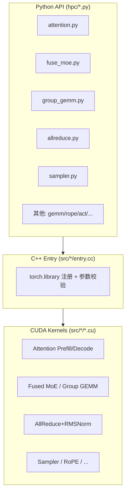

# HPC-Ops 分析

HPC-Ops 是腾讯混元 AI Infra 团队开源的 **LLM 推理高性能 CUDA 算子库**，面向 NVIDIA SM90（H20 等 Hopper 架构）GPU。目标是在 Attention、MoE、GEMM、采样、归一化、通信融合等推理热路径上，提供接近或超过 vLLM、SGLang、FlashInfer、NCCL、TensorRT-LLM 等基线的性能。

- 仓库路径：`edgeLLM/hpc-ops`
- 上游：https://github.com/Tencent/hpc-ops

---

## 整体定位

HPC-Ops 不是完整推理框架，而是 **可被 vLLM / SGLang 等框架集成的底层算子层**：

| 层级 | 路径 | 说明 |
|------|------|------|
| C++/CUDA 内核 | `src/` 下各模块的 `.cu` / `.cc` | 实际 GPU 实现 |
| PyTorch 绑定 | 编译为 `_C.abi3.so`，通过 `torch.ops.hpc.*` 注册 | C++ entry 层 |
| Python 封装 | `hpc/` 包 | 自动发现并导出各模块函数 |

Python 入口加载逻辑（`hpc/__init__.py`）：

```python
so_files = list(Path(__file__).parent.glob("_C.*.so"))
torch.ops.load_library(so_files[0])
_export_functions(_discover_modules())  # 自动导出 hpc/*.py 中的公开函数
```

构建上通过 CMake 编译全部 CUDA 源文件，目标架构固定为 `90a`，依赖 CUTLASS/CuTe（`CMakeLists.txt` 中 `CUDA_ARCHITECTURES "90a"`）。

---

## 架构分层



典型调用链：

```
hpc.attention_prefill_bf16(...)
  → torch.ops.hpc.attention_prefill_bf16
  → entry.cc（shape/dtype 校验）
  → 异步 CUDA kernel
```

---

## 核心算子模块

| 模块 | 作用 | 典型场景 |
|------|------|----------|
| **Attention** | Prefill / Decode、Paged KV Cache、动态任务调度、Block-sparse | 在线 serving，变长 batch、长上下文 |
| **Fused MoE** | 路由 + Gate-Up GEMM + 激活量化 + Down GEMM + Top-K 加权归约 | DeepSeek-V3、Qwen3-235B 等 MoE 低延迟推理 |
| **Group GEMM** | FP8 分组矩阵乘（per-tensor / block-wise） | Expert Parallel 下按 expert 分组 GEMM |
| **GEMM (BF16×FP32)** | 将 FP32 权重拆成高低 BF16 分量，双 GEMM 融合 | MoE Router、稀疏/线性 Attention 等对精度敏感的路径 |
| **AllReduce 融合** | AllReduce + Residual Add + RMSNorm 一体 | Tensor Parallel 后处理，减少 HBM 读写和 kernel launch |
| **Sampler** | 重复惩罚、温度、Top-K/Top-P、Softmax、随机采样 | Decode 步采样，合并为少量 kernel |
| **Normalization / RoPE / Act** | RMSNorm、RoPE+KV 存储、激活量化 | Transformer 层通用组件 |
| **STEM** | Block-sparse prefill 相关预处理 | 稀疏 Attention 的前置准备 |
| **Communicator** | NVLink multicast、Lamport P2P 等 | 融合 AllReduce 的底层通信 |

Python API 入口文件对照：

| 算子族 | 入口文件 |
|--------|----------|
| Attention / Block-sparse | `hpc/attention.py`, `hpc/stem.py` |
| BF16×FP32 GEMM | `hpc/gemm.py` |
| Group GEMM FP8 | `hpc/group_gemm.py` |
| Fused MoE | `hpc/fuse_moe.py` |
| AllReduce + RMSNorm | `hpc/allreduce.py` |
| Sampler | `hpc/sampler.py` |
| RMSNorm / RoPE / Act | `hpc/normalization.py`, `hpc/rope.py`, `hpc/act.py` |

---

## Group GEMM 详解

Grouped GEMM（分组矩阵乘）在一次 kernel launch 中完成多组形状相同、规模不同的 GEMM，是 MoE 推理的核心底层算子。入口：`hpc/group_gemm.py`，内核：`src/group_gemm/`（TMA 主路径）与 `src/group_gemm/cp_async/`（低延迟路径）。

### 问题定义

每组独立计算 `Y[i] = X[i] @ W[i]^T`：

| 张量 | Shape | 说明 |
|------|-------|------|
| `x` | `[total_seq, K]` | 所有组 token 按 expert 排列后拼接 |
| `weight` | `[num_group, N, K]` | 每组一组权重（如一个 expert） |
| `seqlens` | `[num_group]` | 每组实际 token 数 |
| `cu_seqlens` | `[num_group + 1]` | 前缀和，定位每组在 `x` 中的起始位置 |
| 输出 `y` | `[total_seq, N]` | BF16 |

### 两种量化模式

**per-tensor**（`group_gemm_pertensor_fp8`）

- 每组一个 scale：`y_scale[num_group]`
- 语义等价于对每组调用 `torch._scaled_mm`
- 实现简单，适合 per-tensor FP8 量化的 MoE（如 Hunyuan / Qwen3 MoE）

**block-wise**（`group_gemm_blockwise_fp8`）

- 激活 scale：`x_scale[K/128, total_seq_pad]`（128×128 block）
- 权重 scale：`w_scale[num_group, N/128, K/128]`（最后一维 pad 到 4 的倍数）
- K 维每 tile 累加时乘对应 block scale，FP32 累加后转 BF16
- 辅助算子 `reformat_x_scale`：转置 + pad scale 为 TMA 友好布局（兼容 DeepEP 等格式）
- 适合 DeepSeek-V3 等 block FP8 模型

### 两条内核路径

| 路径 | 目录 | 特点 |
|------|------|------|
| **TMA + Warp Specialization** | `src/group_gemm/` | 高吞吐，大 batch / prefill |
| **cp.async 多 stage** | `src/group_gemm/cp_async/` | 低延迟，小 batch / decode；含 scatter 变体 |

### 相对标准实现的优化

「标准实现」主要指：Python for-loop 每组一次 `torch._scaled_mm`、DeepGEMM 等 grouped FP8 库、以及 vLLM 常见的「先 gather 再 batched GEMM」MoE 路径。

| 优化手段 | 说明 |
|----------|------|
| **Persistent kernel** | 一个 grid（`num_sm` 个 block）跨所有 group 的所有 tile 循环，launch 从 O(num_group) 降到 O(1) |
| **Per-group TMA descriptor** | `update_grouped_tma` 为每组更新 TMA 描述符，指向 `x`/`y` 子区间，避免物理 reorder |
| **SM90 FP8 Tensor Core + Warp Specialization** | Load warpgroup（TMA 搬数据）与 Math warpgroup（GMMA 计算）并行，8-stage pipeline |
| **PDL 链式启动** | TMA 更新 kernel 与 GEMM kernel 在 GPU 上串行、CPU 无需 sync；Fused MoE 整条链靠 PDL 叠加 |
| **自适应 tile 形状** | 按 `num_seq_per_group_avg` 选 `kTileM`（8/16/32/48/64）；decode 小 M 用小 tile，prefill 大 M 用大 tile |
| **三种任务调度策略** | Policy 0：预生成 task_map；Policy 1：水平遍历（小 K/N）；Policy 2：垂直遍历（大 K/N），缓解 expert 负载不均 |
| **TMA descriptor 缓存** | 传入 `tma_desc` 时跳过 descriptor 更新，连续 decode 步可复用 |
| **Scale 融合 epilogue** | per-tensor / block-wise scale 在 K-tile 累加时乘入 FP32 accumulator，避免单独 dequant kernel |
| **cp.async scatter** | 通过 `row_indices` 从原始 token pool 非连续读 A，省掉 gather 物理拷贝（Fused MoE cp_async 路径） |

`num_seq_per_group_avg` 与 `kTileM` 的对应关系（`group_gemm_pertensor_fp8.cu`）：

```
≤ 8  → kTileM = 8
≤ 16 → kTileM = 16
≤ 32 → kTileM = 32
≤ 48 → kTileM = 48
≤ 64 → kTileM = 64（K≤192 时 kTileK=64）
...
```

### 为什么更快

| 瓶颈 | 标准做法 | HPC-Ops |
|------|----------|---------|
| Kernel launch | 每组 1 次，decode 时占比极高 | 1 次 persistent + PDL 链 |
| 内存流量 | gather → GEMM 两次读 token | TMA 子区间 / scatter 直读 |
| 负载不均 | 静态 batched GEMM 按最大 M padding | task_map + 三种 tile 遍历策略 |
| 小 M 效率 | 大 tile 空算严重 | M=8/16 小 tile + 多 stage pipeline |
| 算子融合 | scale / quant 单独 kernel | scale 融进 GEMM epilogue |

官方 benchmark（对比 DeepGEMM）：Prefill 最高 **1.1x**，Decode 最高 **1.88x**。Decode 提升更大，因为小 batch、多 expert、负载不均时上述优化收益最明显。

### 在 Fused MoE 中的位置

Group GEMM 是 Fused MoE 的核心计算（`src/fuse_moe/fuse_moe.cu`）：

```
路由(count_and_gather)
  → Group GEMM(gate-up)
  → 激活 + 量化
  → Group GEMM(down)
  → top-k reduce
```

cp_async 变体用 scatter GEMM 进一步去掉 gather 阶段。

### 使用场景

| 场景 | 特征 | 推荐路径 |
|------|------|----------|
| MoE Prefill | 每组 token 多（32–256+） | TMA 主路径，大 tile M |
| MoE Decode | 每组 1–8 token，expert 负载不均 | cp_async + task_map；或 TMA M=8 |
| Expert Parallel (EP) | 本卡只跑部分 expert | `num_group = num_expert_local` |
| DeepSeek-V3 block FP8 | 需要 block scale | `group_gemm_blockwise_fp8` + `reformat_x_scale` |
| Hunyuan / Qwen3 per-tensor FP8 | 整 tensor 一个 scale | `group_gemm_pertensor_fp8` |

**不适用**：非 MoE 模型、非 SM90 GPU、每组 token 完全均匀且极大（与标准 batched GEMM 差距缩小）。

### 代码示例

```python
import hpc

# per-tensor：MoE gate-up/down
y = hpc.group_gemm_pertensor_fp8(
    x, weight, seqlens, cu_seqlens, y_scale,
    num_seq_per_group_avg=mean_tokens_per_expert,
)

# block-wise：DeepSeek 类 block FP8
x_scale = hpc.reformat_x_scale(raw_x_scale, seqlens, cu_seqlens, mean_seq)
y = hpc.group_gemm_blockwise_fp8(
    x, weight, seqlens, cu_seqlens, x_scale, w_scale,
    num_seq_per_group_avg=mean_seq,
)
```

测试参考：`hpc-ops/tests/test_group_gemm_pertensor.py`、`test_group_gemm_blockwise.py`、`test_group_gemm_cp_async.py`。

---

## 关键技术特点

### 1. Attention（最大模块）

- **Prefill**：一次处理整段 prompt；支持 BF16 / FP8、多种量化粒度（per-token / per-head / per-tensor）
- **Decode**：单 token 自回归；支持 **Paged KV Cache**（`block_ids` 索引）
- **动态 Decode 调度**：把 KV 切成均匀 tile，用贪心 bin-packing 分配 CTA，缓解长短请求混 batch 的尾延迟
- **Block-sparse Prefill**：按 block mask 跳过无效 KV tile，配合 FP8 per-tile scaling

### 2. Fused MoE

- 底层 Gate-Up / Down 线性层由 **Group GEMM** 承担（详见上文 [Group GEMM 详解](#group-gemm-详解)）
- 避免先 gather 再 GEMM 的额外内存流量
- 用 shared-memory counting 降低全局 atomic 压力
- `cp.async` 路径 + PDL（Programmatic Dependent Launch）减少 launch bubble
- 支持 per-tensor 和 block-wise FP8 scaling

### 3. 通信-计算融合

- **高吞吐模式**：CUDA multicast，适合 prefill 大 token
- **低延迟模式**：Lamport P2P 两 kernel + PDL，适合 decode 小 batch
- 逻辑上等价于：`RMSNorm(AllReduce(x) + residual, weight)`

### 4. 精度策略

- 主路径：**BF16**、**FP8 (e4m3fn)**
- 精度敏感 GEMM：**BF16×FP32**（权重拆高低位，双 Tensor Core GEMM 融合，固定 scale `1/256`）

---

## 性能概览（官方 benchmark）

| 算子 | 对比基线 | 代表性结果 |
|------|----------|------------|
| Attention BF16 | FlashInfer, FA2/FA3, TRT-LLM | Prefill 最高 1.33x，Decode 最高 2.22x |
| Attention FP8 | FlashInfer, FA3, TRT-LLM | Prefill 最高 1.12x，Decode 最高 2.0x |
| Sparse Attention FP8 | MIT-BSA, FlashPrefill-BSA 等 | 最高 3.16x |
| Dynamic decode attention | Static split-k | 最高 2.88x |
| BF16×FP32 GEMM | cuBLAS FP32/TF32 | 最高 3.22x |
| Fused FP8 MoE | vLLM CUTLASS/Triton, SGLang | TP 最高 1.6x，EP 最高 1.5x |
| Fused AllReduce + RMSNorm | NCCL, FlashInfer | 最高 1.76x |
| Fused sampler | vLLM PyTorch, FlashInfer | 最高 8.5x |
| GroupGEMM FP8 | DeepGEMM | Prefill 最高 1.1x，Decode 最高 1.88x |

详细复现见 `hpc-ops/benchmark/`。

---

## 环境与安装

**要求：**

- NVIDIA SM90 架构 GPU（H20 等）
- Python 3.8+
- C++17 编译器
- CUDA Toolkit 12.8+

**从源码安装：**

```bash
cd hpc-ops
make wheel
python3 -m pip install dist/*.whl
```

---

## 基本用法

```python
import torch
import hpc

num_tokens = 1024
num_group, n, k = 8, 4096, 4096
x = torch.randn((num_tokens, k), dtype=torch.float, device="cuda").to(torch.float8_e4m3fn)
w = torch.randn((num_group, n, k), dtype=torch.float, device="cuda").to(torch.float8_e4m3fn)
scale = torch.full((num_group,), 1.0, dtype=torch.float, device="cuda")
num_tokens_per_group = torch.full((num_group,), 8, dtype=torch.int32, device="cuda")
cu_num_tokens_per_group = torch.cumsum(
    torch.cat([torch.tensor([0], dtype=torch.int32, device="cuda"), num_tokens_per_group]),
    dim=0,
).to(torch.int32)

output = hpc.group_gemm_pertensor_fp8(
    x, w, num_tokens_per_group, cu_num_tokens_per_group, scale,
)
```

各算子的完整用法可参考 `hpc-ops/tests/` 下对应测试文件。

---

## 与 Chamleon / Cosmos3 reference 的关系

`chameleon/models/cosmos3/reference.py` 是 **Cosmos3 轻量参考模型**（CPU 可跑的 MoT 四阶段 surrogate），使用 PyTorch 原生 `Linear` + `matmul` attention，**不依赖 hpc-ops**。

| | hpc-ops | reference.py |
|---|---------|--------------|
| 层级 | 底层 CUDA 算子 | 模型结构/算法参考实现 |
| 设备 | GPU (SM90) | CPU 友好的小模型 |
| 用途 | 生产推理加速 | 端到端 smoke test / ONNX 友好 |

若要在 Cosmos3 或 edgeLLM 推理栈里加速 Attention/MoE，需要在更上层框架中 **集成 hpc-ops 算子**；`reference.py` 本身不承担这一职责。

---

## 总结

**HPC-Ops 的功能作用**：为 LLM 在线推理提供一套 **生产级、高度优化的 CUDA 算子集合**，覆盖从 Prefill/Decode Attention、MoE、Grouped GEMM，到 TP 通信融合、Decode 采样等完整热路径；通过 PyTorch custom op 暴露简洁 Python API，便于接入 vLLM/SGLang 等框架，在 H20/SM90 上追求 SOTA 吞吐与延迟。

**Roadmap（官方）：**

- 扩展量化支持（4bit/8bit 混合精度等）
- Megakernel：多算子融合为单 kernel
- 下一代硬件支持
- 低精度通信 kernel（AllReduce / AllGather）
