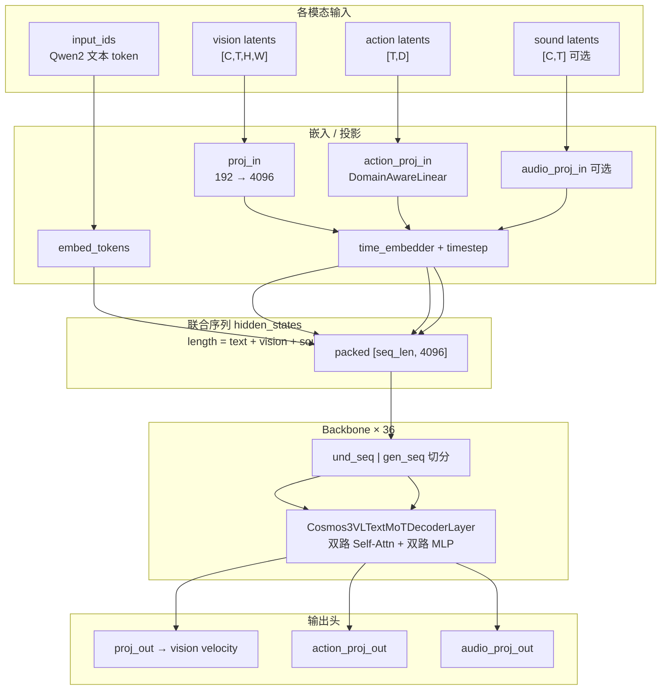
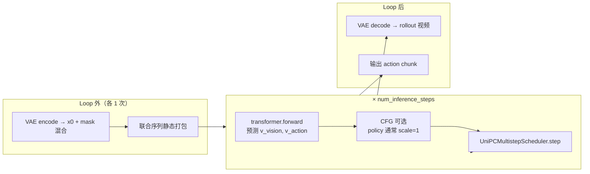

# Cosmos3 模型架构：VAE 之后的 DiT（MoT Transformer）

> 本文描述 **Wan VAE encode 之后** Cosmos3 使用的 **`Cosmos3OmniTransformer`**（Mixture-of-Tokens DiT）结构，以及 pipeline 如何把 vision / text / action 拼成联合序列做 flow matching 去噪。  
> VAE 部分见 [cosmos3_arch_vae.md](./cosmos3_arch_vae.md)；Policy 端到端见 [cosmos3_policy_detail.md](./cosmos3_policy_detail.md)。  
> 源码：`transformer_cosmos3.py`、`pipeline_cosmos3_omni.py`。

---

## 零、一句话定位

VAE 把像素压成 **latent 时空网格**；之后的 **`Cosmos3OmniTransformer`（~16B MoT DiT）** 在 **同一条联合 token 序列** 里，对 **文本 + 视觉 latent +（可选）action +（可选）sound** 做 **flow matching 去噪**，预测各模态的 **velocity**；scheduler 迭代更新 latent，最后 **VAE decode** 回像素。

```text
像素 ──VAE encode──► latent z
                         │
    文本 token ──────────┼──► Cosmos3OmniTransformer（× num_steps）
    action 噪声 ─────────┤         UniPC scheduler.step
                         │
                         ▼
                    去噪后 latent ──VAE decode──► 像素 rollout
                    去噪后 action ───────────────► action chunk
```

---

## 一、VAE 输出之后、进 DiT 之前（Pipeline 预处理）

### 1.1 视觉 latent 归一化与 condition 混合

```python
# pipeline_cosmos3_omni.py
raw_mu = retrieve_latents(vae.encode(x), sample_mode="argmax")
x0_tokens_vision = (raw_mu - mean) * inv_std   # per-channel 归一化
```

Policy 典型 shape：`[1, 48, 5, H/16, W/16]`（latent 通道 48，5 个 latent 时间步）。

### 1.2 Condition mask：首帧锚定，其余为噪声

```python
latents = vision_condition_mask * x0_tokens_vision + (1 - mask) * pure_noise
```

Policy（`mode="policy"`）：`vision_condition_frames = [0]`，即 **仅 z₀ 为观测 condition**，z₁～z₄ 用纯噪声初始化。

Action 分支独立：`x0_tokens_action = zeros(chunk_size, action_dim)`，16 步 action 全部从噪声去噪（policy 不传 `raw_actions`）。

### 1.3 文本：无独立 Text Encoder

Cosmos3 **不跑单独的 Qwen2 文本塔**；plain prompt → JSON caption → **Qwen2 tokenizer** → `input_ids`，直接在 DiT 里 `embed_tokens` 嵌入。

### 1.4 联合序列打包 + 3D mRoPE

Pipeline 在 denoising loop 之前调用：

| 方法 | 作用 |
|------|------|
| `_prepare_text_segment` | 文本 token 索引、mRoPE 起始 offset |
| `_prepare_vision_segment` | vision token 数、`patch_h×patch_w`、noisy frame 索引、vision mRoPE |
| `_prepare_action_segment` | action token 数、condition 帧、action mRoPE |
| `_prepare_sound_segment` | （可选）sound token 布局 |

Vision token 数（单样本）：

```text
num_vision_tokens = latent_t × patch_h × patch_w
patch_h = ceil(latent_h / latent_patch_size)   # latent_patch_size=2
```

---

## 二、核心模型：`Cosmos3OmniTransformer`

**类名：** `Cosmos3OmniTransformer`（`transformer_cosmos3.py`）  
**范式：** Qwen3-VL 风格的 **MoT（Mixture of Tokens）** —— 理解（understanding）与生成（generation）**双通路 attention + 双 MLP**，在一条 packed 序列上联合建模。

### 2.1 典型配置（Cosmos3-Nano / Policy）

| 参数 | 典型值 | 含义 |
|------|--------|------|
| `hidden_size` | 4096 | Transformer 隐层维度 |
| `num_hidden_layers` | 36 | MoT Decoder 层数 |
| `num_attention_heads` | 32 | 注意力头数 |
| `num_key_value_heads` | 8 | GQA |
| `head_dim` | 128 | 每头维度 |
| `intermediate_size` | 12288 | MLP 中间层 |
| `latent_channel` | 48 | 与 VAE latent 通道一致 |
| `latent_patch_size` | 2 | latent 上 2×2 patch → token |
| `patch_latent_dim` | 192 | `2×2×48` |
| `action_gen` | True | Policy checkpoint |
| `action_dim` | 模型训练宽度 | DROID raw 10D 会 pad 到此维度 |
| `vocab_size` | 151936 | Qwen2 词表 |

### 2.2 模块拓扑



### 2.3 单层：`Cosmos3VLTextMoTDecoderLayer` 与「双通路」含义

#### 「双通路」≠ 两个串行阶段

**不是**「先跑完整个理解网络，再跑生成网络」。在 **每一次** `transformer.forward`（每个 denoising step、每一层）里，und 与 gen **同时**进入同一层，一次算完。

「先后」体现在 **序列位置** 和 **注意力可见性**，而不是两次独立 forward。

#### 联合序列的物理顺序

Pipeline 拼出的 packed 序列（示意）：

```text
[ 文本 token × und_len ] [ vision tokens ] [ sound tokens? ] [ action tokens ]
└────── und_seq ────────┘ └──────────────── gen_seq ────────────────────────┘
```

Policy：`und_len` = 仅文本长度；vision / action 全在 `gen_seq`。

#### 同一层内的注意力规则（关键）

源码 `Cosmos3AttnProcessor`（`transformer_cosmos3.py`）：

| 通路 | Token | Attention 模式 | 能看到谁 |
|------|-------|----------------|----------|
| **Understanding** | 文本（und） | **因果** self-attn（`is_causal=True`） | 仅文本自身（从左到右） |
| **Generation** | vision / action / sound（gen） | **全连接** cross-attn（`is_causal=False`） | **全部 und K/V + 全部 gen K/V** |

```text
und Q ──causal──► und K/V          （文本自回归，互相看）

gen Q ──full──► [und K/V | gen K/V]  （生成 token 能「读」文本 + 彼此）
```

因此：

- **语义上的「先理解、再生成」**：gen token 的 Q 可以 attend 到 und 的 K/V，文本条件 **注入** 到 vision/action；文本 **看不到** 噪声 latent / action（und 不 attend gen）。
- **计算上的「同时」**：同一层里先算 und/gen 各自的 Q/K/V，再各跑一遍 attention，不是两个串行模型。

#### 单层数据流

```text
und_seq（文本）                    gen_seq（vision/action/sound）
        │                                    │
   input_layernorm                  input_layernorm_moe_gen
        │                                    │
        └──── Cosmos3PackedMoTAttention ──────┘
              │  und: causal self-attn
              │  gen: full attn → und+gen KV
        │                                    │
   post_attn + MLP                   post_attn + mlp_moe_gen
```

- **und_seq**：`hidden_states[:und_len]`
- **gen_seq**：`hidden_states[und_len:]`
- 同一层内 **两套 LayerNorm + 两套 MLP**；Q/K/V 投影也分 understanding / generation 两套

#### 推理时间轴上的「先后」

| 阶段 | 是否串行 | 说明 |
|------|----------|------|
| 预处理 | 有顺序 | 先 tokenize 文本、再 VAE encode 图像（各 1 次） |
| 每个 denoising step | **联合一次 forward** | 文本 + 当前 noisy vision/action **一起**进 DiT |
| 36 层堆叠 | 层间串行 | 每层内 und/gen 仍同时更新；逐层 refine |

**总结**：双通路 = **同一 forward、两种 attention 规则、两套权重**；「理解→生成」由 **gen 读 und、und 不读 gen** 的 mask 保证，而非两次独立推理。

### 2.4 Vision token 在 DiT 内的第二次 patchify

VAE 已做时空压缩；DiT 还对 latent **再做 2×2 空间 patchify**（与 VAE 入口的 patchify 不同）：

```python
# [C, T, H, W] → 每个 (t, h, w) patch → 向量 dim = 2×2×48 = 192
packed = _patchify_and_pack_latents(vision_tokens)
packed = proj_in(packed)   # 192 → 4096
```

每个 latent 时间步产生 `patch_h × patch_w` 个 token；5 步 latent × 空间 patch 数 = vision 序列长度。

### 2.5 Action token

- Shape：`[chunk_size, action_dim]`（Policy 默认 16 步）
- **`DomainAwareLinear`**：按 `domain_id`（如 DROID → `droid_lerobot`）选择不同投影权重，支持多机器人本体
- 与 vision **不同分支、不同时间长度**：16 action 步 ≠ 5 vision latent 步

### 2.6 Forward 输出

每步 denoising 返回三组 **velocity 预测**（flow matching）：

```python
preds_vision, preds_sound, preds_action = transformer(...)
```

- Vision：`proj_out` → unpatchify → `[1, C, T, H, W]` 与 latent 同形
- Action：`action_proj_out` → `[T, action_dim]`
- Condition 位置 velocity 被 mask 为零（不参与 scheduler 更新）

---

## 三、去噪环（Flow Matching + UniPC）



- **Scheduler**：`FlowMatchEulerDiscreteScheduler` + UniPC multistep
- **Policy**：`guidance_scale=1.0`，通常 **不做 CFG**（只跑 cond pass）
- 每步把当前 `latents` / `action_latents` 与 `timestep` 送入 transformer，用返回 velocity 更新

---

## 四、Policy-DROID 路径上的数据 shape（示例）

假设 concat 后 canvas 经 tier 与 padding，VAE 输出 `latent_h×latent_w`，`chunk_size=16`：

| 阶段 | Tensor | Shape（示意） |
|------|--------|----------------|
| VAE encode 后 | `x0_tokens_vision` | `[1, 48, 5, h, w]` |
| 初始 `latents` | mask 混合 | `[1, 48, 5, h, w]`，仅 t=0 为观测 |
| Vision patch 后 | packed tokens | `[5×patch_h×patch_w, 4096]` |
| Action 初始噪声 | `action_latents` | `[16, action_dim]` |
| Text | `input_ids` | `[text_len]` |
| Transformer 输出 v | `preds_vision` | 同 latent shape |
| | `preds_action` | `[16, action_dim]` |
| 去噪完成后 | VAE decode | `[1, 3, 17, H, W]` 像素 rollout |

---

## 五、与 VAE 文档的衔接

| 边界 | VAE 负责 | DiT 负责 |
|------|----------|----------|
| 表示空间 | 像素 ↔ latent grid | latent / action 上的 flow matching |
| 时间语义 | 17 像素帧 → 5 latent 步 | 5 latent token 序列 + 16 action token 序列 |
| Patch | 入口 patchify（Wan2.2） | latent 上 2×2 patchify → transformer token |
| 文本 | 不涉及 | Qwen2 token 嵌入 + 交叉注意力式联合建模 |

完整栈：

```text
AutoencoderKLWan  →  Cosmos3OmniTransformer  →  UniPC  →  AutoencoderKLWan
     (codec)              (16B MoT DiT)          (solver)      (codec)
```

---

## 六、关键源码索引

| 组件 | 文件 | 说明 |
|------|------|------|
| `Cosmos3OmniPipeline` | `pipeline_cosmos3_omni.py` | 端到端编排 |
| `_encode_video` | 同上 | VAE encode + 归一化 |
| `prepare_latents` | 同上 | condition mask、噪声初始化 |
| `_prepare_*_segment` | 同上 | 联合序列 / mRoPE |
| Denoising loop | 同上 ~1620+ | transformer + scheduler |
| `Cosmos3OmniTransformer` | `transformer_cosmos3.py` | DiT 主体 |
| `Cosmos3VLTextMoTDecoderLayer` | 同上 | MoT 单层 |
| `_patchify_and_pack_latents` | 同上 | Vision token 化 |
