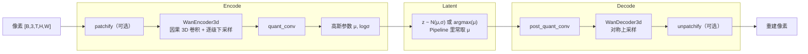
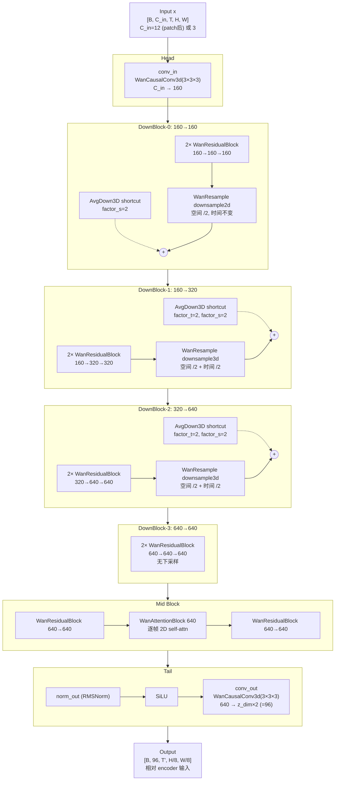
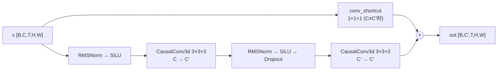

# Cosmos3 模型架构：Wan VAE（WAE）

> 本文描述 Cosmos3 使用的 **Wan VAE**（`AutoencoderKLWan` / `WanEncoder3d`）的原理、内部结构、各 layer 连接关系与典型输入输出 shape。  
> **VAE 之后的 DiT（MoT Transformer）** 见 [cosmos3_arch_dit.md](./cosmos3_arch_dit.md)。  
> 源码：`diffusers/src/diffusers/models/autoencoders/autoencoder_kl_wan.py`  
> Policy 端到端流程见 [cosmos3_policy_detail.md](./cosmos3_policy_detail.md)；视频生成见 [cosmos3_flow.md](./cosmos3_flow.md)。

---

## 零、Wan VAE 原理概述

### 0.1 在整体栈中的角色

WAE（Wan VAE）是一个 **3D 视频变分自编码器（KL-VAE）**：把高维像素视频压进 **低维、低分辨率的 latent 时空网格**，DiT 等生成模型在 latent 里做扩散 / flow matching，最后再 decode 回像素。

```text
像素视频  ←──decode──  latent（紧凑语义 + 时空结构）  ←──DiT 去噪──  噪声
   │                           ▲
   └──────── encode ───────────┘
```

没有 VAE，DiT 就要直接在 `[B, 3, T, H, W]` 上工作，算力和显存都不可接受。WAE 是 **像素世界与生成模型之间的 codec**——类似 JPEG 之于图像 CNN，但是 **可学习、3D、因果、面向生成** 的版本。

### 0.2 抽象流程（Encode → Latent → Decode）



**Encode 四步：**

1. **patchify（Wan 2.2）**：2×2 空间 patch 并入通道，`H, W` 减半、通道变 12，相当于先做一层「无损重排」。
2. **Encoder**：多层 3D 卷积金字塔，空间约 `/8`、时间约 `/4`，输出 `z_dim×2` 通道特征图。
3. **quant_conv**：1×1×1 卷积，整理成 VAE 的高斯参数。
4. **采样 / 取均值**：训练时从 `N(μ, σ)` 采样；Cosmos3 推理通常 **直接取 μ（argmax）**，再减 mean、除 std 归一化后交给 DiT。

**Decode** 完全对称：`post_quant_conv` → Decoder 上采样 → `unpatchify` → clamp 到 `[-1, 1]`。

### 0.3 五条核心设计原理

#### （1）时空联合压缩，而非「逐帧 2D VAE」

WAE 用 **3D 因果卷积** 同时在 **T、H、W** 上下采样：

| 维度 | 典型压缩比（相对原像素） | 机制 |
|------|------------------------|------|
| 空间 | ×16 | patchify ×2 + encoder ×8 |
| 时间 | ×4 | 后两个 down stage 做 temporal downsample |

17 帧像素 → 5 步 latent，即 `(T - 1) // 4 + 1`。latent 每一步对应约 4 帧像素的信息，**不是 1:1 帧对齐**。

#### （2）因果性：流式编码 + 自回归友好

所有时间卷积都是 **因果的**（只看过去帧）。配合 **分块 encode**（首块 1 帧，后续每块 4 帧）和 **feat_cache**，长视频不必一次灌进网络，chunk 间通过 cache 传递上下文，结果与整段等价。

这同时支持：**用过去帧 encode 观测，用未来 latent 步做 rollout 预测**——Cosmos3 Policy 的时间语义就建立在这上面。

#### （3）变分瓶颈：连续、平滑的 latent 空间

KL-VAE 训练目标大致是：

```text
重建损失（像素接近原视频） + β · KL(q(z|x) ‖ N(0, I))
```

效果：latent 空间 **连续、可插值**，适合扩散 / flow matching；DiT 学的是「在这个空间里从噪声走向数据分布」。Pipeline 里对 latent 做 **per-channel mean/std 归一化**，是把 VAE 输出对齐到 DiT 训练时的数值范围。

#### （4）多尺度金字塔 + 低分辨率 attention

Encoder 是经典 **U-Net encoder 半支**：

- `dim_mult` 控制 **stage 数** 和 **通道宽度**（越深越宽）。
- 每个 stage：若干 ResBlock + 下采样（Wan 2.2 用带 `AvgDown3D` shortcut 的 DownBlock）。
- **MidBlock** 在最深层加一次 **逐帧 2D self-attention**，在低分辨率上捕获全局空间关系，成本可控。

Decoder 结构对称，保证 encode/decode 可逆（有损但高质量重建）。

#### （5）Wan 2.2 residual down block

| | Wan 2.1 | Wan 2.2（Cosmos3） |
|---|---------|-------------------|
| Down stage | ResBlock 串行 + Resample | 主路 + `AvgDown3D` shortcut 相加 |
| 作用 | 标准 VAE 金字塔 | shortcut 保留 pooling 信息，主路学残差修正 |

这是架构版本差异（`is_residual=True`），必须与 checkpoint 匹配。详见 [§三、关键配置参数](#三关键配置参数)。

### 0.4 信息如何被「压扁」

```text
原像素空间                          Latent 空间
┌─────────────────┐                ┌──┐
│ 3 ch            │   Encoder      │48│  ← 更少通道
│ T=17 帧         │  ──────────►   │T'=5│ ← 更少时间步
│ H×W 全分辨率    │                │H/16×W/16│ ← 更小空间
└─────────────────┘                └──┘
     高维、冗余大                      低维、DiT 友好
```

DiT 在 latent 上做 patchify（如 2×2）后再进 Transformer，是 **第二层** token 化；VAE 的 patchify 是 **进入 encoder 前** 的通道重排，两者不要混。

### 0.5 在 Cosmos3 中的角色

| 阶段 | WAE 干什么 |
|------|-----------|
| Policy 预处理 | 首帧（+ padding 窗口）→ encode → **z₀ 作为视觉 condition** |
| DiT 去噪 | 在 **同一 latent 空间** 里联合预测未来 latent 步 + action |
| 可视化 | 未来 latent → decode → rollout 视频 |

WAE **不参与**扩散迭代本身；只在 encode/decode 边界出现。

### 0.6 与经典 2D SD VAE 的对比

| | SD 2D VAE | Wan VAE |
|---|-----------|---------|
| 输入 | 单张图 | 视频片段 |
| 卷积 | 2D | **3D 因果** |
| 时间 | 无 | **/4 压缩，因果分块** |
| Latent | 4 ch, H/8 | 16–48 ch, T/4, H/16 |
| 推理 | 一次 forward | **chunk + cache 流式** |

---

## 一、在 AutoencoderKLWan 中的位置

Cosmos3 在调用 `WanEncoder3d` **之前** 可能先做 `patchify`（Wan 2.2）：

```text
像素视频 [B, 3, T, H, W]
    │  patchify(patch_size=2)  ← 仅 Wan 2.2 / Cosmos3
    ▼
Encoder 输入 [B, 12, T, H/2, W/2]
    │  WanEncoder3d
    ▼
[B, z_dim×2, T', H'', W'']     # conv_out 输出 z_dim×2（如 96）
    │  quant_conv (1×1×1)
    ▼
高斯参数 [B, z_dim×2, T', H'', W'']
```

**时间 / 空间压缩比（相对原始像素）：**

| 维度 | 公式 | 配置项 |
|------|------|--------|
| 时间 | `T' = (T - 1) // 4 + 1` | `scale_factor_temporal = 4` |
| 空间 | `H'' = H // 16, W'' = W // 16` | `patchify /2` × encoder `/8` |

Policy 示例（Wan 2.1 风格，`in_channels=3`，无 patch）：`T=17, H=480, W=640`

| 阶段 | Shape |
|------|-------|
| 输入 | `[1, 3, 17, 480, 640]` |
| conv_in 后 | `[1, 96, 17, 480, 640]` |
| DownBlock-0 后 | `[1, 96, 17, 240, 320]` |
| DownBlock-1 后 | `[1, 192, 9, 120, 160]` |
| DownBlock-2 后 | `[1, 384, 5, 60, 80]` |
| DownBlock-3 后 | `[1, 384, 5, 60, 80]` |
| conv_out 后 | `[1, 32, 5, 60, 80]` |

---

## 二、WanEncoder3d 整体拓扑

Cosmos3 使用 **Wan 2.2 residual 路径**（`is_residual=True`）。

**Cosmos3 Wan 2.2 典型配置：**

| 参数 | 值 |
|------|-----|
| `base_dim` | 160 |
| `dim_mult` | `[1, 2, 4, 4]` |
| `z_dim` | 48（conv_out 输出 `z_dim×2 = 96`） |
| `in_channels` | 12（patchify 后） |
| `num_res_blocks` | 2 |
| `temperal_downsample` | `[False, True, True]` |
| `is_residual` | True |



**通道维度计算：**

```python
dims = [base_dim * m for m in [1] + dim_mult]
# Cosmos3: base_dim=160, dim_mult=[1,2,4,4]
# → dims = [160, 160, 320, 640, 640]

# Policy (Wan 2.1 风格): base_dim=96
# → dims = [96, 96, 192, 384, 384]
```

4 个 `WanResidualDownBlock` 对应 `(dims[i] → dims[i+1])`，`i = 0, 1, 2, 3`。

---

## 三、关键配置参数

### 3.1 `dim_mult`：通道倍率与 stage 数量

`dim_mult` 是 **每个下采样 stage 相对 `base_dim`（代码里参数名 `dim`）的通道倍率列表**，同时决定 encoder 有多少个 down stage。

源码：

```python
dims = [base_dim * m for m in [1] + dim_mult]
# 前缀 [1] 表示 conv_in 输出通道 = base_dim × 1
```

以 `base_dim=160, dim_mult=[1, 2, 4, 4]` 为例：

| 索引 | 计算 | 通道 C | 对应模块 |
|------|------|--------|----------|
| — | `160×1` | 160 | `conv_in` 输出 |
| stage 0 | `160×1` | 160 | DownBlock-0：160→160 |
| stage 1 | `160×2` | 320 | DownBlock-1：160→320 |
| stage 2 | `160×4` | 640 | DownBlock-2：320→640 |
| stage 3 | `160×4` | 640 | DownBlock-3：640→640 |

要点：

- **`len(dim_mult)` = DownBlock 个数**（默认 4），也等于 **空间下采样 stage 数**（最后一级通常不再下采样分辨率，只做通道变换）。
- **`dim_mult[i]` 越大，该 stage 输出通道越多**，表达能力越强，参数量与计算量也越大。
- 末尾两个 `4, 4` 表示 **最后两级保持 640 通道不再扩宽**，只在最深层做特征提炼（DownBlock-3 无 Resample）。
- `dims` 相邻两项 `(dims[i], dims[i+1])` 就是第 `i` 个 DownBlock 的 `(in_dim, out_dim)`。

与 **`temperal_downsample`** 的关系：`temperal_downsample` 长度通常等于 `len(dim_mult)`，逐 stage 控制该级是否做 **时间** 下采样；**空间** 下采样由 `down_flag=(i != len(dim_mult)-1)` 决定（除最后一级外每级 `/2`）。

Decoder 侧对称：`dims = [base_dim * m for m in [dim_mult[-1]] + dim_mult[::-1]]`，通道随上采样逐级收窄。

### 3.2 `is_residual`：Wan 2.1 vs 2.2 架构开关

`is_residual` 决定 **down/up stage 用哪套模块**，不是 ResBlock 内部 `x + h` 那条小残差。

| | `is_residual=False`（Wan 2.1） | `is_residual=True`（Wan 2.2 / Cosmos3） |
|---|---|---|
| Encoder stage | `ResBlock × N` → `WanResample`（串行扁平列表） | 一个 `WanResidualDownBlock`（主路 + shortcut） |
| Decoder stage | `WanUpBlock` | `WanResidualUpBlock`（对称，用 `DupUp3D`） |
| 下采样 shortcut | 无 | `AvgDown3D` 与主路输出相加 |

**如何选择：** 必须与 checkpoint 权重一致，不能随意切换。

| 模型 | `is_residual` |
|------|---------------|
| Wan 2.1 VAE | `False`（`AutoencoderKLWan` 默认） |
| Wan 2.2 VAE / Cosmos3 | `True`（见 `convert_wan_to_diffusers.py` 的 `vae22_diffusers_config`） |

两种拓扑的 state_dict key 与层结构不同，混用会导致 load 失败或 silent wrong。这是 **架构版本开关**，不是推理超参。

### 3.3 `num_res_blocks` vs DownBlock 个数

容易混淆的两个「层数」：

| 概念 | 由什么决定 | 默认值 | 含义 |
|------|-----------|--------|------|
| **DownBlock 个数** | `len(dim_mult)` | 4 | 分辨率 stage 数；每 stage 最多一次空间 `/2` |
| **每 DownBlock 内 ResBlock 数** | `num_res_blocks` | 2 | 该 stage 主路上叠多少个 `WanResidualBlock` |

```python
# WanResidualDownBlock 内部
for _ in range(num_res_blocks):
    resnets.append(WanResidualBlock(in_dim, out_dim, dropout))
```

改 `num_res_blocks` 只影响 **每个 stage 内的卷积深度**；改 `dim_mult` 的长度或数值则改变 **stage 总数、通道宽度、下采样次数**。

### 3.4 `WanResidualDownBlock` 的作用

Wan 2.2 将每个 down stage 封装为一个 **带 parallel shortcut 的下采样块**：

```text
输入 x [B, C_in, T, H, W]
         │
    x_copy ──────────────────────► AvgDown3D ──────────────┐
         │                    (pool + 通道重组)              │
         │                                                  (+)
         ▼                                                   │
    ResBlock × num_res_blocks                                │
         ▼                                                   │
    [WanResample]  ← 仅 down_flag=True                       │
         └──────────────────────────────────────────────────┘
                              │
                              ▼
                    输出 [B, C_out, T', H', W']
```

- **主路（learned path）**：`WanResidualBlock` 做 3D 特征变换，末尾 `WanResample` 做可学习的时空下采样。
- **Shortcut（`AvgDown3D`）**：无卷积，对输入做时空分组平均 + 通道重组，输出 shape 与主路对齐；`factor_s=2` 空间 `/2`，`factor_t=2` 时间 `/2`。
- **相加**：`return x + self.avg_shortcut(x_copy)` — 类似 ResNet / SDXL VAE 的 down block，shortcut 提供恒等信息的「安全通路」，主路主要学 **与 pooling 的残差**，训练更稳、重建通常更好。

`AvgDown3D` 核心逻辑（`autoencoder_kl_wan.py`）：按 `factor_t × factor_s²` 分组，通道扩成 `C×factor` 再 group mean 到 `C_out`。

Decoder 对称：`WanResidualUpBlock` + `DupUp3D`（repeat + reshape 上采样）。

---

## 四、子模块内部连接

### 4.1 WanResidualBlock

每个 DownBlock 内含 2 个 ResBlock：



### 4.2 WanResidualDownBlock

主路径 + shortcut 残差相加：

```text
x_copy ──────────────────────────► AvgDown3D ──┐
  │                                             ├──► (+) ──► out
  └──► ResBlock × num_res_blocks ──► [Downsample] ──┘
```

源码（`autoencoder_kl_wan.py`）：

```python
return x + self.avg_shortcut(x_copy)
```

### 4.3 WanResample 下采样

| mode | 空间 | 时间 | 内部操作 |
|------|------|------|----------|
| `downsample2d` | `/2` | 不变 | 逐帧 ZeroPad2d + Conv2d stride=2 |
| `downsample3d` | `/2` | `/2` | 先做 2d down，再 `CausalConv3d(3,1,1) stride=(2,1,1)` 合并相邻帧 |

各 DownBlock 的下采样配置（`temperal_downsample=[False, True, True]`）：

| Block | 通道 | downsample mode | 空间 | 时间 |
|-------|------|-----------------|------|------|
| 0 | 160→160 | `downsample2d` | `/2` | 不变 |
| 1 | 160→320 | `downsample3d` | `/2` | `/2` |
| 2 | 320→640 | `downsample3d` | `/2` | `/2` |
| 3 | 640→640 | 无 | 不变 | 不变 |

### 4.4 WanMidBlock

```text
ResBlock(640→640)
  → WanAttentionBlock(640)   # [B,C,T,H,W] 展成 (B×T) 个 [C,H,W] 做单头 SDPA
  → ResBlock(640→640)
```

### 4.5 WanCausalConv3d

- 在时间维上因果：padding 只在过去帧侧
- 推理时配合 `feat_cache` 跨 chunk 传递上下文

---

## 五、各 Stage Shape 对照表

以 **Cosmos3 Wan 2.2** 为例：原始像素 `[B, 3, 17, 512, 512]`

| Stage | 模块 | C | T | H | W | 备注 |
|-------|------|---|---|---|---|------|
| patchify 后 | — | 12 | 17 | 256 | 256 | 相对原图像 /2 |
| conv_in | CausalConv3d | 160 | 17 | 256 | 256 | |
| DownBlock-0 | Res×2 + down2d | 160 | 17 | 128 | 128 | 仅空间 /2 |
| DownBlock-1 | Res×2 + down3d | 320 | ~9 | 64 | 64 | 空间+时间 /2 |
| DownBlock-2 | Res×2 + down3d | 640 | ~5 | 32 | 32 | 空间+时间 /2 |
| DownBlock-3 | Res×2 | 640 | ~5 | 32 | 32 | 无下采样 |
| mid_block | Res+Attn+Res | 640 | ~5 | 32 | 32 | |
| conv_out | CausalConv3d | **96** | ~5 | 32 | 32 | z_dim×2=96 |

相对**原始像素**：`T'≈5`，`H'=512/16=32`，`W'=512/16=32`。

---

## 六、因果分块编码（实际推理路径）

`AutoencoderKLWan._encode` **不是**一次性喂 17 帧，而是因果分块 + `feat_cache`：

```python
iter_ = 1 + (num_frame - 1) // 4
for i in range(iter_):
    if i == 0:
        out = self.encoder(x[:, :, :1, :, :], feat_cache=..., feat_idx=...)
    else:
        out_ = self.encoder(
            x[:, :, 1 + 4 * (i - 1) : 1 + 4 * i, :, :],
            feat_cache=..., feat_idx=...,
        )
        out = torch.cat([out, out_], 2)
```

```text
Chunk-0: [B,C, 1,H,W]  ──encoder──► [B,96, 1,h,w]
Chunk-1: [B,C, 4,H,W]  ──encoder──► [B,96, 1,h,w]  ─┐
Chunk-2: [B,C, 4,H,W]  ──encoder──► [B,96, 1,h,w]  ─┼─ cat(dim=2) ──► [B,96, 5,h,w]
Chunk-3: [B,C, 4,H,W]  ──encoder──► [B,96, 1,h,w]  ─┤
Chunk-4: [B,C, 4,H,W]  ──encoder──► [B,96, 1,h,w]  ─┘
```

每个 `WanCausalConv3d` 在时间维上只看过去帧；`feat_cache` 在 chunk 间传递上下文，保证与整段视频一次 encode 等价。

---

## 七、参数量（参考）

| 配置 | WanEncoder3d 参数量 |
|------|---------------------|
| Policy 风格 `base_dim=96, z_dim=16` | ≈ **53.6M** |
| Cosmos3 Wan 2.2 `base_dim=160, z_dim=48` | ≈ **~150M** |

完整 VAE（encoder + decoder + quant conv）Policy 风格约 **127–132M**。

---

## 八、关键源码索引

| 组件 | 文件 | 行号（约） |
|------|------|-----------|
| `WanEncoder3d` | `autoencoder_kl_wan.py` | 509–628 |
| `WanResidualDownBlock` | 同上 | 473–506 |
| `WanResidualBlock` | 同上 | 315–386 |
| `WanResample` | 同上 | 224–312 |
| `WanMidBlock` | 同上 | 434–470 |
| `WanCausalConv3d` | 同上 | 131–173 |
| `AutoencoderKLWan._encode` | 同上 | 1133–1158 |
| `patchify` | 同上 | 917–937 |

---

**下一步阅读：** [cosmos3_arch_dit.md](./cosmos3_arch_dit.md) — VAE encode 之后的 `Cosmos3OmniTransformer`（MoT DiT）结构与去噪环。
