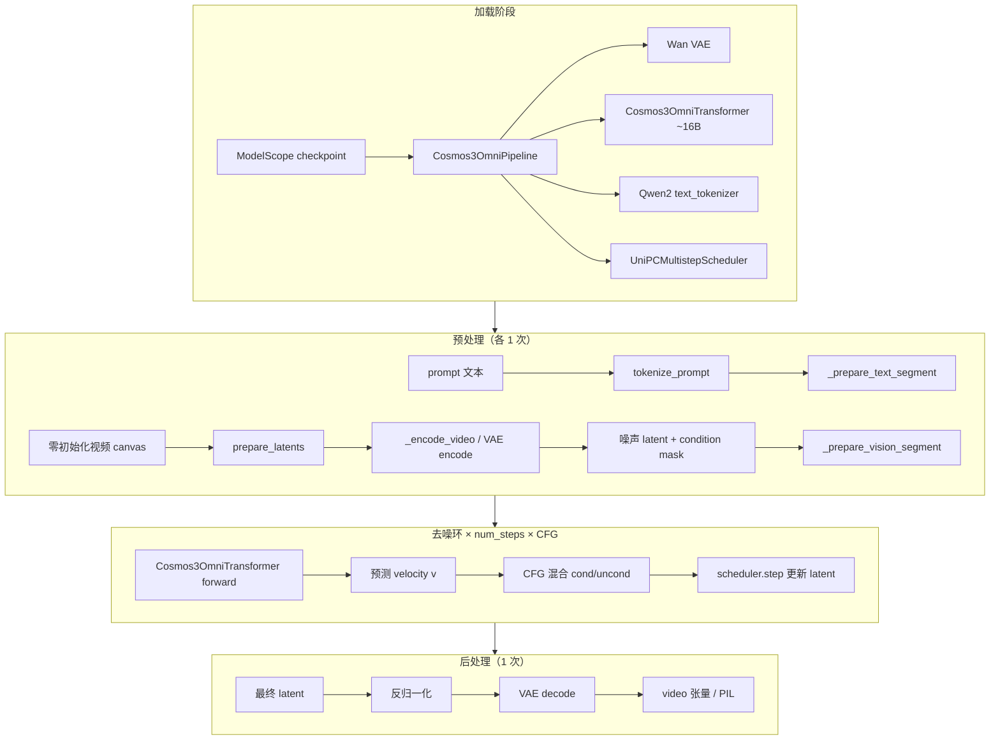

# Cosmos3 推理流程梳理（Chameleon + diffusers）

> 以 `configs/cosmos3_stats_thor.yaml` 为参考 workload，说明 Chameleon 四阶段拆分与
> `Cosmos3OmniPipeline` 端到端推理的对应关系。更完整的模型背景见 [cosmos3.md](./cosmos3.md)。

---

## 一、配置摘要（cosmos3_stats_thor.yaml）

| 字段 | 值 | 含义 |
|------|-----|------|
| 权重 | ModelScope `Cosmos3-Nano` | ~16B MoT Generator + Wan VAE |
| 模式 | `video` | 文本生成视频（无 action/sound） |
| 分辨率 | **480×848，33 帧，24fps** | ~1.4 秒视频 |
| 去噪 | **4 步**，CFG=6.0 | UniPC flow-matching |
| 精度 | bfloat16 | |
| Chameleon stage | vae_encode → text_embed → dit×4 → vae_decode | stats 按此拆分计 FLOPs |

**Thor 配置下的关键张量尺寸（推导）：**

```
像素视频:     [1, 3,  33, 480, 848]
VAE latent:   [1, 16,  9,  30,  53]   # 时间÷4，空间÷16
Patch 网格:   T=9, H=⌈30/2⌉=15, W=⌈53/2⌉=27  → 3645 vision tokens
文本 tokens:  ~150–400（prompt + system + 分辨率/时长模板）
联合序列:     und_len + 3645
```

---

## 二、整体流程（两条路径）



| 路径 | 入口 | 行为 |
|------|------|------|
| **stats**（thor yaml 默认） | `chameleon stats --config configs/cosmos3_stats_thor.yaml` | 按 4 个 stage **分别** forward 计 FLOPs；dit 只计 **cond 单次**，不含 CFG |
| **真实 infer** | `actions: [infer]` + `chameleon infer` | `Cosmos3RealOrchestrator` → `pipe.__call__()` **端到端** |

---

## 三、Chameleon 四 Stage 与 diffusers 模块映射

```text
Chameleon stage     diffusers 模块                    真实推理执行次数
─────────────────────────────────────────────────────────────────────
vae_encode          pipe.vae.encode()               1（条件编码，t2v 时对零 canvas）
text_embed          transformer.embed_tokens          1（嵌入在 dit 内；stats 单独拆出）
dit                 transformer 完整 forward        num_steps × 2（CFG cond+uncond）
vae_decode          pipe.vae.decode()               1
```

stats 的 execution plan：`vae_encode×1, text_embed×1, dit×4, vae_decode×1`

真实 infer 的 dit 实际 forward：**4 × 2 = 8 次**（`guidance_scale=6.0` 开启 CFG）。

代码入口：

- 架构规格：`chameleon/architectures/cosmos3.py`
- 适配器：`chameleon/models/cosmos3/adapter.py`
- stats 真实权重输入：`chameleon/profile/cosmos3_real_stats.py`
- 端到端编排：`chameleon/runtime/orchestrators/cosmos3/real.py`
- diffusers Pipeline：`diffusers/.../pipeline_cosmos3_omni.py`

---

## 四、端到端推理逐步展开（text-to-video）

对应 `Cosmos3OmniPipeline.__call__()`（thor 配置：无 image/video 条件，纯 t2v）。

### Step 0：加载 Cosmos3OmniPipeline

| 组件 | 类 / 作用 |
|------|-----------|
| `vae` | `AutoencoderKLWan` — 3D Wan VAE |
| `transformer` | `Cosmos3OmniTransformer` — 16B MoT DiT |
| `text_tokenizer` | Qwen2 chat tokenizer |
| `scheduler` | `UniPCMultistepScheduler` — flow matching 去噪 |

### Step 1：文本 tokenize（→ text_embed + dit 前置）

**输入：**

```text
prompt: "A robot arm picks up a red cube on a wooden table."
num_frames=33, height=480, width=848, fps=24
```

**处理（`tokenize_prompt`）：**

1. 拼接 system prompt（video 模式）
2. 追加时长模板：`"The video is 1.4 seconds long and is of 24 FPS."`
3. 追加分辨率模板：`"This video is of 480x848 resolution."`
4. Qwen2 `apply_chat_template` → token id 列表

**输出：**

```text
cond_input_ids:   list[int]     # 条件 prompt
uncond_input_ids: list[int]     # 负向 prompt（空串 + 逆模板）
```

**`_prepare_text_segment(cond_input_ids)` 输出：**

| 字段 | 形状 / 含义 |
|------|------------|
| `input_ids` | `[und_len]` |
| `text_indexes` | `[und_len]` 联合序列中文本位置 |
| `text_mrope_ids` | `[3, und_len]` 3D mRoPE 位置 |
| `und_len` | 文本 token 数 |
| `vision_start_temporal_offset` | vision 段 temporal 起始偏移 |

### Step 2：VAE 条件编码 + 初始化 latent（→ vae_encode + dit 准备）

**`prepare_latents(num_frames=33, height=480, width=848)`：**

1. **构造 vision canvas（纯 t2v）：**

   ```text
   vision_tensor = zeros[1, 3, 33, 480, 848]   # [-1,1] 范围
   ```

2. **VAE encode（`_encode_video`）：**

   ```text
   输入:  [1, 3, 33, 480, 848]
   vae.encode → mu
   归一化: (mu - mean) * inv_std
   输出:  x0_tokens_vision [1, 16, 9, 30, 53]   # 干净条件 latent
   ```

3. **加噪初始化：**

   ```text
   vision_condition_mask [9,1,1]  # t2v 全 0 → 所有帧都是 noisy
   latents = pure_noise           # 同 shape 的随机噪声
   ```

4. **`_prepare_vision_segment`** — 为 dit 预打包静态索引：

   ```text
   vision_token_shapes:  [(9, 15, 27)]
   vision_sequence_indexes: [und_len .. und_len+3644]
   vision_noisy_frame_indexes: [0..8]  全部帧 noisy
   num_noisy_vision_tokens: 3645
   vision_mrope_ids: [3, 3645]
   ```

**Stage 边界：**

- Chameleon `vae_encode` = 上述 `vae.encode` 路径
- stats 用随机 `[1,3,33,480,848]` 代替 zeros，语义相同

### Step 3：MoT Transformer 去噪环（→ dit，热点）

**每步 denoise（×4 步 × 2 CFG）：**

#### 3.1 输入打包（`Cosmos3OmniTransformer.forward`）

```text
联合序列 hidden_states [sequence_length, 4096]  初始为 0

① 文本嵌入:
   embed_tokens(input_ids) → scatter 到 text_indexes

② Vision latent 打包:
   latents [1,16,9,30,53]
   → patchify（patch_size=2）
   → proj_in: Linear(192 → 4096)
   → 加 time embedding（flow timestep）
   → scatter 到 vision_sequence_indexes

③ 组装 position_ids:
   cat(text_mrope_ids, vision_mrope_ids)  → [3, und_len+3645]

④ 拆 dual-path:
   und_seq = hidden[:und_len]      # 理解路径（文本，因果）
   gen_seq = hidden[und_len:]      # 生成路径（vision，双向）
```

#### 3.2 MoT 主干（×36 层 `Cosmos3VLTextMoTDecoderLayer`）

每层 **双塔独立参数**：

```text
                    und 路径（文本理解）          gen 路径（视觉生成）
                    ─────────────────          ─────────────────
Pre-Attn RMSNorm    input_layernorm            input_layernorm_moe_gen
Attention           to_q/k/v/out               add_q/k/v_proj + to_add_out
                    + 3D mRoPE                 + 3D mRoPE
Post-Attn RMSNorm   post_attention_layernorm   post_attention_layernorm_moe_gen
MLP                 mlp (4096→12288→4096)      mlp_moe_gen
```

Attention 为 **two-way joint attn**：und 与 gen 在同一 attention 中交互，但 Q/K/V/O 投影各用一套。

#### 3.3 输出解包

```text
norm(und_seq), norm_moe_gen(gen_seq) → cat
proj_out: Linear(4096 → 192)  @ vision_mse_loss_indexes
→ unpatchify → preds_vision: list[Tensor]  # 预测 velocity v_t
```

#### 3.4 CFG + scheduler 更新

```text
cond forward   → v_cond
uncond forward → v_uncond
v = v_uncond + 6.0 × (v_cond - v_uncond)

UniPCMultistepScheduler.step(v, t, latents) → latents_{t-1}
```

**dit 输入/输出小结（单步 cond pass）：**

| | |
|--|--|
| **输入** | 文本 ids、vision latents `[1,16,9,30,53]`、timestep、各类 index/mrope |
| **输出** | `preds_vision` — 与 latent 同结构的 **flow velocity** |
| **Thor 配置** | 4 步 × 2（CFG）= **8 次**完整 16B forward |

### Step 4：VAE 解码（→ vae_decode）

**输入：** 去噪完成的 `latents [1, 16, 9, 30, 53]`

**处理：**

```text
反归一化: z_raw = latents / inv_std + mean
vae.decode(z_raw) → [1, 3, 33, 480, 848]
postprocess_video → output_type="pt" 时 [T,C,H,W]
```

**输出：**

```text
video: Tensor [33, 3, 480, 848]  或 PIL 帧列表
sound: None（enable_sound=false）
```

---

## 五、各模型结构展开

### 1. Wan VAE（`AutoencoderKLWan`）

```text
encode 路径:
  [B,3,T,H,W]
  → 3D Conv Encoder（因果时间，分块处理 T）
  → quant_conv → DiagonalGaussian（取 mode/argmax）
  → [B, z_dim, T/4, H/16, W/16]

decode 路径:
  [B, z_dim, T_lat, H_lat, W_lat]
  → post_quant_conv
  → 3D Conv Decoder（逐帧 + cache）
  → [B, 3, T, H, W]
```

**计算特点：** Conv3D 为主；stats 理论 FLOPs 易高估，CUDA profiler 更可信。

### 2. Text Embedding（`transformer.embed_tokens`）

```text
nn.Embedding(vocab=151936, dim=4096)
input:  [und_len] int64
output: [und_len, 4096]
```

查表，FLOPs ≈ 0；在真实推理中嵌入在 dit forward 第一步完成。

### 3. Cosmos3OmniTransformer（MoT DiT，核心）

**规模（Cosmos3-Nano 典型）：**

| 参数 | 值 |
|------|-----|
| hidden_size | 4096 |
| num_layers | 36 |
| num_heads / kv_heads | 32 / 8 (GQA) |
| intermediate | 12288 |
| head_dim | 128 |

**计算量分布（Thor 480p/33帧）：**

```text
dit 单步 cond forward  ≈ 数百 TFLOPs 量级（序列 ~4000 tokens）
× 4 步 × 2 CFG ≈ 主导总推理算力（>95%）
```

**关键算子：**

- `proj_in/out`：patch latent ↔ hidden
- 36×（Dual-path Attention + 2× MLP）
- 3D mRoPE 旋转位置编码
- `time_embedder`：flow timestep 条件

### 4. Scheduler（非神经网络）

```text
UniPCMultistepScheduler + flow_shift
4 步 sigma 调度，每步更新 latents（无参数，计算可忽略）
```

---

## 六、stats 与真实 infer 的差异

| 维度 | `chameleon stats` | 真实 `pipe.__call__()` |
|------|-------------------|------------------------|
| dit CFG | **只计 cond 1 次** | cond + uncond 各 1 次 |
| dit 步数 | 汇总 `dit×4` | 实际 4 步循环 |
| vae_encode 输入 | 随机噪声 video | zeros canvas（t2v） |
| 输出 | 无视频，只有 FLOPs 表 | `[33,3,480,848]` 视频 |
| 安全校验 | `enable_safety_checker: false` | 同配置则跳过 |

**真实 infer 的 dit FLOPs ≈ stats 中 dit 值 × 2（CFG）**

### CUDA profiler 读数说明

| 字段 | 可信度 | 说明 |
|------|--------|------|
| dit `profiler_flops` | 高 | 与理论值一致时可作算量主依据 |
| vae `profiler_flops` | 中偏高 | 比理论值可信；Conv3D 可能略漏计 |
| `peak_device_mem` | 高 | 峰值显存规划用 |
| `profiler_mem`（TB 级） | 忽略 | allocator 增量 proxy，非真实 DRAM 流量 |

---

## 七、数据流总览（Thor 配置）

```text
"A robot arm picks up..." 
    │
    ▼ tokenize + templates
cond_input_ids [~200 tokens]
    │
    ├──────────────────────────────────────┐
    ▼                                      ▼
embed_tokens                      zeros [1,3,33,480,848]
[und_len, 4096]                           │
    │                              VAE encode + normalize
    │                              [1,16,9,30,53] x0
    │                                      │
    │                              + noise → latents
    │                                      │
    └──────────┬───────────────────────────┘
               ▼
    MoT Transformer ×4步×2(CFG)
    联合序列 [und_len+3645, 4096]
    输出 velocity → scheduler 更新 latents
               │
               ▼
    VAE decode → [33, 3, 480, 848] video
```

---

## 八、运行命令

```bash
# Thor 上 stats（理论 FLOPs，较快）
chameleon stats --config configs/cosmos3_stats_thor.yaml

# Thor 上 stats + CUDA profiler 校验
chameleon stats --config configs/cosmos3_stats_thor.yaml --measured

# 真实端到端生成（需将 yaml 中 actions 改为 [infer]）
chameleon infer --config configs/cosmos3_stats_thor.yaml
```

全尺寸 720p×189 帧统计见 `configs/cosmos3_video_realweights.yaml`（建议 datacenter GPU）。

---

## 九、部署优化指向

按 Thor 480p/33帧/4步：

1. **dit（MoT 16B）** — 算力与显存瓶颈；量化、TRT、减步数、降分辨率最有效
2. **vae_decode** — 第二大算力；输出像素 `[33×480×848]`
3. **vae_encode** — t2v 仅 encode 零 canvas，占比小
4. **text_embed** — 可忽略
