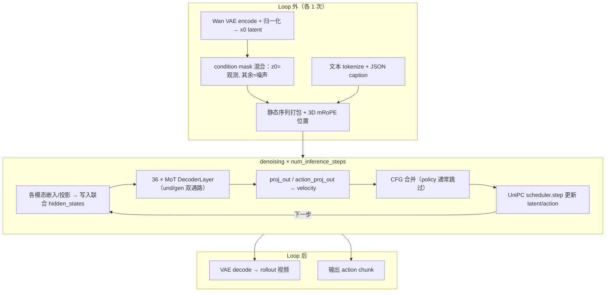
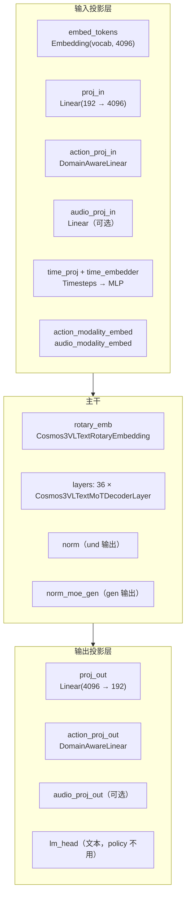
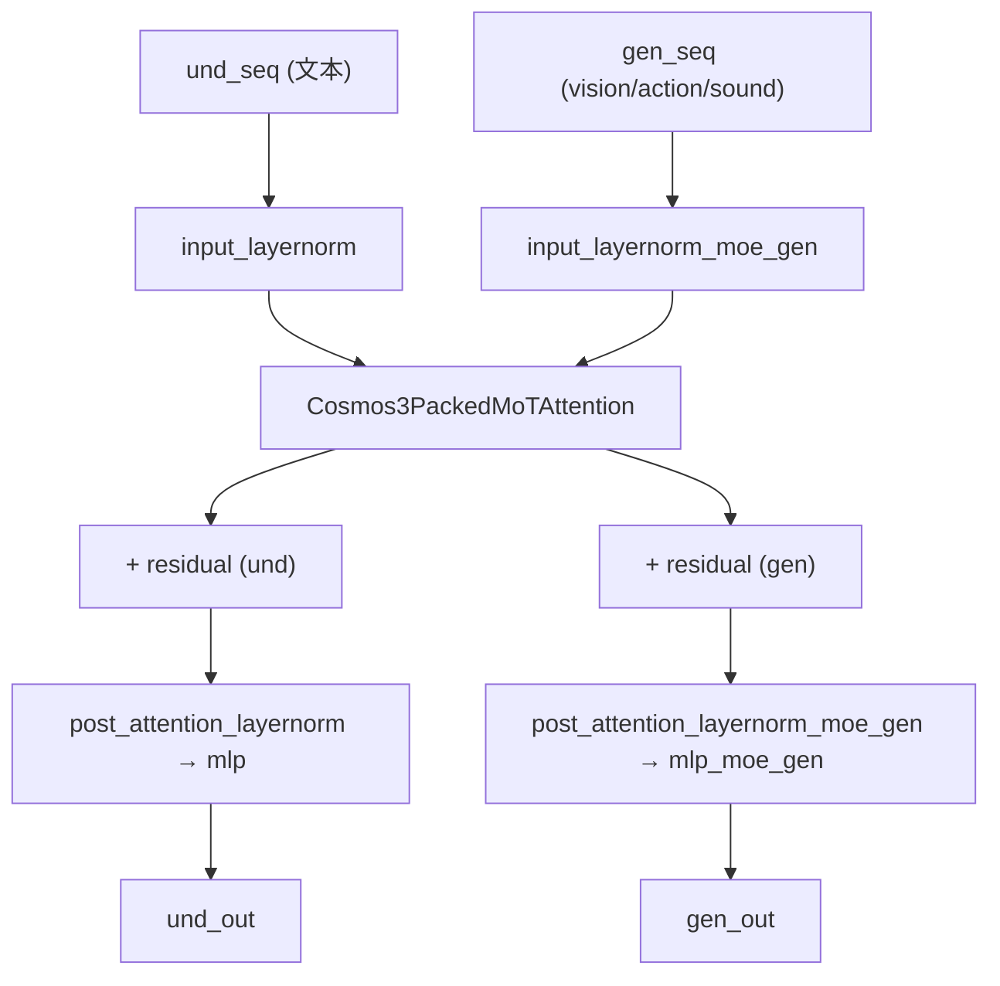

# Cosmos3 MoT 详解：`Cosmos3OmniTransformer`

> 从整体架构（输入 / 输出 / 计算过程）到模块级结构，详解 Cosmos3 的核心 **MoT（Mixture-of-Transformers / Mixture-of-Tokens）DiT**。  
> VAE 前端见 [cosmos3_arch_vae.md](./cosmos3_arch_vae.md)；DiT 概览见 [cosmos3_arch_dit.md](./cosmos3_arch_dit.md)；与 π₀.₅ 对比见 [cosmos3_vs_pi05.md](./cosmos3_vs_pi05.md)。  
> 源码：`diffusers/src/diffusers/models/transformers/transformer_cosmos3.py`、`pipeline_cosmos3_omni.py`。

---

# 第一部分：整体架构

## 1. 定位

`Cosmos3OmniTransformer` 是一个 **多模态 flow-matching DiT**。它把 **文本、视觉 latent、动作、（可选）声音** 拼进 **一条 packed token 序列**，用 **双通路（understanding / generation）** 的 Transformer 主干做联合去噪，每步预测各模态的 **velocity**。

与标准 LLM 的关键区别：

- 不是自回归逐 token 生成，而是 **在固定长度的序列上做扩散去噪**（每步整网 forward）。
- 文本走 **因果理解通路**，生成模态走 **全连接生成通路**，两套权重、同一次前向。

## 2. 输入

单次 `forward`（一个 denoising step、一个 CFG pass）接收：

| 类别 | 张量 | 形状 | 说明 |
|------|------|------|------|
| 文本 | `input_ids` | `[und_len]` | Qwen2 token id（JSON caption） |
| | `text_indexes` | `[und_len]` | 文本在联合序列中的位置 |
| 视觉 | `vision_tokens` | `[1, C, T, H, W]` | 当前 noisy latent，`C=latent_channel=48` |
| | `vision_timesteps` | `[num_noisy_vision_tokens]` | 每个 noisy patch 的扩散时间步 |
| | `vision_sequence_indexes` | `[num_vision_tokens]` | vision 在序列中的位置 |
| 动作 | `action_tokens` | `[chunk_size, action_dim]` | 当前 noisy action |
| | `action_domain_ids` | `[1]` | 本体域 id（如 DROID） |
| 声音(可选) | `sound_tokens` | `[C_s, T_s]` | |
| 位置 | `position_ids` | `[3, seq_len]` | 3D mRoPE（t/h/w 三轴） |
| 元信息 | `sequence_length`, `und_len`, `*_noisy_frame_indexes`, `*_mse_loss_indexes` | | 打包/读取索引 |

**关键点：**
- `vision_tokens` 是「起点 + 上一步结果」，**每个 step 都在变**；文本 `input_ids` 全程不变。
- Policy 下 `vision_condition_frames=[0]`，即 latent t=0 是真实观测（clean），t=1…4 为噪声。

## 3. 输出

```python
preds_vision, preds_sound, preds_action = transformer(...)
```

| 输出 | 形状 | 含义 |
|------|------|------|
| `preds_vision` | `[1, C, T, H, W]`（list） | vision velocity；condition 帧位置为 0 |
| `preds_action` | `[chunk_size, action_dim]`（list） | action velocity |
| `preds_sound` | `[C_s, T_s]` 或 None | sound velocity |

velocity 送入 pipeline 做 CFG 合并 + `UniPCMultistepScheduler.step` 更新 latent。

## 4. 端到端计算过程



**一次 `forward` 内部三段：**

1. **Encode（打包）**：文本 embed、vision patchify+proj_in、action domain-proj、加时间步嵌入 → 全部 scatter 进 `[seq_len, hidden_size]` 的联合 buffer。
2. **Backbone**：切 `und_seq | gen_seq`，过 36 层 MoT DecoderLayer。
3. **Decode（读取）**：按 `*_mse_loss_indexes` 取出对应位置，投影回各模态 velocity 空间。

---

# 第二部分：模型结构详解

## 5. 配置参数（典型 Nano / Policy）

| 参数 | 值 | 含义 |
|------|-----|------|
| `hidden_size` | 4096 | 主干隐层维度 |
| `num_hidden_layers` | 36 | MoT 层数 |
| `num_attention_heads` | 32 | Q 头数 |
| `num_key_value_heads` | 8 | KV 头数（GQA，4:1） |
| `head_dim` | 128 | 每头维度 |
| `intermediate_size` | 12288 | MLP 中间层（SwiGLU） |
| `latent_channel` | 48 | 对齐 VAE latent |
| `latent_patch_size` | 2 | latent 上 2×2 patch |
| `patch_latent_dim` | 192 | `2×2×48`，proj_in 输入维 |
| `rope_theta` | 5e6 | mRoPE base |
| `rope_axes_dim` | `[24,20,20]` | mRoPE t/h/w 三轴维度分配 |
| `action_dim` | 训练宽度 | DROID 10D 会 pad 到此 |
| `num_embodiment_domains` | 32 | 本体域数量 |
| `vocab_size` | 151936 | Qwen2 词表 |

## 6. 组成模块总览



## 7. 输入侧：如何把各模态变成 4096 维 token

### 7.1 文本

```python
packed_text_embedding = self.embed_tokens(input_ids)   # [und_len, 4096]
hidden_states[text_indexes] = packed_text_embedding
```

无独立 Text Encoder，直接查 embedding 表。

### 7.2 视觉：两级 patchify

VAE 已压过一次；DiT 在 latent 上 **再做 2×2 空间 patchify**：

```python
# _patchify_and_pack_latents
# [C, T, H, W] → 每个 (t, h, w) 2×2 patch 拉平为 192 维
latent = latent.reshape(C, T, H//p, p, W//p, p)
latent = einsum("cthpwq->thwpqc", latent).reshape(-1, p*p*C)  # [num_patch, 192]
packed = proj_in(packed)                                       # 192 → 4096
```

- 每个 latent 时间步产生 `patch_h × patch_w` 个 token。
- `num_vision_tokens = latent_t × patch_h × patch_w`。

### 7.3 时间步嵌入：只加到 noisy token

```python
timesteps = vision_timesteps * timestep_scale       # timestep_scale=0.001
emb = time_embedder(time_proj(timesteps))           # 正弦 → MLP → 4096
packed_tokens = _apply_timestep_embeds_to_noisy_tokens(packed_tokens, emb, ...)
```

`_apply_timestep_embeds_to_noisy_tokens` 用 `scatter_add` **只把时间步嵌入加到 noisy 帧对应的 token 上**；condition 帧（clean）不加。

### 7.4 动作：Domain-Aware 投影

```python
packed_tokens_action = action_proj_in(packed_tokens_action, per_token_domain_ids)
packed_tokens_action = packed_tokens_action + action_modality_embed
```

`DomainAwareLinear` 用 `nn.Embedding` 存 **每个本体域一套 weight/bias**，按 `domain_id` 查出对应 `[in, out]` 矩阵做 `bmm`：

```python
weight = self.fc(domain_id).view(N, in, out)   # 每 token 取自己域的权重
bias   = self.bias(domain_id).view(N, out)
out = bmm(x, weight) + bias
```

→ 一套 checkpoint 支持多机器人本体（不同 action 语义）。

### 7.5 汇聚

所有模态 token 按各自 `*_sequence_indexes` 写进同一个 `[seq_len, 4096]` 的 `hidden_states`，顺序为：

```text
[ 文本 und_len ][ vision ][ sound? ][ action ]
```

## 8. 位置编码：3D mRoPE

`Cosmos3VLTextRotaryEmbedding` 用 **三轴（t / h / w）** 的多维 RoPE，`rope_axes_dim=[24,20,20]` 把 head_dim 拆给三个坐标轴：

```python
# 关键：position-id 矩阵乘法强制 float32
with torch.autocast(..., enabled=False):
    freqs = inv_freq_expanded @ position_ids_expanded
freqs = apply_interleaved_mrope(freqs, rope_axes_dim)   # [TTT|HHH|WWW] → 交织
```

- 文本 token：三轴退化为同一线性位置。
- vision token：`get_3d_mrope_ids_vae_tokens` 按 `(grid_t, grid_h, grid_w)` 生成真实时空坐标，并用 `temporal_compression_factor` 对齐像素时间。
- **float32 强制**：bf16 无法表示 >256 的连续整数位置，否则位置塌缩。

## 9. 主干：`Cosmos3VLTextMoTDecoderLayer`（× 36）

### 9.1 双通路结构



每层持有 **两套** LayerNorm + **两套** MLP（`mlp` / `mlp_moe_gen`），理解和生成互不共享 FFN 权重：

```python
und_norm = input_layernorm(und_seq)
gen_norm = input_layernorm_moe_gen(gen_seq)
und_attn, gen_attn = self_attn(und_norm, gen_norm, rotary_emb)
residual_und = und_seq + und_attn
residual_gen = gen_seq + gen_attn
return residual_und + mlp(post_attention_layernorm(residual_und)), \
       residual_gen + mlp_moe_gen(post_attention_layernorm_moe_gen(residual_gen))
```

### 9.2 注意力：`Cosmos3PackedMoTAttention` + `Cosmos3AttnProcessor`

**两套 Q/K/V 投影：**

| 通路 | 投影 | Norm |
|------|------|------|
| understanding | `to_q/to_k/to_v/to_out` | `norm_q/norm_k`（QK-Norm，RMSNorm on head_dim） |
| generation | `add_q_proj/add_k_proj/add_v_proj/to_add_out` | `norm_added_q/norm_added_k` |

**两种 attention 规则（同一次前向）：**

```python
# 理解通路：文本因果自注意力
causal_out = attn(q_und, k_und, v_und, is_causal=True)

# 生成通路：gen 的 Q 看 [und + gen] 的 K/V（全连接）
all_k = cat([k_und, k_gen]);  all_v = cat([v_und, v_gen])
full_out = attn(q_gen, all_k, all_v, is_causal=False)
```

信息流向：

```text
文本 Q  ──causal──►  文本 K/V           （文本自回归，看不到噪声）
gen  Q  ──full───►  [文本 K/V | gen K/V]  （生成侧读文本条件 + 彼此）
```

- 「先理解、后生成」由 **mask 单向可见性** 实现（gen 读 und，und 不读 gen），不是两个串行网络。
- GQA：32 Q 头共享 8 KV 头（`enable_gqa=True`）。
- QK-Norm：对 Q、K 逐头 RMSNorm，稳定注意力数值。

### 9.3 MLP：SwiGLU

```python
down_proj(silu(gate_proj(x)) * up_proj(x))   # 4096 → 12288 → 4096
```

## 10. 输出侧：读取 velocity

主干结束后 und/gen 各自过最终 norm 再拼回：

```python
und_out = self.norm(und_seq)
gen_out = self.norm_moe_gen(gen_seq)
last_hidden_state = cat([und_out, gen_out])
```

按索引取出各模态并投影：

```python
# vision：取 noisy 位置 → proj_out → unpatchify 回 [1,C,T,H,W]
preds_vision = unpatchify(proj_out(last_hidden_state[vision_mse_loss_indexes]))

# action：domain-aware 反投影
preds_action = action_proj_out(last_hidden_state[action_mse_loss_indexes], domain_ids)
```

- 只对 **noisy 帧** 做投影与预测；condition 帧输出补零。
- `lm_head`（文本）在 policy / 扩散路径不使用。

## 11. 去噪环与 scheduler（pipeline 侧）

```text
for step in num_inference_steps:
    v_cond   = transformer(cond_static, 当前 noisy latent/action, t)
    v_uncond = transformer(uncond_static, ...)         # 仅 CFG 时
    v = v_uncond + guidance_scale * (v_cond - v_uncond)  # policy: scale=1 → 跳过
    latents        = UniPC.step(v_vision, t, latents)
    action_latents = UniPC.step(v_action, t, action_latents)
```

- **Scheduler**：flow matching + `UniPCMultistepScheduler`（多步）。
- **CFG mask**：`_mask_velocity_predictions` 把 condition 位置 velocity 清零，避免更新观测帧。
- **per-modality step**：vision 与 action 各自调用 scheduler（时间轴不对齐：5 latent 步 vs 16 action 步）。

## 12. 计算量直觉

| 阶段 | 频次 | 主成本 |
|------|------|--------|
| VAE encode | 1 | 3D CNN，因果分块 |
| 序列打包 / mRoPE | 1 | 轻量 |
| transformer.forward | **num_steps × (1 或 2)** | **36 层 × 4096 × seq_len**，主导成本 |
| VAE decode | 1（loop 后） | 3D CNN |

**优化关注点**：文本 token 在每步都参与整网 forward，但其 K/V 静态——这正是 π₀.₅ 用 prefix KV cache 优化、而 Cosmos3 当前未做的地方（见 [cosmos3_vs_pi05.md §9](./cosmos3_vs_pi05.md)）。

---

## 13. 关键源码索引

| 组件 | 位置（`transformer_cosmos3.py`） |
|------|-------------------------------|
| `Cosmos3OmniTransformer.__init__` | L297–391 |
| `Cosmos3OmniTransformer.forward` | L554–725 |
| `_patchify_and_pack_latents` | L416–443 |
| `_apply_timestep_embeds_to_noisy_tokens` | L396–414 |
| `Cosmos3VLTextMoTDecoderLayer` | L239–294 |
| `Cosmos3PackedMoTAttention` | L185–236 |
| `Cosmos3AttnProcessor` | L29–99 |
| `Cosmos3VLTextRotaryEmbedding` | L107–139 |
| `Cosmos3VLTextMLP` | L142–151 |
| `DomainAwareLinear` | L154–182 |
| Pipeline 去噪环 | `pipeline_cosmos3_omni.py` L1620+ |
