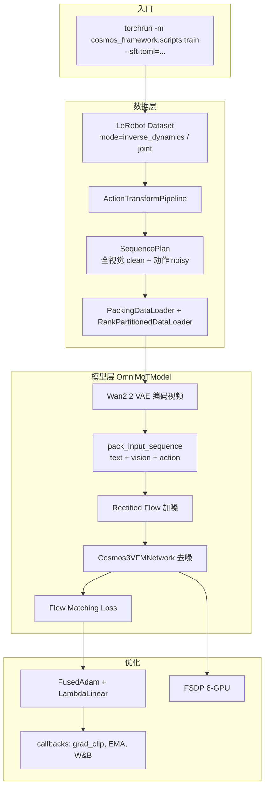
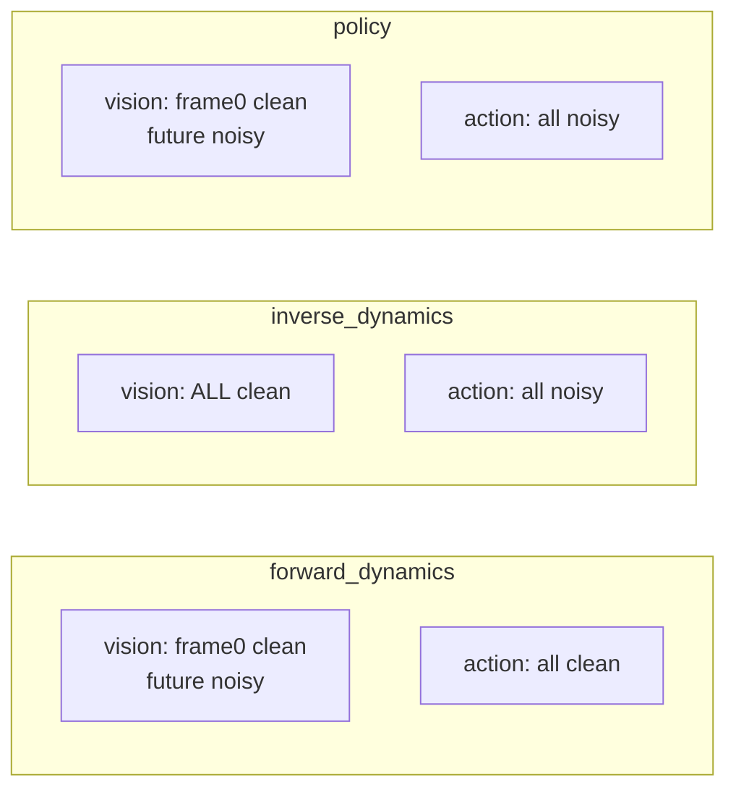

# Cosmos3 inverse_dynamics 训练流程详解

> 本文分析 **cosmos-framework** 中 `mode="inverse_dynamics"` 的 SFT 训练路径：数据管线、SequencePlan、Flow Matching loss、优化器与分布式训练；并说明推理输出的 **动作向量物理含义**、**轨迹 vs 控制** 的定位，以及真机对接方式。推理侧示例见 `inputs/omni/action_inverse_dynamics_*.json`；Policy 推理见 [cosmos3_policy_detail.md](../../cosmos3_policy_detail.md)；Flow Matching 推理背景见 [cosmos3_flow.md](../../cosmos3_flow.md)。
>
> **代码仓库：** [cosmos-framework](https://github.com/NVIDIA/Cosmos)（路径以下均相对于该仓库根目录）

---

## 0. 先澄清：仓库里「有没有单独 recipe」

在 **cosmos-framework v1.2.2** 开源树里：

- **有**完整的 `inverse_dynamics` 训练逻辑（数据 → SequencePlan → Flow Matching loss → 优化器）
- **没有**像 `action_policy_droid` 那样单独命名的 launch shell / TOML
- 已发布的 **Policy SFT**（DROID/LIBERO）刻意设 `mode="policy"`，避免与 `forward_dynamics` / `inverse_dynamics` 混训

因此：`inverse_dynamics` 不是独立训练系统，而是 **Action 多任务框架** 下的一种 `mode`，与 `policy`、`forward_dynamics` 共用同一套 `OmniMoTModel` + `ImaginaireTrainer`。

---

## 1. 任务定义：逆动力学在学什么

**逆动力学（Inverse Dynamics）**：给定完整观测视频 + 文本 prompt，预测导致该视频变化的动作序列。

与另外两种 action mode 的对比：

| mode | 视觉条件 | 视觉是否参与 loss | 动作条件 | 动作是否参与 loss |
|------|----------|-------------------|----------|-------------------|
| `forward_dynamics` | 仅第 1 帧 clean | 未来帧 noisy（有 vision loss） | 全部动作 clean | 无 action loss |
| **`inverse_dynamics`** | **全部 latent 帧 clean** | **无 vision loss** | 仅 history clean | **全部动作 noisy（有 action loss）** |
| `policy` | 第 1 帧 clean | 未来帧 noisy | history clean | 动作 noisy |

核心逻辑在 `cosmos_framework/data/generator/action/transforms.py` 的 `build_sequence_plan_from_mode`：

```python
# image2video / forward_dynamics / policy: first frame is clean (conditioning)
# inverse_dynamics: all frames are provided as context
if mode in ["image2video", "forward_dynamics", "policy"]:
    condition_frame_indexes_vision = [0]
elif mode == "inverse_dynamics":
    condition_frame_indexes_vision = list(
        range(0, (video_length - 1) // video_temporal_downsample + 1)
    )

# forward_dynamics: all action steps are clean (conditioning)
# inverse_dynamics / policy: action is supervised (predicted)
if mode == "forward_dynamics":
    condition_frame_indexes_action = list(range(action_length))
elif base_action_length == video_length - 1:
    condition_frame_indexes_action = list(range(num_history_actions))
```

推理侧：输入观测视频，动作用纯噪声初始化（与 policy 相同），见 `cosmos_framework/inference/action.py` 中 `ModelMode.POLICY | ModelMode.INVERSE_DYNAMICS` 分支。

---

## 2. 端到端训练流水线



**训练入口：** `cosmos_framework/scripts/train.py`，由 TOML recipe（`--sft-toml=...`）驱动，经 `SFTExperimentConfig` → Hydra LazyConfig → `ImaginaireTrainer.train()`。

---

## 3. 数据层详解

### 3.1 数据集与 mode 选择

所有 Action LeRobot 数据集继承 `ActionBaseDataset`（`cosmos_framework/data/generator/action/datasets/base_dataset.py`），支持三种 mode + `joint` 随机混合：

```python
_MODE_CHOICES = ("forward_dynamics", "inverse_dynamics", "policy")

def _choose_mode(self) -> str:
    if self._mode == "joint":
        return random.choice(_MODE_CHOICES)
    return self._mode
```

| mode 设置 | 行为 |
|-----------|------|
| `mode="joint"`（DROID 等默认） | 每个 sample 以 1/3 概率随机为 ID / FD / Policy → **Cosmos3 基座预训练常用** |
| `mode="inverse_dynamics"` | 纯逆动力学 SFT |
| `mode="policy"` | 已发布 Policy recipe 使用，避免 joint 稀释各任务 loss |

Policy recipe 中的注释（`action_policy_droid_nano.py`）：

> `"joint"` would randomly pick forward_dynamics/inverse_dynamics/policy per sample (multi-task), which dilutes each per-task loss by ~1/3.

### 3.2 单样本字段

`_build_result` 产出：

| 字段 | 含义 |
|------|------|
| `video` | uint8，`[C, T, H, W]` |
| `action` | 归一化后 `[T_action, D_raw]`，再 pad 到 `max_action_dim=64` |
| `ai_caption` | 任务描述 + 元数据（视角、FPS、分辨率等） |
| `mode` | `"inverse_dynamics"` |
| `domain_id` | embodiment ID（av=1, bridge=7, droid=8…） |
| `idle_frames` | 静止帧计数（**ID mode 不写入 prompt**） |

ID 特有：跳过 idle frame 元数据，避免泄露动作信息（`transforms.py` 中 `_should_append_idle_frame_info` 对 `inverse_dynamics` 返回 `False`）。

### 3.3 ActionTransformPipeline

对每个 sample 依次：

1. 反射 padding 到标准分辨率（480p 等）
2. 拼接 caption 元数据（ID 跳过 idle_frames）
3. Qwen3-VL tokenizer 文本 tokenize（`cfg_dropout_rate=0.1` 做 CFG）
4. 构建 `SequencePlan`
5. `ActionProcessor.preprocess_action`：归一化 → pad 到 64 维 → 记录 `raw_action_dim`

**动作归一化**（domain 相关）：

- DROID Policy：`action_normalization=None`（原始 joint 绝对值）
- LIBERO：`quantile_rot` 等
- 公式：`(raw - offset) / scale`，推理时 `denormalize_action` 反变换

**通道 masking**：loss / 加噪 / 速度场只在 `raw_action_dim` 有效维度上计算，padding 通道置零。

### 3.4 分布式 DataLoader

与 Vision SFT 相同栈：

- `PackingDataLoader`：多样本 token packing（`max_samples_per_batch=128`）
- `RankPartitionedDataLoader` + `ActionIterableShuffleDataset`：按 episode 分片、shuffle、顺序读 window（I/O 友好）

---

## 4. 模型前向：从 batch 到 packed sequence

### 4.1 视觉编码

`OmniMoTModel.get_data_and_condition`：

- 视频 uint8 → `[-1, 1]` → Wan2.2 VAE latent `[C, T_latent, H', W']`（temporal downsample=4）

### 4.2 动作不做 VAE，直接作为 token

动作是 `[T, max_action_dim]` 的连续向量，经 `DomainAwareLinear` 投影进 LLM hidden space。

### 4.3 Sequence Packing 与 condition mask

`cosmos_framework/data/generator/sequence_packing/modalities.py` 中，对每个 action frame：

- `condition_mask=1` → clean（不参与 loss）
- `condition_mask=0` → noisy（参与 Flow Matching loss）

**inverse_dynamics**：视觉帧全部 `condition_mask=1` → `mse_loss_indexes` 为空；动作帧（除 history）全部 noisy。

### 4.4 网络结构（动作相关）

`Cosmos3VFMNetwork` 中：

| 模块 | 作用 |
|------|------|
| `action2llm` | 动作 → hidden（按 `domain_id` 选权重，跨 embodiment） |
| `llm2action` | hidden → 预测速度场 |
| `action_modality_embed` | 模态 embedding |
| `time_embedder` | σ/t 嵌入，只加在 noisy action token 上 |

MoT 主干做 **text + vision(clean) + action(noisy)** 的 joint attention（`joint_attn_implementation="two_way"`）。

`DomainAwareLinear` 实现见 `cosmos_framework/model/generator/mot/domain_aware_linear.py`（基于 X-VLA 的多 embodiment 设计）。

---

## 5. Loss 设计（核心）

### 5.1 Rectified Flow / Flow Matching 原理

训练目标：学习速度场 \(v\)，使插值路径 \(x_t = \sigma \cdot \epsilon + (1-\sigma) \cdot x_0\) 满足 \(v = \epsilon - x_0\)。

`RectifiedFlow.get_interpolation`（`cosmos_framework/model/generator/diffusion/rectified_flow.py`）：

```python
x_t.append(x_0[i] * t[i] + x_1[i] * (1 - t[i]))
dot_x_t.append(x_0[i] - x_1[i])
```

注意：代码里 `x_0` = noise，`x_1` = clean data（与 diffusion 社区记号相反）。

### 5.2 训练 step 流程

`OmniMoTModel.training_step`：

1. Tokenize 文本
2. 从 batch 构建 `sequence_plans`
3. VAE 编码 → `gen_data_clean`
4. 采样 σ/t（vision 用 waver/logitnormal；action 默认 **复用 vision 的 σ**）
5. `_add_noise_to_input`：按 condition_mask 混合 clean/noisy
6. `denoise()`：MoT 预测 \(v\)
7. `_compute_losses()`：MSE + 时间权重

### 5.3 动作 Flow Matching Loss

实现：`cosmos_framework/model/generator/algorithm/loss/flow_matching.py`

\[
\mathcal{L}_{action} = \mathbb{E}_{\sigma, \epsilon}\left[ w(\sigma) \cdot \| v_\theta(x_t, t) - (\epsilon - x_0) \|^2 \cdot \mathbb{1}_{noisy} \right]
\]

要点：

- 只在 `noisy_mask = 1 - condition_mask` 位置计算
- `raw_action_dim` 截断：padding 通道不参与 loss
- 时间采样：`train_time_action_distribution="logitnormal"`（`nano_model_config` 默认）
- 时间权重：`train_time_weight="uniform"`
- shift：按分辨率 `{256:3, 480:5, 720:10}` warp σ

### 5.4 总 Loss 组合

```python
total_loss += fm_loss_vision * loss_scale          # DROID recipe: loss_scale=10
total_loss += fm_loss_action * action_loss_weight  # 默认 10.0
```

**inverse_dynamics 样本的实际梯度来源：**

| 项 | 值 | 说明 |
|----|-----|------|
| `fm_loss_vision` | ≈ 0（dummy） | 全视觉 clean → `has_noisy_tokens(vision)=False` |
| `fm_loss_action` | **主 loss** | 全部动作步 noisy |
| MoE load balancing | 可选 | 默认 `coeff_gen=None` 关闭 |

`action_loss_weight=10` 的原因（源码注释）：视频 loss 量级 ~1.5，动作 ~0.05，需放大动作梯度。

**joint 混训 / 空 action batch**：无 action 的 rank 用 `dummy_loss = 0.0 * sum(preds_action)` 防止 FSDP reduce-scatter 死锁。

### 5.5 可选：`independent_action_schedule`

默认 `False`：动作与视觉 **共享同一 σ**。设为 `True` 时，动作从独立 `rectified_flow_action` 采样 `[n_action, 1]` 的 σ（`shift_action` 可单独配置）。纯 ID 训练通常不必开启。

配置定义见 `cosmos_framework/configs/base/defaults/model_config.py` → `RectifiedFlowTrainingConfig`。

---

## 6. 优化器与学习率设计

Action SFT recipe 以 DROID 为例（`action_policy_droid_nano.py`），ID 训练可复用同一套：

| 设计 | 细节 |
|------|------|
| **优化器** | `FusedAdam`（CUDA fused kernel） |
| **精度** | bf16 参数 + **fp32 master weights** |
| **eps** | `1e-8`（bf16 + eps=1e-6 在 action loss 上会发散） |
| **可训练参数** | 仅 generation 路径 + action head；**冻结** Qwen3-VL understanding 路径 |
| **Action head LR** | 基础 `2e-4` × **5.0** = **1e-3**（action2llm / llm2action / action_modality_embed） |
| **其他 head LR** | `2e-4`（moe_gen, vae2llm, llm2vae, time_embedder） |
| **Weight decay** | 0.05 |
| **Scheduler** | `LambdaLinear` 线性 decay |
| **Grad clip** | `clip_norm=1.0`, `force_finite=True` |
| **Grad scaler** | **关闭**（纯 bf16） |
| **EMA** | Power EMA，`rate=0.1` |

**`keys_to_select` 白名单：**

```python
keys_to_select=[
    "moe_gen", "time_embedder", "vae2llm", "llm2vae",
    "action2llm", "llm2action", "action_modality_embed",
]
lr_multipliers={
    "action2llm": 5.0,
    "llm2action": 5.0,
    "action_modality_embed": 5.0,
}
```

优化器构建逻辑：`cosmos_framework/utils/generator/optimizer.py`（`_build_params_with_metadata` 按子串匹配参数名并冻结其余参数）。

**Trainer 循环**（`cosmos_framework/trainer/__init__.py`）：

```
forward → loss.backward() → grad_scaler.step(optimizer) → scheduler.step() → zero_grad
```

分布式：**FSDP**（8-way shard），Context Parallel 可选。

---

## 7. Checkpoint 与初始化

Policy SFT 从 Cosmos3-Nano DCP 加载时 **跳过 action head**（基座无 domain 专用动作头）：

```python
keys_to_skip_loading=[
    "net_ema.", "action2llm", "llm2action",
    "action_modality_embed", "action_pos_embed",
]
```

**inverse_dynamics 能力**在 released **Cosmos3-Nano 基座**中通常来自预训练阶段的 `mode="joint"` 多任务；开源 Policy post-train 不会强化 ID。

若做 **纯 ID SFT** 建议：

1. 复制 `examples/toml/sft_config/action_policy_droid_repro.toml`
2. Hydra override 设 `mode="inverse_dynamics"`
3. 视情况 **保留** action head 从基座加载（若基座已训过 ID）
4. ID 样本本身 vision loss≈0，无需额外改 `loss_scale`

---

## 8. 推理 vs 训练的一致性

| 阶段 | inverse_dynamics |
|------|------------------|
| 视觉 | 全帧 VAE encode 为 clean condition |
| 动作 init | 全噪声 |
| 采样 | UniPC，`num_steps=30`，`guidance=1.0`（默认无 CFG） |
| 输出 | `sample_outputs.json` 中 `action` 字段（反归一化后） |

默认参数：`cosmos_framework/inference/defaults/inverse_dynamics/sample_args.json`。

Embodiment 与 `raw_action_dim` 映射见 `cosmos_framework/data/generator/action/domain_utils.py`（如 av=9D，bridge/droid=10D）。

**后处理链路**（`OmniMoTModel` → `ActionProcessor.postprocess_action`）：

1. Flow Matching 去噪得到模型空间 action（64 维 pad，有效维由 `raw_action_dim` 决定）
2. 截断 padding：`[..., :raw_action_dim]`
3. 若训练时使用 normalizer → `denormalize_action`（quantile / meanstd 等）
4. 写入 JSON；**不会**自动变成可直接下发的关节角速度或力矩

---

## 9. 推理输出：动作序列的物理含义

**结论：既不是统一的「各关节目标位置」，也 generally 不是「关节角速度 \(\dot{q}\)」。** 具体语义由 **`domain_name`（embodiment）** 与训练时的 `ActionSpec` 决定；`inverse_dynamics` 与 `policy` 在 **同一 domain 下 action 向量格式相同**，差别只在视觉输入是「全视频」还是「首帧」。

### 9.1 输出张量形态与时间轴

```text
action: [action_chunk_size, raw_action_dim]

例：action_inverse_dynamics_robot.json → [16, 10]（Bridge）
    action_inverse_dynamics_av.json     → [60, 9] （AV）
```

与 Policy 相同的时间语义（详见 [cosmos3_policy_detail.md](../../cosmos3_policy_detail.md) §4.1）：

```text
视频帧:  f0   f1   f2  ...  f_{T-1}     （T = chunk_size + 1）
action:     a0   a1  ...  a_{T-2}       （chunk_size 步）

a_i = 从 f_i 到 f_{i+1} 的「转移」
```

inverse_dynamics：**全视频作为 clean 条件**，模型只反推这 `chunk_size` 步 action，不生成未来视频。

### 9.2 按 domain 的维度含义

`cosmos_framework/data/generator/action/action_spec.py` 用 `DimType`（POS / ROT / GRIPPER / JOINT）标注每一维；`pose_utils.py` 定义 `backward_framewise` 等 pose convention。

#### Bridge / DROID（ee_pose）— 10D **相对末端位姿增量**

官方 robot ID 示例 `inputs/omni/action_inverse_dynamics_robot.json` 使用 `domain_name=bridge_orig_lerobot`。

`bridge_orig_lerobot_dataset.py` 注释：

```text
10D = [pos_delta(3), rot6d_delta(6), gripper(1)]
pose_convention = backward_framewise
```

`backward_framewise`（`pose_utils.py`）：

\[
\Delta T_i = T_i^{-1} \cdot T_{i+1}
\]

| 维度 | 含义 |
|------|------|
| `tx, ty, tz` (3) | 相邻帧间相对平移（OpenCV 对齐坐标系，米级） |
| `rot_0 … rot_5` (6) | 相对旋转的 **6D rotation** 编码（非欧拉角、**非角速度**） |
| `gripper` (1) | 夹爪标量命令 |

DROID 默认 `ee_pose` 路径（`droid_lerobot_dataset._build_raw_action`）同样是 **10D 相对位姿 + gripper**，不是关节空间量。

#### DROID Policy（`joint_pos`）— 8D **绝对关节位置**

`action_space="joint_pos"` 时（Cosmos3-Nano-Policy-DROID post-train）：

```text
8D = [joint_0 … joint_6 (7), gripper (1)]   # 绝对关节 command，非角速度
```

`use_state=True` 时，序列首行是当前观测关节状态（history conditioning），其后为 chunk 内 commanded joints。  
**仅在此 action space 下**，输出可较直接理解为「关节位置目标」。

#### AV — 9D 位姿类增量（无 gripper）

`action_inverse_dynamics_av.json`：`domain_name=av`，`raw_action_dim=9` → `Pos(3) + Rot(rot6d)`，一般为自车 ego **相对位姿/规划增量**，不是油门/方向盘等底层控制量。

#### 其他 embodiment（摘要）

| domain | raw_action_dim | 典型语义 |
|--------|----------------|----------|
| `bridge_orig_lerobot` / DROID ee_pose | 10 | 相对 EE Δ + gripper |
| `droid_lerobot` (joint_pos) | 8 | **绝对关节角** + gripper |
| `av` / `camera_pose` | 9 | 相对位姿 Δ（无 gripper） |
| `umi` | 10 | 操作相关 pose 向量 |
| `libero` | 7/10/13 | 依 `rotation_space` 而定 |

同一 checkpoint 经 `DomainAwareLinear` 的 `domain_id` 路由到不同 head；**换 domain 即换动作语义**。

### 9.3 与常见直觉的对照

| 常见理解 | Cosmos3 inverse_dynamics 实际 |
|----------|-------------------------------|
| 各关节目标位置 \(q^*\) | **仅** `joint_pos` 域才是；Bridge/ee_pose **不是** |
| 关节角速度 \(\dot{q}\) | **不是**；代码库无单独的速度 action space |
| 末端绝对目标位姿 | **不直接输出**；ee_pose 域输出的是 **帧间相对 \(\Delta T\)**，需积分还原 |
| 可直接下发的控制命令 | **通常不能**；需反归一化 + 坐标变换 +（IK）+ 底层控制器 |

训练侧：Bridge 从观测 state 的绝对 pose 经 `pose_abs_to_rel` 得到相对 action；推理是逆问题——输出相对向量，若要绝对 EE 轨迹需 `pose_rel_to_abs`（需 `initial_pose` 等；policy 训练样本常带 `initial_pose`，纯 ID 推理 JSON 未必暴露）。

---

## 10. 实际部署与控制器对接

**不能笼统理解为「模型输出关节位置 → 控制器算角速度」**；是否成立取决于 domain。

### 10.1 Bridge / ee_pose ID（如 `action_inverse_dynamics_robot.json`）

```text
观测视频
  → 模型反推 [chunk, 10] 相对 ΔT + gripper
  → 反归一化 + 坐标系转换（Bridge/DROID 各有 DEFAULT_ROTATION、OpenCV 对齐）
  → pose_rel_to_abs 积分为绝对 EE 轨迹（需初始位姿）
  → 运动学逆解 IK → 关节角 q*
  → 底层控制器（位置/阻抗/速度环）→ 力矩或角速度
```

此处 **模型不输出关节位置**；关节角是 IK 的后处理结果。

### 10.2 DROID `joint_pos` Policy / ID

```text
模型输出 [chunk, 8] 绝对关节角 + gripper
  → 反归一化（joint_pos 常为 raw，无 normalizer）
  → 作为关节 setpoint / 轨迹跟踪目标
  → 底层 Franka/关节控制器生成 q̇、力矩等
```

此处 **可以** 近似理解为「关节位置 → 控制器 → 角速度/力矩」。

### 10.3 inverse_dynamics 与 policy 在对接上无差别

| | inverse_dynamics | policy |
|--|------------------|--------|
| action 向量格式 | 同 domain 同定义 | 同 domain 同定义 |
| 输入 | 完整视频 | 首帧观测 |
| 后处理栈 | 相同 | 相同 |

不能因为是 ID 就默认输出是关节角。

### 10.4 模型 action：轨迹还是控制？

**更准确：模型输出的是「短时域的开环轨迹 / 动作块（action chunk）」，不是底层「控制量」；部署时可当作高层 setpoint 序列，由底层控制器跟踪。**

#### 轨迹 vs 控制

| | **轨迹 / 规划（trajectory / plan）** | **控制（control）** |
|--|-------------------------------------|---------------------|
| 时间范围 | 一段未来：\(a_0,\ldots,a_{K-1}\) | 当前时刻一个指令 |
| 典型内容 | 位姿序列、关节角序列、路径点 | 力矩 \(\tau\)、角速度 \(\dot{q}\)、电流 |
| 闭环 | 常 **开环** 执行若干步后再重规划 | **闭环** 每周期反馈修正 |
| Cosmos3 输出 | **更像这个** | **一般不是** |

Cosmos3 一次推理给出 **`[chunk_size, raw_action_dim]` 整段序列**（如 16 步 × 10 维），对应 `chunk_size + 1` 帧时间窗内的逐步转移，本质是 **短时 open-loop plan**，不是单步 PD 控制律的输出。

#### 按 domain 的「轨迹」含义

| domain | 轨迹指什么 |
|--------|------------|
| ee_pose（Bridge 等） | **末端相对位姿增量序列** \(\Delta T_0,\ldots,\Delta T_{K-1}\)，积分为 EE 路径 |
| joint_pos（DROID Policy） | **关节角序列** \(q_0,\ldots,q_{K-1}\)（绝对 command） |

因此：**不是**力矩/角速度等电机层信号，**是**「未来一小段时间该怎么动」的离散 waypoints。

#### 部署时为何又像「控制」

真机常用 **receding horizon（滚动时域）**：

```text
每 Δt：
  观测 → 模型 → 整段 chunk [a0 … a_{K-1}]
  只执行前 k 步（k ≤ chunk_size）
  再观测 → 再推理 → 新 chunk
```

```text
Cosmos3 action  =  规划层 / 行为层（next K steps 做什么）
底层控制器     =  执行层（now 怎么跟踪）
```

与 pi0、Diffusion Policy 等 **chunk VLA** 同类：chunk 充当 **高层 setpoint**，底层控制器再生成 \(\dot{q}\)、\(\tau\)。

#### inverse_dynamics vs policy

| | inverse_dynamics | policy |
|--|------------------|--------|
| 轨迹还是控制？ | **相同**：都是 chunk 轨迹 | **相同** |
| 语义差别 | 从完整视频 **反推** 已发生的动作轨迹 | 从首帧 **预测** 将要执行的动作轨迹 |

ID 偏 **轨迹估计 / 反演**；Policy 偏 **轨迹生成 / 规划**。二者都不是底层控制律。

#### 记忆口诀

```text
模型 action  =  短时域、开环的 action chunk（轨迹片段 / 高层 setpoint 序列）
            ≠  角速度、力矩等底层控制量
            →  经 IK / 积分 / 反归一化 后，交给控制器跟踪这条轨迹
```

### 10.5 部署速查

| 场景 | 模型直接输出 | 下游通常还需 |
|------|--------------|--------------|
| Bridge / ee_pose ID | 相对 EE Δ + gripper | 反归一化 → 坐标变换 → 积分 → **IK** → 关节/速度控制 |
| DROID `joint_pos` | 绝对关节角 + gripper | 反归一化 → **可直接作关节 setpoint** → 底层控制器 |
| AV 9D | 相对 ego 位姿 Δ | 反归一化 → 规划/控制栈映射（非关节空间） |

diffusers / cosmos-framework 推理 pipeline **不包含** 真机 IK、坐标映射与 Franka 下发；见 [cosmos3_policy_detail.md](../../cosmos3_policy_detail.md) §六、§Phase G 与 cosmos-framework `docs/action_policy_droid_posttrain.md`。

---

## 11. 如何启动 inverse_dynamics 训练

### 方式 A：纯 ID（override mode）

```bash
torchrun --nproc_per_node=8 -m cosmos_framework.scripts.train \
  --sft-toml=examples/toml/sft_config/action_policy_droid_repro.toml \
  -- dataloader_train.dataloader.datasets.droid.dataset.mode=inverse_dynamics
```

需事先设置：`DROID_ROOT`、`BASE_CHECKPOINT_PATH`、`WAN_VAE_PATH`、`IMAGINAIRE_OUTPUT_ROOT`（见 `docs/action_policy_droid_posttrain.md`）。

### 方式 B：多任务 joint（接近基座预训练）

数据集默认 `mode="joint"`（如 `DROIDLeRobotDataset`），每个 sample 随机三种 action 任务之一。

### 方式 C：自定义 TOML

在 `[job]` 中 `experiment = "action_policy_droid_nano"`，再通过 Hydra tail 改 `mode`、lr、iter 等。

---

## 12. 与 Policy 训练的关键差异

| 维度 | inverse_dynamics | policy（已发布 recipe） |
|------|------------------|-------------------------|
| 监督目标 | 仅动作 | 动作 + 未来视频 |
| Vision loss | 无（全 condition） | 有（`loss_scale=10`） |
| Action loss | 有（`action_loss_weight=10`） | 有 |
| 有效梯度 | 几乎全在 action head + 共享 MoT | action + vision 双头 |
| Caption | 不含 idle_frames 元数据 | 可含 |
| 开源 recipe | 无专用，需 override | `launch_sft_action_policy_*.sh` |

三种 mode 的 SequencePlan 对比：



---

## 13. 实现层面的设计亮点

1. **统一 Flow Matching 框架**：视觉/动作/音频共用 rectified flow，仅通过 `SequencePlan` 的 condition mask 切换任务
2. **DomainAwareLinear**：同一模型支持 AV（9D）、Bridge（10D）、DROID（10D）等不同 embodiment
3. **raw_action_dim masking**：64 维统一 action space，loss 只在有效维度计算
4. **FSDP-safe dummy loss**：混合 batch / 空 action batch 不会导致分布式死锁
5. **Action head 高 LR**：5× multiplier 补偿新初始化 head 与冻结 backbone 的学习速度差

---

## 14. 关键源码索引

| 主题 | 路径 |
|------|------|
| SequencePlan 构建 | `cosmos_framework/data/generator/action/transforms.py` |
| 数据集 mode 选择 | `cosmos_framework/data/generator/action/datasets/base_dataset.py` |
| Action SFT 数据集 | `cosmos_framework/data/generator/action/datasets/action_sft_dataset.py` |
| Flow Matching loss | `cosmos_framework/model/generator/algorithm/loss/flow_matching.py` |
| 训练 step | `cosmos_framework/model/generator/omni_mot_model.py` |
| MoT 网络 / action head | `cosmos_framework/model/generator/mot/cosmos3_vfm_network.py` |
| Nano 模型默认 config | `cosmos_framework/configs/base/experiment/sft/models/nano_model_config.py` |
| DROID Policy experiment | `cosmos_framework/configs/base/experiment/action/posttrain_config/action_policy_droid_nano.py` |
| 优化器 | `cosmos_framework/utils/generator/optimizer.py` |
| Trainer | `cosmos_framework/trainer/__init__.py` |
| 推理 batch 构建 | `cosmos_framework/inference/action.py` |
| Action 向量规格 | `cosmos_framework/data/generator/action/action_spec.py` |
| 相对/绝对 pose 转换 | `cosmos_framework/data/generator/action/pose_utils.py` |
| 反归一化 / postprocess | `cosmos_framework/data/generator/action/action_processing.py` |
| domain 维度表 | `cosmos_framework/data/generator/action/domain_utils.py` |
| Bridge 数据集定义 | `cosmos_framework/data/generator/action/datasets/bridge_orig_lerobot_dataset.py` |
| 文档 | `cosmos-framework/docs/action_policy_droid_posttrain.md` |

---

## 相关文档

- [cosmos3_policy_detail.md](../../cosmos3_policy_detail.md) — Policy 推理（diffusers）
- [cosmos3_flow.md](../../cosmos3_flow.md) — T2V Flow Matching 推理
- [cosmos3_mot.md](../../cosmos3_mot.md) — MoT 架构概览
- cosmos-framework `docs/code_structure.md` — 仓库结构
- cosmos-framework `docs/training.md` — SFT 通用指南
