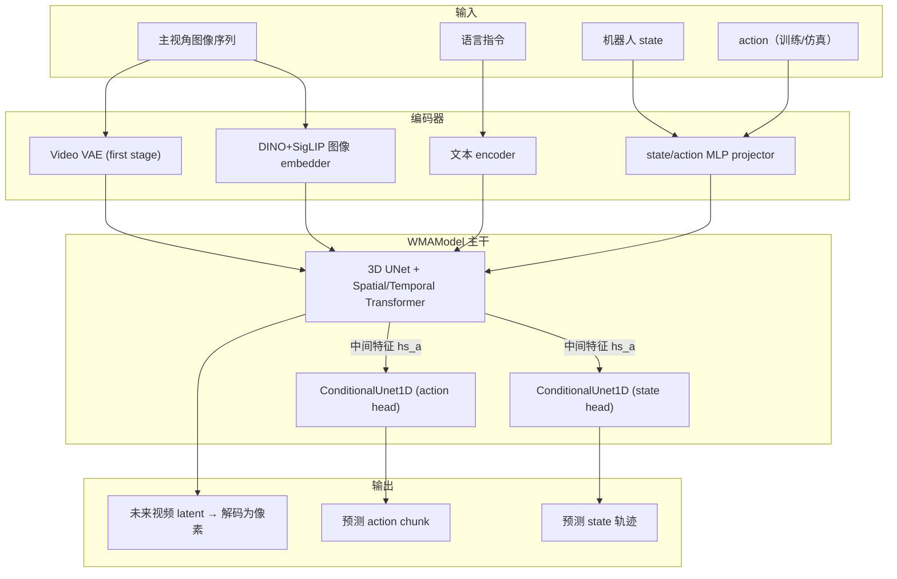
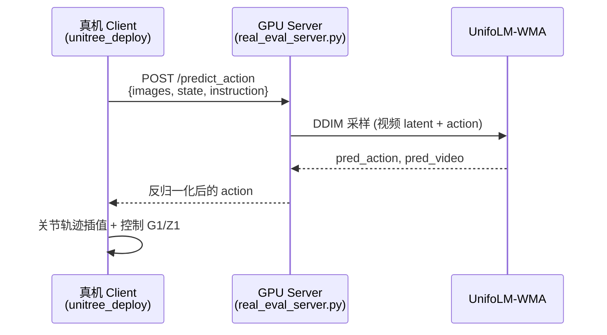
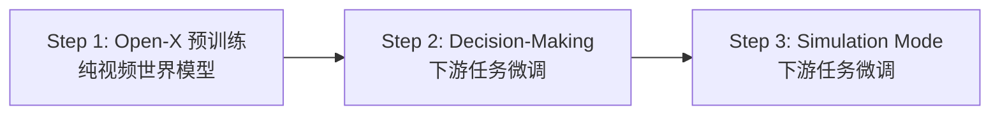
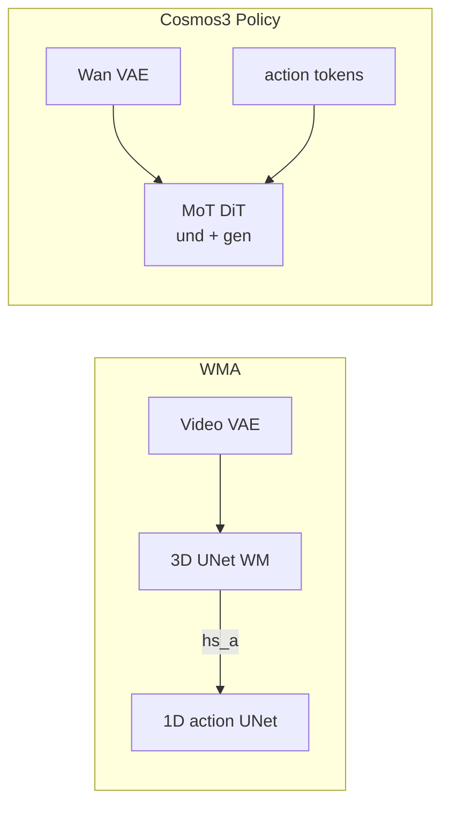

# UnifoLM-WMA-0：World-Model-Action 架构分析

> **UnifoLM-WMA-0** 是宇树（Unitree）开源的 **World-Model-Action（WMA）** 框架：用一个 **视频世界模型** 同时承担「预测未来交互过程」与「输出机器人动作」两类能力，面向 Z1 / G1 等多 embodiment 的通用操作学习。  
> 上游仓库：[unifolm-world-model-action](https://github.com/unitreerobotics/unifolm-world-model-action)  
> 本地代码路径：`/home/zhangxa/codes/edgeLLM/unifolm-world-model-action`

**相关文档：** [cosmos3_vs_pi05.md](../cosmos3_vs_pi05.md)、[cosmos3.md](../cosmos3.md)、[cosmos3_policy_detail.md](../cosmos3_policy_detail.md)；下文 **§十二** 专述 WMA 与 Cosmos3 差异。

---

## 一、一句话定位

| 维度 | 说明 |
|------|------|
| **核心思想** | 世界模型（视频扩散）+ 动作头（1D 扩散）**联合训练、特征共享** |
| **两大用途** | (a) **Simulation Engine** — 交互式仿真、合成数据；(b) **Policy Enhancement** — 预测未来视频 latent 的同时输出 action chunk |
| **Embodiment** | 统一 action/state 向量空间（pad 至 16 DoF），支持 Z1 单/双臂、G1 夹爪等 |
| **数据** | LeRobot V2.1 → 视频 + h5 transition + CSV；Base 模型在 Open-X 预训练 |

真机 demo 中，**右上角小窗**即为世界模型对未来动作视频的预测（decision 模式下联合采样得到）。

---

## 二、整体架构



**要点：** 视频 3D UNet 是「世界模型」；`action_unet` / `state_unet` 来自 **Diffusion Policy** 的 `ConditionalUnet1D`，通过 UNet 多尺度时空特征金字塔 **`hs_a`** 与 world model **深度耦合**，而非完全独立的 policy 网络。

---

## 三、代码组织与类继承

```text
DDPM (PyTorch Lightning)
  └── LatentDiffusion              # 潜空间视频扩散（VAE + DDIM）
        └── LatentVisualDiffusion  # + 图像条件 + action/state head + DP scheduler
              └── WMAModel         # 3D UNet 主体（wma_model.py）
```

| 路径 | 职责 |
|------|------|
| `src/unifolm_wma/models/ddpms.py` | Lightning 训练、`LatentVisualDiffusion`、loss、采样 |
| `src/unifolm_wma/modules/networks/wma_model.py` | 3D UNet 世界模型 + action/state head |
| `src/unifolm_wma/models/diffusion_head/` | Diffusion Policy 风格 1D UNet |
| `src/unifolm_wma/modules/attention.py` | Spatial / Temporal Transformer |
| `src/unifolm_wma/data/wma_data.py` | 视频 + transition 数据集 |
| `scripts/trainer.py` | PyTorch Lightning 训练入口 |
| `scripts/evaluation/real_eval_server.py` | 真机 FastAPI + DDIM 推理 |
| `unitree_deploy/` | G1/Z1 真机环境、IK、相机、夹爪、轨迹插值 |

训练入口配置（`configs/train/config.yaml`）：

```yaml
target: unifolm_wma.models.ddpms.LatentVisualDiffusion
wma_config:
  target: unifolm_wma.modules.networks.wma_model.WMAModel
unet_head_config:
  target: unifolm_wma.models.diffusion_head.conditional_unet1d.ConditionalUnet1D
```

---

## 四、WMAModel 前向与联合扩散

`WMAModel.forward` 同时处理三条流：

| 输入 | 含义 |
|------|------|
| `x` | 视频 latent `(B, C, T, H, W)` |
| `x_action` | action 扩散流 |
| `x_state` | state 扩散流 |
| `context` | cross-attn 条件（state + text + image） |
| `context_action` | action head 专用条件（历史图像、历史 state） |

核心逻辑（简化）：

```python
# 3D UNet encoder → middle → decoder
y = self.out(h)                    # 视频噪声 / v-prediction

# action/state head 共享 UNet 中间特征 hs_a
a_y = self.action_unet(x_action, timesteps, hs_a, context_action, ...)
s_y = self.state_unet(x_state, timesteps, hs_a, context_action, ...)
return y, a_y, s_y
```

- **联合扩散**：视频、action、state 共享 diffusion timestep。
- **特征注入**：action head 接收视频 UNet 各层 **`hs_a`**（类似「用 world model 的内部表示指导动作」）。

---

## 五、两种运行模式

### 5.1 Decision-Making Mode（决策模式）

**用途：** 真机部署 —— 观测 → 预测 action chunk。

训练时条件构造（`decision_making_only=True`）：

```python
mode_batch = cat([obs_state, instruction, image_emb])  # 不含 action
```

推理时（`real_eval_server.py`）：

```python
cond["c_crossattn"] = [ state_emb + text_emb + image_emb ]
cond["c_crossattn_action"] = [ 历史图像, 历史 state ]
cond["c_concat"] = [ 首帧 latent 复制到全序列 ]   # hybrid conditioning
cond_action_emb = zeros  # action 由 head 预测，不作为输入
```

**部署拓扑：**



- **Server：** `scripts/run_real_eval_server.sh` → FastAPI `/predict_action`
- **Client：** `unitree_deploy/scripts/robot_client.py`（SSH 隧道 + 控制频率 15Hz 等）

### 5.2 Interactive Simulation Mode（交互仿真模式）

**用途：** 给定图像 prompt + 文本 + 机器人 state，rollout **未来视频**（可交互改 action）。

训练时（`decision_making_only=False`）：

| 子模式 | 条件拼接 |
|--------|----------|
| Decision 训练 | `[obs_state, **zero_action**, instruction, image]` |
| Simulation 训练 | `[obs_state, **真实 action**, null_instruction, image]` |

Simulation 把 **action 作为条件** 喂给世界模型，学习「给定动作下世界如何演变」；Decision 则 action 置零，由 head 预测。

推理脚本：`scripts/run_world_model_interaction.sh` + `configs/inference/world_model_interaction.yaml`。

---

## 六、训练流程（三阶段）



| 阶段 |  checkpoint | 数据 | 学到什么 |
|------|-------------|------|----------|
| Base | `UnifoLM-WMA-0_Base` | [Open-X](https://robotics-transformer-x.github.io/) | 通用 image+text → 未来视频 |
| Dual Decision | `UnifoLM-WMA-0_Dual` | Unitree 5 个 LeRobot 任务 | 联合预测视频 + action |
| Dual Simulation | 同上 | 同上 | action-conditioned 视频生成 |

**数据目录结构（转换后）：**

```text
target_dir/
    ├── videos/{dataset}/{camera_view}/*.mp4
    ├── transitions/{dataset}/meta_data + *.h5
    └── {dataset}.csv
```

**关键超参（`configs/train/config.yaml`）：**

- 视频：16 帧、`v`-prediction、1000 diffusion steps、DDIM 采样
- Action/state：`ConditionalUnet1D`、独立 `DDIMScheduler`、horizon=16
- `agent_state_dim` / `agent_action_dim`：默认 16（多 embodiment pad）
- `decision_making_only`：仅训决策模式时可设为 `True`，跳过 simulation 条件分支

---

## 七、Decision 模式单次推理数据流

```text
1. 相机 top view 最近 n_obs_steps 帧 → DINO+SigLIP embed → image_proj
2. 关节 state 最近 n_obs_steps 步 → state_projector + pos_emb
3. 语言指令 → text encoder
4. 视频帧 → VAE encode → latent z；首帧 latent concat 到全序列 (c_concat)
5. DDIM ~50 步联合去噪：
   - WMAModel 预测视频 latent
   - action_unet 预测 action chunk（如 16 步 × action_dim）
6. action 反归一化 → 真机 low-level controller
7. （可选）视频 latent decode → 未来视频预览
```

---

## 八、技术谱系

| 来源 | 借鉴内容 |
|------|----------|
| [DynamiCrafter](https://github.com/Doubiiu/DynamiCrafter) | Image-to-video latent diffusion、3D UNet、hybrid conditioning |
| [Diffusion Policy](https://github.com/real-stanford/diffusion_policy) | `ConditionalUnet1D` action diffusion head |
| [ACT / HPT](https://github.com/liruiw/HPT) | 多 embodiment 统一 action/state 向量（pad 到固定维） |

---

## 九、与 π₀.₅ / Chameleon 对照

| 维度 | UnifoLM-WMA | π₀.₅ (Chameleon) |
|------|-------------|------------------|
| 世界模型 | **显式**视频 latent 扩散 UNet | 无独立视频 WM；flow matching 直接出 action |
| 动作生成 | DP 式 1D UNet + **共享 WM 特征 `hs_a`** | Gemma Action Expert flow matching |
| 条件 | 图像 + 文本 + state；首帧 latent concat | 多视角 SigLIP + 语言 + state（π₀.₅ state 进 prompt） |
| 训练目标 | 视频 v-pred + action/state ε-pred | Flow matching velocity |
| 推理 | Server-Client + DDIM 联合采样 | openpi Policy / TRT 分 stage engine |
| 仿真能力 | **原生** simulation mode 生成未来视频 | 无对等「动作条件视频 rollout」 |
| 部署 | FastAPI + unitree_deploy | `chameleon eval` + TRT engines |

**抽象对比：**

```text
WMA:
  [图像+文本+state] ──► 3D UNet 去噪视频 latent
                    └──► hs_a ──► action_unet 去噪 action chunk
  （世界模型与策略在同一扩散框架内联合优化）

π₀.₅:
  [图像+语言] ──prefill 1×──► prefix KV cache
  [action noise] ──denoise×N──► Action Expert（只读 prefix KV）
  （世界理解在 VLM prefix；不显式生成未来像素/ latent 视频）
```

WMA 更偏 **「生成式世界模型 + 扩散策略」**；π₀.₅ 更偏 **「VLA flow matching + 工程化 TRT 部署」**。二者都使用 LeRobot 类数据，但 WMA **强依赖主视角视频序列** 作为训练与推理输入。

---

## 十、常用命令速查

```bash
# 环境
conda create -n unifolm-wma python==3.10.18 && conda activate unifolm-wma
pip install -e . && cd external/dlimp && pip install -e .

# 数据转换（LeRobot → WMA 格式）
cd prepare_data && python prepare_training_data.py \
    --source_dir /path/to/lerobot --target_dir /path/to/out \
    --dataset_name DATASET --robot_name "Unitree G1 Robot with Gripper"

# 训练
bash scripts/train.sh

# 仿真交互推理
bash scripts/run_world_model_interaction.sh

# 真机：Server
bash scripts/run_real_eval_server.sh

# 真机：Client
cd unitree_deploy && python scripts/robot_client.py \
    --robot_type g1_dex1 --action_horizon 16 --language_instruction "pack black camera into box"
```

---

## 十一、小结

1. **一个 DynamiCrafter 风格的 latent 视频扩散模型** 作为世界模型，建模机器人—环境交互的视觉动态。  
2. **挂载 Diffusion Policy 式 action/state head**，经 UNet 中间特征 **`hs_a`** 与 world model 深度耦合。  
3. **同一套权重** 可切换 **Decision**（预测动作）与 **Simulation**（动作条件下生成视频）。  
4. **`unitree_deploy`** 提供 G1/Z1 真机闭环，与 GPU inference server 分离部署。

---

## 十二、与 Cosmos3 对比

二者都是 **「世界模型 + 动作策略」联合建模**，推理时都能 **同时产出 action chunk 与未来视频（或 latent rollout）**；但 **主干架构、扩散范式、视觉 front-end、动作注入方式与工程体量** 差异很大。Cosmos3 侧细节见 [cosmos3.md](../cosmos3.md)、Policy 路径见 [cosmos3_policy_detail.md](../cosmos3_policy_detail.md)。

### 12.1 一句话对照

| | UnifoLM-WMA | Cosmos3（Policy 模式） |
|---|-------------|------------------------|
| **定位** | DynamiCrafter 系 **3D UNet 世界模型** + DP 式 action head | **MoT DiT** 统一 Omni 模型中的 **Generator 塔** |
| **联合方式** | 视频 UNet 中间特征 **`hs_a`** → 独立 `ConditionalUnet1D` | vision / action **同一 joint token 序列**，一次 MoT forward |
| **扩散** | DDPM/DDIM，视频 **v-pred**，action **ε-pred** | **Flow matching** + UniPC |
| **规模** | UNet ~320ch + 1D head（**~1B 量级**） | `Cosmos3-Nano` DiT **~16B** + Wan VAE |
| **开源侧重** | 宇树 Z1/G1 真机 + 仿真闭环 | NVIDIA DROID Policy + 通用 video/reason 生态 |

### 12.2 整体架构

```text
WMA（LatentVisualDiffusion + WMAModel）:
  图像 ──► SD 式 Video VAE ──► 3D UNet（Spatial/Temporal Transformer）
  图像 ──► DINO+OpenCLIP embedder ──► cross-attn 条件
  文本 ──► FrozenOpenCLIPEmbedder
  state/action ──► MLP projector ──► cross-attn

  3D UNet encoder/decoder ──► 视频 latent 去噪
                    └── hs_a ──► ConditionalUnet1D(action) + ConditionalUnet1D(state)
  （两条「头」：世界模型 CNN+Transformer，策略 1D UNet）

Cosmos3 Policy（Cosmos3OmniPipeline + MoT DiT）:
  首帧观测 ──► Wan VAE encode ──► vision latent 网格（可联合去噪 t=1…T′）
  文本 ──► tokenize + embed ──► und 通路 prefix
  action 噪声 ──► action_proj_in ──► gen 通路 token

  单次 Cosmos3OmniTransformer forward:
    und: 文本因果 self-attn
    gen: vision + action token 双向 cross-attn 到 (und + gen) 全部 KV
  ──► velocity_vision + velocity_action ──► UniPC step
  （一个 Transformer，双通路 MoT，无独立 action UNet）
```



### 12.3 模型结构逐项对比

| 维度 | UnifoLM-WMA | Cosmos3 |
|------|-------------|---------|
| **世界模型主干** | `WMAModel`：3D UNet + ResBlock + Spatial/Temporal Transformer（DynamiCrafter  lineage） | `Cosmos3OmniTransformer`：36 层 **Mixture-of-Transformers** DiT |
| **动作模块** | `ConditionalUnet1D`（Diffusion Policy），**与视频 UNet 结构分离**，靠 `hs_a` 注入 | action 作为 **gen 通路 token**，`action_proj_in/out` + `DomainAwareLinear` |
| **state 建模** | 显式 `x_state` 流 + `state_unet`，与 action 并列 | Policy-DROID 以 **图像 + 语言** 为主；本体差异靠 `domain_id`（非 WMA 式连续 state 扩散） |
| **注意力形态** | UNet 内 cross-attn（text/image/state）；Temporal self-attn 沿帧 | und **因果** + gen **全连接 cross-attn** 到联合 KV；**3D mRoPE**（T/H/W + FPS 调制） |
| **视频 latent** | SD `AutoencoderKL`，4ch，`scale_factor=0.18215`，`perframe_ae=True` | **Wan VAE**，48ch，时间 **/4** 压缩，因果 3D CNN |
| **图像条件** | SigLIP/OpenCLIP **语义 embed** + Resampler；首帧 latent **concat**（hybrid） | 观测 **VAE latent** 作条件 z₀；未来步在 **同一 latent 空间** flow 去噪 |
| **文本** | FrozenOpenCLIPEmbedder（penultimate） | JSON caption + 标准 text embed（und 通路） |
| **action 维度** | pad 至 **16 DoF**（Z1/G1 统一） | 按 **domain**（如 DROID `raw_action_dim=10`） |
| **时间窗** | `temporal_length=16` 帧 latent | `chunk_size=16` action ↔ `num_frames=17` 像素窗（16 转移 + 1 观测） |
| **预测参数化** | 视频 **v-prediction**；action head **epsilon**（DDIM DP scheduler） | **velocity**（flow matching），vision + action 同 scheduler |
| **CFG** | 可选 `unconditional_guidance_scale`（视频）；真机 server 常用 scale=1 | Policy 通常 **`guidance_scale=1.0`**（不用 CFG） |

### 12.4 「联合」的两种哲学

**WMA：特征级耦合（two-tower + bridge）**

- 视频 3D UNet 是主计算图；action/state head 是 **挂载的 1D 扩散 UNet**。
- 耦合点：`WMAModel.forward` 里 UNet 各层输出 **`hs_a`**，作为 `action_unet(..., hs_a, ...)` 的 **多尺度条件**（`imagen_cond_gradient: True` 时可反传）。
- 优点：结构清晰、action head 可复用 Diffusion Policy 生态；世界模型可单独做 simulation。
- 代价：action 与 video **不是同一 token 序列**，跨模态对齐靠 **中间特征蒸馏**，而非端到端同一 self-attn 图。

**Cosmos3：序列级联合（single forward, MoT）**

- `prepare_latents` 把 **vision latent token + action token** 打进 **同一条 gen 序列**；每层 MoT 里 gen Q  attend 全部 und+gen KV。
- 优点：时空与 action **同一 flow matching 目标**；Reasoner/Generator 可共享 embedding（Omni 统一 ckpt）。
- 代价：**~16B 每步 denoise** 全网 forward；只要 action 时仍联合更新 video latent（算力浪费，见 [cosmos3_vs_pi05.md §4.4](../cosmos3_vs_pi05.md)）。

### 12.5 视觉编码：OpenCLIP vs Wan VAE

与 π₀.₅/Cosmos3 对照（[cosmos3_vs_pi05.md §四](../cosmos3_vs_pi05.md)）类似，WMA 与 Cosmos3 也呈现 **「语义 embed + 生成 latent」** 的分野：

| | WMA | Cosmos3 |
|---|-----|---------|
| **语义路径** | DINO+OpenCLIP → Resampler → **cross-attn**（不 decode 像素） | 文本 und 通路；**无**独立 SigLIP 式 2D ViT |
| **生成路径** | SD VAE latent **4×40×64**（配置 `image_size`） | Wan latent **48×T′×h×w**，T′=5（17 帧 /4） |
| **Policy 输入** | 主视角 **视频 clip**（训练）/ 当前帧序列（推理 `n_obs_steps`） | Policy：**1 张** concat 观测图；17 帧窗内仅首帧为真 |
| **未来视频** | 3D UNet 对 **整段 T 帧 latent** DDIM 去噪 | flow 去噪 **t=1…4** latent 步，再 VAE decode |
| **角色分工** | OpenCLIP **看懂**；VAE **可 rollout** | VAE **同时** codec + 条件；语义靠 **16B DiT + 文本** |

WMA 比 Cosmos3 **多一路显式语义 embed**（类似 π₀.₅ 的 SigLIP 角色），但世界动态仍在 **UNet+VAE** 里学；Cosmos3 则 **几乎全压在 Wan latent + MoT DiT** 上。

### 12.6 运行模式对比

| 模式 | WMA | Cosmos3 |
|------|-----|---------|
| **决策 / Policy** | `decision_making_only`：条件不含 action，联合 DDIM 采样 → action + 视频 | `mode="policy"`：flow 联合 denoise → `[chunk_size, action_dim]` + rollout 视频 |
| **仿真 / 前向动力学** | `Simulation`：action 进条件，生成未来视频 | `forward_dynamics`：给定 `raw_actions` → 预测视频 |
| **逆动力学** | 无一等公民 API | `inverse_dynamics`：完整视频 → 反推动作 |
| **Reasoner** | 无 | 独立 **Qwen3-VL 级** Reasoner 塔（`transformers` 路径） |

WMA 的 Decision/Simulation 是 **同一 WMAModel、不同 batch 条件构造**；Cosmos3 的 policy / forward / inverse 是 **同一 Pipeline 的 `CosmosActionCondition.mode`**，权重需 `action_gen=True`（Policy 专用 ckpt）。

### 12.7 训练与数据

| | WMA | Cosmos3 |
|---|-----|---------|
| **阶段** | Open-X Base → Dual Decision → Dual Simulation（三阶段） | 大规模 Omni 预训练 + Policy-DROID 等下游 |
| **数据格式** | LeRobot V2.1 → 视频 + h5 + CSV；**强依赖主视角视频** | LeRobot / DROID；Policy 可 **单帧图 + 语言** |
| **Embodiment** | 宇树 Z1/G1，action/state pad 16D | `domain_name` / `domain_id`（DROID、GR00T 等） |
| **框架** | PyTorch Lightning + diffusers scheduler | diffusers `Cosmos3OmniPipeline` + transformers Reasoner |

### 12.8 推理与部署

| | WMA | Cosmos3 |
|---|-----|---------|
| **采样步数** | DDIM 常见 **16～50** 步（配置 `ddim_steps`） | Policy 默认 **~30** UniPC steps |
| **真机链路** | `real_eval_server.py`（FastAPI）+ `unitree_deploy` client | 官方 cookbooks / diffusers；Chamleon 侧有 Cosmos3 分析文档，TRT 路径不同于 π₀.₅ |
| **输出** | action chunk + 可选 **右上角 WM 预览视频** | action chunk + **17 帧 rollout 视频**（可视化） |
| **延迟特征** | 3D UNet 中等规模；双 head 联合采样 | **16B DiT 逐步全序列**；VAE encode/decode 额外开销 |

### 12.9 与 π₀.₅ 三角关系（简表）

| 维度 | WMA | Cosmos3 | π₀.₅ |
|------|-----|---------|------|
| 显式世界模型 | ✅ 3D UNet 视频 | ✅ Wan+DiT 视频 latent | ❌ |
| 动作生成 | 1D UNet + `hs_a` | MoT gen action token | Action Expert flow |
| 视觉 front-end | OpenCLIP + SD VAE | Wan VAE | SigLIP ViT |
| 参数量 | ~1B 级 | ~16B | ~2B |
| 真机开源栈 | ✅ unitree_deploy | 文档/cookbook 为主 | openpi + Chamleon TRT |

### 12.10 选型直觉

| 需求 | 更倾向 |
|------|--------|
| 宇树 G1/Z1、仿真+真机一体、中等算力 | **WMA** |
| 需要 **逆动力学**、Omni（理解+生成+策略）统一 ckpt | **Cosmos3** |
| 只要 action、边缘 TRT、低延迟 | **π₀.₅**（见 [cosmos3_vs_pi05.md](../cosmos3_vs_pi05.md)） |
| 联合 future video + action，但要 **可控算力** | **WMA**（UNet 远小于 16B DiT） |
| 最大规模预训练、NVIDIA 生态与 DROID Policy | **Cosmos3** |

**抽象对比：**

```text
WMA:     [VAE latent + CLIP] ──► 3D UNet ──► video
                              └── hs_a ──► 1D UNet ──► action
         （CNN/Transformer 世界模型 + 外挂 DP 头）

Cosmos3: [Wan latent + text] ──► MoT DiT（und∥gen 一次 forward）──► Δvideo + Δaction
         （单一 Transformer，token 级联合 flow matching）

π₀.₅:    [SigLIP + text] ──prefill──► KV ──► Action Expert flow ──► action only
         （无 video rollout）
```

---

## 参考链接

- [Project Page](https://unigen-x.github.io/unifolm-world-model-action.github.io)
- [HuggingFace Models](https://huggingface.co/collections/unitreerobotics/unifolm-wma-0-68ca23027310c0ca0f34959c)
- [GitHub README](https://github.com/unitreerobotics/unifolm-world-model-action/blob/main/README.md)
