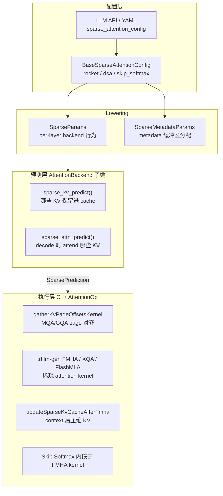
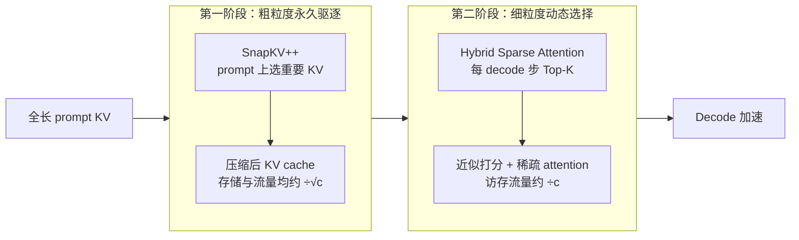
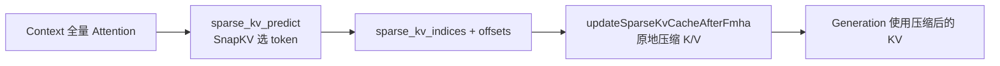

# TensorRT-LLM 稀疏 Attention 实现分析

> 基于 TensorRT-LLM 源码与官方文档的梳理，供 Chameleon / model_optimizer 侧参考。
> 用户文档：[Sparse Attention](https://github.com/NVIDIA/TensorRT-LLM/blob/main/docs/source/features/sparse-attention.md) ·
> 开发指南：[Sparse Attention Development Guide](https://github.com/NVIDIA/TensorRT-LLM/blob/main/docs/source/developer-guide/sparse-attention-development-guide.md) ·
> 设计博客：[Blog 17](https://github.com/NVIDIA/TensorRT-LLM/blob/main/docs/source/blogs/tech_blog/blog17_Sparse_Attention_in_TensorRT-LLM.md)

TensorRT-LLM 的稀疏 attention 是一套**框架级可插拔系统**，目标是在长上下文推理中跳过对输出贡献很小的 KV 计算。核心思路是：**算法只负责预测「看哪些 KV」；统一的 `AttentionOp` 负责稀疏计算与稀疏 KV cache 改写**。

---

## 1. 总体架构



### 两类稀疏行为

| 类型 | 含义 | 支持范围 |
|------|------|----------|
| **Sparse KV cache** | Context 阶段全量算完后，按 `sparse_kv_indices` **原地压缩** KV cache | MQA/GQA/MHA，token 级 |
| **Sparse computation** | Decode 阶段只 attend `sparse_attn_indices` 指定的 KV | MQA/GQA：**page 级**；MLA：**token 级** |

C++ 侧统一通过 `SparseAttentionParams` 传递索引（`cpp/tensorrt_llm/kernels/sparseAttentionKernels.h`）：

| 字段 | 形状 / 含义 |
|------|-------------|
| `sparse_kv_indices` | `[num_kv_heads, num_sparse_kv_indices]` | 仅 RocketKV Context 阶段产出；算法详见 §3.1 |
| `sparse_attn_indices` | `[num_kv_heads, num_sparse_attn_indices]` |
| `sparse_kv_offsets` | `[num_contexts + 1]` |
| `sparse_attn_offsets` | `[num_generations + 1]` |
| `num_sparse_topk` | token sparse attention 的 topK |
| `sparse_kv_cache_pool` | 主 KV pool；动态稀疏 MLA 下可为压缩 KV pool |
| `sliding_window_kv_cache_pool` | 动态稀疏 MLA 的 SWA KV pool |
| `sparse_mla_topk_lens` | `[num_tokens]`，DeepSeek-V4 稀疏 MLA |
| `sparse_attn_indices_block_size` | 索引块大小（RocketKV = page_size，DSA = 1） |

Python 侧对应 `SparsePrediction` dataclass（`tensorrt_llm/_torch/attention_backend/interface.py`），经 `AttentionForwardArgs.sparse_prediction` 传入 C++ op。

---

## 2. 配置与注册分发

### 用户 API

通过 `sparse_attention_config` 启用（Python 或 YAML），是 discriminated union：

| `algorithm` | 配置类 | 特点 |
|-------------|--------|------|
| `rocket` | `RocketSparseAttentionConfig` | 无训练、两阶段 KV 压缩 |
| `dsa` | `DeepSeekSparseAttentionConfig` | 模型原生 indexer + Top-K |
| `skip_softmax` | `SkipSoftmaxAttentionConfig` | kernel 内动态跳过（BLASST） |

配置类实现两个 lowering 方法：

- `to_sparse_params()` → 每层 `AttentionBackend` 的运行时参数
- `to_sparse_metadata_params()` → `AttentionMetadata` 预分配缓冲区

定义位置：`tensorrt_llm/llmapi/llm_args.py`。

### Backend / Cache Manager 分发

`tensorrt_llm/_torch/attention_backend/sparse/utils.py` 按算法选择实现：

| 函数 | `rocket` | `dsa` | `skip_softmax` |
|------|----------|-------|----------------|
| `get_sparse_attn_kv_cache_manager` | `RocketKVCacheManager` | `DSACacheManager` | 标准 `KVCacheManager` |
| `get_trtllm_sparse_attn_attention_backend` | `RocketTrtllmAttention` | `DSATrtllmAttention` | `TrtllmAttention`（复用，阈值传入 kernel） |
| `get_vanilla_sparse_attn_attention_backend` | `RocketVanillaAttention` | 不支持 | 不支持 |

`TrtllmAttention.forward()` 在 kernel 启动前调用预测钩子（`trtllm.py`）：RocketKV 与 DSA 走 `sparse_kv_predict` + `sparse_attn_predict`；**Skip Softmax 不走预测路径**，阈值直接传给 C++ FMHA kernel。

---

## 3. 三种算法实现

### 3.1 RocketKV（框架级，MQA/GQA）

**论文**：[RocketKV: Accelerating Long-Context LLM Inference via Two-Stage KV Cache Compression](https://arxiv.org/pdf/2502.14051)（arXiv:2502.14051，NVIDIA Research / Georgia Tech，2025）— **无训练**、面向 decode 阶段的两阶段 KV cache 压缩。

#### 论文摘要

**问题**：Decode 阶段 KV cache 随序列长度线性增长，成为显存容量与访存带宽瓶颈；已有方法分两类——**永久驱逐**（省存储+带宽，但可能误删后续仍需要的 token）与**动态 Top-K 选择**（保留全量 KV、每步只取子集，省带宽但需辅助存储）。单用一种在低 token budget 下精度下降明显；论文用 Exact-TopK（oracle）说明：在 budget=256 时全量 attention 与稀疏 attention 几乎等价，说明**瓶颈在「预测准不准」**。

**核心思想**：将两类方法**串联为两阶段**，在带宽、容量、精度之间折中：



给定总 token budget \(t\) 与压缩比 \(c=S/t\)，论文将压缩比**均分到两阶段**，每阶段约 \(\sqrt{c}\)；第二阶段内部的 Hybrid Attention 再在 **head 维**与 **sequence 维**各承担约 \(c^{1/4}\) 的压缩，避免单维过度稀疏导致精度崩塌。

**第一阶段：SnapKV++**（对应 TRT-LLM 的 `sparse_kv_predict` / `sparse_kv_indices`）

在 **input prompt** 上做**粗粒度、永久性** KV 驱逐，改进自 SnapKV [Li et al., 2024]：

| 相对 SnapKV 的增强 | 说明 |
|-------------------|------|
| **GQA 兼容** | 在 **group** 维聚合 attention 分数，同一 KV group 共享一套选中 token，避免 per-head 重复存同一 KV |
| **自适应 pooling** | 序列维 max-pool 的 kernel size 随输入长度切换（短序列用小 kernel，长序列用大 kernel）；第一阶段可用更大 kernel（论文默认远大于 SnapKV 的 7） |

算法（论文 Algorithm 1）：

1. 用 **observation window** 末尾的 query 对 prefix key 算 attention score
2. 在 sequence、group 维聚合
3. 按序列长度自适应选 pooling kernel → 沿序列维 pool
4. **argtopk** 得到要保留的 prefix 下标，再**强制保留 observation window**
5. 输出剪枝后的 \(K_{cache}, V_{cache}\)

**第二阶段：Hybrid Sparse Attention（HSA）**（对应 TRT-LLM 的 `sparse_attn_predict` / KT cache + `topr`/`topk`）

在**剩余 KV** 上，每个 decode 步做**细粒度动态 Top-K** sparse attention，同时利用 **head 维**与 **sequence 维**稀疏（借鉴 Quest 的 page min/max 与 SparQ 的 head 维选择）：

| 步骤 | 内容 |
|------|------|
| **Step 1** | 将 K 按 page 分组，存每页 element-wise **min/max** 作为辅助张量（KT cache 的数学来源） |
| **Step 2** | 对当前 query：在 group 维对 \(\|q\|\) 取 **top-r** head 下标；按 \(q\) 符号从 min 或 max 取向量；用部分 \(q\) 与 page 代表向量算**近似 attention score**；沿序列维 **top-k** |
| **Step 3** | 仅对 top-k 位置取**完整** K/V，做 sparse attention |

压缩比 \(\sqrt{c}\) 在 Step 1（序列维 page 压缩）与 Step 2（head 维 top-r）之间再均分为 \(c^{1/4}\)。与 SnapKV++ 一样，选择基于 **attention group** 而非单个 head。

**复杂度与收益（论文 Table 1 量级）**

- 总 KV **访存流量**约为 Full-KV 的 **\(1/c\)**
- 总 KV **存储**约为 **\(1/\sqrt{c} + 2/c^{3/4}\)**（含 min/max 辅助页开销）
- 最高约 **400×** 压缩比设定下仍可控；H100 上 decode **端到端最高约 3× 加速**、峰值显存**最高约 31%** 降幅，LongBench / Needle / RULER 等长上下文任务上相对 Full-KV **精度损失可忽略**（Llama3.1-8B 在 budget=512 时几乎无损）

**与 TensorRT-LLM 实现的对应**

| 论文概念 | TRT-LLM 实现 |
|----------|----------------|
| SnapKV++ 永久驱逐 | `sparse_kv_predict` → `sparse_kv_indices` → `updateSparseKvCacheAfterFmha` |
| HSA Step 1 page min/max | KT cache（`triton_rocket_update_kt_cache_*`） |
| HSA Step 2 top-r + 近似打分 | `topr_filter` + `triton_rocket_paged_kt_cache_bmm` |
| HSA Step 3 序列维 top-k | `sparse_attn_predict` → `sparse_attn_indices` → `gatherKvPageOffsets` |
| `prompt_budget` / `window_size` / `kernel_size` | `RocketSparseAttentionConfig` 同名字段 |
| `topr` / `topk` | 第二阶段 head / sequence 稀疏超参 |

官方参考实现：[NVlabs/RocketKV](https://github.com/NVlabs/RocketKV)。

**思路**：Context 永久 KV 驱逐 + Generation 动态 Top-K。

> **索引字段分工**：全框架里**只有 RocketKV 在 Context 阶段会计算 `sparse_kv_indices`**（永久决定保留哪些 K/V）。DSA 的 `sparse_kv_predict` 为 no-op；Skip Softmax 不压缩 KV。Generation 阶段的动态选择走 **`sparse_attn_indices`**（另一条链路）。

**两阶段预测**（`tensorrt_llm/_torch/attention_backend/sparse/rocket.py`）：

#### `sparse_kv_indices` 计算算法（SnapKV）

`sparse_kv_indices` 表示：Context prefill 结束后，**每个 KV head 要永久写入/保留进 KV cache 的 token 在原始序列中的下标**。C++ `updateSparseKvCacheAfterFmha` 按这些**升序排列**的下标原地 gather，压缩 K/V。



**超参与短路条件**

| 参数 | 默认 | 含义 |
|------|------|------|
| `prompt_budget` | 2048 | 压缩后最多保留的 token 总数 |
| `window_size` | 32 | 末尾 observation window（**必保留**） |
| `kernel_size` | 63 | 对重要性分数做 1D max-pool 平滑 |
| `page_size` | 4 | 与后续 page 级 sparse decode 对齐 |

- `num_ctx_tokens == 0` → 不预测，返回 `None`
- `seq_len <= prompt_budget` → **不压缩**，返回 `None`（全量保留 KV）
- 仅对 `prompt_lens >= prompt_budget` 的 context 请求做稀疏选择

**序列切分**

对长度 `seq_len` 的 context，逻辑上拆成两段：

```
[  prefix: token 0 .. seq_len-window_size-1  ] [ window: 最后 window_size 个 token ]
|<-------- 参与 Top-K 竞争 ----------------->|  |<------ 全部保留 ------------->|
```

- **Q（观察窗）**：最后 `window_size` 个位置的 query
- **K（打分对象）**：prefix 部分的 key（长度 `seq_len - window_size`）

**重要性分数（6 步，对应 `_get_snapkv_indices` / `sparse_kv_predict`）**

1. **Window Q 对序列 K 做点积注意力**（带因果 mask）：`score = softmax(Q_window @ K^T / sqrt(d))`，形状 `[B, Hq, W, seq_len]`
2. **只保留 prefix 列并沿 query 维求和**：`score[:, :, -W:, :-W].sum(dim=-2)` → `[B, Hq, prefix_len]`
3. **GQA 聚合到 KV head**：同一 KV head 下多个 Q head 分数相加 → `[B, Hkv, prefix_len]`
4. **1D MaxPool 平滑**：`max_pool1d(kernel_size)`，降低单点噪声
5. **Top-K 选 prefix**：取 `k = prompt_budget - window_size` 个位置，`sort` 升序（原地压缩 KV 时不可覆盖未读数据）
6. **拼接 window（必保留）**：`window_indices = [prefix_len, ..., seq_len-1]`，最终 `sparse_kv_indices = concat(selected_prefix, window_indices)`，总长 = `prompt_budget`

对每个 KV head \(h\)，prefix 位置 \(i\) 的重要性可写为：

\[
\text{importance}_h(i) = \text{MaxPool}\Big(\sum_{q \in \text{group}(h)} \sum_{t \in \text{window}} \text{Attn}(q_t, k_i)\Big)
\]

**输出张量语义**

| 字段 | 形状（概念） | 含义 |
|------|--------------|------|
| `sparse_kv_indices` | `[num_kv_heads, total_selected_tokens]` | 每 KV head 要保留的**原始 token 下标**（可 per-head 不同） |
| `sparse_kv_offsets` | `[num_contexts + 1]` | 各 request 在扁平 indices 里的区间前缀和 |

Trtllm 批量路径用 `triton_rocket_qk_split` / `triton_bmm` / `indexer_topk_prefill` 替代纯 PyTorch `topk`，再用 `triton_rocket_batch_to_flatten` 拼 prefix Top-K 与 window 下标。短序列 batch 在 flatten kernel 中退化为 `[0, 1, ..., context_len-1]`。

**选中之后如何使用**

1. 先跑**全量** context attention（完整 KV 写入 cache）
2. `sparse_kv_predict` 算出 `sparse_kv_indices`
3. `updateSparseKvCacheAfterFmha` 按 indices **原地压缩** K/V
4. `triton_rocket_update_kt_cache_ctx` 更新 **KT cache**（供 Generation 动态打分）

Generation 阶段**不再更新** `sparse_kv_indices`（`sparse_kv_predict` 在 decode 返回 `None`）。

**数值例子**：`seq_len=10000`，`prompt_budget=2048`，`window_size=32` → 从 9968 个 prefix 中取 Top-2016，再强制保留下标 9968..9999，每 KV head 最终保留 2048 个 token 的 K/V。

**Context 实现步骤（生产路径摘要）**

1. `triton_rocket_qk_split`：从 prompt 拆出 observation window 与 prefix
2. `triton_bmm` + `triton_softmax`：window 对 prefix 打分
3. `max_pool1d` 平滑 + `indexer_topk_prefill`：选出 `prompt_budget - window_size` 个 prefix token
4. `sort` + `triton_rocket_batch_to_flatten`：拼 window 下标，生成 `sparse_kv_indices`
5. 更新辅助 **KT cache**

**Generation — `sparse_attn_predict`**

1. `topr_filter`：可选 query 维度稀疏
2. 用 KT cache 做 `triton_rocket_paged_kt_cache_bmm` 打分
3. `triton_topk` 选出每步 Top-K → `sparse_attn_indices`

**粒度**：`indices_block_size = page_size`（默认 4），走 **page 级** sparse computation。

**辅助内存**：`RocketKVCacheManager` 继承 `KVCacheManager`，Python 层管理 paged KT cache，与主 KV 共享 block ID 生命周期。

**使用注意**（官方文档）：

- 需 `kv_cache_config.enable_block_reuse: false`
- 建议 `enable_chunked_prefill: false`
- 预测侧仅 `pytorch` backend；生产推理用 `RocketTrtllmAttention`

**YAML 示例**：

```yaml
sparse_attention_config:
  algorithm: rocket
  prompt_budget: 2048
  kt_cache_dtype: float8_e5m2
kv_cache_config:
  enable_block_reuse: false
enable_chunked_prefill: false
```

---

### 3.2 DSA — DeepSeek Sparse Attention（模型原生，MLA）

**论文**：[DeepSeek V3.2](https://github.com/deepseek-ai/DeepSeek-V3.2-Exp/blob/main/DeepSeek_V3_2.pdf)

**架构**：轻量 **Indexer**（低秩 Q/K 投影 + MQA 打分）→ Top-K → 稀疏 MLA attention。

**核心类**：`DSATrtllmAttention` 内嵌 `Indexer` 子模块（`dsa.py`）。

**预测接口**：

- `sparse_kv_predict`：**no-op**（不做 KV cache 压缩）
- `sparse_attn_predict`：将 indexer 产出的 local Top-K 转为 **global paged KV 索引**

**Indexer 计算栈**（高性能路径）：

- FP8 MQA logits：`deep_gemm.fp8_mqa_logits` / `fp8_paged_mqa_logits`
- 可选 CuTe DSL：`use_cute_dsl_topk`、`use_cute_dsl_paged_mqa_logits`
- Top-K decode：`torch.ops.trtllm.indexer_topk_decode`（Blackwell 上可选 GVR heuristic Top-K，`index_topk=2048`）
- Hadamard transform（可选 `fast_hadamard_transform`）

**粒度**：`indices_block_size = 1`，**token 级** sparse MLA；C++ 走 `SparseType::StaticTokenSparse` / `DynamicTokenSparse`。

**辅助内存**：`DSACacheManager`，Indexer K cache 在 **C++ KVCacheManager** 中集成（支持 KV reuse 等）。

**YAML 示例**：

```yaml
sparse_attention_config:
  algorithm: dsa
  index_topk: 64
```

---

### 3.3 Skip Softmax Attention（kernel 级，非框架预测）

**论文**：[BLASST](https://arxiv.org/pdf/2512.12087)

**思路**：在 FlashAttention 风格 kernel 内，根据 QK 分数与序列长度动态跳过 softmax 块，**不改模型结构、不压缩 KV**。

**配置路径**：

- 直接设 `threshold_scale_factor`（prefill/decode 可分开）
- 或通过 checkpoint 中 ModelOpt 校准的 `target_sparsity` + numexpr 公式映射

**集成方式**：

- 复用标准 `TrtllmAttention`，无 `sparse_kv_predict` / `sparse_attn_predict`
- 阈值经 `SkipSoftmaxParams` 传入 C++ `attentionOp`（`mSkipSoftmaxThresholdScaleFactorPrefill/Decode`）
- trtllm-gen FMHA kernel 内 `mSkipSoftmaxThresholdScaleFactor` 控制跳过逻辑

**适用**：仅 **TRTLLM** attention backend。VisualGen 扩散模型另有 `SkipSoftmaxScheduler`（按 timestep 开关）。

**YAML 示例**：

```yaml
sparse_attention_config:
  algorithm: skip_softmax
  threshold_scale_factor:
    prefill: 1000.0
    decode: 500.0
```

---

## 4. C++ 执行路径

### MQA/GQA Generation：Page 对齐

Decode 前调用 `invokeGatherKvPageOffsets`（`sparseAttentionKernels.cu`）：

- 输入：可能无序的 `sparse_attn_indices`
- 输出：page 对齐的 `output_kv_page_offsets` + 每 head 有效 seq length
- 再进入标准 attention kernel

### Context：KV 原地压缩

`updateSparseKvCacheAfterFmha`（`unfusedAttentionKernels_2_template.h`）：

- Context FMHA 全量算完后执行
- 按 **已排序** 的 `sparse_kv_indices` 原地 gather，只保留重要 token
- 兼容 chunked prefill，但 KV 会写两次（全量 + 压缩）

### MLA：Token 级稀疏

`attentionOp.cpp` 中 `useSparseMLA()` 分支设置 `tllmRunnerParams.mSparseAttention` 为 `StaticTokenSparse` 或 `DynamicTokenSparse`，将 `sparse_attn_indices` 作为 `kvPageIdxPtr` 传入 `mTllmGenFMHARunner`。

### Skip Softmax

内嵌于 trtllm-gen FMHA / XQA dispatcher，通过 `mSkipSoftmaxThresholdScaleFactor` 与可选 stats buffer 统计跳过块数。

---

## 5. Triton 辅助 Kernel 层

`tensorrt_llm/_torch/attention_backend/sparse/kernel.py` 为 RocketKV 提供预测侧算子：

| Kernel | 用途 |
|--------|------|
| `triton_rocket_qk_split` | Context 阶段 Q/K 拆分 |
| `triton_bmm` / `triton_softmax` | 重要性打分 |
| `triton_rocket_paged_kt_cache_bmm` | KT cache 上 QK 打分 |
| `triton_topk` | Generation Top-K 选择 |
| `triton_index_gather` | 按索引 gather |
| `triton_rocket_update_kt_cache_*` | KT cache 更新 |

RocketKV 将原 Python 参考实现替换为 Triton，以支持 batch>1 并降低预测延迟。

---

## 6. 端到端调用链

```
LLM(sparse_attention_config=...)
  → ModelEngine.sparse_attention_config
  → get_sparse_attn_kv_cache_manager()     # RocketKVCacheManager / DSACacheManager
  → Attention.__init__()
      sparse_params = config.to_sparse_params(layer_idx)
      backend_cls = get_trtllm_sparse_attn_attention_backend()
      → RocketTrtllmAttention / DSATrtllmAttention / TrtllmAttention
  → forward 每步:
      sparse_kv_predict + sparse_attn_predict → SparsePrediction
      → torch.ops.trtllm.attention / attentionOp
          → gatherKvPageOffsets (GQA decode)
          → trtllm-gen FMHA (sparse / skip_softmax)
          → updateSparseKvCacheAfterFmha (Rocket context)
```

CUDA Graph：`SeqLenAwareSparseAttentionConfig` 可为短/长序列分别 capture graph（DSA 的 `skip_indexer_for_short_seqs` 等）。

---

## 7. 算法对比

### 用户视角（官方文档）

| 维度 | RocketKV | DSA | Skip Softmax |
|------|----------|-----|--------------|
| Prefill 加速 | 否 | 是 | 是 |
| Decode 加速 | 是 | 是 | 是 |
| KV cache 减少 | 是 | 否 | 否 |
| 需框架级支持 | 是 | 是 | 否 |
| 模型原生 | 否 | 是 | 否 |

### 实现视角

| 维度 | RocketKV | DSA | Skip Softmax |
|------|----------|-----|--------------|
| 是否产出 `sparse_kv_indices` | ✅ Context（SnapKV） | ❌ | ❌ |
| 集成层级 | 框架预测 + 稀疏 KV + 稀疏计算 | 框架预测 + 稀疏 MLA | **仅 kernel 参数** |
| Attention 类型 | MQA/GQA | MLA | 通用 full attention |
| 稀疏粒度 | Page（decode）/ Token（KV 压缩） | Token | Block（kernel 内） |
| 辅助内存 | KT cache（Python BlockManager） | Indexer K cache（C++ 集成） | 无 |
| 自定义 kernel | Triton 预测 + C++ gather/compress | DeepGEMM + CuTe DSL Top-K + trtllm-gen | trtllm-gen FMHA 内嵌 |

---

## 8. 对 Chameleon / 端侧 VLA 的启示

TensorRT-LLM 稀疏 attention 与 Chameleon 当前 pi05 路径差异较大：

- **pi05 是静态 shape、短序列、固定去噪步** — 长上下文稀疏的主要动机不强
- `llm_prefix` 每推理只算一次并缓存；热点在 `action_expert` 去噪环，而非 prefix 长上下文

若要在 Chameleon 引入稀疏，路径评估：

| 方案 | 可行性 | 说明 |
|------|--------|------|
| **Skip Softmax** | 中等 | 不改图结构，需 TRTLLM 类 backend + 校准阈值；Chameleon 当前为独立 stage TRT engine，需 kernel 支持 |
| **RocketKV** | 低 | 需完整预测栈 + KT cache + `gatherKvPageOffsets`，与三 stage 拆分 + 简化 orchestrator 集成成本高 |
| **DSA** | 不适用 | 仅适用于带 indexer 的模型（DeepSeek V3.2 类），不适用于 pi05 Gemma |

**可借鉴的架构模式**（与 Chameleon `KernelImpl` / `PlatformSpec` 对齐）：

```
Config → SparseParams → predict hooks → 统一 AttentionOp
```

- 算法作者只需实现 `sparse_kv_predict` / `sparse_attn_predict`
- 执行、KV layout、page 对齐由框架与 C++ op 统一处理
- 辅助内存（KT cache、Indexer K cache）通过专用 CacheManager 扩展

这与 Chameleon 文档中「算子 kernel + 编译工具链两层收敛差异」的设计哲学一致；稀疏 attention 可作为**运行时/算子层**的可选优化插件，而非编排层改动。

---

## 9. 关键文件索引

| 职责 | 路径（相对 TensorRT-LLM 仓库根） |
|------|----------------------------------|
| 用户文档 | `docs/source/features/sparse-attention.md` |
| 开发指南 | `docs/source/developer-guide/sparse-attention-development-guide.md` |
| 设计博客 | `docs/source/blogs/tech_blog/blog17_Sparse_Attention_in_TensorRT-LLM.md` |
| 配置定义 | `tensorrt_llm/llmapi/llm_args.py` |
| 分发工具 | `tensorrt_llm/_torch/attention_backend/sparse/utils.py` |
| RocketKV | `tensorrt_llm/_torch/attention_backend/sparse/rocket.py` |
| DSA + Indexer | `tensorrt_llm/_torch/attention_backend/sparse/dsa.py` |
| Skip Softmax 校准 | `tensorrt_llm/_torch/attention_backend/sparse/skip_softmax.py` |
| Triton kernels | `tensorrt_llm/_torch/attention_backend/sparse/kernel.py` |
| 预测接口 / SparsePrediction | `tensorrt_llm/_torch/attention_backend/interface.py` |
| Trtllm 集成 | `tensorrt_llm/_torch/attention_backend/trtllm.py` |
| Attention 模块 | `tensorrt_llm/_torch/modules/attention.py` |
| C++ 稀疏参数 | `cpp/tensorrt_llm/kernels/sparseAttentionKernels.h` |
| C++ AttentionOp | `cpp/tensorrt_llm/common/attentionOp.cpp` |
| KV 压缩 kernel | `cpp/tensorrt_llm/kernels/unfusedAttentionKernels/unfusedAttentionKernels_2_template.h` |
