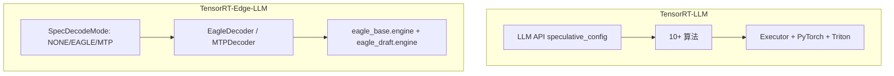

# TensorRT-LLM / TensorRT-Edge-LLM 投机解码实现分析

> 基于两仓库源码与官方文档的梳理，供 Chameleon / model_optimizer 侧参考。
> TensorRT-LLM 文档：[Speculative Decoding](https://github.com/NVIDIA/TensorRT-LLM/blob/main/docs/source/features/speculative-decoding.md)

**结论**：两个仓库**均实现了投机解码（Speculative Decoding）**，但定位与算法覆盖差异很大——TensorRT-LLM 是多算法通用栈；TensorRT-Edge-LLM 是端侧 runtime，目前仅 **EAGLE** 与 **MTP** 两条路径。

---

## 1. 投机解码基本原理

投机解码用于**低 batch、自回归 token 生成**加速：轻量 **draft** 机制一次提议多个候选 token，**target（基座）模型**在一次前向中批量验证；接受的 token 越多，等效于越少的串行前向步数。


典型收益场景：LLM decode 阶段；**不直接适用于** pi05 的 flow-matching 动作去噪环（另一套迭代语义）。

---

## 2. TensorRT-LLM：完整多算法栈

### 2.1 启用方式

通过 `LLM(..., speculative_config=...)` 或 YAML / `trtllm-serve` / `trtllm-bench` 配置。文档：`TensorRT-LLM/docs/source/features/speculative-decoding.md`。

```python
from tensorrt_llm import LLM
from tensorrt_llm.llmapi import Eagle3DecodingConfig

llm = LLM(
    "/path/to/target_model",
    speculative_config=Eagle3DecodingConfig(
        max_draft_len=3,
        speculative_model="yuhuili/EAGLE3-LLaMA3.1-Instruct-8B",
    ),
)
```

启用后，每个 request 会创建长度 `max_draft_len` 的 draft 序列；**低 batch 时**加速最明显。部分算法需 `disable_overlap_scheduler=True`。

### 2.2 支持的算法

| 算法 | 配置类 | 说明 |
|------|--------|------|
| **Draft/Target** | `DraftTargetDecodingConfig` | 任意独立 draft 模型；需与 target **同 tokenizer** |
| **EAGLE / EAGLE3** | `EagleDecodingConfig` / `Eagle3DecodingConfig` | 训练时测试式 draft；EAGLE3 支持 **dynamic tree**（`use_dynamic_tree`） |
| **MTP** | `MTPDecodingConfig` | 模型原生 Multi-Token Prediction（DeepSeek、Step-3.x 等） |
| **NGram** | `NGramDecodingConfig` | Prompt Lookup Decoding；无模型，维护 n-gram 池 |
| **Medusa** | `MedusaDecodingConfig` | 多头并行 draft（legacy 路径仍保留） |
| **PARD** | `PARDDecodingConfig` | 单次前向用 mask token **并行**预测 K 个 draft |
| **DFlash** | `DFlashDecodingConfig` | 用 target 指定层 hidden state 做 cross-attn draft |
| **SA（Suffix Automaton）** | `SADecodingConfig` 或与 EAGLE3/MTP/PARD **组合** | GPU 后缀匹配；`use_sa_spec=True` |
| **User-provided** | `UserProvidedDecodingConfig` | 自定义 `Drafter.prepare_draft_tokens` |

**SA 增强**：可与 EAGLE3 / MTP / PARD 组合，在重复文本上提高 accept rate；也可单独作为 `SADecodingConfig` 使用。

### 2.3 实现层次

| 层级 | 路径（相对 TensorRT-LLM 根） |
|------|------------------------------|
| 用户 API / 配置 | `tensorrt_llm/llmapi/llm_args.py` |
| PyTorch 运行时 | `tensorrt_llm/_torch/`（Eagle plugin、spec metadata、CUDA Graph） |
| C++ Executor | `cpp/tensorrt_llm/executor/speculativeDecodingConfig.cpp` |
| C++ Runtime | `cpp/include/tensorrt_llm/runtime/speculativeDecodingModule.h`、`speculativeDecodingMode.h` |
| 工具 | `cpp/tensorrt_llm/runtime/utils/speculativeChoicesUtils.cpp` |
| Triton 服务 | `triton_backend/inflight_batcher_llm/`（speculative 客户端与 e2e 测试） |
| 示例 | `examples/llm-api/llm_speculative_decoding.py` |
| 文档 | `docs/source/features/speculative-decoding.md` |

### 2.4 EAGLE3 Dynamic Tree（补充）

- `use_dynamic_tree=True`：树形 draft，每层可扩展多个候选（非线性链）
- 参数：`dynamic_tree_max_topK`、`max_total_draft_tokens`
- **限制**：当前不支持 sliding window attention / MLA 模型（如 DeepSeek、gpt-oss）

---

## 3. TensorRT-Edge-LLM：端侧 EAGLE + MTP

面向 **Jetson / 端侧 TensorRT engine** 的 C++ runtime；投机解码是 `DecodingStrategy` 插件，**无** NGram / Medusa / PARD 等。

### 3.1 模式枚举

`cpp/runtime/config/llmEngineConfig.h`：

```cpp
enum class SpecDecodeMode : int32_t
{
    kNONE,   // 标准自回归
    kEAGLE,  // EAGLE / EAGLE3 draft + base verify
    kMTP,    // Multi-Token Prediction（含 hybrid 模型 state scatter）
};
```

`DecoderRegistry`（`cpp/runtime/decoding/decoderRegistry.cpp`）按 `DeploymentConfig::specDecodeMode()` 选择：

| 模式 | 解码器 | `name()` |
|------|--------|----------|
| `kNONE` | `VanillaDecoder` | vanilla |
| `kEAGLE` | `EagleDecoder` | eagle |
| `kMTP` | `MTPDecoder` | mtp |

不支持时（`unsupportedReason`）或 `request.disableSpecDecode` 时**回退 vanilla**。

### 3.2 EAGLE 解码流程（`EagleDecoder`）

`cpp/runtime/decoding/eagleDecoder.cpp` 单步 decode 大致为：

1. **Draft model prefill**
2. **Construct draft proposal**（树/链提议）
3. **Base model verification**（一次 verify 多 token）
4. **Draft accept token**（接受前缀、更新 draft KV）

专用 kernel：`cpp/kernels/speculative/eagleAcceptKernels.cu`、`eagleUtilKernels.cu`。

### 3.3 MTP 解码流程（`MTPDecoder`）

- 链式 MTP draft + base verify
- Hybrid 模型（Mamba/GDN）需 **recurrent / conv state scatter**：`mtpStateScatterKernels.cu`
- 代码注释：树形提议逻辑主要在 `EagleDecoder`；MTP 偏简单链式

### 3.4 Draft 模型与导出

| 类型 | Python 模型 / 量化 | 说明 |
|------|-------------------|------|
| EAGLE3 | `tensorrt_edgellm/models/eagle3/modeling_eagle3_draft.py` | 非 HF 原生，Edge-LLM 自实现 draft |
| MTP | `tensorrt_edgellm/quantization/models/mtp_draft.py` | MTP draft 架构 |

量化 README 说明：EAGLE3 等 speculative draft 在 Edge-LLM 侧 **reimplement**，非直接拉 HF 权重即用。

### 3.5 Engine 目录布局

**EAGLE**（`experimental/server/engine_layout.py`）：

```
{eagle_engine_dir}/
    eagle_base.engine      # target / verify
    eagle_draft.engine     # draft
    base_config.json
    draft_config.json
    d2t.safetensors        # draft→target token 映射
    tokenizer.json
    ...
```

**实验性 Server**：`experimental/server/engine.py`、`api_server.py` — `has_draft_model`、`--draft-engine-dir`。

### 3.6 CI 覆盖示例

- Qwen3-1.7B + **EAGLE3** speculative decoding
- Qwen3-VL-4B + **EAGLE3**（VLM）
- Qwen3.5-0.8B **MTP**（FP16 base + MTP draft）

### 3.7 其他相关 kernel

- XQA：`kernelSrcs/xqa/` 含 speculative decoding 的 `inputSeqLen > 1` 路径
- GDN MTP decode：`kernelSrcs/gdn_cutedsl/gdn_decode_mtp.py`（多 token verify / rollback）

---

## 4. 两仓库对比

| 维度 | TensorRT-LLM | TensorRT-Edge-LLM |
|------|--------------|-------------------|
| **是否有投机解码** | ✅ | ✅ |
| **算法** | EAGLE3、MTP、NGram、PARD、DFlash、SA、Medusa、Draft/Target、自定义 | **仅 EAGLE、MTP** |
| **定位** | 数据中心 / 通用 LLM 服务、PyTorch + C++ Executor | 端侧 TRT engine、轻量 C++ runtime |
| **API** | `LLM` + `speculative_config`（Python 一等公民） | C++ `DecodingStrategy` + engine 目录；experimental HTTP server |
| **Draft 来源** | HF Hub / 本地 checkpoint / 模型内置 MTP | Edge-LLM 导出 pipeline + `eagle_*.engine` |
| **回退** | 依算法与 backend | 明确 fallback 到 `VanillaDecoder` |
| **VLM** | 通用多模态栈 | Qwen3-VL + EAGLE 等有专门 pipeline |



---

## 5. 对 Chameleon / pi05 的启示

| 点 | 说明 |
|----|------|
| **语义不匹配** | 投机解码优化的是 **离散 token 自回归 decode**；pi05 热点是 **action_expert flow-matching 去噪环**（连续动作、固定 `num_steps`），不能直接套用 EAGLE/MTP |
| **`llm_prefix` 理论可能** | 若 openpi 的 PaliGemma 前缀以 **长文本 + 多 token decode** 运行，可参考 draft+verify；需独立 draft 模型、双 engine、与 orchestrator KV 对齐 |
| **端侧参考** | TensorRT-Edge-LLM 的 `EagleDecoder` 四阶段与 engine 布局，可作为「双 engine + C++ 解码策略」的端侧范式；Chameleon 当前是 stage 级 TRT engine + `VLAOrchestrator`，未集成 speculative |
| **可借鉴架构** | `DecodingStrategy` 注册 + vanilla fallback；与 Chameleon 的 `RuntimeBackend` / `Engine.run` 插件思路类似，但需新 orchestrator 语义（token 级而非 action chunk） |

**可行性粗评**（与 `sparse_attention.md` 一致口径）：

| 方案 | 可行性 | 说明 |
|------|--------|------|
| 在 `action_expert` 上做投机解码 | 低 | 去噪步非 token AR；需新算法定义 |
| 在 `llm_prefix` 上接 Edge-LLM EAGLE | 中–低 | 需 EAGLE3 draft 训练/导出 + 改 orchestrator；pi05 前缀常只算一次，收益有限 |
| 长上下文 LLM 服务（非 pi05 MVP） | 高 | 直接用 TensorRT-LLM `speculative_config` |

---

## 6. 关键文件索引

### TensorRT-LLM

| 职责 | 路径 |
|------|------|
| 特性文档 | `docs/source/features/speculative-decoding.md` |
| 配置类 | `tensorrt_llm/llmapi/llm_args.py` |
| 示例 | `examples/llm-api/llm_speculative_decoding.py` |
| C++ 模式 | `cpp/include/tensorrt_llm/runtime/speculativeDecodingMode.h` |
| C++ 模块 | `cpp/include/tensorrt_llm/runtime/speculativeDecodingModule.h` |

### TensorRT-Edge-LLM

| 职责 | 路径 |
|------|------|
| 模式枚举 | `cpp/runtime/config/llmEngineConfig.h` |
| 解码器注册 | `cpp/runtime/decoding/decoderRegistry.cpp` |
| EAGLE | `cpp/runtime/decoding/eagleDecoder.cpp` |
| MTP | `cpp/runtime/decoding/mtpDecoder.cpp` |
| Speculative kernels | `cpp/kernels/speculative/` |
| EAGLE3 draft 模型 | `tensorrt_edgellm/models/eagle3/` |
| Engine 布局 | `experimental/server/engine_layout.py` |
| Server | `experimental/server/engine.py` |
