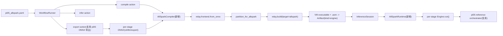
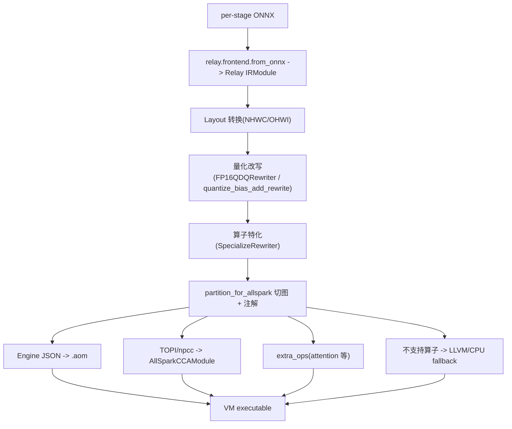

# pi05 在 AllSpark P1 上的 Chameleon 对接方案（TVM 路径）

> 本文是设计方案文档，描述如何在 Chameleon 中新增 AllSpark P1 硬件后端（经 TVM 桥接），
> 使 pi05 这类 VLA 模型可在 P1（NT3 ASIC）上部署。**本期只做架构设计，不落地实现代码。**
>
> 配套参考：`nio/docs/tvm_for_p1.md`（TVM-for-P1 全链路分析：Codegen 分层、编译期三步改写、
> `partition_for_allspark`、回退与多路径执行、VM Runtime 内存/Stream/P1 接口映射）。

---

## 0. 背景与结论

### 0.1 pi05 是什么

pi05（π0.5，Physical Intelligence）是一个 3.3B 参数的 VLA（Vision-Language-Action）模型，
三段式层级结构：

| Stage | 子模型 | 规模 | 计算特征 |
|-------|--------|------|----------|
| 视觉编码 | SigLIP So400m/14 ViT | ~400M | compute-bound，每相机 256 patch token |
| 语言前缀 | PaliGemma（Gemma 2B backbone） | ~2.6B | prefill，compute + bandwidth bound，写 KV cache |
| 动作专家 | Action Expert（Gemma-300m） | ~300M | flow-matching 去噪环（~10 步），读 KV cache |

推理时：ViT 出图像 token → PaliGemma 吃 (图像 token + 文本指令 + 机器人关节状态) 写 KV cache →
Action Expert 从噪声向量出发，用 cross-attention 对 KV cache 做 ~10 步 flow-matching 迭代，
输出约 50 步的连续动作 trajectory。关键算子特征：bidirectional attention、AdaRMSNorm（按去噪步条件化的归一化）。

### 0.2 核心结论：这是"加硬件后端"，不是"加模型"

pi05 已是 Chameleon 内置模型。Chameleon 的 `pi05` 架构已定义三 stage：

- `vit` → `llm_prefix` → `action_expert`，默认 orchestrator `pi05`（[chameleon/runtime/orchestrators/pi05/reference.py](../chameleon/runtime/orchestrators/pi05/reference.py)）

因此 **P1 接入的本质是新增一个硬件目标后端**，复用 Chameleon 现成的三层可插拔扩展点
（与已 production-ready 的 `tensorrt` 后端同构），而不是新增一个模型。

### 0.3 为什么走 TVM 桥接

Chameleon 的中性 IR 是 **ONNX**（per-stage 导出）；TVM-for-P1 从 Relay/Relax 经
`partition_for_allspark` 切图、注解，最终产出 `.aom`（AllSpark Object Model）。
两者通过 `tvm.relay.frontend.from_onnx` 天然衔接，无需重写 P1 的算子映射/Codegen，
直接复用 `nio/docs/tvm_for_p1.md` 描述的整条 TVM-for-P1 工具链（Engine JSON / TOPI-npcc /
extra_ops / LLVM fallback / AllSpark CCA VM Runtime）。

---

## 1. Chameleon 可插拔扩展点回顾

Chameleon 采用分层注册表 + Artifact 契约。新增硬件后端需要挂载到以下三个一等公民扩展点
（均为 import-time 注册）：

| 层 | 抽象基类 | 注册函数 | 注册表 | 文件 |
|----|----------|----------|--------|------|
| 平台 | `PlatformSpec` | `register_platform` | `PLATFORM_REGISTRY` | [chameleon/core/platform.py](../chameleon/core/platform.py) |
| 编译 | `CompilerBackend` | `register_compiler` | `COMPILER_REGISTRY` | [chameleon/compile/base.py](../chameleon/compile/base.py) |
| 运行时 | `RuntimeBackend` + `Engine` | `register_runtime` | `RUNTIME_REGISTRY` | [chameleon/runtime/base.py](../chameleon/runtime/base.py) |

控制流（多 stage 去噪/CFG/KV handoff）由 **Orchestrator** 承担，与 RuntimeBackend（单 stage `run()`）
解耦；`InferenceSession` 按 `ArchitectureSpec.stage_names` 逐 stage 选 runtime、加载 engine，再交给
orchestrator 串联（[chameleon/runtime/orchestrator/session.py](../chameleon/runtime/orchestrator/session.py)）。

> 现状：`tensorrt` 是唯一端到端 production-ready 的后端；`horizon/tvm/openvino` 仅有 compiler scaffold，
> 无对应 runtime。本方案要把 `allspark` 做成与 `tensorrt` 同级的端到端栈。

---

## 2. 端到端数据流



编译期内部（对应 `tvm_for_p1.md` 的三步改写）：



---

## 3. 新增/改动 touchpoint（按 cosmos3 接入模式对齐）

下表是完整 checklist，参考 cosmos3 接入时的同构 touchpoint。

### 3.1 平台注册

在 [chameleon/core/platform.py](../chameleon/core/platform.py) 的 `_register_builtin_platforms()`
新增：

```python
PlatformSpec(
    name="nio_p1",
    vendor="nio",
    device="allspark",
    dtypes=("fp16", "int8"),   # P1 偏好 FP16；INT8 走 QNN
    compiler="allspark",
    runtime="allspark",
    kernel_tag="p1",
    torch_device="cpu",        # orchestrator 侧标量/控制流仍在 host
    description="NIO AllSpark P1 (NT3 ASIC), via TVM-for-P1.",
    aliases=("allspark_p1", "p1"),
)
```

- `dtypes` 对齐 TVM-for-P1 的 FP16 偏好（见 `tvm_for_p1.md` 量化改写章节）。
- `device="allspark"` 对应 TVM 的 `kDLAllSpark` 设备类型。

### 3.2 编译后端 `allspark`（核心）

新增 `chameleon/compile/allspark/backend.py`，实现 `CompilerBackend`
（镜像 [chameleon/compile/tensorrt/backend.py](../chameleon/compile/tensorrt/backend.py)）：

- `name = "allspark"`
- `available()`：探测 `tvm` 与 AllSpark SDK（`libruntime.so` / npcc）是否可导入/可用；
  不可用时 **不报错**，而是给出清晰的 on-device 构建说明（完全沿用 TRT 的 unavailable 分支写法），
  这样 dry-run / plan 仍可在无 SDK 的开发机上跑通。
- `compile(graph, quant_meta, ctx, cfg)`：
  1. 校验 `graph.kind == "onnx"` 且有 `graph.path`；
  2. `mod, params = tvm.relay.frontend.from_onnx(onnx_model, shape_dict)`；
  3. `mod = partition_for_allspark(mod, params, ...)`（Relay 路径，见 `tvm_for_p1.md`）；
  4. `with tvm.transform.PassContext(...): exe = relay.build(mod, target="allspark", params=params)`；
  5. 序列化 VM executable（`.so` + `.json` + `.params`）与底层 `.aom`，
     返回 `Artifact(kind="engine", stage=..., platform="nio_p1", path=...)`。
- 通过 `cfg`（build_cfg dict）暴露关键编译选项：
  - `precision`（默认 `fp16`，对接 `FP16QDQRewriter`）
  - `layout`（NHWC / OHWI）
  - `allow_llvm_fallback`（不支持算子回退 host CPU）
  - workspace 策略（`kSeparateInitAtBegin` / `kNotUnify`）
  - `extra_ops`（attention 等自定义算子开关）
- `register_compiler(AllSparkCompiler())`，并在 `chameleon/compile/__init__.py` import 触发注册。

> 注：可保留现有 `tvm` scaffold 名不变，新建 `allspark` 后端专指 P1 目标，
> 避免与通用 AMD/CPU TVM 路径混淆。

### 3.3 运行时后端 `allspark`

新增 `chameleon/runtime/allspark/backend.py`，实现 `RuntimeBackend` + `Engine`
（镜像 [chameleon/runtime/tensorrt/backend.py](../chameleon/runtime/tensorrt/backend.py)）：

- `AllSparkRuntime(RuntimeBackend)`，`name = "allspark"`：
  - `load(artifact, ctx)`：加载 VM executable，构造
    `tvm.runtime.vm.VirtualMachine(exe, device=tvm.allspark())`（`kDLAllSpark`），
    返回 `AllSparkEngine`。
- `AllSparkEngine(Engine)`：
  - `run(inputs)`：将 numpy/torch 输入 → `tvm.nd.array(x, device=allspark)`
    （512B 对齐；`TVM_VM_NO_PAGEABLE=true` 时 host 内存落 `kDLAllSparkHost` pinned 以利 DMA），
    调用 `vm["main"](*args)`，把输出 NDArray → numpy，组织成 `{"output": ...}`，
    与 orchestrator 期望的输出名对齐。
  - I/O zero-copy：直接把 NDArray 指针交给 Engine，避免多余拷贝（见 `tvm_for_p1.md` IO 绑定）。
- `register_runtime(AllSparkRuntime())`，在 [chameleon/runtime/__init__.py](../chameleon/runtime/__init__.py)
  import 触发注册。

### 3.4 控制流：复用 pi05 reference orchestrator

pi05 的 stage 链与去噪控制流已实现，**无需新写 orchestrator**：

```python
# chameleon/runtime/orchestrators/pi05/reference.py（现状）
img_tokens   = engines["vit"].run({"images": images})["output"]
prefix_memory = engines["llm_prefix"].run({"img_tokens": ..., "lang_tokens": ...})["output"]
# flow-matching 去噪环：
while time >= -dt / 2:
    time_emb = create_sinusoidal_pos_embedding(t, time_dim, ...)
    v_t = engines["action_expert"].run(
        {"state": state, "prefix_memory": prefix_memory, "x_t": x_t, "time_emb": time_emb}
    )["output"]
    x_t = x_t + dt * v_t
```

- `vit / llm_prefix / action_expert` 各自是一个 AllSpark Engine；去噪环、AdaRMSNorm 的
  time embedding、Euler 更新仍在 Python orchestrator 中（与 TRT/reference 路径一致）。
- 选中方式：`platform: nio_p1` 时平台默认 `runtime=allspark`；或显式
  `stage_runtimes={"vit":"allspark","llm_prefix":"allspark","action_expert":"allspark"}`。
- `Pi05ReferenceOrchestrator.requires_stage_engines=True`（默认），`InferenceSession` 会
  自动按 stage 加载 AllSpark engine。
- **关键约束**：AllSpark Engine 的输出 dict key 必须暴露为 `"output"`，
  且各 stage 的输入名（`images` / `img_tokens` / `lang_tokens` / `state` / `prefix_memory` /
  `x_t` / `time_emb`）须与 ONNX 导出时的 `input_names` 一致，否则要在 Engine 侧做名字映射
  （参考 cosmos3_trt pipeline 的 `_take()` 兼容写法）。

### 3.5 部署路径（真实权重，可选 / 后续阶段）

- 复用现成 pi05 ONNX 导出 [chameleon/deploy/pi05_openpi.py](../chameleon/deploy/pi05_openpi.py)
  与 `deploy/pi05/`（stages：`vit / llm / expert / denoise`）。
- 在 [chameleon/deploy/backends.py](../chameleon/deploy/backends.py) 新增
  `_ALLSPARK_BACKENDS = frozenset({"allspark", "pi05_allspark"})` 与
  `is_allspark_deploy_backend()`。
- 新增 `run_pi05_allspark_build()`（镜像 `run_pi05_build` 的 TRT 构建，把 `trt_build.build_engine`
  替换为调用 `AllSparkCompiler.compile`）。
- 在 [chameleon/api.py](../chameleon/api.py) 的 `run_export` / `run_deploy_build` 增加 allspark 分支；
  在 [chameleon/workflows/actions.py](../chameleon/workflows/actions.py) 的 compile action 路由中
  增加 `is_allspark_deploy_backend(backend)` 判定。

### 3.6 配置、build_cfg、依赖、测试

- `configs/pi05_allspark.yaml`：
  ```yaml
  architecture: pi05
  model: pi05
  platform: nio_p1
  actions: [export, compile, infer]
  deploy:
    backend: reference   # 或 pi05_allspark（真实权重）
  compile:
    - stage: vit
      options:
        build_cfg: configs/build_configs/pi05_vit_allspark_build_cfg.py
    - stage: llm_prefix
      options:
        build_cfg: configs/build_configs/pi05_llm_allspark_build_cfg.py
    - stage: action_expert
      options:
        build_cfg: configs/build_configs/pi05_expert_allspark_build_cfg.py
  infer:
    use_compiled_engines: true
  ```
- `configs/build_configs/pi05_*_allspark_build_cfg.py`：每 stage 一个 `build_cfg` dict
  （precision、固定 shape、layout、allow_llvm_fallback），形状须与 ONNX 导出 / orchestrator 一致。
- `pyproject.toml` 增加 optional extra `[allspark]`（`apache-tvm` + AllSpark SDK 安装说明）。
- `tests/e2e/workflows/test_pi05_allspark_e2e.py`：
  - `test_dry_run_plan`：plan 含 vit/llm_prefix/action_expert，无需 SDK。
  - `test_onnx_to_aom`（slow，SDK 可用时）：单 stage ONNX → `.aom` → 推理 smoke。

---

## 4. pi05 专有难点与 P1 落点

这些是 pi05 区别于普通 CNN 的硬骨头，决定了哪些算子走 P1 哪条 Codegen 路径
（对接 `tvm_for_p1.md` 的"回退与多路径执行"章节）。

### 4.1 算子归属（Codegen 多路径）

| 算子类型 | 出现位置 | P1 落点 |
|----------|----------|---------|
| Conv / Dense / MatMul / QNN | SigLIP patch embed、Gemma FFN/投影 | Engine JSON → `.aom`（主路径） |
| LayerNorm / RMSNorm / AdaRMSNorm | 全模型 | 优先 Engine；不支持则 TOPI/npcc 或 orchestrator 侧 |
| Attention（含 bidirectional） | ViT、PaliGemma、Action Expert cross-attn | extra_ops 自定义算子（推荐）或 TOPI/npcc |
| flow-matching Euler 更新 / 采样 | 去噪环 | orchestrator 侧（host），与 TRT 路径一致 |
| 不支持/长尾算子 | 边角 | `allow_llvm_fallback=True` → host CPU |

### 4.2 量化策略

- P1 偏好 FP16：编译期 `FP16QDQRewriter`（FP32 Q/DQ → FP16 Q/DQ + `annotation.cast_hint`）
  与 `quantize_bias_add_rewrite`（float bias_add → int32 量化 bias_add）。
- SigLIP / Gemma 的大矩阵乘走 FP16（带宽 + 融合收益）；scale 计算域保留 FP32 以控精度。
- INT8（QNN）作为可选，针对 compute-bound 的 ViT 评估收益。
- 精度风险：FP16 路径需逐 stage 与 PyTorch reference 比对（见 6.3）。

### 4.3 LLM KV-cache handoff（最大难点）

PaliGemma 写 KV cache → Action Expert 读同一份 cache（两个 expert 共享 `num_kv_heads / head_dim`）。

- **本期（scaffold/固定 shape）**：把 `llm_prefix` 当作"固定 seq len 的 prefill 整体 ONNX"，
  其输出 `prefix_memory` 即承载 KV 信息的张量，直接作为 `action_expert` 的输入，
  cross-attention 在 action_expert 子图内部完成。规避动态 KV-cache 管理。
- **后续（生产）**：动态 seq len + Paged KV Cache 走 TVM **Relax** 路径
  （`tvm_for_p1.md` 提到的 Relax VM / PagedKVCache），需要单独建模，列为 Roadmap 阶段 5。

### 4.4 bidirectional attention / AdaRMSNorm

- pi05 对 image patch / 文本 prompt / 连续 action token 使用 bidirectional attention（非因果），
  需确认 attention extra_op 支持非因果 mask。
- AdaRMSNorm 按去噪步条件化：time embedding 在 orchestrator 侧算好后作为输入喂给 action_expert，
  归一化算子在子图内或特化算子实现。先验证数值对齐，再谈性能。

---

## 5. 分阶段 Roadmap

| 阶段 | 目标 | 验收 |
|------|------|------|
| 1 | 平台 + 编译/运行时后端骨架；单个 ONNX 算子 → `.aom` → 推理 | 在 P1（或 x86 jarvis 模拟器）跑通最小算子 |
| 2 | 接通 `vit`（纯 ViT，编译友好） | vit stage 端到端，输出与 PyTorch 对齐 |
| 3 | 接通 `llm_prefix`（固定 seq len，FP16） | prefix_memory 数值对齐 |
| 4 | 接通 `action_expert` + flow-matching 去噪环（复用 reference orchestrator） | 端到端 action chunk，full e2e 测试通过 |
| 5 | 真实 openpi 权重 + 动态 KV-cache（Relax 路径） | 真实权重端到端部署 |

最小可运行优先级：阶段 1 → 2，先证明 ONNX→Relay→partition_for_allspark→.aom→VM 这条桥接成立，
再逐 stage 接通。

---

## 6. 风险与依赖

### 6.1 工具链可用性
AllSpark SDK / npcc / TVM-for-P1 toolchain 需在构建环境可用；否则编译后端走"说明性 stub"
（同 TRT 的 unavailable 分支），保证 dry-run / plan 在普通开发机不阻塞。

### 6.2 ONNX 算子覆盖度
SigLIP / Gemma 中部分算子（GeLU 变体、RoPE、特殊 attention mask）可能需 extra_ops 或
LLVM fallback，需逐 stage 用 `partition_for_allspark` 验证切图覆盖率，统计 fallback 比例。

### 6.3 数值精度回归
FP16 路径需与 PyTorch reference 逐 stage 比对。建议复用 evaluate 的 `pt_trt_compare` 思路，
新增 `pt_allspark_compare` policy runner（[chameleon/evaluate/](../chameleon/evaluate/)），
在 LeRobot 数据上对比 action 误差。

### 6.4 stage I/O 契约漂移
Engine 输出名 / 输入名须与 orchestrator + ONNX 导出严格一致；build_cfg 的固定 shape
须与 `adapter.example_observation` / `stage_example_inputs` 同源，避免 export↔compile 漂移
（参考 cosmos3 用 `shapes.py` 集中常量的做法）。

---

## 7. 关键文件索引（落地时的挂载点）

| 作用 | 文件 | 改动 |
|------|------|------|
| 平台注册 | [chameleon/core/platform.py](../chameleon/core/platform.py) | 新增 `nio_p1` |
| 编译后端基类 | [chameleon/compile/base.py](../chameleon/compile/base.py) | 复用 |
| 编译后端实现 | `chameleon/compile/allspark/backend.py` | 新建 |
| 运行时基类 | [chameleon/runtime/base.py](../chameleon/runtime/base.py) | 复用 |
| 运行时实现 | `chameleon/runtime/allspark/backend.py` | 新建 |
| Orchestrator | [chameleon/runtime/orchestrators/pi05/reference.py](../chameleon/runtime/orchestrators/pi05/reference.py) | 复用 |
| Session 装配 | [chameleon/runtime/orchestrator/session.py](../chameleon/runtime/orchestrator/session.py) | 复用 |
| 部署判定 | [chameleon/deploy/backends.py](../chameleon/deploy/backends.py) | 新增 allspark 分支 |
| pi05 导出 | [chameleon/deploy/pi05_openpi.py](../chameleon/deploy/pi05_openpi.py) | 复用 |
| API 分发 | [chameleon/api.py](../chameleon/api.py) | 新增 allspark 分支 |
| Workflow | [chameleon/workflows/actions.py](../chameleon/workflows/actions.py) | 新增 allspark 路由 |
| 配置 | `configs/pi05_allspark.yaml` + `configs/build_configs/pi05_*_allspark_build_cfg.py` | 新建 |
| 测试 | `tests/e2e/workflows/test_pi05_allspark_e2e.py` | 新建 |
| 依赖 | [pyproject.toml](../pyproject.toml) | 新增 `[allspark]` extra |

> TVM-for-P1 侧的 Codegen / VM Runtime / AllSpark CCA 细节，全部见 `nio/docs/tvm_for_p1.md`，
> 本文不重复。
