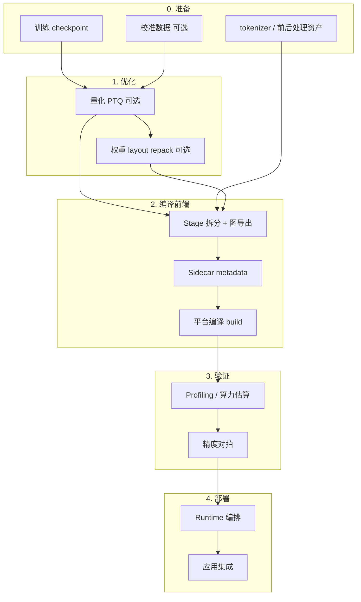
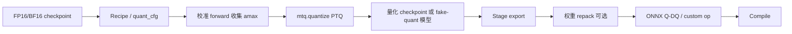
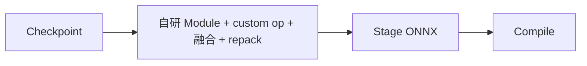
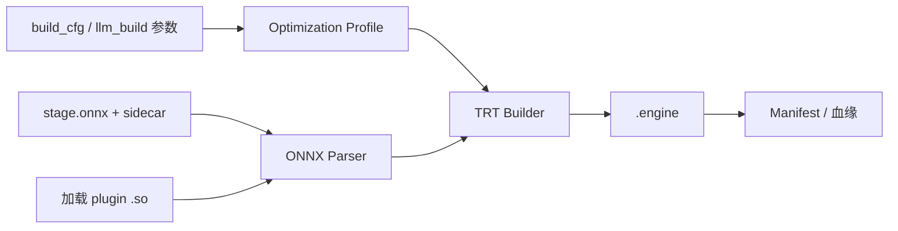
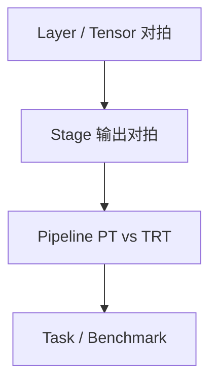
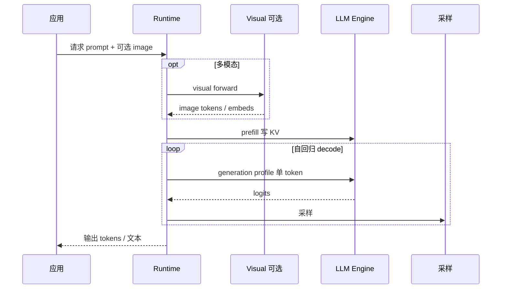
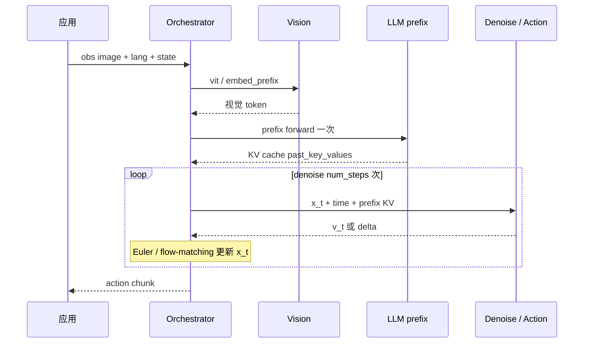

# 端侧模型部署一般流程

本文总结 **LLM / VLM / VLA** 在嵌入式设备（Jetson Orin、Drive Thor、边缘 GPU、BPU 等）上的 **通用部署流水线**，不绑定具体工具链。文中 **§3.1 量化 · §3.2 导出/重写 · §3.3 编译 · §3.5 精度验证** 可独立阅读；三项目（TensorRT-Edge-LLM、model_optimizer、Chamleon）对照见各节附录表。

---

## 1. 与数据中心 serving 的根本差异

| 维度 | 端侧 onboard | 数据中心 serving |
|------|--------------|------------------|
| Batch | **≈1**，形状可静态化 | 连续 batching、动态并发 |
| 内存 | 8–32GB 统一内存，须 **可预算** | 大显存 + paged KV 池化 |
| 延迟 | 单次推理 **尾延迟** 优先 | 吞吐、多租户优先 |
| 编译 | **AOT**（TRT engine / 厂商 blob） | 常保留 PyTorch / 动态图 |
| Runtime | **C++ 为主**，Python 仅开发态 | Python API + 调度器 |
| KV | **Linear / 固定槽位** 或 stage 间 handoff | Paged attention、跨请求复用 |

**不宜照搬 onboard 的路径**：vLLM/sglang 式 continuous batching、TensorRT-LLM paged KV + in-flight batching、动态 seq len 多用户调度。

---

## 2. 通用流水线总览



**硬分离原则**（业界常见做法）：

- **Host / 开发机**：量化、图导出、部分编译（视平台而定）
- **目标板**：最终 engine build（SM / BPU 精确匹配）、集成测试、OTA 发布
- **Sidecar 与 engine 分离**：tokenizer、embedding、quant config 等 **不进** 或 **不全进** 编译产物，便于热更新

---

## 3. 各阶段说明

### 3.0 准备

| 输入 | 说明 |
|------|------|
| **Checkpoint** | FP16/BF16 或预量化权重（safetensors 等） |
| **模型配置** | 层数、head、RoPE、多模态子模块 |
| **前后处理资产** | tokenizer、chat template、norm stats（VLA）、图像 resize 规则 |
| **校准集** | 量化用代表性样本（文本 / 图文 / 机器人 observation） |

产出：可加载的 **训练语义一致** 的推理输入规范（I/O 契约）。

---

### 3.1 量化（可选）

**目的**：在精度可接受前提下，压缩 **权重 / 激活 / KV**，使模型放进显存并降低带宽。

| 对象 | 典型手段 | 主要收益 |
|------|----------|----------|
| 权重 | INT4 AWQ、NVFP4、FP8 | 显存、权重带宽 |
| 激活 | NVFP4、FP8 W8A8 | 算力与激活带宽 |
| KV Cache | FP8 KV | 长上下文显存与 attention 带宽 |
| 大表 | FP8 embedding、缩词表 | 词表显存 |

端侧量化的核心设计原则：**量化数学（PTQ 校准）与 IR 导出 / kernel layout 解耦**——先得到带 scale 的量化 checkpoint 或 fake-quant 模型，再在 export 阶段按 metadata **选择 Linear 实现类**、emit 对应 ONNX 子图，必要时 **repack** 权重字节序。详见下文 §3.1.3–§3.1.5。



#### 3.1.1 通用 PTQ 流水线

无论具体工具链，端侧 **训练后量化（PTQ）** 通常遵循固定步骤：

| 步骤 | 动作 | 产出 |
|------|------|------|
| **1. 选 recipe** | 指定算法（max / AWQ / SmoothQuant 等）与目标格式（FP8、INT4、NVFP4…） | `quant_cfg` 或 CLI 参数 |
| **2. 准备校准集** | 代表性样本（文本 / 图文 / 机器人 observation）；**VLM 须含图像** 才能标定 visual 激活 | `DataLoader` |
| **3. 结构替换** | 将 `nn.Linear` 等替换为带 `TensorQuantizer` 的量化模块，按 recipe 配置 bit/axis/block | fake-quant 图 |
| **4. 校准 forward** | 跑 `forward_loop`，收集各层 **amax** 或 AWQ/SQ 专用统计量 | scale / zero-point |
| **5. 固化量化参数** | 执行 `algorithm`（`max`、`awq_lite`、`smoothquant`…） | 量化权重 + metadata |
| **6. 导出 checkpoint**（可选） | `export_hf_checkpoint` → safetensors + `hf_quant_config.json` | 可 OTA 的量化权重 |
| **7. 下游 export** | trace ONNX；NVFP4 另做 **ONNX 图后处理**（见 §3.1.8）；Edge-LLM 在 export **前** 做 PyTorch repack | `stage.onnx` |

**注意**：步骤 1–6 在 **Host / GPU 开发机**完成，**不依赖** TRT plugin；步骤 7 才与 §3.2 模型重写、custom op 交汇。

#### 3.1.2 ModelOpt 两阶段机制（业界主流实现）

Workspace 内 **TensorRT-Edge-LLM** 与 **model_optimizer** 均基于 **NVIDIA Model Optimizer（ModelOpt）**。`mtq.quantize(model, config, forward_loop)` 在语义上固定为两阶段：

```text
阶段 A — apply_mode("quantize"):
  nn.Linear → QuantLinear + TensorQuantizer（weight / input / output）
  set_quantizer_by_cfg(quant_cfg)   # 通配符匹配各量化器属性

阶段 B — calibrate(algorithm):
  forward_loop 跑校准集 → 收集 amax → 固化 scale → 开启 fake quant 仿真
```

`quant_cfg` 是支持 **多种方案并存** 的核心数据结构（见 §3.1.3）。`algorithm` 常见取值：

| algorithm | 典型格式 | 校准特点 |
|-----------|----------|----------|
| `max` | FP8、NVFP4、FP8 KV | per-tensor / per-block amax |
| `awq_lite` | INT4 AWQ W4A16 | 搜索 `pre_quant_scale`，保精度 |
| `smoothquant` | INT8 W8A8 | 平滑激活离群值后量化 |

校准 forward 的 **根模块** 有约束：含 `*_bmm_quantizer`（FP8 KV）时，`mtq.quantize` 的根须为 **HuggingFace `PreTrainedModel`**，否则 attention BMM 量化器不会注册——pi0.5 的 `Pi05DenoiseStep` 等 wrapper 须把 `gemma_expert` 作为 quantize root，校准经 `forward_context` 走完整 denoise forward（见 §3.1.5）。

#### 3.1.3 如何在模型中支持不同量化方案（三层架构）

多种量化方案并非靠 `if/else` 散落在业务代码，而是通过 **recipe → 模块分发 → IR 发射** 三层解耦：

```text
┌─────────────────────────────────────────────────────────────┐
│  Layer 1 — Recipe（quant_cfg）                               │
│  通配符 / 模块路径 → QuantizerAttributeConfig                  │
│  例：*weight_quantizer、*layers.11.*.input_quantizer           │
└──────────────────────────┬──────────────────────────────────┘
                           ▼
┌─────────────────────────────────────────────────────────────┐
│  Layer 2 — 模块分发（export 时选 Linear 类）                  │
│  Edge-LLM: make_linear(module_name, config) → FP8/NVFP4/AWQ… │
│  ModelOpt: QuantLinear.forward → TensorQuantizer fake quant   │
└──────────────────────────┬──────────────────────────────────┘
                           ▼
┌─────────────────────────────────────────────────────────────┐
│  Layer 3 — IR / Kernel（ONNX 子图 + plugin）                  │
│  FP8: QuantizeLinear + DQ + MatMul                          │
│  NVFP4: nvfp4_act_qdq + nvfp4_dequantize + MatMul            │
│  INT4: int4_groupwise_gemm custom op                         │
│  FP8 KV: attention_plugin(enable_fp8_kv_cache=True)          │
└─────────────────────────────────────────────────────────────┘
```

##### （1）Recipe 层：`quant_cfg` 通配符与子模块覆盖

`quant_cfg` 是 `模块名模式 → 量化器属性` 的字典。键支持通配（`*`）、层级路径（`*layers.{i}.mlp.gate_proj.weight_quantizer`）、以及 **按类名** 匹配。`"default"` 为未命中时的默认。

**支持多方案的方式**：

| 手段 | 示例 | 效果 |
|------|------|------|
| **全局 recipe** | `NVFP4_DEFAULT_CFG`、`FP8_DEFAULT_CFG` | 主体统一 W4A4 / W8A8 |
| **子模块禁用** | `"lm_head": {"enable": False}` | LM head 保持 FP16 |
| **逐层覆盖** | `*layers.11-17.*` → FP8 quantizer | NVFP4 body + 高层 FP8 混合 |
| **按算子跳过** | denoise：`action_in_proj.*_quantizer` → disable | 时间/动作投影保持 FP32 |
| **KV 独立 merge** | `update_quant_cfg_with_kv_cache_quant` + `FP8_KV_CFG` | 权重量化与 KV 量化正交组合 |
| **AdaRMS / norm** | `input_layernorm` / `post_attention_layernorm` → disable | 纯 RMSNorm 无量化器；AdaRMS 的 `dense` 走 Linear 规则 |

model_optimizer 在 `config/quant/*.py` 维护各 stage 的 recipe 文件（如 `llm_quant_nvfp4_cfg.py`、`denoise_quant_fp8_cfg.py`）；CLI `model-opt quantize --quantize_cfg <file>` 加载后传给各 stage 的 `Model.quantize()`。

##### （2）模块分发层：按 metadata 实例化不同 Linear

**TensorRT-Edge-LLM** 在 **自研 Module 树** 构建时用 `make_linear(config, in, out, module_name)` 分发：

```text
module_quant_type(module_name, config)
  ├─ quant.excluded          → FP16Linear
  ├─ layer_overrides[name]   → 覆盖 dominant quant_type（混合精度）
  └─ quant.quant_type        → FP8 / NVFP4 / AWQ / GPTQ / MXFP8 / INT8SQ …
```

每种 `*Linear` 的 `forward()` **故意 emit** 与 TRT 融合路径匹配的子图（调用 `ops.py` 中的 custom op 桩）。checkpoint 的 `hf_quant_config.json` 驱动 `ModelConfig.quant`，export 时 **无需再跑 PTQ**。

**model_optimizer（pi0.5）** 在 export 前仍用 **HF + ModelOpt `QuantLinear`**：量化后 `set_dynamic_quant(model, "bf16"|"fp16")` 为 NVFP4 激活 quantizer 设置 `_trt_high_precision_dtype` 与 `_onnx_quantizer_type`（动态激活 / 静态权重），使 ONNX QDQ 与 TRT 解析一致。`embed_prefix` 导出前另有 `_patch_modelopt_quantizers_trt_hp_for_onnx`，避免 FP8 符号与 TRT 高精度 dtype 冲突。

##### （3）IR / Export 层：量化方案如何进入 ONNX

| 方案 | PyTorch 侧 | ONNX / TRT 侧 | 额外后处理 |
|------|------------|---------------|------------|
| **FP8 W8A8** | `TensorQuantizer` fake quant | 标准 `QuantizeLinear` + `DQ` + `MatMul` | `set_dynamic_quant` |
| **NVFP4 W4A4** | block FP4 + FP8 scale（ModelOpt `QuantLinear` 或 Edge `NVFP4Linear`） | `nvfp4_act_qdq` / `nvfp4_dequantize` custom op，或两级 `DequantizeLinear` | **MO 路径**：export 后 `fp4qdq_to_2dq`（**ONNX 图改写**，见 §3.1.8）；**Edge 路径**：load 后 `apply_all_repacking`（**PyTorch 权重 layout**，见 §3.1.8） |
| **INT4 AWQ W4A16** | AWQ `pre_quant_scale` | `int4_groupwise_gemm` custom op | `repacking.py` nibble layout |
| **FP8 KV** | `*_bmm_quantizer` on HF attention | `attention_plugin(enable_fp8_kv_cache=True)` | quantize root 须为 PreTrainedModel |
| **FP8 Embedding** | 不在 PTQ 内 | runtime lookup | `lang_embedding.safetensors` sidecar |

**预量化社区权重**（AWQ/GPTQ/ModelOpt 已量化 checkpoint）：跳过步骤 3–5，export 时直接 `GPTQLinear` / `AWQLinear` 加载 + repack。

#### 3.1.4 混合精度与组件级组合

端侧常见 **同一模型内多种精度并存**，通过 recipe 与 metadata 组合实现，而非单一全局 bit-width：

| 组件 | 可独立配置 | 典型组合 |
|------|------------|----------|
| **Backbone** | fp8 / int4_awq / nvfp4 / mxfp8 / int8_sq | Thor：`nvfp4` 主体 |
| **LM head** | 可与 backbone 不同 | `nvfp4` body + `fp8` head（精度敏感） |
| **KV cache** | `fp8`（与权重正交） | `nvfp4` + `fp8` KV（长 context） |
| **Visual / Audio tower** | `fp8` | VLM：语言 NVFP4 + 视觉 FP8 |
| **Embedding** | export 阶段 sidecar | FP8 词表，不进 engine |
| **Expert / denoise 投影** | per-module disable | expert FP8 + `action_*` FP32 |

**平台约束**：Jetson Orin 以 FP16 / INT8 / INT4 为主；**FP8 / NVFP4 / MXFP8 需 Blackwell 级（Thor）** Tensor Core 路径。

**LM head 配置陷阱**：在 `layer_overrides` 里对 lm_head 写 `"default": {"enable": False}` 会 **覆盖** body 已 enable 的 quantizer（历史 bug）；应只对 `lm_head` 路径显式设精度。

#### 3.1.5 量化与 Export 的衔接（pi0.5 要点）

各 stage 的 `Model.quantize(quant_cfg, calib_data, export_dir)` 遵循统一模式：

```text
calib_dataloader = get_calibrate_dataset(calib_data)
quantize_model(root_module, quant_cfg, calib_dataloader, forward_context=...)
set_dynamic_quant(self, dynamic_quant_dtype)
export(export_dir)                    # trace ONNX
[NVFP4, MO] fp4qdq_to_2dq(onnx)       # ONNX 图后处理，非 PyTorch repack（§3.1.8）
[denoise] apply_denoise_onnx_post_export_patches
```

| Stage | quantize root | 校准 forward | 特殊处理 |
|-------|---------------|--------------|----------|
| **llm** | `GemmaModel`（HF） | `model(**batch)` | AWQ 标定暂转 fp32；FP8 KV 需 HF root |
| **expert** | `gemma_expert` | expert forward | 同 llm |
| **denoise** | `gemma_expert` 或整 `Pi05DenoiseStep` | 经 `forward_context` 完整 denoise | FP8 KV → expert root；AdaRMS 预计算：**校准关、导出开** |
| **vit / embed_prefix** | SigLIP 子模块 | 图文样本 | vision quant conv 禁 input quant |

**FlashRT 路径**（`native_flashrt_decoder`）：不走 TRT denoise ONNX 量化链，而用 **离线 `NativeDecoderStatsCollector`** 收集激活 scale → `NativeDecoderQuantSpec` JSON，供手写 FVK 静态 FP8 布局（属 runtime/compile 侧，见 §3.2.5 附录）。

#### 3.1.6 附录：三项目量化实现对照

| 维度 | TensorRT-Edge-LLM | model_optimizer（pi0.5） | Chamleon |
|------|-------------------|--------------------------|----------|
| **PTQ 入口** | `tensorrt-edgellm-quantize` | `model-opt quantize --quantize_cfg` | `chameleon quantize`（`QuantMethod` 插件：`int8`/`fp8`/`nvfp4`/`int4_awq` 等 6 种） |
| **底层引擎** | ModelOpt `mtq.quantize` | 同左（`quantization_utils.quantize_model`） | `quantization/methods/modelopt_ptq.py` 封装 |
| **Recipe 定义** | `quantization_configs.py` + CLI | `config/quant/*.py` per stage | YAML `quantize` step + method 名 |
| **模块分发** | 自研 `make_linear` → 8 种 Linear | HF `QuantLinear` + `set_dynamic_quant` | 委托 adapter + ModelOpt PTQ |
| **混合精度** | `QuantConfig.layer_overrides` + `module_quant_type` | `quant_cfg` 逐层通配覆盖 | 随 method / YAML |
| **KV 量化** | `kv_cache_quant=fp8` + attention plugin flag | `FP8_KV_CFG` merge 进 quant_cfg | 随 method 配置 |
| **Embedding FP8** | export `--fp8-embedding` | `fp8_lang_embedding` sidecar | 未默认接入 |
| **Export 后处理** | export 前 PyTorch `repacking.py`；图内 custom op / 标准 DQ | export 后 `fp4qdq_to_2dq` + denoise dtype patch | 随 pi05 deploy 路径 |
| **预量化权重** | AWQ/GPTQ/ModelOpt 直接 load | 同左 | — |
| **特殊模型** | EAGLE/MTP draft、Phi4MM、Qwen3-ASR joint | pi0.5 分 stage；AdaRMS 校准/导出分叉 | 薄编排，无量化自研 |

**与 §3.2 模型重写的关系**：量化决定 **checkpoint 里权重的数值表示与 scale**；模型重写决定 **ONNX 里出现哪些算子节点**。二者在 export 交汇：`make_linear` / `QuantLinear` 的 `forward()` 必须把量化数学 **翻译成** TRT 可融合的 Q-DQ 子图或 custom op——因此 §3.2.2（4）量化感知 Linear 与 §3.1.3（2）模块分发是同一链路的两侧。

#### 3.1.7 案例深入：pi0.5 denoise 的 FP8 recipe 如何定制

以 `model_optimizer/config/quant/denoise_quant_fp8_cfg.py` 为例，说明 **Layer 1（recipe）** 如何在单 stage 内混用多种精度策略：

```python
# 全局：FP8 W8A8（ModelOpt FP8_DEFAULT_CFG）
QUANT_CFG = FP8_DEFAULT_CFG

# 整类 norm 不参与量化（无 QuantLinear 子模块的纯 RMSNorm）
QUANT_CFG["quant_cfg"]["input_layernorm"] = {"enable": False}
QUANT_CFG["quant_cfg"]["post_attention_layernorm"] = {"enable": False}
QUANT_CFG["quant_cfg"]["norm"] = {"enable": False}

# 时间/动作投影保持全精度（与 flow 控制强相关、shape 小）
for name in ("action_in_proj", "action_out_proj", "time_mlp_in", "time_mlp_out"):
    QUANT_CFG["quant_cfg"][f"{name}.weight_quantizer"] = {"enable": False}
    QUANT_CFG["quant_cfg"][f"{name}.input_quantizer"] = {"enable": False}
    # ...
```

**设计意图**：

| 模块 | 策略 | 原因 |
|------|------|------|
| `gemma_expert` 内 Linear | FP8 | 主体算力与带宽 |
| `input_layernorm` 等 | disable | 语言塔纯 RMSNorm 无可量化 Linear；AdaRMS 的 `dense` 若启用则单独走 Linear 规则 |
| `action_*` / `time_mlp_*` | disable | 小矩阵、控制流敏感；denoise 后处理还须 MatMul/bias dtype 对齐（§3.2.5 denoise patch） |
| 可选 `FP8_KV_CFG` merge | `*_bmm_quantizer` | KV 量化与权重 FP8 **正交**；quantize root 须为 `gemma_expert`（HF） |

**执行链**：`Pi05DenoiseStep.quantize()` → `quantize_model(gemma_expert, quant_cfg, calib, forward_context=self)` → `set_dynamic_quant` → `export` → `apply_denoise_onnx_post_export_patches`。若同时开 **AdaRMS 预计算**（§3.2.6），校准期 `enable_adarms_precompute(False)`，导出期再打开——校准 batch 只有 `timestep`，没有 `adarms_mod`。

**Chamleon 侧**：YAML `quantize` step 选 `method: fp8` 等名称，由 `ModelOptQuantMethod` 映射到同名 `FP8_DEFAULT_CFG`；无 ModelOpt 时降级为 metadata-only（CPU 开发机可跑通流水线，权重仍 FP16）。

#### 3.1.8 NVFP4：`repack` 与 `fp4qdq_to_2dq` 各在哪一步？

**一句话总结**：

- **NVFP4 的「量化数学」（FP4 数值 + block/global scale）在 PTQ（`mtq.quantize`）阶段完成。**
- **PyTorch 权重 repack**（layout / view / MoE pack）在 **export 之前**，主要是 Edge-LLM 路径。
- **`fp4qdq_to_2dq` 在 export 之后**：把 ONNX 里的 **`TRT_FP4QDQ` 占位节点** 展开成 **两级 `DequantizeLinear`**，并把权重 **真正写入** 为 **`FLOAT4E2M1` initializer**（packed 字节）+ **`FLOAT8E4M3FN` block scale**——**不是** PyTorch repack，也 **不是** 简单的「INT8 改个 type 标签」。

| | **权重 repack（PyTorch）** | **`fp4qdq_to_2dq`（ONNX 后处理）** |
|--|---------------------------|-------------------------------------|
| **发生时机** | checkpoint **load 之后、trace export 之前** | `torch.onnx.export` **完成之后、build 之前** |
| **操作对象** | `nn.Module` 上的 weight buffer | ONNX `ModelProto`（节点 + initializer） |
| **改什么** | 字节 **layout / dtype view**（数值等价） | **图结构** + **新建 FP4/FP8 initializer**，删除旧权重 |
| **典型代码** | Edge-LLM `checkpoint/repacking.py::apply_all_repacking` | `modelopt.onnx.quantization.qdq_utils.fp4qdq_to_2dq` |
| **pi0.5 MO 路径** | **一般不做** 独立 repack 模块 | **NVFP4 必做**（各 stage `_nvfp4_post_processing`） |

```text
                    PTQ (ModelOpt mtq.quantize)
                              │
                              ▼
              量化 checkpoint：FP4 数值 + block/global scale
                              │
         ┌────────────────────┴────────────────────┐
         │                                         │
   Edge-LLM 路径                           model_optimizer 路径
         │                                         │
         ▼                                         ▼
  load_weights                           QuantLinear 保留 ModelOpt buffer
         │                                         │
         ▼                                         ▼
  apply_all_repacking  ◄── PyTorch repack         set_dynamic_quant
  · 稠密 NVFP4: uint8→int8 view                    │
  · MoE NVFP4: 专家 stack + interleave              ▼
    + N-major pack（Thor/GeForce）            torch.onnx.export
         │                              → TRT_FP4QDQ 融合节点
         ▼                                         │
  trace export (custom op / DQ)                    ▼
         │                              fp4qdq_to_2dq(onnx)  ◄── ONNX 图改写 + 权重落盘
         │                              · 删 TRT_FP4QDQ，拆两级 DequantizeLinear
         │                              · 新建 weight_f4 (FLOAT4E2M1) + f8_scale + f32_scale
         │                              · 删旧 FP16/BF16 权重 initializer；写 external data
         ▼                                         ▼
              llm_build / build_engine
```

##### PyTorch repack 做什么（Edge-LLM 为主）

在 `loader.load_weights()` 末尾调用 `apply_all_repacking(model)`：

| 量化类型 | repack 内容 | 不做会怎样 |
|----------|-------------|------------|
| **INT4 AWQ/GPTQ** | nibble swizzle、zero-point fold、Marlin/MoE stack | plugin 读错通道 → **结果全错** |
| **NVFP4 稠密 Linear** | `_cast_nvfp4_weights`：`uint8` → `int8` **view**（比特不变，满足 ONNX importer） | 部分路径 UINT8 initializer 解析失败 |
| **NVFP4 MoE** | decode → interleave(up,gate) → `_nvfp4_pack_n_major` 等 | fused MoE plugin 无法消费 HF 布局 |

**注意**：稠密 NVFP4 的 repack 很轻（多为 view cast）；**重 repack 在 MoE / INT4**。这与 INT4「必须 swizzle 才能算对」不同量级，但仍在 **export 前** 的 PyTorch 侧完成。

##### `fp4qdq_to_2dq` 做什么（model_optimizer pi0.5 为主）

**export 阶段留下了什么？**

ModelOpt 对 **静态权重**（`weight_quantizer._onnx_quantizer_type = "static"`）export 时，并不直接在 ONNX 里写 FP4 字节，而是插入 **占位** 自定义节点：

```text
trt::TRT_FP4QDQ(weight_fp16/bf16, block_size=…)
```

此时 ONNX 里的 **权重 initializer 仍是 FP16/BF16**（高精度浮点），`TRT_FP4QDQ` 在 trace 时只是「标记这里要做 NVFP4 静态双量化」。**真正的 FP4 打包发生在 export 之后的 `fp4qdq_to_2dq`。**

**`fp4qdq_to_2dq` 逐步做了什么？**（`modelopt/onnx/quantization/qdq_utils.py`）

对每个 `TRT_FP4QDQ` 节点：

| 步骤 | 动作 |
|------|------|
| 1 | 从 initializer 读回权重 → `read_f16_tensor_as_fp32`（按 FP16/BF16 解释，再算 FP32） |
| 2 | 计算 **per-tensor** global scale（`get_weights_scaling_factor_2`）与 **per-block** scale（`get_weights_scaling_factor`） |
| 3 | 按 block 做 NVFP4 量化 → `_cast_fp4`：两枚 FP4 nibble **pack 进 1 byte**（内部用 `uint8` numpy 存 raw bytes） |
| 4 | block scale 写成 **FP8 E4M3**（`_cast_fp8` → initializer `data_type = FLOAT8E4M3FN`） |
| 5 | 新建 initializer：`weight_f4`，**ONNX 类型设为 `FLOAT4E2M1`**（`make_tensor(..., data_type=Float4, vals=w_f4.tobytes(), raw=True)`） |
| 6 | **删除** 原 `TRT_FP4QDQ` 节点与旧 FP16/BF16 权重 initializer |
| 7 | 插入 **两级** 标准 `DequantizeLinear`（先 DQ block scale，再 DQ weight，带 `axis=-1, block_size=…`） |
| 8 | 对后续 MatMul/Gemm 的 activation 侧插入 `Cast` 到 FP16/BF16，保证与 DQ 输出 dtype 一致 |

**图结构变化：**

```text
# export 后（简化）
weight [FP16/BF16] ──► TRT_FP4QDQ ──► w_dq ──► MatMul

# fp4qdq_to_2dq 后
weight_f4 [FLOAT4E2M1, packed bytes]
weight_f8_scale [FLOAT8E4M3FN]     weight_f32_scale [FP32]
        │                │
        └─► DQ(scale) ──► sw_f32
                              │
weight_f4 ──► DQ(w_f4, sw_f32, block_size) ──► w_dq ──► MatMul
```

##### 「INT8 → FLOAT4E2M1」到底指什么？

容易混淆的三件事：

| 说法 | 实际含义 | 发生在哪 |
|------|----------|----------|
| **INT8 → FLOAT4E2M1（类型标签）** | 部分文档/路径把 **packed 字节** 先用 `INT8`/`UINT8` initializer 承载，TRT 解析前改为 ONNX 枚举 **`FLOAT4E2M1`** | Edge dynamo 注释中的 post-export 改写；或 packed raw bytes 的 **ONNX 类型声明** |
| **`_cast_fp4` 输出 `uint8`** | 两 nibble 一字节的 **物理存储** 用 numpy `uint8` 数组；写入 ONNX 时 **`data_type` 仍标为 `FLOAT4E2M1`**，不是把 INT8 量化值语义改成 FP4 | **`fp4qdq_to_2dq` 内部** |
| **从 FP16/BF16 权重生成 FP4** | 读回高精度权重 → 按 block **重新量化** → pack → 写入新 initializer | **`fp4qdq_to_2dq` 主路径**（pi0.5 MO） |

因此：**pi0.5 路径上，NVFP4 权重「变成 FP4 并落进 ONNX」主要是在 `fp4qdq_to_2dq` 里完成的**——但输入是 export 留下的 **FP16/BF16 initializer**，不是 PTQ 后再走一遍 INT8 整型权重。`FLOAT4E2M1` 是 ONNX 对 **packed FP4 字节** 的类型名；与 PyTorch repack 里的 `uint8→int8 view`（Edge export 前，比特不变）也不是同一步。

**激活（activation）侧**：`export_fp4` 在 `onnx_quantizer_type == "dynamic"` 时会直接 emit FP4 dynamic quant + DQ 子图，**不**经过 `TRT_FP4QDQ`；`fp4qdq_to_2dq` 主要处理 **静态权重** 节点。

**pi0.5 调用链**（`llm.py::_nvfp4_post_processing` 等）：

```text
onnx.load → fp4qdq_to_2dq(onnx_model)
         → 删掉 export_dir 里除 .json 外的旧文件
         → onnx.save_model(..., save_as_external_data=True, location="onnx_model.data")
```

Edge-LLM 若在 dynamo export 时已直接 emit 等价的两级 `DequantizeLinear`（不经过 `TRT_FP4QDQ`），则 **不必** 再跑 `fp4qdq_to_2dq`；pi0.5 走 HF `QuantLinear` + static weight export 时 **必须** 跑。

##### 与 denoise dtype patch 的顺序（MO）

```text
export → [NVFP4] fp4qdq_to_2dq → apply_denoise_onnx_post_export_patches → build
```

dtype patch 解决 MatMul/bias **浮点 dtype 不一致**；与 repack / `fp4qdq_to_2dq` 正交。

##### FlashRT 的「repack」是第三条线

`repack_decoder_weights`（FlashRT native decoder）在 **runtime 初始化** 把 HF expert 权重排成手写 FVK 布局，**不属于** NVFP4 PTQ → ONNX 链路；与本文 §3.1.8 前两列无关。

---

### 3.2 导出（Graph Capture / Stage Export）

**目的**：把训练栈上的模型变为 **平台可编译的 IR**（常见为 ONNX）。端侧路径里，这一步往往不只是「原样 trace」，而是 **对模型重写（model rewrite）**——用与训练 **数学等价、但图结构面向部署** 的实现，替换 HuggingFace / PyTorch 原生模块。

#### 3.2.1 模型重写：为何不直接 trace Transformers？

训练与推理栈通常共用 `transformers` 等现成实现；端侧 export 却常 ** deliberately 不用 HF forward trace**，而改为 **自研推理图 + 直读 checkpoint 权重**。主要动机如下：

| 动机 | 说明 |
|------|------|
| **图稳定、可 OTA** | HF 小版本升级常改模块命名、算子分解、控制流；trace 出的 ONNX **随版本漂移**。车载/机器人要求 **10 年级** 可回归的 export 图，须由部署代码 **显式控制** forward 语义。 |
| **算子与 runtime 对齐** | 端侧 attention、INT4/NVFP4 GEMM、MoE 路由等依赖 **TRT Plugin / 专用 kernel**；通用 `MatMul+Softmax` 分解图难以被编译器融合，也无法走 FP8 KV、XQA decode 等路径。 |
| **Prefill + Decode 统一** | LLM 需 **同一张 ONNX** 通过 `past_len=0/>0` 与双 optimization profile 服务 prefill 与单 token decode；HF 模块默认不暴露这一 I/O 契约。 |
| **量化与 kernel layout 解耦** | Checkpoint 可能是 AWQ/GPTQ/NVFP4 等多种 layout；需在 export 前 **repack** 成 plugin 期望字节序，而不是把 layout 问题留给 runtime。 |
| **融合与带宽** | 训练图偏「正确、可读」；端侧要 **减 kernel launch、减 HBM 往返**（fused MLP、fused MoE、RoPE+写 KV 合一）。 |

```text
训练侧：  HF Checkpoint（权重 + config）  →  transformers 训练/推理
端侧 export：同一 Checkpoint  →  自研 nn.Module（仅推理语义）  →  ONNX + custom op
                ↑ 只借权重与配置，不借 HF 计算图
```

与「直接用 `optimum` / `torch.export` trace HF」相比：**数值对齐 HF 训练结果，但图结构是 deployment-native 的**。

#### 3.2.2 重写时做的典型工作

模型重写不是单点技巧，而是 **结构替换 + 算子替换 + 权重变换 + I/O 重设计** 的组合。

##### （1）自研模块树（结构对齐、实现自有）

- 按 `config.json` 解析层数、head、RoPE、MoE / Mamba / GDN 等 **层类型**，在 `models/<arch>/` 下用 **自有** `Attention`、`RMSNorm`、`DecoderLayer` 等拼装网络。
- **权重 key 与 HF 对齐**（`loader.load_weights` 填 buffer），必要时 **key_remap**（多模态嵌套 config、TTS talker 等）。
- **不 import** `transformers` 的 `forward`，避免 hidden 依赖与版本绑定。

##### （2）Custom Op 三段式（export 桩 → ONNX → C++ Plugin）

端侧高性能算子无法在纯 ONNX 标准 op 中表达，采用固定模式：

```text
torch.library.custom_op   # export 时返回正确 shape 的 dummy tensor
        ↓ dynamo_translations / symbolic
ONNX Custom Node + schema   # llm_build 可识别
        ↓
TRT Plugin / CuTe kernel    # 板端实际执行
```

常见 custom op 类别：

| 类别 | 典型 op / 节点 | 解决的部署问题 |
|------|----------------|----------------|
| **Attention** | 统一 attention plugin（vanilla / FP8 KV / EAGLE tree） | Prefill FMHA + decode XQA；Linear KV 原地更新；RoPE 融合 |
| **ViT Attention** | vit attention plugin | 变长 `cu_seqlens`、双向 attention |
| **量化 Linear** | INT4 groupwise GEMM、NVFP4/MXFP8 Q-DQ、INT8 SQ | W4A16 / W4A4 / W8A8 走 Tensor Core 路径 |
| **MoE** | INT4 MoE plugin、NVFP4 MoE（prefill/decode/fused） | 路由 + topk + 多专家 GEMM **单节点或融合 kernel** |
| **Hybrid 层** | Gated Delta Net、Mamba causal conv + SSM update | 非标准 Transformer 层的端侧 kernel |
| **Action / 原生 TRT** | rope、kv_cache_update、attention（无 plugin 回退路径） | 小模型 action head 等于 TRT 原生 op 即可 |

Attention 等 op 的 **feature flag 必须显式传入**（如 `enable_fp8_kv_cache`），避免 dynamo 因默认值被优化掉而导致 ONNX 缺字段。

##### （3）子图融合（Fused MLP、Fused MoE 等）

在 **不改变数学语义** 的前提下合并算子，降低 **权重带宽与 launch 次数**：

| 融合模式 | 原始（训练图） | 重写后 | 收益 |
|----------|----------------|--------|------|
| **Fused MLP（SwiGLU/GeGLU）** | `down(act(gate(x)) * up(x))` 两次 FC1 GEMM | `gate_up_proj` 一次 GEMM + split + act + mul + down | 少一次 FC1 权重读；更高算术强度 |
| **MoE gate+up 打包** | 每专家独立 gate/up/down | export 前 stack + interleave 为 plugin 级 `fc_gate_up_qweights` | 融合路由与分组 GEMM |
| **Attention 内融合** | RoPE、写 KV、FMHA/XQA 多 kernel | AttentionPlugin 内 RoPE+WriteKV+FMHA 或 XQA | 减中间 buffer；FP8 KV 直连 |
| **NVFP4 MoE 端到端** | route → FC1 → act → quant → FC2 多步 | 单 fused MoE kernel（部分平台） | decode/prefill 少 launch |

**Fused MLP 示例（Gemma / pi0.5 类 MLP）**——纯图重写、零 plugin 也可成立：

```text
原：  g = x @ W_gate^T ;  u = x @ W_up^T ;  h = act(g) * u ;  y = h @ W_down^T
合：  [g;u] = x @ W_gu^T   （W_gu = concat(W_gate, W_up)）
      h = act(g) * u ;  y = h @ W_down^T
```

可在 export 前 **in-place 替换** `GemmaMLP` 为 `FusedGemmaMLP`；ONNX 中为一次 MatMul + Split + 激活 + Mul + MatMul，TRT Myelin 可继续融合 down 前小算子。

##### （4）量化感知 Linear（`make_linear` 类模式）

同一层类型按 checkpoint metadata **分发** 不同 Linear 实现，每种 `forward()` **故意 emit** 与 TRT 融合路径匹配的子图（量化 recipe 与模块分发见 **§3.1.3**）：

```text
QuantConfig → FP16Linear | FP8Linear | NVFP4Linear | AWQLinear | GPTQLinear | ...
                    ↓
            对应 Q-DQ-MatMul / int4_groupwise_gemm / nvfp4_act_qdq 等 ONNX 子图
```

LM head、MoE 专家、visual tower 可 **与 backbone 不同精度**（混合精度 export）。

##### （5）权重 Repack（layout 重写，非改数值）

量化 checkpoint 的 **存储 layout** 与 GPU plugin/kernel 期望 layout 可能不一致。在 **PyTorch 侧、trace export 之前** 做 repack（Edge-LLM：`load_weights` → `apply_all_repacking`）：

- **INT4**：nibble swizzle、fold zero-point → plugin 约定 `(nibble-8)*scale`
- **MoE（INT4/NVFP4）**：逐专家 stack → N-major / Marlin / interleave(up,gate)
- **NVFP4 稠密层**：多为 `uint8→int8` view cast（比特不变）

**NVFP4 的 ONNX 图改写 `fp4qdq_to_2dq` 不是 repack**——发生在 export **之后**，见 **§3.1.8**。

**INT4 不做 repack 会直接算错**；NVFP4 稠密层不 view cast 可能导致 ONNX/TRT 解析问题；MoE 不做重 pack 则 plugin 无法加载。

##### （6）图级 I/O 与 sidecar 外置

重写还包括 **什么进 ONNX、什么留 runtime**：

| 进 ONNX 图 | 外置 sidecar（不进 engine） |
|------------|----------------------------|
| 主干 MatMul/Attention/MoE | `embedding.safetensors`（含 FP8 embedding） |
| KV cache I/O 绑定 | tokenizer、chat_template |
| 控制张量：`context_lengths`、`kvcache_start_index` | `config.json`、quant metadata |
| 可选 external INT4 大权重 | vocab_map、LoRA adapter 目录 |

Embedding lookup、采样循环、denoise **控制流** 等常留在 **C++ Orchestrator**，不强行塞进单一 ONNX。

VLA denoise 中 **AdaRMS modulation** 可进一步外置为图输入 `adarms_mod`（host 按固定步调度预算），见 **§3.2.6**。

##### （7）与 Stage 拆分的关系

模型重写发生在 **每个 stage 的 export 内**；stage 拆分（vit / llm / denoise）是 **VLA 或多模态** 在重写之后的 **切图策略**，见下节。LLM 单 backbone 可在 **一次重写** 中得到「prefill+decode 统一图」。



#### 3.2.3 为何要 Stage 拆分

| 模型形态 | 典型 stage | 原因 |
|----------|-----------|------|
| **LLM** | 单 backbone（或 + visual tower） | Prefill/decode 可 **同一 ONNX、双 profile** |
| **VLM** | visual + llm | 视觉塔与语言塔 **算力与 shape 不同** |
| **VLA** | vit → llm_prefix → action/denoise | **一次 prefix + N 次 denoise**；KV 须跨 stage 传递 |

整模型单 engine 在 VLA 上通常 **不可行**：denoise 环成为热点，且 prefix KV 须在 expert 阶段复用。

#### 3.2.4 导出要点

- **静态 shape 上界**：batch、seq_len、action_horizon、denoise 步数在 product 设计时 **定 cap**
- **Custom op → 后端 plugin**：Attention、INT4 GEMM、NVFP4 MoE 等须在 IR 中显式出现（见 **§3.2.2**）
- **Prefill + Decode 统一图**（LLM）：单 ONNX 通过 I/O 区分 `past_len=0` / `past_len>0`，compile 时建 **双 optimization profile**
- **Sidecar 同步写出**：runtime 需要的 config、tokenizer、embedding、quant flag——**不宜**全部 bake 进 engine

**产物**：`stage.onnx`（每 stage 一个或多个）+ sidecar 目录 + **Manifest / 血缘记录**（版本、TRT 版本、quant spec）。

#### 3.2.5 附录：三项目重写实例对照

§3.2.2 描述的是 **通用重写模式**；下表按 **重写类型** 列出三仓库中的 **具体实现**，便于查缺。按发生阶段分为：**Export 图重写**、**Export 后 ONNX patch**、**权重 layout repack**、**Sidecar 外置**、**Runtime 挂载**（后两类严格说不算 export 重写，但与 pi0.5 路径强相关，一并列出）。

| 重写类型 | TensorRT-Edge-LLM | model_optimizer（pi0.5） | Chamleon |
|----------|-------------------|--------------------------|----------|
| **自研 Module 树 + 不 trace HF** | 全架构 `models/<arch>/`；`loader.load_weights` + 各模型 `key_remap`（Alpamayo、Talker/TTS、Phi4MM 等） | 默认仍用 HF `GemmaModel`/`GemmaDecoder`；**Edge 路径**另建 `GemmaModelEdgeOnnxExport` | `deploy/pi05/*` 薄包装 HF decoder（`eager` attention）；**无**自研 backbone |
| **Attention custom op** | `trt::attention_plugin`、`trt::vit_attention_plugin`；Action 小模型回退 `trt::attention_onnx` + `rope_onnx` + `kv_cache_update_onnx` | `llm_with_trtedgellm`：包装 `GemmaAttentionTrtEdge` + 导出专用 forward 调 `edge.forward`；QKV layout 对齐 plugin | **未接** Edge attention plugin；LLM stage 为 **原生 MatMul+Softmax** eager 图 |
| **独立 FMHA plugin** | （含于 attention_plugin 族） | `llm_with_cutedsl`：`trt::FmhaD256AttentionPlugin`（CuTe DSL，不依赖 Edge-LLM） | `kernels/fmha/fmha_d256.py` 占位；**未接入** export 主路径 |
| **Fused MLP（gate+up 合并）** | 部分架构 export 内融合 | `fused_mlp.install_fused_mlp`；feature 注册于 `llm.py` / `dit.py` | **未实现**（expert/denoise 仍 HF MLP） |
| **AdaRMS 预计算（图简化）** | — | `dit.py`：`adarms_dense_precompute`；导出时 `timestep`→`adarms_mod`，forward hook 绕过 dense GEMM（**详见 §3.2.6**） | **未实现** |
| **量化 Linear / Q-DQ 子图** | `make_linear` → FP16/FP8/NVFP4/AWQ/GPTQ/INT8SQ 等（**详见 §3.1.3**） | ModelOpt 量化 + `embed_prefix` 的 TRT high-precision patch | 依赖 ModelOpt（若走 reference quant 路径） |
| **MoE / Hybrid 层 plugin** | `int4_moe_plugin`、`Nvfp4MoePlugin`、`gated_delta_net`、Mamba `causal_conv1d`/`update_ssm_state` | pi0.5 无 MoE | — |
| **INT4/NVFP4/MXFP8 辅助 op** | `int4_groupwise_gemm`、`nvfp4_act_qdq`、`mxfp8_*`、`fp8_quantize/dequantize`、`gather_nd` | 经 ModelOpt QDQ + Edge plugin（Edge 路径） | — |
| **权重 repack（layout）** | `checkpoint/repacking.py`（AWQ/GPTQ/NVFP4/MoE stack） | FlashRT `repack_decoder_weights`（**runtime/compile**，非 ONNX 图） | — |
| **Vocab reduction** | `vocab_reduction/`：repack **前** 缩 lm_head 行；EAGLE draft 特例 | — | — |
| **External weights 外置** | `externalize_weights` 大权重不进 ONNX | — | — |
| **LoRA** | `insert_lora.py` 图插入；`merge_lora.py` checkpoint 合并 | — | — |
| **Spec decode / MTP 变体** | EAGLE base/draft、MTP base/draft 分目录 export | — | — |
| **多模态 sidecar 拆分** | Talker codec embedding、lm_heads、`small_to_mtp_projection`；Alpamayo processor | `fp8_lang_embedding` → `lang_embedding.safetensors`；`embed_prefix` 多相机 SigLIP 图 | `embed_prefix` stage **未实现** |
| **Export 后 ONNX dtype patch** | — | `denoise_onnx_post_export.py` 四步：全局 bias、投影层、NVFP4 Gemm、FP8 Gemm dtype 对齐 | **未接**（denoise 若走 MO 路径需同样 patch） |
| **SigLIP / ViT 导出 patch** | 各 visual tower 自研 | `embed_prefix`：vision quant conv 禁 input quant（TorchScript ONNX） | `export_vit` 薄包装 |
| **Runtime engine 替换** | C++ `LLMEngineRunner` 原生 | `pi05_trt_engine_setup.py`：vit/llm/expert/denoise engine 挂载；`fp8_lang_embedding` runtime lookup | `deploy/pi05` + TRT build；**编排层**，无额外图重写 |
| **FlashRT 整循环 decoder** | — | `native_flashrt_decoder`：绕过 TRT denoise loop，手写 FVK + 静态 FP8 | — |

**覆盖度结论（相对 §3.2.2 通用模式）：**

| 项目 | 已写入 §3.2.2 的模式 | 本文附录补充、原文未逐项列出的 |
|------|----------------------|-------------------------------|
| **TensorRT-Edge-LLM** | 自研模块、custom op 全族、fused MLP/MoE、make_linear、repack、sidecar | vocab reduction、external weights、LoRA 插入/合并、EAGLE/MTP、Alpamayo/Talker/Phi4MM key_remap、Action 原生 TRT op 回退 |
| **model_optimizer** | fused MLP、Attention plugin 对接思路、sidecar embedding | `GemmaModelEdgeOnnxExport` 双 forward、CuTe FMHA、AdaRMS（§3.2.6）、denoise dtype patch、FlashRT；**量化 recipe 见 §3.1.6–§3.1.7** |
| **Chamleon** | （几乎无独立重写，仅 stage 拆分） | 明确：**委托** MO 风格薄 export；LLM **未**走 Edge attention；embed_prefix 缺失；fmha 仅占位 |

> **pi0.5 路径差异要点**：model_optimizer 的 **Edge/CuTe LLM 路径**与 Chamleon 默认 **HF eager LLM export** 不是同一张图；对比数值或 compile 结果时需先确认走的是哪条 export 后端。

#### 3.2.6 案例深入：AdaRMS Dense 预计算（Pi0.5 denoise）

Pi0.5 VLA 的 **denoise stage**（action expert / DiT）使用 **Adaptive RMSNorm（AdaRMS）**：扩散时间步 `t` 经 MLP 变成条件向量，再经每个 norm 上的 `dense`（`cond_dim → dim×3`）生成 `(scale, shift, gate)`，对 token 做仿射调制并返回 `gate` 供 gated residual 使用。

**为何值得单独成节**：这是 §3.2.2「图级 I/O 重写」的典型实例——不是改数学，而是把 **与推理输入无关、仅依赖固定步调度** 的子图移出 engine，改由 host 预算后以张量注入；收益主要来自 **少 launch + 图简化让 Myelin 融合更好**（model_optimizer / FlashRT 实测约 **-5.5ms**）。

##### 背景：默认 denoise 图里有什么

条件链路（`model_optimizer/models/pi05/dit.py`）：

```text
timestep [batch]
  └─ create_sinusoidal_pos_embedding(t)     # 仅依赖 t
       └─ time_mlp_in → SiLU → time_mlp_out → SiLU
            └─ adarms_cond [batch, cond_dim]
                 └─ 每个 AdaRMS：modulation = dense(adarms_cond)   # cond_dim → dim×3
                      └─ scale, shift, gate = chunk(modulation, 3)
                           └─ normed * (1+scale) + shift ；返回 gate
```

18 层 expert 有 **37 个 AdaRMS**（每层 `input_layernorm` + `post_attention_layernorm`，再加 final `norm`）。denoise 默认 **10 步** → 每步 37 次 `dense` GEMM → **370 个小 GEMM / 次推理**（launch-bound 段，算力本身极小）。

**关键洞察**：`adarms_cond` **只依赖 `timestep`**，与 `x_t`、prefix KV、观测无关；flow-matching 的 `num_steps` / `dt` 在部署期固定；`dense` 权重冻结 ⇒ 每个 `(step_k, norm_i)` 的 modulation 是 **常量**，不必在 TRT 热路径里重复计算。

##### 两种模式对比

```mermaid
flowchart TB
    subgraph default["默认模式：timestep 进图"]
        t1[timestep] --> sin1[sinusoid + time_mlp]
        sin1 --> dense1["37× dense（engine 内）"]
        dense1 --> norm1[AdaRMS 仿射]
        xt1[x_t] --> expert1[gemma_expert]
        norm1 --> expert1
        expert1 --> vt1[v_t]
    end

    subgraph pre["预计算模式：adarms_mod 进图"]
        t2[timestep] --> host["Host: precompute_adarms_modulation"]
        host --> mod2[adarms_mod]
        mod2 --> inject[注入 _injected_mod]
        inject --> norm2["注入版 forward（无 dense）"]
        xt2[x_t] --> expert2[gemma_expert]
        norm2 --> expert2
        expert2 --> vt2[v_t]
    end
```

| 维度 | 默认模式 | AdaRMS 预计算 |
|------|----------|---------------|
| 第 5 个 ONNX 输入 | `timestep` `[batch]` | `adarms_mod` `[num_norms, batch, dim×3]` |
| 图内 sinusoid / time_mlp | 有 | **无** |
| 图内 37 个 `dense` | 有 | **无** |
| 条件如何进 norm | `adarms_cond` 传入 expert → 各层 `dense(cond)` | Host 预算后 `_inject_modulation`；expert 传 `adarms_cond=None` |
| 实现位置 | openpi `GemmaRMSNorm.forward` | `dit.py` 运行时替换为 `_adarms_injected_forward`（不改 `modeling_gemma.py`） |

##### 预计算的三步机制

**（1）替换 norm forward**（`enable_adarms_precompute`）：把 37 个 AdaRMS 的 `forward` monkey-patch 为注入版——读 `self._injected_mod`（`[batch, dim×3]`），`chunk` 得 scale/shift/gate，做 `normed*(1+scale)+shift`；**不调用** `self.dense`。

**（2）Host 预算 modulation**（`precompute_adarms_modulation(timestep)`）：

```text
cond = _compute_adarms_cond(timestep)          # 完整 time 链路（PyTorch 全精度）
mods = [norm.dense(cond) for norm in norms]    # 仍用真实 dense 权重
adarms_mod = stack(mods, dim=0)              # [num_norms, batch, dim×3]
```

`num_norms` 顺序固定：`layer[i].input_layernorm` → `layer[i].post_attention_layernorm`（i 递增）→ `gemma_expert.norm`。18 层时 `num_norms=37`，`dim×3 = hidden_size×3`。

**（3）推理注入**（`forward` 预计算分支）：`_embed_action(x_t)` 只做 `action_in_proj`（不算 time）；`_inject_modulation(adarms_mod)` 给每个 norm 设 `_injected_mod`；`_run_expert(..., adarms_cond=None)` 走 expert 主干。

##### ONNX 导出：输入 / 输出

| 名称 | Shape（典型） | 说明 |
|------|---------------|------|
| `prefix_pad_masks` | `[batch, prefix_len]` | prefix 有效 mask |
| `past_keys` | `[L, batch, H_kv, prefix_len, D]` | LLM prefix KV（与 LLM stage 堆叠方式一致） |
| `past_values` | 同 `past_keys` | |
| `x_t` | `[batch, action_horizon, action_dim]` | 当前步噪声动作 |
| `timestep` **或** `adarms_mod` | `[batch]` **或** `[37, batch, dim×3]` | **第 5 输入名与 shape 随模式切换** |
| `v_t`（输出） | `[batch, action_horizon, action_dim]` | flow 速度场 |

导出时（`Pi05DenoiseStep.export`）：预计算模式用 `adarms_mod` 假输入 tracing，日志示例：`[adarms] precompute export: 37 norms × dim*3=3072, dense GEMM 已移出图`。

**量化注意**：ModelOpt 校准数据只含 `timestep`，故 `quantize()` 会 **临时关闭**预计算做标定，**导出前再打开**——校准走完整 time 链路，最终 ONNX 仍是 `adarms_mod` 图。

##### 实际推理（TRT host 循环）

`infer/pi05_adarms.py::AdaRmsModulator`：用 **非预计算** 模式构建 `Pi05DenoiseStep`（保留原始 `dense`），按 `timestep` 调用 `precompute_adarms_modulation`，结果 **fp32 缓存**（固定 10 步最多 10 份）。

`pi05_trt_engine_setup.py::install_denoise`：若 `denoise_adarms_precompute=true`，每步：

```text
adarms_mod = AdaRmsModulator(timestep)   # Host：sinusoid + time_mlp + 37×dense
v_t = denoise_engine(..., adarms_mod=adarms_mod)   # Engine：仅仿射 + transformer 主干
```

一步 denoise 数据流：

```text
Host                          TRT denoise engine
────                          ──────────────────
timestep ──→ 预算 adarms_mod ──→ 注入式 AdaRMS（elementwise，无 dense）
x_t      ────────────────────→ action_in_proj → expert → v_t
past_kv  ────────────────────→ cross-attn with prefix
```

##### 启用与三处一致性

| 阶段 | 开关 |
|------|------|
| Export / quantize | `feature_config.features.adarms_dense_precompute=true` 或 `PI05_ADARMS_PRECOMPUTE=1` |
| Build | ONNX 第 5 输入为 `adarms_mod`，shape 须与 export 日志中 `N×dim×3` 一致 |
| Serve / infer | `tensorrt.denoise_adarms_precompute=true`（或 onnxrt 同名项） |

**风险**：若运行时改变 `num_steps`、`dt` 或 sinusoid 参数（`min_period=4e-3`, `max_period=4.0`），须 **重算** 全部 step 的 modulation；开关前后应对 `v_t` 做逐步 cos 比对（建议 ≥ 0.999）。

##### 与 FlashRT、Chamleon 的关系

| | model_optimizer（TRT 路径） | FlashRT |
|--|----------------------------|---------|
| 预算 | `precompute_adarms_modulation` → `adarms_mod` 张量 | `precompute_adarms_styles` → `sa/sf/fs` 常量 |
| 注入 | TRT 图输入 | fused kernel 内消费 |
| 性质 | **编译器友好**（图简化） | 手写 FVK，整 10 步循环 |

Chamleon 默认 `deploy/pi05/denoise` **未接** 此 feature；要走预计算须使用 model_optimizer 的 `Pi05DenoiseStep` + 上述三处开关对齐。

**代码锚点**：`model_optimizer/models/pi05/dit.py`（export / inject / precompute）、`infer/pi05_adarms.py`（host 预算）、`infer/tensorrt/pi05_trt_engine_setup.py`（engine 喂入）。

---

### 3.3 编译（Build / Compile）

**目的**：将 §3.2 产出的 ONNX（+ sidecar）在 **目标 SM / 同架构 GPU** 上编译为 **可执行 engine**，并固化 **shape 上界、optimization profile、plugin 注册、workspace 峰值**。



**硬约束（三项目共识）**：

| 约束 | 说明 |
|------|------|
| **板端 build** | Edge-LLM 官方要求 **在 Edge 设备上** `llm_build`；pi0.5 亦应在部署 GPU 上 build |
| **TRT 版本锁定** | build 与 infer 的 TensorRT 主版本 **必须一致** |
| **Export ↔ Build 对齐** | 输入 **名称、秩、dtype** 与 export 一致；动态轴用 min/opt/max 或 `maxInputLen` 等上界表达 |
| **Plugin 先于 Parser** | 自定义 op 须在 `OnnxParser.parse` **之前** `ctypes.CDLL(..., RTLD_GLOBAL)` 加载 |
| **Sidecar 随 engine 部署** | `config.json`、tokenizer、FP8 embedding 等 **不** bake 进 engine，须与 engine 目录一并拷贝 |

#### 3.3.1 通用编译关注点

| 关注点 | 作用 | 典型参数 |
|--------|------|----------|
| **Optimization profile** | 约束 TRT 为 min/opt/max shape 选 kernel；决定 plugin `getWorkspaceSize()` 峰值 | LLM：prefill 长 seq + decode seq=1 **双 profile** |
| **Shape 上界** | 同时约束 **KV 池大小** 与 **scratch workspace** | `maxInputLen`、`maxKVCacheCapacity`、`maxBatchSize` |
| **Precision / STRONGLY_TYPED** | 与 ONNX 浮点 dtype、custom plugin I/O 对齐 | `bf16` / `fp16`；含 Edge AttentionPlugin 时常需 **FP16 ONNX** 或 `strongly_typed_network` |
| **Workspace pool** | Builder 临时融合缓冲 | `workspace_mb`（Python 路径常见 8192） |
| **Plugin 库** | Attention、INT4 GEMM、NVFP4 MoE 等 | `plugin_lib_paths` / Edge 内置 `libNvInfer_edgellm_plugin.so` |
| **Debug 输出** | 逐 tensor 对齐 PyTorch | `debug_output_tensors`（仅调试，engine 变大变慢） |

**产物**：`.engine`（每 stage 一个或多个）+ build 日志 + Manifest 记录（ONNX/engine 哈希、TRT 版本、build_cfg）。

#### 3.3.2 TensorRT-Edge-LLM：C++ `llm_build` / `visual_build`

Edge-LLM 的编译是 **专用 C++ Builder**，不是通用 `trtexec` 封装：

```text
onnx/ + config.json + tokenizer/ …
        │
        ▼
llm_build --onnxDir … --engineDir …
           [--maxInputLen] [--maxKVCacheCapacity] [--maxBatchSize]
           [--maxLoraRank] [--specDraft|--specBase] [--profilingDetailed]
        │
        ▼
llm.engine + sidecar 复制到 engineDir
```

| 工具 | 模型 | 关键参数 |
|------|------|----------|
| **`llm_build`** | LLM / Talker / Action expert ONNX | `maxInputLen`、`maxKVCacheCapacity`、`maxBatchSize`；EAGLE `--specDraft`/`--specBase` |
| **`visual_build`** | ViT / visual tower | `minImageTokens`、`maxImageTokens` |
| **`action_build`** | Alpamayo 等 action head | 与 LLM 共享 `maxKVCacheCapacity` 须 **一致** |

**LLM 双 optimization profile（Edge 精华）**：`EngineExecutor` 在 **同一 engine** 上切换 **context（prefill）** 与 **generation（decode）** profile——对应 export 时「单 ONNX、past_len=0/>0」契约。Build 期 `maxInputLen` / `maxKVCacheCapacity` 直接进入 AttentionPlugin 的 workspace 估算（prefill 长 seq 往往是 scratch 峰值来源）。

**精度评测 build 建议**（`examples/accuracy/README.md`）：accuracy 数据集 prompt 较长，宜 `maxInputLen=8192`、`maxKVCacheCapacity=10240`；VLM 须 **分别** build visual + text engine。

**Runtime 衔接**：C++ `LLMEngineRunner` 使用 `kUSER_MANAGED` workspace + 多 engine 串行共享 scratch（`setContextMemory`）；build 期 profile 越大，此处 `getRequiredContextMemorySize()` 越高。

#### 3.3.3 model_optimizer：Python `build_engine` + `build_cfg`

pi0.5 每 stage 一份 Python **`build_cfg`**（`config/build_configs/*.py`），经 `model-opt build --build_cfg …` 调用 `trt_build/build.py::build_engine`：

```python
# denoise_step_build_cfg.py 示例 — 须与 dit.py export 的 input_names/shape 一致
build_cfg = {
    "precision": "bf16",
    "strongly_typed_network": True,
    "workspace_mb": 8192,
    "min_shapes": {"prefix_pad_masks": (1, 818), "past_keys": (18, 1, 818, 256), ...},
    "opt_shapes": { ... },
    "max_shapes": { ... },
}
```

**build 流水线（5 步）**：

1. **`validate_precision_matches_onnx`**：ONNX 主浮点 dtype 与 `precision` 不一致则 **提前 fail**（避免 TRT 选错 kernel、深层输出塌缩）
2. **`trt.init_libnvinfer_plugins`** + **`plugin_lib_paths`** 预加载 Edge/CuTe 插件
3. **ONNX Parser**（`EXPLICIT_BATCH`；可选 `STRONGLY_TYPED`）
4. **Optimization profile**：`min_shapes` / `opt_shapes` / `max_shapes` 按 **输入名** 绑定
5. **`build_serialized_network`** → 写 `.engine`；`record_trt_build_artifact` 写入血缘

**与 export 对齐清单（常见踩坑）**：

| 开关 / 参数 | export 侧 | build 侧 |
|-------------|-----------|----------|
| AdaRMS 预计算 | 第 5 输入 `adarms_mod` `[37,B,dim×3]` | `denoise_*_adarms_build_cfg.py` 改输入名与 shape |
| prefix 长度 | export `prefix_len` / 假输入 | `_PREFIX_LEN` / `SEQ_LEN` 一致 |
| Edge Attention | ONNX 插件 I/O 常为 **FP16** | `precision="fp16"` 或 bf16+插件报错时改 export dtype |
| NVFP4 denoise | QDQ + 四步 dtype patch 后 | `strongly_typed_network=True`；勿对 `action_in_proj` 强行 fp32 override（Add bias dtype 冲突） |
| CuTe LLM | `llm_cutedsl_build_cfg.py` + FmhaD256 插件 so | 独立 plugin 路径 |

**Artifacts**：build 结果记入 `model_optimizer/artifacts`，便于 CI 追溯 ONNX → engine 对应关系。

#### 3.3.4 Chamleon：YAML 编排 + 复用 deploy build

Chameleon 提供 **两条 compile 路径**：

| 路径 | 入口 | 说明 |
|------|------|------|
| **`deploy.backend=pi05`** | `run_deploy_build` → `build_pi05_stage_engine` | 复用 `deploy/trt_build.py`（与 model_optimizer 同构的 `build_engine`）+ `deploy/build_cfg` 解析 |
| **Reference adapter** | `run_compile` → `TensorRTCompiler` | 通用 ONNX Artifact → engine；`cfg["profiles"]` 支持 **prefill/decode 双 profile** 列表 |

**Workflow YAML** 示例动作序：`quantize → export → compile → trt_profile → infer`。`compile` step 指定 stage 与 `build_cfg` 路径；`infer.use_compiled_engines=true` 时把 compile 产物注入 `InferenceSession`。

**Profiling 集成**：`chameleon trt-profile` 对已 build 的 engine 跑 `trtexec --exportProfile`，`draw/trt_profile_viewer.py` 解析 JSON 生成交互 layer 表——与 compile 解耦，属 **build 后性能验证**（见 §3.4）。

#### 3.3.5 三项目编译对照

| 维度 | TensorRT-Edge-LLM | model_optimizer | Chamleon |
|------|-------------------|-----------------|----------|
| **Build 入口** | `llm_build` / `visual_build` C++ | `model-opt build` + `build_cfg.py` | `chameleon compile` / `run_deploy_build` |
| **Profile 模型** | C++ Builder 内建 LLM 双 profile | 每输入 min/opt/max  dict | pi05：静态 shape cfg；reference：`profiles[]` 双 profile |
| **Plugin** | 链接 Edge plugin 库 | `plugin_lib_paths` 显式加载 | 同 MO + compile cfg |
| **Precision 预检** | Builder 内 | `validate_precision_matches_onnx` | 同 MO（`deploy/trt_build.py`） |
| **Sidecar** | export 目录复制到 engineDir | export_dir JSON / safetensors | Manifest Artifact 血缘 |
| **VLA 多 stage** | 分目录 build | vit/llm/expert/denoise 各 `*_build_cfg.py` | 同 pi05 deploy |
| **Spec decode** | `--specDraft`/`--specBase` | — | — |

> **LLM 单图双 profile vs pi0.5 多 engine**：Edge-LLM LLM 用 **一个 engine 两个 profile** 服务 prefill/decode；pi0.5 用 **多 stage 多 engine** + host 环（denoise×N），compile 重点是 **stage 间 KV handoff shape**，不是 decode profile。

---

### 3.4 Profiling 与算力估算（Build 后、上车前）

Profiling 不替代精度验证，但应在 **compile 通过后、task eval 前** 完成，用于确认 **latency 预算** 与 **热点层**。

| 类型 | 工具 / 位置 | 作用 |
|------|-------------|------|
| **Layer profiling** | Edge：`llm_build --profilingDetailed`；Chamleon：`trtexec --exportProfile` + profile viewer | 找 Attention / MoE / Myelin 融合块耗时 |
| **Stage latency** | Edge：`llm_inference --dumpProfile`；MO：serve / webui timing hooks | vit / llm / denoise 各占 ms |
| **Denoise 环** | 须 **× num_steps**（默认 10） | 勿只 profile 单步 denoise engine |
| **Workspace / 显存** | `getDeviceMemorySizeV2`、Edge `setContextMemory` 多 engine 串行共享 scratch | 峰值常由 LLM prefill profile 决定 |
| **理论 MACs** | 无 GPU 时粗算 | 判断是否可 onboard |

**VLA 注意**：若 denoise 图已含 expert，**不要**再把 expert engine 与 denoise 单步 latency 相加；FlashRT 整循环 decoder 则 profile **整 10 步 FVK**，与 TRT 单步 engine 不可直接对比。

---

### 3.5 精度验证

Compile 只保证 **图可执行**；精度验证保证 **数值与任务语义可接受**。推荐 **分层推进**，避免一上来就跑完整 robot eval。



#### 3.5.1 分层验证策略

| 层级 | 对象 | 指标 / 方法 | 典型门禁 |
|------|------|-------------|----------|
| **L1 Tensor** | 单层或 debug engine 输出 | cosine sim、L1 mean/max、MAE | cos ≥ **0.999**（AdaRMS 等图简化） |
| **L2 Stage** | vit / llm / expert / denoise 各 stage | `Pi05Metric` / `compare_predictions` | 校准集上逐 key 对比 |
| **L3 Pipeline** | PyTorch vs TRT 同输入 | WebUI `vit_pt_trt_compare`、`trt_trt_compare`、Polygraphy 子图 | 逐步 mse/mae 曲线 |
| **L4 Task** | 端到端能力 | Edge：`examples/accuracy`；VLA：LeRobot success rate | 业务阈值 |

**原则**：

- **先 FP16/BF16 engine 对拍，再量化 engine**——分离 compile bug 与 quant 误差。
- **Export / quant / build 开关三角一致**（如 AdaRMS 的 export 输入 = build shape = serve 喂入）。
- 量化模型除 tensor 对拍外，须做 **代表性 downstream eval**（LLM：MMLU/MMMU；VLA：仿真或实机 episode）。

#### 3.5.2 TensorRT-Edge-LLM：Benchmark 体系

`examples/accuracy/` 提供三类评测：

| 类型 | 数据集示例 | 流程 |
|------|------------|------|
| **Accuracy（选择题）** | MMLU、MMMU、MMStar、OmniBench | `prepare_dataset` → `llm_inference` → `calculate_correctness` |
| **ROUGE（生成质量）** | GSM8K、HumanEval、MTBench | vLLM 生成 reference → Edge inference → ROUGE 对比 |
| **Audio** | Seed-TTS-eval、MiniMax | WER + speaker similarity |

**要点**：

- VLM 须 **visual engine + text engine** 联合推理（`--multimodalEngineDir`）。
- Build 时用 **大于产品 cap 的 seq len** 做 accuracy，避免 benchmark 被截断。
- CI 侧可从 `llm_inference` / `llm_build` stdout 解析 `--dumpProfile` 做 perf baseline（`tests/defs/utils/baseline.py`）。

#### 3.5.3 model_optimizer：Stage val 与 Compare 工具链

**量化前后 stage val**（各 `Model.quantize` 内建）：

```text
quantize 前：val_loop(original) → val_datas_before
quantize 后：val_loop(quantized) → val_datas_after
Pi05Metric.compare(before, after)  # Origin vs Quantized
```

**PyTorch ↔ TRT 对拍**（`evaluate/compare/utils.py`）：

- `compare_predictions(pred_trt, pred_pt)` 逐输出 key 打印 **cosine sim、L1 mean/max**
- `model-opt eval` → `run_eval` → `record_eval_artifact` 写入 metrics 血缘
- 部署 WebUI：`vit_pt_trt_compare`、`compare_mode`、`trt_trt_compare`（两路 TRT 配置对比）、`trt_ort_polygraphy_compare`（子图 ONNX TRT vs ORT）

**pi0.5 特殊项**：

| 场景 | 验证要点 |
|------|----------|
| **NVFP4** | export 后 `fp4qdq_to_2dq` + denoise dtype patch 后再 build；对拍失败先查 ONNX bias dtype |
| **AdaRMS 预计算** | 开关前后 **逐步** `v_t` cos ≥ 0.999 |
| **FP8 lang embedding** | sidecar 存在性 + runtime lookup 与 engine 一致 |
| **QDQ error** | `quantize(..., measure_quant_error=True)` 打印 top-K RMSE quantizer |

#### 3.5.4 Chamleon：Manifest 与 Workflow 验证

Chameleon 通过 **Manifest** 串联 quantize / export / compile / infer 血缘：

- 每步产出 `Artifact`（kind=`onnx`|`engine`|`quantized`），记录 path、platform、metadata
- `WorkflowRunner` 在 `infer.use_compiled_engines` 时只注入 **已 compile** 的 stage engine
- Reference 路径：`run_compile` 可在 compile 内嵌 capture→ONNX（与 pi05 deploy 导出分离）

CPU 开发机无 TRT 时：`ModelOptQuantMethod` **metadata-only** 量化、`TensorRTCompiler` 抛出清晰 on-device 说明——流水线可跑通，**精度验证须上 GPU**。

#### 3.5.5 三项目精度验证对照

| 维度 | TensorRT-Edge-LLM | model_optimizer | Chamleon |
|------|-------------------|-----------------|----------|
| **Tensor 对拍** | C++ inference + 自定义脚本 | `compare_predictions`、Polygraphy | 随 infer session / 待扩展 |
| **Stage metric** | — | `Pi05Metric` per stage | 委托 MO eval |
| **Task benchmark** | MMLU/MMMU/ROUGE/TTS 全套 | LeRobot WebUI / sim eval | YAML `infer` step |
| **Quant 前后** | 量化 checkpoint 独立 eval | `val()` before/after quantize | quantize Manifest |
| **Artifacts 记录** | 手工 / CI baseline | `record_eval_artifact` | Manifest |
| **推荐门禁** | 数据集 accuracy 不降超阈值 | cos ≥ 0.999（stage）；task SR | Manifest 哈希 + stage 对拍 |

**上车前 Checklist（通用）**：

1. Export ONNX 与 build_cfg **输入名/shape/dtype** 一致（含 AdaRMS、FP8 embedding sidecar）
2. FP16/BF16 engine 与 PyTorch **L2 stage 对拍**通过
3. 量化 engine 与 FP16 engine（或 golden）**cos / MAE** 过线
4. Profiling 满足 **latency 预算**（denoise×steps、首 token、 sustained FPS）
5. Manifest / artifact 记录 **engine 哈希 + TRT 版本 + quant recipe** 便于 OTA 回归

---

### 3.6 Runtime 部署

**目的**：在设备上 **串行或分 stage 调用** 编译产物，完成一次端到端推理。

#### 3.6.1 两层结构

```text
┌─────────────────────────────────────────┐
│ 编排层 Orchestrator                      │
│  · 前后处理（tokenize / 图像 / state）    │
│  · stage 调用顺序                        │
│  · KV / hidden state handoff             │
│  · VLA：denoise 环控制流                 │
├─────────────────────────────────────────┤
│ 执行层 Engine Executor                   │
│  · 单 stage enqueue / run                │
│  · profile 切换、I/O 绑定                │
│  · 可选 CUDA Graph                       │
└─────────────────────────────────────────┘
```

开发态可用 **Python 编排 + C++/TRT 执行**；生产态目标为 **C++ 编排 + C++ 执行**，无 PyTorch 依赖。

#### 3.6.2 内存模型（须分开规划）

| 类型 | 内容 | 生命周期 |
|------|------|----------|
| **权重** | 常驻 engine constant 或 sidecar 加载 | 进程级 |
| **KV Cache** | Attention 历史 K/V（或 VLA prefix 输出） | 跨 prefill/decode 或跨 stage |
| **I/O 激活** | logits、embeddings、action tensor | stage 间传递或预分配 buffer |
| **Scratch / workspace** | TRT context memory、plugin 临时区 | 单次 enqueue；**多 engine 可串行共享** |

显存预算公式（粗算）：

```text
峰值 ≈ 权重 + KV池 + max(stage_workspace) + 激活峰值 + 前后处理缓冲
```

#### 3.6.3 LLM / VLM 推理时序



**常见优化**：System prompt KV 缓存、投机解码（EAGLE/MTP）、decode CUDA Graph、FP8/NVFP4 权重与 FP8 KV。

#### 3.6.4 VLA 推理时序



**关键契约**：

- Prefix **只算一次**；denoise **复用同一份 KV**（layout 与层数须在 export 时约定）
- Denoise 环是 **延迟热点**：优先 CUDA Graph、单步小 engine、专用 kernel（或融合 decoder）
- 停止条件 / 特殊 token（若 LLM 段含 CoT）须在编排层 **显式定义**，不能照搬 chat EOS

---

### 3.7 评测与上线

| 阶段 | 内容 |
|------|------|
| **离线 benchmark** | 延迟分 stage、显存峰值、功耗 |
| **任务 eval** | 机器人 benchmark、ASR WER、LLM 基准 |
| **Manifest 归档** | checkpoint 版本、quant、engine、TRT/NPU 版本、精度结果 |
| **OTA** | engine + sidecar 分包；export 图稳定可回归 |

---

## 4. 按模型类型的流程差异

| 类型 | Stage 数 | 编译重点 | Runtime 重点 |
|------|----------|----------|--------------|
| **纯 LLM** | 1 | 双 profile；Linear KV 容量 | Prefill + decode 循环；采样 |
| **VLM** | 2（visual + llm） | 变长 image token；共享 workspace | 多 engine 串行；MRoPE 等 |
| **VLA** | 3+（vit / llm / denoise） | denoise 静态 shape；KV I/O 对齐 | Orchestrator + denoise×N |
| **MoE LLM** | 1（含 MoE 层） | 专家权重 layout；prefill/decode MoE kernel | 路由 + 分组 GEMM |

---

## 5. 端到端检查清单

```text
□ Checkpoint 与训练推理语义一致（dtype、norm、tokenizer）
□ 量化 metadata 与 compile/runtime 对齐（含 repack）
□ 每 stage ONNX I/O 名称/shape 与 Orchestrator 契约一致
□ LLM build：context + generation 双 profile（若含 decode）
□ max_kv / max_seq 与 product 规格一致
□ 编译与运行环境 TensorRT（或等价工具链）版本一致
□ 逐 stage 数值对拍通过
□ 全链路 latency：denoise×N 单独达标
□ 显存：权重 + KV + max(workspace) 低于设备上限
□ Manifest 记录血缘，便于 OTA 回滚
```

---

## 6. 文档说明

本文自成体系，覆盖端侧 LLM/VLM/VLA 从准备、量化、导出、编译、验证到 Runtime 的通用流程，并在各节附录中对照 TensorRT-Edge-LLM、model_optimizer、Chamleon 三项目实现差异。代码路径以各仓库内 `tensorrt_edgellm/`、`model_optimizer/`、`chameleon/` 为准。
