# TensorRT-Edge-LLM 作用、架构与和 TensorRT-LLM 的差异

## 1. 它是什么、解决什么问题

**TensorRT-Edge-LLM** 是 NVIDIA 面向 **嵌入式 / 端侧** 的 LLM/VLM **C++ 推理运行时**，目标平台是 **Jetson（Orin/Thor）** 和 **DRIVE Thor**，而不是数据中心 GPU 集群。

核心诉求：

- 在 **显存、功耗、算力受限** 的设备上跑 SOTA 语言/多模态模型
- **整条链路可在 Edge 设备上完成**（ONNX 导出可在 x86，**Engine Build + 推理在板端**）
- **生产部署无 Python 依赖**（C++ runtime；另有 experimental Python server）
- 面向车载、机器人、工业 IoT 等 **低延迟、离线、隐私** 场景

与 **TensorRT-LLM**（数据中心推理栈）是 **并列产品线**，不是其子集：Edge 重「单设备可部署」，TRT-LLM 重「多卡吞吐与服务化」。

---

## 2. 整体架构（三阶段流水线）

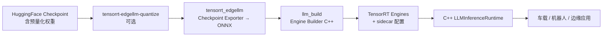

| 阶段 | 组件 | 职责 |
|------|------|------|
| **量化（可选）** | `tensorrt_edgellm/quantization/` | 从 FP16/BF16 生成统一量化 checkpoint（NVFP4/INT4/FP8 KV 等） |
| **导出** | `tensorrt_edgellm/` | **不 trace HF**，自研 model 实现 + safetensors 加载 → ONNX + runtime sidecar |
| **建引擎** | `llm_build`（C++） | ONNX → TensorRT engine（板端） |
| **推理** | `cpp/runtime/` | 自回归 decode、VLM、EAGLE/MTP、LoRA、CUDA Graph |

设计边界（官方文档明确）：**Python 管 export/量化；C++ 管 build + infer**。与 TRT-LLM 的「PyTorch 原生 LLM API 贯穿 compile/runtime」不同。

### 2.1 `tensorrt_edgellm` 导出流程与核心做法

Edge-LLM **不用 HuggingFace `torch.export` / FX trace 原模型**，而是由 `tensorrt_edgellm` 根据 checkpoint **metadata + safetensors 张量** 构造自研 PyTorch 图，再导出为 **ONNX + runtime sidecar**。HF 只提供权重与配置，不参与 forward 语义。

#### 为什么不 trace HF？

| 做法 | HF trace / `optimum` 等 | Edge `tensorrt_edgellm` |
|------|-------------------------|-------------------------|
| 模型定义 | 依赖 `transformers` 实现 | `tensorrt_edgellm/models/` **自研**，与 HF 版本解耦 |
| 图结构 | 随 HF 升级漂移 | export 行为由 Edge 代码 **显式控制** |
| 算子 | 通用 ONNX op | **自定义 op**（`trt::attention_plugin`、INT4 GEMM、NVFP4 DQ 等）一一对应 C++ plugin |
| KV / 投机 | 常需额外包装 | 单 ONNX 覆盖 **prefill + decode**；EAGLE/MTP/FP8 KV 作为图 I/O 与 flag 内置 |
| 量化 | 多种 ad-hoc 路径 | checkpoint metadata 驱动 **统一 loader + repack** |

车载/机器人 **长生命周期 OTA** 要求 export 图稳定；自研 model + 直读 safetensors 避免 transformers 小版本升级导致 trace 图变化。

#### 端到端导出流程

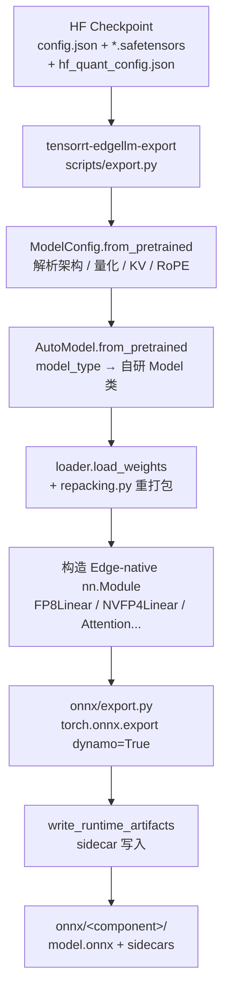

**CLI 一条命令按 `model_type` 拆组件导出**（`tensorrt_edgellm/scripts/export.py`）：

| 组件 | 输出路径 | 说明 |
|------|----------|------|
| LLM backbone | `onnx/llm/model.onnx` | 文本解码器；thinker / talker / code_predictor 等按族映射 |
| Visual encoder | `onnx/visual/model.onnx` | VLM 视觉塔（Qwen-VL、InternVL、Phi4MM…） |
| Audio encoder | `onnx/audio/model.onnx` | ASR / Omni 音频塔 |
| Action expert | `onnx/action/model.onnx` | Alpamayo VLA 动作头 |
| Code2Wav | `onnx/code2wav/model.onnx` | TTS/Omni 声码器 |
| MTP / EAGLE draft | `onnx/mtp_draft/` 等 | `--mtp` / draft 单独目录 |

#### 八步数据流（checkpoint-driven）

1. **读配置**：`config.json` + `model.safetensors.index.json`；多模态时 **promote** 嵌套 `text_config` / `thinker_config` 为 LLM 配置。
2. **构建 `ModelConfig`**：hidden size、head 数、层类型（dense / MoE / hybrid Mamba+Attn）、RoPE、**量化格式**（`hf_quant_config.json`）、FP8 KV flag、EAGLE draft 检测（`draft_vocab_size`）等。
3. **模型分发**：`AutoModel.from_pretrained` 查 `_MODEL_REGISTRY`；未注册则回退 `models/default/CausalLM`；Qwen3-VL、Nemotron-H、Alpamayo 等有专用类。
4. **加载权重**：遍历 safetensors shard，`loader.load_weights` 按 key 填入 `nn.Module` buffer；多模态/ TTS 可做 **key_remap**（如 `talker.codec_embedding` → `embed_tokens`）。
5. **量化 repack**：`repacking.py` 将 ModelOpt AWQ / GPTQ / NVFP4 等 layout 转为 TRT plugin 期望格式（详见量化章节 [§4.2.7](#427-量化权重-repack)）。
6. **可选变换**：`--reduced-vocab-dir` 缩词表；`--fp8-embedding`；`--externalize-weights` 把 INT4 FFN/MoE/LM head 拆为外部 safetensors；`--eagle-base` / `--mtp` 切换图 I/O。
7. **导出 ONNX**：`torch.onnx.export(..., dynamo=True)` + `dynamo_translations.py` 将 `torch.library.custom_op` 译为 ONNX custom node；**一张图**同时服务 prefill（`past_len=0`）与 decode（`past_len>0`）。
8. **写 runtime sidecar**：与 `model.onnx` 同目录，供 `llm_build` / C++ runtime 消费。

#### 自研 Model 层的关键设计

**（1）结构与 HF 对齐，实现完全自有**

- 目录：`tensorrt_edgellm/models/`（`qwen3_vl/`、`nemotron_h/`、`default/`、`eagle3/`、`alpamayo/`…）
- 每层使用 Edge 定义的 `Attention`、`RMSNorm`、`make_linear()` 等，而非 `transformers` 模块。

**（2）Custom Op 桩 + ONNX 翻译**

`models/ops.py` 用 `torch.library.custom_op` 注册 **trace 期占位**（返回正确 shape 的 dummy tensor），export 时译为 TRT 可识别的 ONNX 节点：

| Custom op 域 | 典型用途 | Runtime 对应 |
|--------------|----------|----------------|
| `trt::attention_plugin` | 统一 Attention（vanilla / FP8 KV / EAGLE tree） | `AttentionPlugin` |
| `trt_edgellm::int4_groupwise_gemm` | INT4 AWQ/GPTQ GEMM | INT4 groupwise plugin |
| `trt::DequantizeLinear`（NVFP4） | FP4 权重/激活 DQ | NVFP4 plugin / CuTe kernel |
| `TRT_MXFP8DynamicQuantize` 等 | MXFP8 激活 | Blackwell MXFP8 op |

`onnx/onnx_custom_schemas.py` 在 export 前注册 schema，保证 `llm_build` 与 C++ plugin 签名一致。

**（3）Linear 按 checkpoint 精度分发**

`models/linear.py` 的 `make_linear()` 根据 `QuantConfig` 实例化：

`FP16Linear` / `FP8Linear` / `NVFP4Linear` / `MXFP8Linear` / `AWQLinear` / `GPTQLinear` / `INT8SQLinear` …

每种类的 `forward()` 故意 emit **与 TRT 融合路径匹配的 ONNX 子图**（Q-DQ-MatMul、INT4 GEMM、NVFP4 双级 DQ 等）。

**（4）单图双阶段（Prefill + Generation）**

LLM ONNX 典型 I/O（`onnx/export.py` 文档）：

| 方向 | 张量 | 作用 |
|------|------|------|
| In | `inputs_embeds` [B, seq, H] | token embedding（或 VLM 已融合 multimodal embedding） |
| In | `past_key_values_*` | Linear KV cache |
| In | `rope_rotary_cos_sin` | RoPE 表 |
| In | `context_lengths`, `kvcache_start_index`, `last_token_ids` | 变长 / 增量 decode 控制 |
| Out | `logits` | 采样用 |
| Out | `present_key_values_*` | 更新后 KV |

Hybrid（Nemotron-H / Qwen3.5 GDN）额外暴露 `conv_state` / `ssm_state` I/O。

#### Runtime Sidecar 产物

Export 除 `model.onnx` + `model.onnx.data` 外，`write_runtime_artifacts()` 写入 C++ runtime **不能或不宜塞进 TRT engine 的资产**：

| 文件 | 内容 | 消费者 |
|------|------|--------|
| `config.json` | 归一化后的 runtime 配置（层数、head、RoPE、FP8 KV flag、`vision_config` 等） | `llm_build`、`llm_inference` |
| `embedding.safetensors` | 词表矩阵（FP16 或 `--fp8-embedding`） | C++ embedding lookup（**不进 ONNX 图**） |
| `tokenizer.*` / `tokenizer_config.json` | 分词器 | C++ Tokenizer |
| `chat_template.jinja` / 处理后模板 | 对话格式 | runtime prompt 构造 |
| `vocab_map.safetensors` | 缩词表映射（可选） | LM head 与 tokenizer 对齐 |
| `*_external_weights.safetensors` | 外置 INT4 FFN/MoE/LM head（可选） | 减 engine 体积，runtime 侧加载 |
| LoRA adapter 目录 | `insert_lora` 后生成 | runtime 热切换 adapter |

**metadata 驱动、少靠 CLI flag**：例如 checkpoint 标了 `kv_cache_quant_algo=fp8`，export **自动**在图中打开 FP8 KV，无需 `--fp8-kv` 开关。

#### 与量化 / 下游 build 的衔接

```text
[可选] tensorrt-edgellm-quantize  →  统一量化 checkpoint
                ↓
tensorrt-edgellm-export  →  onnx/{llm,visual,audio,action,...}/
                ↓
llm_build（板端）  →  TensorRT engine + 复制 sidecar
                ↓
llm_inference / action_inference（C++）
```

Export **到此为止**；不 build engine、不跑推理。量化包只写 checkpoint，与 FP16 预训练 checkpoint **走同一套 export 接口**。

#### 典型命令

```bash
# 标准 LLM / VLM
tensorrt-edgellm-export /path/to/checkpoint /tmp/onnx_out

# NVFP4 + FP8 embedding + 缩词表
tensorrt-edgellm-export /path/to/nvfp4_ckpt /tmp/onnx \
  --fp8-embedding \
  --reduced-vocab-dir /path/to/reduced_vocab

# EAGLE base + 外置大权重
tensorrt-edgellm-export /path/to/base /tmp/onnx/base --eagle-base
tensorrt-edgellm-export /path/to/draft /tmp/onnx/draft

# VLA（Alpamayo）：一次导出 llm + visual + action
tensorrt-edgellm-export Alpamayo-R1-10B Alpamayo/onnx --max-kv-cache-capacity 4096
```

#### 设计边界小结

| 归属 `tensorrt_edgellm` | 归属 C++ `llm_build` / runtime |
|-------------------------|--------------------------------|
| 解析 checkpoint metadata | ONNX → TensorRT engine |
| 自研 Model 构图 + 加载/repack 权重 | Plugin / CuTe kernel 选择与融合 |
| Dynamo ONNX export + custom op 翻译 | Prefill/Generation profile、CUDA Graph |
| 写 embedding / tokenizer / config sidecar | Linear KV、采样、投机解码循环 |

**一句话**：Edge export = **用自研 PyTorch 前端「编译」HF 权重**，产出 **plugin 友好的 ONNX 计算图** + **runtime 必需的 sidecar**；HF `transformers` 既不参与 trace，也不是 runtime 依赖。

---

## 3. C++ Runtime 内部分层

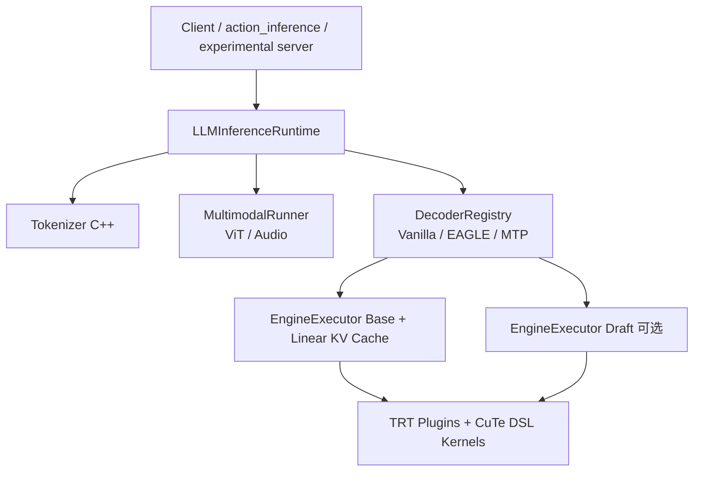

**关键组件**（`TensorRT-Edge-LLM/docs/source/developer_guide/software-design/llm-inference-runtime.md`）：

| 组件 | 作用 |
|------|------|
| `EngineExecutor` | 单 TRT context，**prefill / generation 双 optimization profile** 切换 |
| **Shared Execution Context Memory** | 多 engine **串行共享** TRT workspace（`setContextMemory`，详见 **§3.2**） |
| `Linear KV Cache` | 线性布局 KV（非 TRT-LLM 的 paged/block reuse） |
| `DecoderRegistry` | 可插拔 `VanillaDecoder` / `EagleDecoder` / `MTPDecoder` |
| `MultimodalRunner` | Qwen-VL、InternVL、Phi4MM、Nemotron-Omni 等 |
| `Alpamayo1ActionRunner` | VLA action expert（Alpamayo）；消费 VLM KV + MRoPE deltas，见 **§5** |
| `kernelSrcs/` | CuTe DSL AOT：FMHA、GDN、SSD、GEMM、NVFP4 MoE 等，按 **SM80/87/110/121** 选 artifact |
| `cpp/plugins/` | attention、mamba、NVFP4 MoE、INT4 GEMM 等 **Edge 专用 TRT Plugin** |

推理两阶段：**Prefill（建 KV）→ Generation 循环（采样下一 token）**；可选 **CUDA Graph** 加速 generation。

### 3.1 Linear KV Cache：方案选择、原理与优点

Edge-LLM 采用 **Linear（连续/定长槽位）KV Cache**，由 `KVCacheManager`（文档亦称 Linear KV Cache，`cpp/runtime/kvCacheManager.{h,cpp}`）管理，经 `HybridCacheManager` 与 Mamba 状态统一编排。与 TensorRT-LLM 的 **Paged KV / block pool / 跨请求复用** 是刻意不同的端侧取舍。

#### 什么是 Linear KV Cache？

**原理**：在 GPU 上为每个 attention 层 **一次性预分配** 固定形状的张量，K/V 按序列维度 **连续存放**，通过 `context_lengths` 与 `kvcache_start_index`（运行时绑定为 `kvCacheLengths`）描述「当前有效 token 数」与「写入起点」，而非用 block 表做非连续寻址。

**每层布局**（`KVCacheManager`）：

```text
combined KV: [maxBatchSize, 2, numKVHeads, maxSequenceLength, headDim]
             │              │  │            │                    └── 头维度（可 per-layer 异构）
             │              │  │            └── 最大序列容量（build 时 --maxKVCacheCapacity）
             │              │  └── GQA 的 KV head 数
             │              └── dim=1: K 半区 + V 半区
             └── batch 内每条序列占一行槽位
```

**ONNX / AttentionPlugin 契约**（`tensorrt-plugins.md`）：

- 输入/输出 KV：`[B, 2, H, S, D]`，`S` = **槽位容量**（非当前长度）
- `ContextLengths`：每条序列已写入的有效长度
- `KVCacheStartIndex`：chunked prefill 时的写入偏移；decode 时指向追加位置
- Plugin **原地更新** KV（in-place），与 TRT engine I/O 绑定

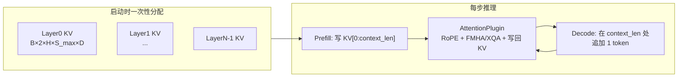

#### 为什么选 Linear，而不是 Paged KV？

| 维度 | **Linear KV（Edge-LLM）** | **Paged KV（TRT-LLM 等数据中心栈）** |
|------|---------------------------|----------------------------------------|
| **目标场景** | 单设备、**BS=1～8**、固定或上界可知的上下文 | 多租户 serving、**动态并发**、超长上下文池化 |
| **内存模型** | build 时定 `maxKVCacheCapacity`，**预分配、可预测** | block 池按需分配/回收，**跨请求共享**空闲块 |
| **调度复杂度** | 无 block 表、无 prefix cache 哈希；runtime **轻量** | KV cache manager、block 分配器、连续 batching 调度器 |
| **算子匹配** | `AttentionPlugin` + fmha_v2 / xqa 针对 **连续 KV** 优化 | Paged attention kernel、disagg prefill/decode |
| **碎片与开销** | batch 内槽位等长，**无块级碎片**；空闲槽位浪费可接受 | 块级复用省显存，但管理/metadata 有成本 |
| **端侧 OTA** | 行为由 `maxKVCacheCapacity` + engine 固定，**易验证** | 池大小与调度策略增加部署调参面 |

**核心动机**：车载/机器人/边缘场景通常是 **少量并发、上下文上限在 product 设计时已知**（如 4K），优先 **低延迟、确定性、C++ runtime 简单可维护**，而非数据中心「成百上千请求拼进同一 GPU」的吞吐问题。Paged KV 的收益（跨请求块复用、变长序列极致省显存）在 BS=1 单用户路径上 **不明显**，却会带来 block 管理、kernel 分支和测试复杂度。

#### 运行时如何工作？

1. **初始化**：`SharedResources` 按 engine config 构造 `KVCacheManager`，`maxSequenceLength = maxKVCacheCapacity`；支持 **per-layer 异构** `numKVHeads` / `headDim`（Gemma4 式混合 head dim）。
2. **新请求**：`resetForNewSequences` 设置各 batch 槽的 `kvCacheLengths`（含 system prompt cache **复用长度**）。
3. **Prefill**：整段 prompt 并行过 TRT engine；AttentionPlugin 将 K/V 写入 `[0, context_len)`；`commitSequenceLength` 提交长度。
4. **Decode**：每步 `context_len += 1`；可用 **CUDA Graph** 固定 launch；KV 指针 **不变**，仅更新 length 元数据。
5. **Batch 结束**：`compactBatch` 将未完成序列 **压缩到靠前槽位**（线性 memcpy/compaction kernel），非 paged 的 block 迁移。
6. **System prompt cache**：同一 system prompt 的 KV 可 **capture/restore** 到内存，跳过后续请求的 prefill 计算（仍占 Linear 槽位内前缀区间）。

Hybrid 模型（Nemotron-H / Qwen3.5）：`HybridCacheManager` 对 attention 层走 Linear KV，对 Mamba 层走 `MambaCacheManager`（conv/ssm state），共享 `kvCacheLengths`。

#### 优点总结

| 优点 | 说明 |
|------|------|
| **实现简单、行为确定** | 无 block pool、无 page table；长度仅用 `context_lengths` / `kvCacheLengths` 标量张量驱动 |
| **与 AttentionPlugin 深度耦合** | fmha_v2（context）、xqa（decode/tree）对 **连续 `[B,2,H,S,D]`** 路径成熟；EAGLE tree attention、FP8 KV 同一 Plugin 覆盖 |
| **预分配、零运行时分配** | 推理热路径 **无 cudaMalloc**；对实时车载 pipeline 友好 |
| **CUDA Graph 友好** | KV 张量地址固定，generation 阶段易 capture 整图 |
| **显存上界可预算** | 总 KV ≈ `2 × Σ_layers (B × H_kv × S_max × D × dtype_bytes)`，便于 SoC 选型 |
| **System prompt cache 自然** | 固定槽位内前缀 KV 可整体 snapshot/restore，降低重复 system prompt 的 TTFT |
| **FP8 KV 路径清晰** | 存储 dtype 在 manager 层选 `kHALF` / `kFP8`；Blackwell 上 FMHA 直连 FP8 张量 |

#### 代价与适用边界

| 局限 | 说明 |
|------|------|
| **显存不随实际 seq 伸缩** | 短对话也占满 `S_max` 槽位；**不适合**超长上下文且序列长度方差极大的多租户云 serving |
| **无跨 engine 实例 KV 共享** | 不像 disaggregated serving 把 KV 块迁到 decode 节点 |
| **batch 内等长容量** | AttentionPlugin 要求 batch 内槽位 **相同 S_max**；变长靠 padding + `context_lengths` 掩码 |
| **超长上下文需提前规划** | 增大 `maxKVCacheCapacity` 线性增加 KV 显存；需 product 级 cap（如 4K/8K） |

#### 与 TRT-LLM 对照（KV 视角）

```text
Edge-LLM:  每请求 ≈ 固定槽位 [0 .. S_max)  连续 KV  →  低延迟单用户
TRT-LLM:   block 池 + paged attention      →  高吞吐多用户、KV 复用与迁移
```

**一句话**：Linear KV 是 Edge **用可预测的预分配连续内存，换取 runtime 简单、kernel 高效、车载可部署性**；Paged KV 是数据中心 **用调度与块管理复杂度，换取多请求显存利用率与 serving 弹性**。

### 3.2 Shared Execution Context Memory（多 Engine 共享 TRT Workspace）

除 §3.1 的 **Linear KV Cache**（Attention 历史 K/V）外，TensorRT `IExecutionContext` 在每次 `enqueue` 时还需要一块 GPU **workspace**（中间激活、plugin scratch、TRT 内部临时 buffer）。Edge-LLM 通过 **`setContextMemory`** 把这块内存改为 **用户预分配、多 engine 共享**，是 VLM / VLA / EAGLE 等多 engine 链式推理的 **端侧显存关键优化**。

#### 3.2.1 它管的是什么？与 KV Cache 的区别

| 内存类型 | 存什么 | 生命周期 | 谁管理 |
|----------|--------|----------|--------|
| **Execution context memory（workspace）** | TRT 推理临时 scratch | 单次 `enqueue` 内有效；engine 间可复用同一块 buffer | `setContextMemory()` |
| **Linear KV Cache** | Attention 的 K/V 历史 | 跨 prefill/decode 步持久 | `KVCacheManager` / `HybridCacheManager` |
| **权重 / Embedding** | 模型参数 | 常驻 | engine constant 或 sidecar（`embedding.safetensors` 等） |

三者 **相互独立**：共享 context memory **不会**共享 KV，也不会共享权重。

#### 3.2.2 Scratch 显存主要用在哪些地方？

`getDeviceMemorySizeV2()` 返回的 workspace 是 TensorRT 在 **单次 `enqueueV3` 执行全图** 时，除 **已绑定的 I/O 张量地址** 之外，仍需在 GPU 上保留的 **临时设备内存峰值**。Edge-LLM 把它整体交给 `setContextMemory`；其内部按 **来源** 可分为三层：

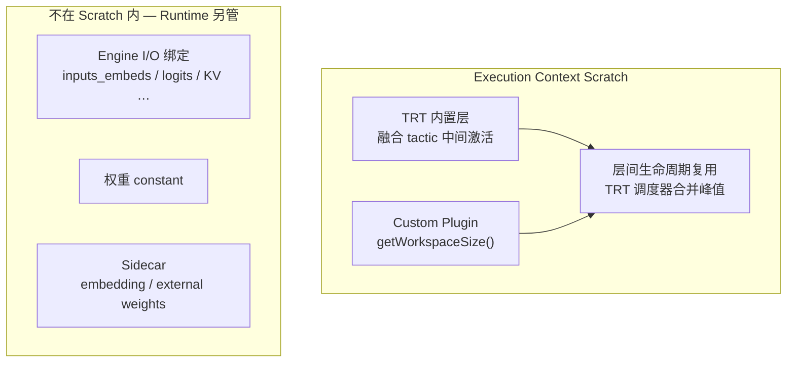

##### （1）不在 Scratch 内的内存（易混淆）

以下由 `LLMEngineRunner` 等在 **enqueue 前** 通过 `setTensorAddress()` 绑定，**不计入** `getDeviceMemorySizeV2()`，但占用 GPU 显存：

| 类别 | 典型张量 | 管理者 |
|------|----------|--------|
| **Linear KV Cache** | `past_key_values_*` / `present_key_values_*`，`[B,2,H,S_max,D]` | `KVCacheManager` / `HybridCacheManager`（§3.1） |
| **输入 / 输出激活** | `inputs_embeds`、`logits`、`hidden_states` | Runtime 预分配 `rt::Tensor`，每步 reshape |
| **控制元数据** | `context_lengths`、`kvcache_start_index`、`last_token_ids` | Runtime 预分配 |
| **RoPE 表** | `rope_rotary_cos_sin` | `LLMEngineRunner` 启动时分配，常驻 |
| **Mamba / GDN 状态** | `conv_state`、`ssm_state`、`h0` | `HybridCacheManager`（与 KV 并列） |
| **权重** | Linear / MoE / LM head 权重 | Engine 内 constant 或 external weights sidecar |
| **Embedding** | 词表矩阵 | `embedding.safetensors` sidecar，C++ lookup |

**结论**：Scratch 是 **「算子算的时候需要的临时垫片」**；KV、embedding、logits 等是 **「业务数据面」**，生命周期更长或跨步持久。

##### （2）TRT 内置层的中间激活

TensorRT build 时会对子图做 **算子融合**（如 Conv+Bias+Act、LayerNorm+MatMul 等）。融合后仍可能有：

- 无法 in-place 的 **中间 feature map**（尤其 prefill 长序列、宽 hidden）
- cuBLAS / cuDNN / TRT tactic 要求的 **算法临时 buffer**（分块 GEMM、reduce 等）

这部分 **没有** Edge 侧显式 `getWorkspaceSize()`，由 TRT 在 build 期根据 optimization profile 的 **min/opt/max shape** 静态估算，并纳入 `getDeviceMemorySizeV2()`。  
**Prefill profile**（`inputs_embeds` seq 可达 `maxInputLen`）通常比 **Generation profile**（seq=1）需要 **更大的 TRT 内置 scratch**。

##### （3）Custom Plugin 的 Scratch（Edge 侧可精确追溯）

Edge-LLM 大量算子走 `cpp/plugins/`，每个 plugin 实现 `getWorkspaceSize()`，在 `enqueue()` 里用 `assignTensorFromWorkspace()` 从同一块 scratch **切片** 使用。Build 时 TRT 按 **optimization profile 的 max shape** 取各 plugin workspace 的峰值并汇总进 `getDeviceMemorySizeV2()`。

**AttentionPlugin**（LLM 每层都有，通常是 **LLM engine workspace 最大头**）：

`attentionPlugin.cpp` 中 `getAttentionWorkspaceSize()` 按 **最坏路径** 累加（注释中的 slot 布局）：

| Slot | Shape | 用途 | 何时用到 |
|------|-------|------|----------|
| 0 | `[B+1]` INT32 | `cuQSeqLens` | Prefill FMHA |
| 1 | `[B+1]` INT32 | `cuKVSeqLens` | Chunked prefill（FMHA_v2） |
| 2 | `[B]` INT32 | `kvCacheEndIdxs` | RoPE + 写 KV |
| 3 | `[B+1]` INT32 | `paddedCuKVSeqLens` | CuTe DSL FMHA bottom-right 对齐 |
| 4 | `[B,2,Hkv,S_max,D]` FP16 | `transposedKV` | **Chunked prefill**：KV layout 转置供 FMHA_v2 读 |
| 5* | `[B,S,Hq,D]` FP8 | `fp8Q` | CuTe FMHA + FP8 KV：RoPE 后 Q 的 FP8 缓冲 |

\* Slot 5 仅在 Blackwell CuTe FMHA + FP8 KV 路径分配。

**量级提示**：Slot 4 与 **单层 KV cache 同阶**（`2×Hkv×S_max×D`）。代码注释写明 chunked prefill 路径 **始终预留** Slot 1–4，即使当前步是普通 prefill——这是 LLM workspace 偏大的原因之一。Decode 走 XQA 时主要读已写入的 Linear KV，plugin workspace 需求 **远小于** prefill。

**NVFP4 MoE Plugin**（Qwen3-MoE / Nemotron MoE，Thor）：

Prefill workspace（`computeNvfp4MoePrefillWorkspaceSize`）按 token 数 `T`、专家数 `E`、topK `K` 预留：

| 区段 | 内容 |
|------|------|
| [A][B] | `topkWeights [T,K]`、`topkIndices [T,K]` |
| [C] | MoE topk softmax 的 radix-sort 等临时区（`numExperts` 非 2 幂时） |
| [D]–[G] | 路由后 **gather** 的 FP4 激活 + block scale |
| [H]–[J] | FC1 输出、激活后再量化 FP4、FC2 输入等 **专家 GEMM 中间态** |

Decode 路径另有 `computeNvfp4MoeDecodeWorkspaceSize`（GEMV 中间 buffer + topk scratch）。  
GB10 上 `Nvfp4MoePluginGeforce` 用 **单 kernel 融合 MoE**，workspace 含 route→FC1→act→quant→FC2 整链 scratch。

**INT4 MoE Plugin**（Orin AWQ MoE）：

`computeInt4MoeWorkspaceSize` 包含：

- TopK 路由权重 / 索引、`topkSoftmax` workspace
- **Marlin** W4A16 GEMM 的排序索引、padding slot、**FP32 reduction buffer**
- 每 slot 的 gate-up / 激活后 / down **中间 FP16 激活** `[totalSlots, …]`

**Gated Delta Net Plugin**（Qwen3.5 hybrid）：

Blackwell 路径：`cu_seqlens [N+1]` + `h0_scratch [N,Hv,kDim,vDim]` FP32（SSM 状态 scratch，**不是**持久 `h0` I/O）。

**Mamba / SSD Plugin**：

Mamba2 prefill 的 chunk-scan 多步 pipeline（cumsum、chunk_state、state_passing、bmm、chunk_scan）需要 **分块 SSM 中间 buffer**，由 `CuteDslSSDRunner::getWorkspaceSize()` 上报。

**ViT Attention Plugin**、**INT4 Groupwise GEMM** 等：部分路径 `getWorkspaceSize() == 0`（直接在 I/O 指针上算，无额外 scratch）。

##### （4）按推理阶段：谁吃 scratch 最多？

| 阶段 | Workspace 主要消耗 | 原因 |
|------|-------------------|------|
| **LLM Prefill** | AttentionPlugin Slot 4（transposedKV）+ TRT 长 seq 融合激活 | `S ≈ maxInputLen`，多层 Attention 在 build 期按 max profile 估峰值 |
| **LLM Decode** | 较小；XQA 读 Linear KV，无 transposedKV | `S=1`；EAGLE 时 tree token 数有上界 |
| **ViT** | ViT FMHA / 变长 `cu_seqlens` | 图像 token 数固定上界，一般 **小于** LLM prefill |
| **MoE 层 Prefill** | NVFP4/INT4 MoE 路由 + 专家中间激活 | 与 `T×K`、专家数相关 |
| **MoE Decode** | GEMV + topk scratch | token 少，通常小于 prefill MoE |
| **Action / Denoise** | 单步 flow-matching 图较小 | 64 waypoint × 10 步在 **runtime 环** 外重复 enqueue，workspace 可复用 |

因此 **共享 context memory 时，瓶颈常常是 `max(LLM_prefill_workspace, ViT_workspace, …)`**，LLM prefill profile 往往决定 `shared_size`。

##### （5）Build Profile 如何放大 Scratch？

`llm_build` 的 optimization profile 直接约束 plugin `getWorkspaceSize()` 的 **max 维**（`attentionPlugin.cpp` 使用 `maxBatchSize`、`maxSeqLen`、`maxKVCacheCapacity`）：

| Profile 参数 | 对 scratch 的影响 |
|--------------|------------------|
| `maxInputLen` ↑ | Attention Slot 5（FP8 Q）、TRT 内置长 seq 激活 ↑ |
| `maxKVCacheCapacity` ↑ | Attention Slot 4（transposedKV）**线性 ↑** |
| `maxBatchSize` ↑ | 各 slot 的 `B` 维 ↑ |
| MoE `maxSeqLen` / token 上界 ↑ | 专家路由与中间激活 ↑ |

**端侧建议**：product 级 cap（如 4K context、BS=1）同时约束 **KV 显存** 与 **workspace 显存**；仅减小 KV 而不收紧 `maxInputLen`/`maxKVCacheCapacity`，workspace 仍可能过大。

##### （6）与 Runtime 外部分配的关系（总显存预算）

单次 LLM 请求 GPU 显存 **粗算**：

```text
总显存 ≈ 引擎权重
       + KV Cache（§3.1，各层预分配）
       + Runtime I/O 张量（embeds / logits / hidden …）
       + max(engine_i workspace)   ← setContextMemory 覆盖部分
       + 其它常驻（RoPE 表、LoRA、system prompt KV snapshot …）
```

`setContextMemory` 只优化 **最后一项**；不能把 KV 或权重「并入」workspace 共享。

#### 3.2.3 `setContextMemory` 接口语义

默认 TRT 行为是 `createExecutionContext()` 时 **内部 `cudaMalloc` workspace**。Edge-LLM 改为 **`ExecutionContextAllocationStrategy::kUSER_MANAGED`**，构造时不分配设备内存，由 runtime 在首次推理前注入：

```cpp
// llmEngineRunner.cpp — 构造时不分配 workspace
mTRTExecutionContext = mEngine->createExecutionContext(
    ExecutionContextAllocationStrategy::kUSER_MANAGED);
// 调用方必须在 execute 前 setContextMemory()
```

配套 API（`LLMEngineRunner`、`EagleDraftEngineRunner`、`MultimodalRunner` 等均提供）：

| API | 作用 |
|-----|------|
| `getRequiredContextMemorySize()` | 返回 **该 engine 单独执行** 所需 workspace 字节数（`ICudaEngine::getDeviceMemorySizeV2()`） |
| `setContextMemory(rt::Tensor& sharedContextMemory)` | 将外部 GPU buffer 绑定到 `IExecutionContext`（`setDeviceMemoryV2`）；`tensor` 容量必须 ≥ `getRequiredContextMemorySize()` |

核心实现（`cpp/runtime/llmEngineRunner.cpp`）：

```cpp
int64_t LLMEngineRunner::getRequiredContextMemorySize() const {
    return mEngine->getDeviceMemorySizeV2();
}

bool LLMEngineRunner::setContextMemory(rt::Tensor& sharedContextMemory) {
    int64_t const requiredSize = getRequiredContextMemorySize();
    if (sharedContextMemory.getMemoryCapacity() < requiredSize) return false;
    mTRTExecutionContext->setDeviceMemoryV2(
        sharedContextMemory.rawPointer(), sharedContextMemory.getMemoryCapacity());
    return true;
}
```

**约束**：`setContextMemory` 必须在 **第一次 `enqueueV3` / `infer()` 之前** 调用；未绑定则 execution context 无有效 workspace。

#### 3.2.4 多 Engine 共享原理

VLM / VLA / 投机解码等场景存在多个 TRT engine（LLM base、EAGLE draft、ViT、Audio、Action…），它们在 `handleRequest` 内 **串行执行、从不并发**。因此各 engine 的 workspace **时间上互斥**，可共用 **一块** GPU buffer：

```cpp
// llmInferenceSpecDecodeRuntime.cpp — 初始化时取 max，再分发给各 runner
int64_t sharedContextMemorySize = std::max({
    baseContextMemorySize, draftContextMemorySize,
    visionContextMemorySize, audioContextMemorySize});
mSharedExecContextMemory = rt::Tensor({sharedContextMemorySize}, ...);
mBaseEngineRunner->setContextMemory(mSharedExecContextMemory);
mDraftEngineRunner->setContextMemory(mSharedExecContextMemory);   // 若有 EAGLE
mVisionRunner->setContextMemory(mSharedExecContextMemory);        // 若有 VLM
```

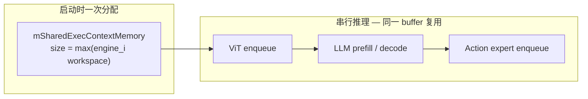

**显存效果**：

```text
不共享：峰值 workspace ≈ Σ_i workspace(engine_i)
共享后：峰值 workspace ≈ max_i workspace(engine_i)
```

对 Jetson / DRIVE **8–32GB 统一内存**，多 engine VLA（如 Alpamayo 的 visual + llm + action，见 **§5**）若不共享，workspace 叠加会显著抬高峰值，影响能否 onboard。

#### 3.2.5 典型使用流程

```text
1. 加载各 engine（LLM / ViT / Draft / Action …）
2. 对每个 runner 调用 getRequiredContextMemorySize()
3. shared_size = max(各 engine 返回值)
4. 分配一块 ≥ shared_size 的 GPU buffer → rt::Tensor
5. 每个 runner 调用 setContextMemory(同一块 buffer)
6. 串行推理：ViT → LLM prefill → decode → Action …
   （同一 buffer 被复用，因不会同时 execute）
```

**覆盖场景**：

| 场景 | 共享的 engine | 代码入口 |
|------|---------------|----------|
| VLM | base LLM + vision（± audio） | `LLMInferenceSpecDecodeRuntime` 构造 |
| EAGLE | base + draft | 同上 |
| TTS Omni | Talker + CodePredictor | `Qwen3OmniTTSRuntime` |
| **VLA Alpamayo** | visual + llm + action | `action_inference` / `LLMInferenceRuntime` 构造（**§5.2**） |

#### 3.2.6 端侧优化归纳

| 优点 | 说明 |
|------|------|
| **降低多 engine 峰值显存** | workspace 从求和变为取 max |
| **零推理热路径分配** | buffer 启动时一次 `cudaMalloc`，推理中不重复分配 workspace |
| **与 KV / CUDA Graph 正交** | KV 地址固定（§3.1）；decode CUDA Graph capture 与 user-managed context 可共存 |
| **部署可预算** | 各 engine `getDeviceMemorySizeV2()` 可在 build 后写入 sidecar，便于 SoC 选型 |

| 注意 | 说明 |
|------|------|
| **必须串行** | 若两 engine 并发 `enqueue` 共用同一 buffer，会数据竞争 |
| **容量取 max** | 共享 buffer 必须 ≥ **每个** engine 单独需求的最大值 |
| **不等于 KV 共享** | Action expert 读 VLM KV 走 `HybridCacheManager` + D2D layout 转换（**§5.7**），与 workspace 无关 |

#### 3.2.7 与 Chameleon / pi05

Chameleon 若将 pi05 拆为 `vit` / `llm` / `denoise` 三个 TRT engine，应借鉴：

1. **Runtime 层**维护一块 `shared_exec_workspace`，三 engine `setContextMemory` 指向同一块 buffer（而非各 engine 默认独立 TRT workspace）。
2. **Manifest** 记录各 stage 的 `required_context_memory_bytes`（compile 后从 TRT engine 查询），便于 onboard 显存预算：`total ≈ weights + KV + max(workspace_i) + activations_peak`。
3. **区分 scratch 与 KV**：pi05 `llm_prefix` 的 `past_key_values` 是 **I/O 绑定**（§3.2.2），不进 workspace；`denoise` engine 的 cross-attention 读 prefix KV 亦同。减小 `maxKVCacheCapacity` 省的是 KV 池，**不自动**缩小 Attention Slot 4（transposedKV）除非 build profile 一并收紧。

**一句话**：`setContextMemory` = 把用户预分配的 GPU workspace 交给 TRT Execution Context；在 **多 engine 串行链式推理** 下用 **一块 max-sized buffer** 替代多次独立分配，是 Edge 端侧 **与 Linear KV 并列的第二类显存优化**。

---

## 4. 针对端侧部署做了哪些工作

### 4.1 平台与精度

| 维度 | Edge-LLM |
|------|----------|
| **硬件** | Jetson Orin/Thor、DRIVE Thor（官方）；Orin + JP6.2+ 兼容 |
| **精度** | **FP16、INT8、INT4（AWQ/GPTQ）、NVFP4** 为主；FP8 KV / FP8 embedding |
| **Build** | **在 Edge 设备上** build engine，针对板端 SM 优化 |
| **Batch** | 以 **BS=1 延迟** 为主；BS=8 测吞吐；EAGLE 在高 batch 收益有限 |

### 4.2 内存与量化（端侧核心）

Edge-LLM 的量化由独立包 `tensorrt_edgellm/quantization/` 完成，底层依赖 **NVIDIA Model Optimizer（ModelOpt）**，输出 **统一 HuggingFace checkpoint**（safetensors + `hf_quant_config.json`），再由 `tensorrt_edgellm` 导出 ONNX 并在板端 build engine。

设计原则：**量化与 ONNX 导出解耦**——量化阶段只做 PyTorch + GPU 校准，不依赖 TRT plugin / C++ runtime；导出阶段按 checkpoint metadata 选择 `FP8Linear` / `NVFP4Linear` / `AWQLinear` 等模块，并在加载后做 **量化权重 repack**（详见 [§4.2.7](#427-量化权重-repack)）。

端侧额外手段（不在 quantizer 内，但同属内存优化链路）：

- **Vocab Reduction**：缩小词表/LM head
- **External weights / embedding sidecar**：大表与 engine 分离加载
- **FP8 Embedding**：在 `tensorrt-edgellm-export --fp8-embedding` 时写入 sidecar

#### 4.2.1 包结构与流水线

```
FP16/BF16 HuggingFace checkpoint
        │
        ▼
tensorrt-edgellm-quantize  (CLI: tensorrt_edgellm/scripts/quantize.py)
        │
        ├─ quantization_configs.py   ← 组装 ModelOpt recipe
        ├─ quantize.py               ← 加载 / 校准 / mtq.quantize / export_hf_checkpoint
        └─ models/                   ← EAGLE3 draft、MTP draft、Qwen3-ASR joint 等
        │
        ▼
量化 checkpoint（safetensors + hf_quant_config.json + tokenizer）
        │
        ▼
tensorrt_edgellm-export  →  ONNX + runtime sidecar
        │
        ▼
llm_build（板端）→ C++ 推理
```

| 文件 | 职责 |
|------|------|
| `quantization_configs.py` | 将 CLI 参数映射为 ModelOpt `quant_cfg`；支持 backbone / lm_head / kv_cache / visual / audio 组合 |
| `quantize.py` | `AutoModel*` 加载、校准 dataloader、`mtq.quantize()`、`export_hf_checkpoint()` |
| `models/eagle3_draft.py` | EAGLE3 draft 自研实现（HF 无此架构），用 base 模型 hidden states 驱动校准 |
| `models/mtp_draft.py` | Qwen3.5 MTP draft 层单独量化 |
| `checkpoint/repacking.py` | 导出前将 ModelOpt 权重 layout 转为 Edge INT4/NVFP4 plugin 期望格式 |

#### 4.2.2 支持矩阵与混合精度

| 组件 | 可选方法 | 说明 |
|------|----------|------|
| **Backbone** | `fp8`, `int4_awq`, `nvfp4`, `mxfp8`, `int8_sq` | 主体 Transformer 层 |
| **LM head** | `fp8`, `int4_awq`, `nvfp4`, `mxfp8` | 可与 backbone 不同精度（混合精度） |
| **KV cache** | `fp8` | 仅 FP8 E4M3；与权重量化独立 |
| **Visual tower** | `fp8` | 需多模态校准（图像+文本） |
| **Audio tower** | `fp8` | Qwen3-ASR；需 ASR 校准（LibriSpeech 等） |
| **Embedding** | — | **不在 quantizer 内**；export 时 `--fp8-embedding` |

常见组合示例：

- `nvfp4` + `nvfp4` lm_head → 全 NVFP4（Thor 主推）
- `nvfp4` + `fp8` kv_cache → NVFP4 权重 + FP8 KV（省显存 + 加速 context FMHA）
- `nvfp4` backbone + `fp8` visual → VLM 视觉塔 FP8、语言塔 NVFP4

**平台约束**（见官方 supported-models）：Jetson Orin 仅 FP16/INT8/INT4；**FP8 / MXFP8 / NVFP4 需 Blackwell 级（Thor）**。

**预量化 checkpoint**：社区 AWQ/GPTQ/ModelOpt 预量化权重可直接 export，**本包不生成 GPTQ**；GPTQ 走 `GPTQLinear` 加载 + repack 路径。

#### 4.2.3 统一量化流程

无论哪种算法，LLM 量化均遵循以下步骤（`quantize_and_export()`）：

1. **加载模型**：`AutoModelForImageTextToText` → `AutoModelForCausalLM` → `AutoModel` 依次尝试；VLM 必须优先 ImageTextToText 以免丢掉 visual tower。特殊模型：Phi4MM（LoRA merge）、Nemotron-H（Mamba patch）、Qwen3-ASR（joint audio+text 校准模型）。
2. **组装 recipe**：`build_quant_config()` 深拷贝 ModelOpt 默认 CFG，再 merge LM head / KV / visual / audio 覆盖项。
3. **校准前向**：用 calibration 数据跑 `forward_loop`，ModelOpt 在各 Linear 上收集 **amax**（或 AWQ/SmoothQuant 专用统计量）。
4. **执行算法**：`mtq.quantize(model, quant_cfg, forward_loop=...)` 按 `algorithm` 字段调用 max / awq_lite / smoothquant 等。
5. **导出 checkpoint**：`export_hf_checkpoint()` 写 safetensors + `hf_quant_config.json`；hybrid 模型（Mamba+Attention）对非 NVFP4 会 skip resmooth（ModelOpt bug workaround）。
6. **下游 repack**：export 时 `checkpoint/loader.py` + `repacking.py` 将 AWQ/GPTQ/NVFP4 转为 TRT plugin layout（详见 [§4.2.7](#427-量化权重-repack)）。

校准数据默认：

| 场景 | 数据集 | batch | 样本数 |
|------|--------|-------|--------|
| 纯文本 LLM | `cnn_dailymail`（可换本地 HF dataset） | AWQ: 16；其余: 1 | 512 |
| VLM + visual FP8 | `lmms-lab/MMMU`（或用户指定图文集） | 1 | min(512, 128) |
| ASR + audio FP8 | `openslr/librispeech_asr` | 1 | min(512, 128) |
| EAGLE3 draft | 同文本集；forward 需 base 模型产出 hidden states | AWQ: 16；其余: 1 | 512 |

#### 4.2.4 算法对比总表（原理与优化维度）

下表从 **端侧 LLM 推理瓶颈** 视角归纳各算法：权重/激活/KV 的 **显存占用**、**访存带宽**、**有效算力（Tensor Core 利用率）**。符号：**◎** 主要优化点，**●** 次要收益，**○** 几乎不涉及，**△** 算法侧精度优化（非硬件直连）。

| 算法 | 格式 | 核心原理（一句话） | 权重大小 | 权重访存带宽 | 激活访存带宽 | 算力/吞吐 | KV 显存 | KV 访存带宽 | 主要缓解瓶颈 | 典型平台 |
|------|------|-------------------|:--------:|:------------:|:------------:|:---------:|:-------:|:-----------:|--------------|----------|
| **FP8** | W8A8 | per-tensor E4M3 量化权重与激活，`max` 校准 amax | ◎ ~50% | ◎ ~50% | ● ~50% | ● FP8 TC（Ada+） | ○ | ○ | **权重显存 + 权重带宽**；长上下文前仍受 KV 限制 | SM89+ |
| **INT4 AWQ** | W4A16 | 仅压权重；`awq_lite` 搜 pre_quant_scale 保精度 | ◎ ~75% | ◎ ~75% | ○ FP16 | ● INT4 GEMM（算/访存比↑） | ○ | ○ | **权重显存 + 权重带宽**；激活仍 FP16，算子多内存访存 | Orin / Thor |
| **NVFP4** | W4A4 | FP4 E2M1 + block FP8 scale；权重/激活均 4bit | ◎ ~75% | ◎ ~75% | ◎ ~75% | ◎ NVFP4 TC | ○ | ○ | **权重带宽 + 激活带宽 + 算力** 三者同时；Thor 主推 | Blackwell |
| **MXFP8** | W8A8* | FP8 E4M3 + E8M0 block scale（block=32） | ◎ ~50% | ◎ ~50% | ● block 动态 | ● MXFP8 TC | ○ | ○ | **权重显存/带宽**；比 per-tensor FP8 精度更好，算力收益弱于 NVFP4 | Blackwell |
| **INT8 SQ** | W8A8 | SmoothQuant 平滑激活离群值后 W8A8 | ● ~50% | ● ~50% | ● INT8 | ● INT8 GEMM | ○ | ○ | **权重显存**（中等）；Orin INT8 路径，算力收益有限 | Orin / A30 |
| **FP8 KV** | KV only | K/V（+Q）FP8 E4M3；与权重量化正交 | ○ | ○ | ○ | ● FP8 FMHA | ◎ ~50% | ◎ ~50% | **KV 显存 + Attention 阶段 KV 带宽**；长上下文/高 batch 收益大 | SM89+ |
| **FP8 Visual** | W8A8（ViT） | 同 FP8，仅 visual/audio 子模块 | ● ViT 权重 | ● ViT 权重 | ● pixel→ViT | ● ViT FP8 | ○ | ○ | **ViT 权重显存/带宽**；需图像校准 | SM89+ |
| **FP8 Embedding** | 表 FP8 | row-block=128 FP8；lookup 时 dequant | ◎ 表 ~50% | ● gather 带宽 | ○ | ○ | ○ | ○ | **大词表 embedding 显存**；export 阶段 sidecar | SM89+ |

\* MXFP8 激活为 **block 动态** 量化，粒度介于 per-tensor FP8 与 NVFP4 之间。

**瓶颈与算法选型（端侧 BS=1 延迟场景）**

| 推理阶段 | 典型瓶颈 | 优先考虑的量化手段 |
|----------|----------|-------------------|
| **Prefill（长 prompt）** | Attention 读 KV 带宽、QKV 写带宽 | FP8 KV；NVFP4/FP8 降权重与激活流量 |
| **Generation（短步、重复）** | 单层 Linear 权重带宽、激活带宽 | NVFP4（Thor）> INT4 AWQ（Orin）> FP8 |
| **模型放不进显存** | 权重 + KV + 激活峰值 | INT4 AWQ / NVFP4 权重；FP8 KV；FP8 Embedding；Vocab Reduction |
| **VLM 首 token 慢** | ViT 权重带宽 + 图像激活 | `--visual_quantization fp8` |
| **精度敏感层** | 量化误差 | LM head 用更高精度（如 NVFP4 body + FP8 head）；AWQ/SQ 的 △ 校准优化 |

**相对 FP16 的资源变化（量级）**

| 算法 | 权重存储 | 单次 Linear 权重读 | 单次 Linear 激活读 | MatMul 有效算力 | 备注 |
|------|:--------:|:------------------:|:------------------:|:---------------:|------|
| FP8 | ÷2 | ÷2 | ÷2（W8A8） | 1.5–2×（有 TC 时） | Edge 部分路径 Q/DQ 后 FP16 MatMul，收益偏存储/带宽 |
| INT4 AWQ | ÷4 | ÷4 | ×1（FP16） | 2–3×（INT4 kernel） | **不算力饱和时** 仍可能 memory-bound |
| NVFP4 | ÷4 | ÷4 | ÷4 | 3–4×（Blackwell TC） | **带宽与算力双优化**；Edge benchmark 吞吐最高 |
| MXFP8 | ÷2 | ÷2 | block÷2 | 1.5–2× | 精度优于 FP8，速度通常不如 NVFP4 |
| INT8 SQ | ÷2 | ÷2 | ÷2 | 1.5–2× | Orin 可用；压缩比低于 4bit |
| FP8 KV | — | — | — | Attention +9–17%（Thor d=128） | 不改变权重；长 seq 显存减半 |

**算法校准目标 vs 硬件优化目标**

| 算法 | 校准/算法在优化什么 | 硬件在优化什么 |
|------|---------------------|----------------|
| FP8 / MXFP8 / NVFP4 | 用 amax（或 block amax）最小化量化误差 | 降低数值位宽 → 减带宽、提 TC 吞吐 |
| INT4 AWQ | △ 搜 α 平衡 weight/act scale，**减重建 MSE** | 4bit 权重 → 减权重带宽与显存 |
| INT8 SQ | △ 搜 per-channel s，**把离群激活迁到权重** | 8bit W&A → 中等压缩 + INT8 GEMM |
| FP8 KV | 收集 K/V/Q amax，**最小化 KV 量化误差** | KV 存储减半；FMHA 读 FP8 张量 |

#### 4.2.5 各量化算法：原理与过程

以下 backbone recipe 均来自 ModelOpt（`modelopt.torch.quantization`），Edge 通过 `quantization_configs.py` 做 submodule 级 wildcard 覆盖。

---

##### FP8（`fp8`）— W8A8，Per-Tensor

**原理**：对 Linear 的 **权重和激活** 均做 FP8 E4M3（4 指数位 + 3 尾数位）量化，各用 **per-tensor** scale。

**ModelOpt 配置**（`FP8_DEFAULT_CFG`）：

```python
"*weight_quantizer": {"num_bits": (4, 3), "axis": None}   # per-tensor FP8
"*input_quantizer":  {"num_bits": (4, 3), "axis": None}
"algorithm": "max"
```

**校准过程**：

1. 校准 forward 收集每层输入/权重的 **amax**（最大绝对值）。
2. `algorithm: "max"`：scale = amax / FP8_E4M3_MAX（448.0）。
3. 权重量化后写入 checkpoint；激活 scale 供 runtime 动态 Q/DQ。

**Runtime 表示**（`FP8Linear`）：`weight` [out,in] fp8 + `weight_scale` / `input_scale` 标量 fp16；ONNX 为标准 `QuantizeLinear` + `DequantizeLinear` + `MatMul`。

**适用**：Ada+（SM89+）；精度与速度折中，显存约为 FP16 的 ~50%（权重侧）。

---

##### INT4 AWQ（`int4_awq`）— W4A16，Weight-Only

**原理**：**Activation-aware Weight Quantization（AWQ）**。激活保持 FP16，仅将权重压到 INT4；利用校准数据估计激活分布，搜索 **pre_quant_scale**（逐输入通道平滑因子），把量化难度从「权重」转移到「易量化的激活侧」，减少 W4A16 误差。

**ModelOpt 配置**（`INT4_AWQ_CFG`）：

```python
"*weight_quantizer": {
    "num_bits": 4,
    "block_sizes": {-1: 128, "type": "static"},  # group_size=128
    "enable": True,
}
"*input_quantizer": {"enable": False}   # W4A16
"algorithm": {"method": "awq_lite", "alpha_step": 0.1}
```

**校准过程**（`awq_lite`）：

1. **收集激活 scale**：校准 forward 中 hook 各 Linear 输入，统计 per-channel amax。
2. **网格搜索 alpha**：对 α ∈ [0, 1]（步长 0.1），计算 `scale_a = weight_scale^(1-α) / act_amax^α`，将 scale 应用到 `pre_quant_scale` 并重算量化误差（MSE）。
3. **选最优 α**：取重建误差最小的 scale，固化 `pre_quant_scale` + INT4 权重 + group-wise scale。
4. Edge 校准 batch_size=**16**（AWQ 需要更多样本稳定 act 统计）。

**Runtime 表示**：两种 layout——

- 社区 **AWQ checkpoint**：`AWQLinear`（`qweight` [in, out//8] int32）→ repack 为 plugin int8 swizzle。
- **ModelOpt 统一导出**：`ModelOptAWQPrepackedLinear`（uint8 预打包 + `pre_quant_scale`）。

**适用**：全平台（Orin/Thor）；7B 级模型在 Orin 上常用；benchmark 上 NVFP4 吞吐通常高于 INT4 AWQ。

---

##### NVFP4（`nvfp4`）— W4A4，Blockwise Dynamic

**原理**：NVIDIA **NVFP4** = **FP4 E2M1**（2 指数 + 1 尾数）权重/激活 + **FP8 E4M3 block scale**。比 INT4 AWQ 更激进（激活也 4bit），但 Blackwell Tensor Core 有原生 NVFP4 路径，Thor 上吞吐最优。

**ModelOpt 配置**（`NVFP4_DEFAULT_CFG`）：

```python
"*weight_quantizer": {
    "num_bits": (2, 1),                              # FP4 E2M1
    "block_sizes": {-1: 16, "type": "dynamic", "scale_bits": (4, 3)},  # group=16, FP8 scale
    "axis": None,
}
"*input_quantizer": { ... 同上 ... }
"algorithm": "max"
```

**校准过程**：

1. 校准 forward 收集 block-wise amax。
2. `max` 算法：每个 **16 元素 block** 计算 FP8 scale，块内 FP4 量化；另有 **global scale**（`weight_scale_2` / `input_scale`）。
3. Export 后 **requantize_resmooth_fused_llm_layers**：对共享输入的 Linear（如 GDN/MoE 投影）**对齐 per-tensor scale 以便 TRT 融合 GEMM**；hybrid 模型上 NVFP4 **必须** resmooth，INT4 AWQ 则 skip（Mamba dummy forward bug）。

**Runtime 表示**（`NVFP4Linear`）：

- `weight` [out, in//2] int8（两个 FP4 nibble/byte）
- `weight_scale` [out, in//16] fp32（block scale）
- `weight_scale_2` 全局 fp32；`input_scale = amax / (6.0 * 448.0)`

MoE 专家权重额外经 `repack_nvfp4_qwen3_moe_experts_*` 打包为 `Nvfp4MoePlugin` N-major layout。

**适用**：Blackwell（SM100/110/121）；Thor 主推精度。

---

##### MXFP8（`mxfp8`）— Microscaling FP8

**原理**：**OCP Microscaling Format**：FP8 E4M3 数值 + **E8M0（8-bit 指数、0 尾数）block scale**，block_size=**32**。比 per-tensor FP8 更细粒度，比 NVFP4 保守。

**ModelOpt 配置**（`MXFP8_DEFAULT_CFG`）：

```python
"num_bits": (4, 3),
"block_sizes": {-1: 32, "type": "dynamic", "scale_bits": (8, 0)},  # E8M0 scale
"algorithm": None   # 纯 max 校准，无 AWQ/SQ 后处理
```

**校准过程**：block-wise 动态量化；权重 checkpoint 已是 FP8+E8M0；激活 runtime 经 `TRT_MXFP8DynamicQuantize` 动态量化。

**Runtime 表示**（`MXFP8Linear`）：`weight` fp8e4m3fn + `weight_scale` uint8 [out, in//32]。

**适用**：Blackwell；需 SM100+ 与对应 TRT custom op。

---

##### INT8 SmoothQuant（`int8_sq`）— W8A8

**原理**：**SmoothQuant** 通过 per-channel **pre_quant_scale** 将激活离群值「平滑」到权重侧，使 W8A8 在 INT8 GEMM 上精度可接受。公式：`Y = (X / s) · (s · W)`，s 由激活/权重 amax 联合决定。

**ModelOpt 配置**（`INT8_SMOOTHQUANT_CFG`）：

```python
"*weight_quantizer": {"num_bits": 8, "axis": 0}    # per-channel 权重
"*input_quantizer":  {"num_bits": 8, "axis": None}  # per-tensor 激活
"algorithm": "smoothquant"
```

**校准过程**：

1. 先 max-calibrate 收集 per-channel 激活 amax。
2. `smoothquant` postprocess：对每层 Linear 计算 scale_a，写入 `pre_quant_scale`，重量化权重为 INT8。
3. 仅支持 **8bit 权重 + 8bit 激活 + per-channel 激活** 组合。

**Runtime 表示**（`INT8SQLinear`）：`weight` int8 [out,in] + `weight_scale` [out] + `input_scale` + `pre_quant_scale` [in]；ONNX 为 Q-DQ-MatMul 融合友好格式。

**适用**：Orin INT8 路径；显存节省小于 4bit，但精度通常优于 W4。

---

##### FP8 KV Cache（`kv_cache_quantization=fp8`）

**原理**：不量化权重，仅量化 **Attention 写入 KV cache 的 K/V tensor** 为 FP8 E4M3，prefill 时校准 Q/K/V 的 amax，runtime 存 FP8、算 attention 时 dequant。

**ModelOpt 配置**（merge `FP8_KV_CFG` + `FP8_ATTN`）：

```python
"*[kv]_bmm_quantizer": {"num_bits": (4, 3), "axis": None}   # K/V BMM 输出
"*q_bmm_quantizer":   {"num_bits": (4, 3), "axis": None}     # Q 也量化（Blackwell FMHA 直连 FP8）
"algorithm": "max"
```

**校准过程**：

1. 与 backbone 量化同一 forward_loop。
2. 每层收集 K/V（及 Q）amax → scale = amax / 448.0。
3. metadata 写入 checkpoint；export **无需额外 flag**，`tensorrt_edgellm` 自动启用 FP8 KV ONNX 路径。

**Runtime 收益**（Thor）：KV 显存 ~50%；context FMHA 9–17% 加速（d=128）；Q 量化 fused 进 RoPE kernel。

**注意**：部分模型（Qwen2.5-7B 等）末层 KV amax 极大，FP8 KV 可能掉精度，需 per-model 验证。

---

##### Visual / Audio Tower FP8

**原理**：与 backbone FP8 相同（E4M3 per-tensor），但通过 wildcard 仅作用于 visual/audio 子模块：

```python
# visual: *visual* / *vision_tower* / *vision_model* / *multi_modal_projector* / *mlp1* / *image_embed*
# audio:  *audio_tower* / *audio_embed*
```

**关键约束**：**必须用多模态校准**，否则 visual quantizer 的 activation scale 未初始化。

- Visual：`--visual_quantization fp8 --dataset lmms-lab/MMMU`
- Audio（Qwen3-ASR）：`--audio_quantization fp8`，默认 LibriSpeech 流式 (audio, transcript) 对

默认情况下 visual/audio/TTS（`*code_predictor*`, `*code2wav*`）pattern **被 disable**，避免误量化。

---

##### FP8 Embedding（export 阶段，非 quantizer）

**原理**：词表 embedding 矩阵按 **row-block（block=128）** 量化为 FP8 E4M3，lookup 时 dequant 到 FP16。

**流程**：`tensorrt-edgellm-export --fp8-embedding` 写 `embedding.safetensors` sidecar，不改 ONNX 主图权重；build 时自动检测。

可与 NVFP4/INT4 权重量化叠加，进一步压缩大 vocab 模型显存。

---

#### 4.2.6 Recipe 组装逻辑（`build_quant_config`）

`build_quant_config()` 是 Edge 相对 ModelOpt 的核心封装：

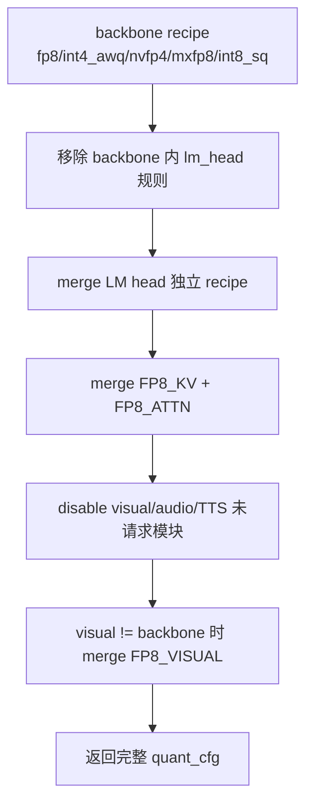

**LM head 独立配置原因**：LM head 对精度敏感且体积大（vocab × hidden），常需与 body 不同精度（如 NVFP4 body + FP8 head）。实现上 **禁止** 在 LM head override 里写 global `"default": {"enable": False}`，否则会覆盖 body 已 enable 的 quantizer（历史 bug）。

#### 4.2.7 量化权重 Repack

> **本节摘要**  
> Repack 解决 **「checkpoint 里怎么存」与「GPU kernel 怎么读」** 的不一致：`safetensors` 载入自研 `Linear` 模块后，`apply_all_repacking()` 把 buffer **原地改成** Plugin/CuTe kernel 期望 layout，再 export ONNX → `llm_build`。  
> **不改变量化数学含义**（fold zero-point、转置 scale 等等价变换）；不做 repack 则 INT4 **数值全错**，不是慢一点的优化问题。  
> Repack 在 **export 加载后** 执行，不在 `tensorrt-edgellm-quantize` 阶段。

| 要解决什么 | Repack 怎么做 |
|------------|----------------|
| AWQ 列打包 `[in, out//8]`，GPTQ 行打包 `[in//8, out]` | 统一 swizzle 为 `[out//2, in]` int8 |
| Plugin 用 `(nibble-8)×scale`，AWQ/GPTQ 用 `(nibble-qzero)×scale` | 把 `qzero` **烘进 nibble** |
| GPTQ `desc_act` / `g_idx` | 重排权重 + `int4_act_perm` 对齐激活 |
| MoE 每专家独立 NVFP4 scale | dequant → interleave(up,gate) → N-major pack |
| ModelOpt AWQ 用 uint8 预打包 | 解包后走同一 `_pack_intweights` |

**六步流水线**（`apply_all_repacking`，顺序不可打乱）：  
① `_stack_moe_experts` → ② `_repack_awq_weights` → ③ `_repack_gptq_weights` → ④ `_cast_modelopt_awq_prepacked` → ⑤ `_cast_fp8_linear_scales` → ⑥ `_cast_nvfp4_weights`

**代码位置**：`tensorrt_edgellm/checkpoint/repacking.py`（与 `models/linear.py` 模块类型一一对应）。

---

**展开说明**

**Repack（重打包）** 指：checkpoint 里的量化权重按 **HF / ModelOpt / 社区 AWQ·GPTQ** 的存储 layout 读入后，在 export 前 **原地变换** 为 Edge **TRT Plugin / CuTe kernel 能直接消费** 的字节布局。数值语义不变（通过 fold zero-point、转置 scale 等保证），变的是 **内存排列与 dtype 视图**。

```text
safetensors（多种来源格式）
        │  loader.load_weights：按 key 填入 FP8Linear / AWQLinear / NVFP4Linear ...
        ▼
apply_all_repacking()   ← checkpoint/repacking.py
        │  swizzle / stack / cast / interleave
        ▼
自研 Model buffer（Plugin 期望 layout）
        │  forward() → custom op → ONNX 节点
        ▼
llm_build → C++ INT4 GEMM / NVFP4 MoE kernel 读同一 layout
```

**为什么需要 Repack？**

| 矛盾 | 说明 |
|------|------|
| **Checkpoint 格式不统一** | 社区 AWQ 用 `[in, out//8]` int32 **列打包**；GPTQ 用 `[in//8, out]` **行打包**；ModelOpt 统一导出用 uint8 预打包；NVFP4 是 FP4 nibble + FP8 block scale |
| **Kernel 只认一种 layout** | `Int4GroupwiseGemmPlugin` 要求 `[out//2, in]` int8 **swizzle** 后布局；kernel 内部用 `(nibble - 8) × scale` 解码 |
| **Zero-point 约定不同** | AWQ/GPTQ 的 `qzeros` 与 plugin 的 `-8` 偏置不一致 → repack 时 **把 zero 烘进 nibble**，避免 runtime 再查表 |
| **MoE 要融合专家** | 逐专家 GPTQ/NVFP4 权重需 **stack + interleave(up,gate)** 成单块 buffer 供 `Nvfp4MoePlugin` / `Int4MoePlugin` |
| **ONNX/TRT 类型细节** | 如 NVFP4 `uint8→int8` view cast，避免部分 importer 对 UINT8 initializer 处理错误 |

Repack **不在量化阶段做**（`tensorrt-edgellm-quantize` 只写 ModelOpt 统一 checkpoint）；**在 export 加载权重后做**，使量化包与社区预量化 checkpoint **共用同一 export 路径**。

##### 调用时机与流水线

`loader.load_weights()` / `load_submodule_weights()` 在 **所有 tensor 赋值完成后** 调用 `apply_all_repacking(model)`。顺序 **不可打乱**（`repacking.py` 注释明确要求）：

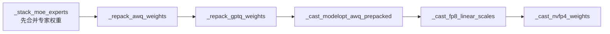

| 步骤 | 作用 | 为何顺序重要 |
|------|------|--------------|
| **1. MoE stack** | 各 expert 的 GPTQ int32 / NVFP4 合并为 plugin 级大 tensor | 需要 **repack 前** 的原始 `qweight`；合并后 per-expert `qweight=None`，后续 GPTQ repack **跳过** |
| **2–3. AWQ/GPTQ** | int32 列/行打包 → int8 swizzle | 依赖完整 `qweight`+`qzeros` |
| **4. ModelOpt AWQ** | uint8 预打包 → 同一 swizzle | ModelOpt 与社区 AWQ 存储不同，目标 layout 相同 |
| **5–6. FP8/NVFP4 cast** | scale dtype、weight view | 轻量，放最后 |

##### 各格式 Repack 详解

**1. 社区 AWQ（`AWQLinear`）— `repack_awq_to_plugin`**

```text
输入: qweight [in, out//8] int32, qzeros [in//g, out//8] int32
输出: qweight [out//2, in] int8（swizzled）
```

步骤：

1. **解包 nibble**：每个 int32 含 8 个 4bit 权重；按 AutoAWQ 的 bit→channel 置换表 `_AWQ_BIT_TO_CH` 还原到 `[in, out]`
2. **Fold zero-point**：plugin 算 `(nibble - 8) × scale`，AWQ 算 `(nibble - qzero) × scale` → 调整 `nibble' = nibble - qzero + 8`
3. **转置** `[in,out] → [out,in]`（N×K）
4. **`_pack_intweights`**：K 维 32/64 块内 permute、N 维 4 行交织、4 nibble 压进 int16 → 再 view 为 `[out//2, in]` int8

**2. GPTQ（`GPTQLinear`）— `repack_gptq_to_plugin`**

```text
输入: qweight [in//8, out] int32（行打包，与 AWQ 正交）
输出: qweight [out//2, in] int8 + int4_act_perm
```

与 AWQ 类似解包 + fold zero（含 `zero_point_offset` 处理 GPTQ 存 `zero` vs `zero-1` 差异）。额外：

- **`g_idx` / `desc_act`**：按 group 重排 K 维行 → 生成 `int4_act_perm`；forward 里对激活 `index_select(-1, perm)`，使 GEMM 输入通道顺序与 swizzle 权重对齐

**3. ModelOpt 统一 AWQ（`ModelOptAWQPrepackedLinear`）— `_cast_modelopt_awq_prepacked`**

```text
输入: weight [N//2, K] uint8（ModelOpt pack_int4_in_uint8，two's complement nibble）
输出: weight [N//2, K] int8（与上相同 swizzle）
```

- uint8 高低 nibble → 有符号 nibble → `+8` 转 plugin 约定 → `_pack_intweights`
- `weight_scale`：`[N, K//g]` → 转置为 `[K//g, N]` fp16（plugin 期望）
- `pre_quant_scale`：cast fp16（ONNX Mul 节点 dtype）

**4. FP8（`FP8Linear`）— `_cast_fp8_linear_scales`**

- 仅将 `input_scale` / `weight_scale` cast 为 **fp16 标量**（ModelOpt 有时写 fp32）；权重本身已是 fp8e4m3fn，**无 swizzle**

**5. NVFP4 稠密层（`NVFP4Linear`）— `_cast_nvfp4_weights`**

- `weight`：`uint8 → int8` **view cast**（比特不变，满足 ONNX/TRT 路径）
- block scale / global scale 在 export 的 `trt::DequantizeLinear` 中使用；稠密层 **无** INT4 式 K/N swizzle

**6. NVFP4 / INT4 MoE 专家 — `_stack_moe_experts` + `repack_nvfp4_qwen3_moe_experts_*`**

MoE 的 gate/up/down 在各 expert 上 **独立 NVFP4 量化**（各自 `weight_scale_2`）。Plugin 要做 **融合 SwiGLU FC1**，必须：

1. `decode_modelopt_nvfp4`：每专家权重 **dequant 到 fp32 稠密**
2. **Interleave**：按 32 列 chunk 交错 `[up_chunk, gate_chunk]` 沿 FC1 的 N 轴
3. **`_nvfp4_pack_n_major`**：repack 为 CuTeDSL `Nvfp4MoePlugin` 的 **N-major** 字节序（prefill GEMM + decode GEMV 共用一块 buffer）

Thor（`sm_110`）与 GeForce（`sm_121`）各有一套 pack 函数；export 时 `--nvfp4-moe-backend` 选择。

INT4 MoE 走 **Marlin layout**（`_extract_gptq_for_marlin`），同样需先 stack 再 swizzle。

##### `_pack_intweights` 在做什么？

这是 INT4 repack 的 **核心 swizzle**：把逻辑上的 `[N, K]` nibble 矩阵变成 **GPU INT4 GEMM kernel 的访存模式**：

- K 方向 32 元块内重排（匹配 warp 读数）
- 每 8 个 K 内 `[0,1,2,3,4,5,6,7] → [0,2,4,6,1,3,5,7]`
- N 方向每 4 行与 K 方向 64 元块 **交织**
- 4 个 nibble 压入一个 int16

**不做 repack 的后果**：数值上仍是 INT4，但 kernel 按错误通道读 nibble → **结果全错**；这不是可选优化，而是 **正确性前提**。

##### Repack vs 量化 vs Export

| 阶段 | 输入 | 输出 | 是否改数值语义 |
|------|------|------|----------------|
| **quantize** | FP16 权重 | ModelOpt 统一 safetensors | 是（量化误差） |
| **repack** | 各类量化 layout | Plugin layout | 否（等价变换 + fold zero） |
| **export ONNX** | repack 后 buffer | custom op 图 | 否（图结构） |
| **llm_build** | ONNX | TRT engine | 否（融合） |

##### 与 Chameleon 的类比

Chameleon 若接入 Edge plugin 或自研 INT4/NVFP4 kernel，也需要类似的 **`KernelArtifactSpec` + repack pass**：checkpoint 格式与 kernel layout 解耦，在 **compile 前** 做一次 layout 变换。Edge 把这件事集中在 `checkpoint/repacking.py`，与 `models/linear.py` 的模块类型一一对应。

#### 4.2.8 特殊量化路径

| 路径 | 说明 |
|------|------|
| **EAGLE3 draft** | `tensorrt-edgellm-quantize draft`；自研 `Eagle3DraftModel`；校准需 base 模型 forward 产出 3 层 hidden states concat |
| **MTP draft** | Qwen3.5 检测到 `mtp_num_hidden_layers>0` 时先 `quantize_mtp_from_base()`，再 quantize base，MTP 权重经 `extra_state_dict` 合入 |
| **Hybrid（Nemotron-H / Qwen3.5 GDN）** | INT4 AWQ skip resmooth；NVFP4 **保留** resmooth（GDN 输入投影融合必需） |
| **预量化 GPTQ/AWQ** | 跳过 `mtq.quantize`；loader 直接读社区格式 |
| **Phi4MM** | 量化前需 LoRA merge（`load_phi4mm_model`） |

---

**小结**：Edge 量化栈 = **ModelOpt 算法层** + **Edge recipe 组装** + **多模态/ASR 校准** + **export repack**。Orin 走 INT4 AWQ / INT8 SQ；Thor 走 NVFP4 + FP8 KV 为主力；混合精度与 submodule 级 FP8 visual 是 VLM 端侧部署的常见组合。

### 4.3 算子与 Kernel（`kernelSrcs`）

Edge-LLM 的高性能算子分两层：

| 层级 | 路径 | 形态 | 特点 |
|------|------|------|------|
| **CuTe DSL AOT** | `kernelSrcs/*_cutedsl/` + `build_cutedsl.py` | `libcutedsl_{arch}.a` + `.h` | Python 编写 → AOT 编译 → CMake 静态链接；**板端 build 无需 Python** |
| **预编译 CUBIN** | `kernelSrcs/fmha_v2/`、`kernelSrcs/xqa/` | `.cubin` 嵌入 C++ | 源自 TensorRT-LLM；多 SM 模板实例化；Orin/Ampere **context/decode attention 回退路径** |

此外还有 `cpp/plugins/`（AttentionPlugin、Int4GroupwiseGemmPlugin、Nvfp4MoePlugin 等）和 `cpp/kernels/` 中的 RoPE、采样等非 DSL 内核。本文聚焦 **`kernelSrcs`**。

```text
kernelSrcs/build_cutedsl.py  (CUDA 12.x + GPU 上运行一次)
        │
        ▼
cpp/kernels/cuteDSLArtifact/{x86_64|aarch64}/sm_<NN>/
  libcutedsl_*.a + include/cutedsl_all.h + metadata.json
        │
        ▼
cmake -DENABLE_CUTE_DSL=ALL  →  AttentionPlugin / GDN / Mamba / MoE / Talker MLP
```

**端侧约束**：多数 CuTe DSL kernel 在 **BS=1** 路径验证最充分；按 `supported_sms` 只为目标 SM 编译 artifact（`sm_87` Orin、`sm_110` Thor、`sm_121` GB10）。

#### 4.3.1 要解决什么问题？

端侧 LLM 推理的算子瓶颈与数据中心不同：

| 瓶颈 | 典型场景 | kernelSrcs 对策 |
|------|----------|-----------------|
| **Context Attention 带宽/算力** | 长 prompt prefill | FMHA（CuTe DSL Blackwell + fmha_v2 cubin 回退）；FP8 KV 直连 FMHA |
| **Decode Attention 延迟** | 每步 1 token | XQA：针对 GQA/MQA 的 generation-phase kernel |
| **Hybrid 线性注意力** | Qwen3.5 / Nemotron-H GDN 层 | GDN decode/prefill；MTP 多 token 验证变体 |
| **Mamba/SSM 长序列** | Nemotron-H Mamba2 层 | SSD chunk-scan prefill |
| **NVFP4 MoE 吞吐** | Qwen3-MoE、Nemotron MoE | 分组 GEMM + 融合 MoE（Thor vs GB10 两套后端） |
| **Talker MLP** | Qwen3-TTS talker | 替代 cuBLAS 的 shape 特化 GEMM |
| **EAGLE 树形 attention** | 投机解码 verify | XQA `SPEC_DEC` + AttentionPlugin tree 模式 |

核心优化方向：**融合**（少 kernel launch、少中间 buffer）、**访存布局匹配 Linear KV**、**按 SM 特化**（TMA/UMMA/cp.async）、**AOT 去 Python 依赖**。

#### 4.3.2 Kernel 组总览

| 组名 | 目录 | 主要算子 | 目标 SM | 优化阶段 | 典型模型/模块 |
|------|------|----------|---------|----------|---------------|
| **fmha** | `fmha_cutedsl_blackwell/` | Context FMHA + ViT FMHA | SM100+ | Prefill / ViT | Qwen3、VLM visual；FP8 KV |
| **fmha_v2** | `fmha_v2/` | Context FMHA（cubin） | SM80–121 | Prefill | Orin/全平台 **CuTe 回退** |
| **xqa** | `xqa/` | Decode MHA/GQA + tree attn | SM80–121 | Generation | 全 LLM；EAGLE |
| **gdn** | `gdn_cutedsl/` | Gated Delta Net | SM80+ | Prefill + Decode | Qwen3.5 hybrid |
| **ssd** | `ssd_cutedsl/` | Mamba2 SSD chunk scan | SM80+ | Prefill | Nemotron-H/Nano |
| **gemm** | `gemm_cutedsl/` | FP16 GEMM `C=A@B^T` | SM80/110/121 | TTS MLP | Qwen3-Omni talker |
| **nvfp4_moe** | `nvfp4_moe_cutedsl/` | MoE FC1+FC2 分组 GEMM | SM100/110 | MoE prefill | Qwen3-30B-A3B、Nemotron |
| **nvfp4_moe_decode** | `nvfp4_moe_cutedsl/` | MoE decode GEMV | SM100+ | MoE decode | 小 routed batch |
| **nvfp4_fused_moe** | `nvfp4_fused_moe_cutedsl/` | 端到端融合 MoE | SM120/121 | Prefill+Decode | GB10 GeForce MoE |

CMake：`-DENABLE_CUTE_DSL=ALL`（客户构建默认）；或按组启用 `fmha;gdn;gemm` 等。

#### 4.3.3 各组：问题、原理、场景

---

##### FMHA — Context 阶段融合多头注意力

**解决什么问题**

- Prefill 时 attention 占 **算力 + KV 读写** 大头；通用实现 launch 多、难融合 RoPE+写 KV。
- VLM 需要 **变长图像 token** 的 bidirectional attention。
- Blackwell 上 **FP8 KV** 需直接读 FP8 张量，避免反复 dequant。

**优化原理**

| 技术 | 作用 |
|------|------|
| **Fused KV layout** `[B,2,H_kv,S,D]` | 与 Linear KV Cache、AttentionPlugin 一致；省 layout 转换与临时分配 |
| **Persistent scheduling** | 提高 SM 占用，长序列 prefill 更饱和 |
| **Bottom-right causal align** | 支持 chunked prefill + 常规模型统一掩码 |
| **Sliding Window 编译期分支** | `fmha_d*_sw` 变体；无 SWA 时去掉左侧 window 代码 |
| **Runtime 动态 B/S/H** | batch、seq、head 数运行时可变，AOT 仍单 kernel |
| **RoPE + WriteKV 融合** | Q 写 KV 与 RoPE 合一；FP8 KV 时 Q→FP8 **零额外 kernel** |

**变体**：LLM d64/d128（±SWA）；ViT d64/d72/d80/d128（`cu_seqlens` 变长、双向）。

**适用场景**：LLM **prefill**；VLM **visual encoder**；**FP8 KV** context attention（Thor）。

**平台**：CuTe DSL FMHA **SM100+ 主路径**；其余走 **fmha_v2 cubin 回退**。

---

##### FMHA_v2 + XQA — 预编译 CUBIN（Attention 双阶段）

**FMHA_v2（context）**

- 源自 TensorRT-LLM `fmha_v2`，`GENERATE_EDGE_LLM=1` patch 后预编译多 SM `.cubin`。
- **问题**：在不支持 Blackwell CuTe FMHA 的 GPU 上仍要 **高性能 prefill**。
- **原理**：head_dim × seq_len × GQA 比 **模板实例化**；contiguous Q/KV 对齐 Edge Linear KV。
- **场景**：Jetson Orin、Ada；Blackwell 上 CuTe 加载失败时的 **fallback**。

**XQA（decode）**

- Generation **seq_len≈1**，context FMHA 效率差；XQA 专为 **MQA/GQA decode** 优化。
- **原理**：`OPTIMIZE_FOR_LATENCY`；linear KV（`TOKENS_PER_PAGE=0`）；**tree attention**（EAGLE verify）。
- **场景**：自回归 **每步 decode**；**EAGLE/MTP 验证**。

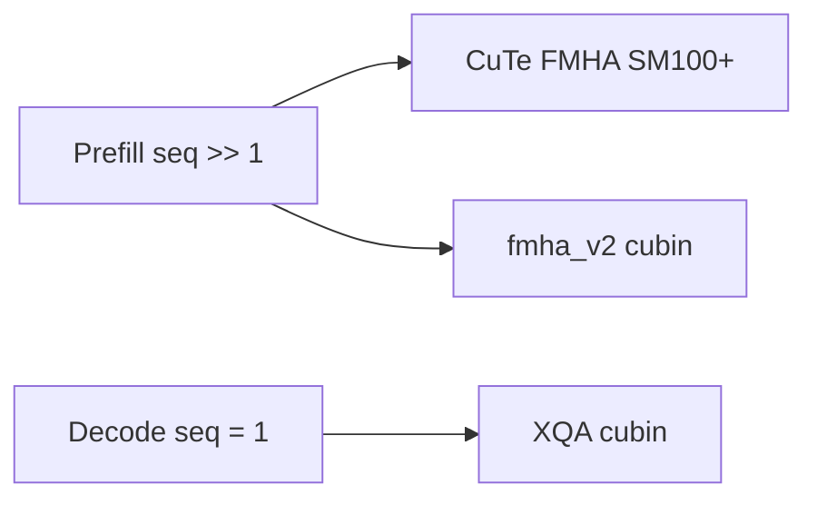

---

##### GDN — Gated Delta Net

**问题**：Qwen3.5 等 **hybrid 层**非标准 Attention；decode/prefill 需更新 SSM 状态 `h0`。

**原理**：`gdn_decode`（seq=1）；`gdn_prefill`（`context_lengths` mask）；`gdn_prefill_blackwell`（TMA，SM100+）；`gdn_decode_mtp`（MTP 验证+回滚）。

**场景**：**Qwen3.5** GDN 层；MTP speculative。

**平台**：SM80+；Blackwell prefill 用 TMA 变体。

---

##### SSD — Mamba2 Chunk Scan

**问题**：Mamba2 prefill 为 **分块 SSM scan**，非 attention。

**原理**：5 步 pipeline（CHUNK=128）：cumsum → chunk_state → state_passing → bmm → chunk_scan；Blackwell 用 TMA/TMEM/WGMMA；`has_init_states` 支持 chunked prefill。

**场景**：**Nemotron-H / Nano** Mamba2 层 prefill。

**平台**：SM80+；Blackwell d64 原生，d128 回退 SM80 路径。

---

##### GEMM — Talker MLP

**问题**：TTS talker 小 batch cuBLAS 开销大。

**原理**：Ampere（cp.async+MMA）/ Thor（UMMA+TMA）/ GB10（WGMMA）三套 `C=A@B^T` FP16 GEMM。

**场景**：**Qwen3-TTS / Qwen3-Omni talker**。

---

##### NVFP4 MoE — 三套后端

| 后端 | 问题 | 原理 | 场景 | SM |
|------|------|------|------|-----|
| **nvfp4_moe** | 多专家 NVFP4 分组 GEMM + 融激活 + scatter | FC1 N-major grouped GEMM；FC2 finalize scatter-reduce | Qwen3-MoE prefill | 100/110 |
| **nvfp4_moe_decode** | decode routed 行少 | K 并行 GEMV | MoE generation | 100+ |
| **nvfp4_fused_moe** | 分解式多次 launch | 单 kernel：route→FC1→act→quant→FC2→scatter | GB10 MoE | 120/121 |

MoE 权重 layout 依赖 export 阶段 **repack**（§4.2.7）与 plugin 一致。

---

#### 4.3.4 优化原理归纳

| 原则 | 体现 |
|------|------|
| **算子融合** | FMHA+KV；RoPE+WriteKV；MoE 融激活/scatter |
| **布局匹配** | 对齐 Linear KV `[B,2,H,S,D]` 与 MoE N-major 权重 |
| **编译期特化** | head_dim、SWA、激活、SSD 的 D×N、分 SM artifact |
| **运行期灵活** | B、seq、context_lengths 运行时传入 |
| **AOT 静态链接** | 板端无 Python/CuTe 依赖 |
| **分层回退** | CuTe FMHA → fmha_v2 cubin |

#### 4.3.5 平台启用建议

| 平台 | `ENABLE_CUTE_DSL` | 关键 kernel |
|------|-------------------|-------------|
| **Orin** sm_87 | `gdn;ssd;gemm`（按需） | fmha_v2 + XQA；INT4 plugin |
| **Thor** sm_110 | `ALL` | CuTe FMHA、FP8 KV、NVFP4 MoE、GDN、SSD |
| **GB10** sm_121 | `gemm;nvfp4_fused_moe` | GeForce GEMM + fused MoE |

```bash
python kernelSrcs/build_cutedsl.py --kernels fmha --gpu_arch sm_110 --arch aarch64
cmake .. -DENABLE_CUTE_DSL=ALL -DEMBEDDED_TARGET=auto-thor
```

#### 4.3.6 与 Chameleon 的关联

- Chameleon **fmha_d256** 占位与 Edge **FMHA/XQA 分工**同类：context vs decode 分 kernel。
- Hybrid/MoE 模型需评估是否引入 GDN/SSD/NVFP4 MoE 同类 **AOT artifact**。
- Edge 的 **SM 绑定 artifact** 与 Chameleon `PlatformSpec` + `KernelArtifactSpec` 可直接对齐。

**小结**：`kernelSrcs` 围绕 **Linear KV、BS≈1、已知 SM** 做融合与布局优化；TRT-LLM 更依赖 trtllm-gen/Triton 与 paged batching，Edge 用 **CuTe DSL AOT + cubin 双轨** 服务车载/嵌入式路径。

### 4.4 模型与模态（端侧产品化）

自研 `tensorrt_edgellm/models/`，覆盖：

| 类型 | 示例 |
|------|------|
| LLM | Qwen3、Llama、Nemotron-H、MoE |
| VLM | Qwen2.5-VL、Qwen3-VL、InternVL、Phi4MM |
| Omni | Qwen3-Omni、Nemotron-Omni（视觉+音频+文本） |
| ASR / TTS | Qwen3-ASR、Qwen3-TTS |
| **VLA** | **Alpamayo-R1-10B**（VLM + action expert 链式，详见 **§5**） |
| Speculative | EAGLE3 draft、MTP draft |

### 4.5 端侧特性（非数据中心刚需）

| 特性 | 说明 |
|------|------|
| **Shared Execution Context Memory** | 多 engine 串行共享 TRT workspace（`setContextMemory`，详见 **§3.2**） |
| **System Prompt Cache** | 固定 system prompt 的 KV 复用 |
| **LoRA** | 图插入 + runtime 切换 adapter |
| **EAGLE / MTP 投机解码** | 仅两种；BS=1 收益明显 |
| **Streaming** | 流式输出 |
| **C++ Tokenizer** | 部署不依赖 Python tokenizer |
| **experimental server** | OpenAI 兼容 API（仍偏实验） |

### 4.6 导出哲学（稳定性）

Checkpoint Exporter **不用 HF tracing**：

- 自研 `ModelConfig` + safetensors 直读
- 自定义 ONNX op → C++ plugin 一一对应
- 量化格式在 loader 里 **repack** 成 runtime 布局

避免 transformers 版本漂移——这对 **车载长生命周期 OTA** 很重要。

---

## 5. VLA C++ 推理流程（以 Alpamayo 为例）

当前 Edge-LLM **唯一落地的 VLA** 为 [nvidia/Alpamayo-R1-10B](https://huggingface.co/nvidia/Alpamayo-R1-10B)（`alpamayo_r1`）。架构为 **Qwen3-VL VLM backbone + flow-matching action expert**，**不是**端到端单 engine，而是 **三 engine 链式、一次 `handleRequest` 跑完**。

> GR00T / Isaac-GR00T 等在仓库中 **尚无** 对应 export / runner；下文均以 Alpamayo 实现为准。

### 5.1 组件与目录

| 组件 | Export 输出 | Build 产物 | C++ 类 |
|------|-------------|-----------|--------|
| LLM backbone | `onnx/llm/` | `engines/llm/` | `LLMInferenceRuntime` + `EngineExecutor` |
| Visual encoder | `onnx/visual/` | `engines/visual/` | `QwenViTRunner`（`MultimodalRunner::create`） |
| Action expert | `onnx/action/` | `engines/action/` | `Alpamayo1ActionRunner` |

**入口**：`examples/multimodal/action_inference.cpp` → `LLMInferenceRuntime::handleRequest()`。

```bash
tensorrt-edgellm-export Alpamayo-R1-10B onnx/ --max-kv-cache-capacity 4096
# 板端分别 llm_build / visual_build / action_build
./build/examples/multimodal/action_inference \
  --engineDir engines/llm --multimodalEngineDir engines \
  --inputFile input_action.json --outputFile output_action.json
```

**输入**：image 列表 + text + **past trajectory** `[x,y,z]`。  
**输出**：`output_text`（CoT）+ `output_trajectory`（64 个 `(accel, kappa)` waypoint）。

### 5.2 端到端流水线

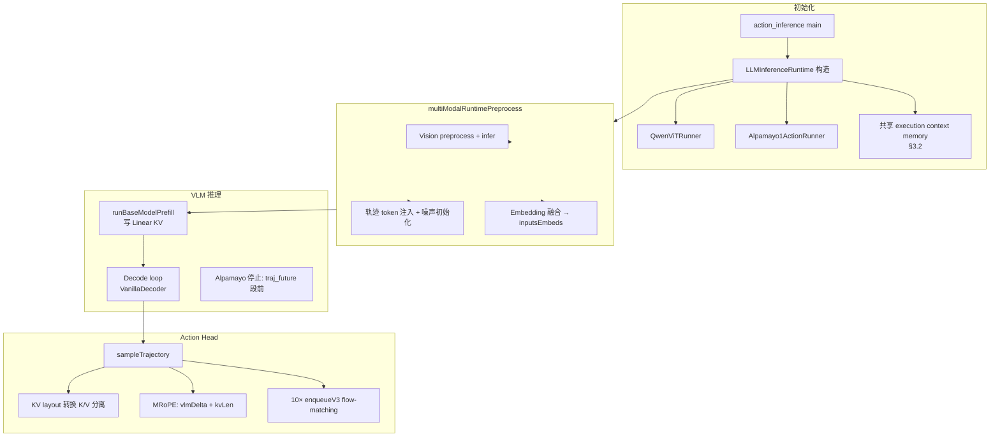

**与纯 VLM 的差异**：decode 结束后多一步 **action head**；decode **停止条件** 与 **KV 复用** 为 VLA 专有。

### 5.3 初始化：三 engine + 共享显存

`LLMInferenceRuntime` 构造时（`llmInferenceRuntime.cpp`）：

1. 从 `multimodalEngineDir/visual` 加载 `QwenViTRunner`；
2. 从 `multimodalEngineDir/action` 加载 `Alpamayo1ActionRunner`；
3. **校验** action 与 LLM 的 `max_kv_cache_capacity` 必须一致（export/build 期 `--max-kv-cache-capacity` 与 `llm_build --maxKVCacheCapacity` 对齐）；
4. LLM / vision / action **串行执行**，共用一块 `max(base, vision, action)` 的 **execution context memory**（`setContextMemory`，详见 **§3.2**），降低端侧显存峰值。

### 5.4 阶段一：多模态预处理

`multiModalRuntimePreprocess()` 顺序固定：

| 步骤 | 实现 | VLA 作用 |
|------|------|----------|
| Vision | `QwenViTRunner::preprocess` → `infer` | 图像 → vision embedding + **MRoPE rope deltas** |
| 轨迹 | `Alpamayo1ActionRunner::preprocess` | 将 `<\|traj_history_start\|>…<\|traj_history_end\|>` 内 pad 替换为 **量化轨迹 token**；初始化 diffusion **噪声轨迹** |
| Tokenize | vision/audio runner 或纯文本 encode | 得到 `batchedInputIds` |
| Embedding | 后续 prefill 中 `mEmbeddingPre->embed` | vision embedding 写入 image token 位置 |

轨迹量化：`action_utils::trajectoryToTokenIds()` 将连续 `[x,y,z]` 历史转为离散 token（ego 坐标系相对差分）。

### 5.5 阶段二：LLM Prefill

`runBaseModelPrefill()` 走标准 Edge 多模态 prefill：

1. `mEmbeddingPre->embed()` — text + vision 融合为 `inputsEmbeds`；
2. `mStepPreparer->prepare(kPrefill)` — context lengths、KV 绑定；
3. `mBaseExecutor->execute()` — TRT prefill profile，**AttentionPlugin / FMHA** 写 **Linear KV** `[B,2,H,S,D]`；
4. `commitSequenceLength()` — 提交有效序列长度；
5. 从 prefill logits **采样第一个 decode token**。

本阶段复用 §3.1 Linear KV、§4.3 FMHA/XQA 等通用优化；Alpamayo backbone 为 Qwen3-VL，走标准 attention + **MRoPE**。

### 5.6 阶段三：LLM Decode（VLA 特化停止）

Decode 经 `VanillaDecoder::decodeStep()`：每步 `inputsEmbeds [BS,1,H]` → engine → 采样 1 token → append 到 `tokenIds` → `commitSequenceLength(+1)` 写 KV。

#### 5.6.1 Alpamayo 序列里各段 token 干什么？

Alpamayo 在 Qwen3-VL 词表上扩展了 **轨迹专用 special token**（export 时 `checkpoint_utils.py` 加入）：

| Token | 作用 |
|-------|------|
| `<\|traj_history_start\|>` … `<\|traj_history_end\|>` | **输入**：历史 egomotion，runtime 把 `<\|traj_history\|>` pad 换成离散 `<i0>`…`<i767>` |
| `<\|cot_start\|>` | **生成起点**：export 时在 generation prompt 末尾自动追加（`chat_template.py`） |
| （CoT 正文） | VLM **自回归生成**的 Chain-of-Causation 推理文本 |
| `<\|cot_end\|>` | CoT 段结束标记 |
| `<\|meta_action_start\|>` … `<\|meta_action_end\|>` | 可选 meta-action 段（训练格式中存在） |
| `<\|traj_future_start\|>` | **未来轨迹段起点**——LM 训练序列与 action expert 的分界 |
| `<\|traj_future_pre_tkn\|>` | future 段前缀 token（训练格式中紧跟 `traj_future_start`） |
| `<\|traj_future\|>` × 64 | 训练时 LM 用离散 token 表示未来轨迹；**推理时由 action expert 扩散去噪替代** |
| `<\|traj_future_end\|>` | future 段结束 |

官方 Alpamayo 推理（PyTorch）也是 **VLM rollout 生成 CoT → 抽出 KV cache → action expert 做 flow-matching**；future 的 64 个 waypoint **不由 VLM 逐步自回归生成**。

#### 5.6.2 精确停止条件（代码语义）

每轮 decode 顺序：`decodeStep()`（采样并 **append** 新 token）→ `updateFinishStates()`。

```cpp
// llmInferenceRuntime.cpp — 当 action runner 为 ALPAMAYO1 时，不用 EOS 判定结束
if (context.tokenIds[i].size() > 1
    && context.tokenIds[i][context.tokenIds[i].size() - 2] == trajFutureStartId) {
    context.finishedStates[i] = 1;  // trajFutureStartId = <|traj_future_start|>
}
```

设 `tokenIds = [..., A, <|traj_future_start|>, B]`（`B` 为 **刚采样到的最后一个 token**）时触发停止。

含义：

- **已写入 KV**：prefill 全段 + CoT 生成段 + `<|traj_future_start|>` + **`B`（通常为 `<|traj_future_pre_tkn|>`）**
- **尚未生成**：64 个 `<|traj_future|>` 离散轨迹 token 及 `<|traj_future_end|>`

注意：不是「见到 `<|traj_future_start|>` 就停」，而是 **多生成 1 个结构 token 后停**——与 PyTorch 侧 VLM 停止时 KV 长度对齐。

#### 5.6.3 为什么不靠 EOS？

| 若用 EOS | 问题 |
|----------|------|
| 标准 chat EOS（如 ``） | Alpamayo CoT/future 段用 **专用 delimiter**，generation 结束点不是 chat EOS |
| 不设停止、一直 decode | 模型会按训练格式继续吐 **64 个 `<\|traj_future\|>`** + `traj_future_end`——与 action expert **重复且表示不同**（离散 LM token vs 连续 flow-matching） |
| 在 `<\|cot_end\|>` 停 | 可能缺少 `traj_future_start` / `pre_tkn` 等结构 token，**KV 长度与 action head 训练时不一致** |

因此 Edge-LLM 对 Alpamayo **禁用 EOS 结束路径**，改用 `traj_future_start` 边界检测（仅当 `mActionRunner` 为 `ALPAMAYO1` 时）。

#### 5.6.4 「CoT 完整」指什么？

- **Prefill** 结束于 `<\|cot_start\|>`（generation prompt 注入）。
- **Decode** 自回归生成 CoT 正文直至模型学到 emit `<\|cot_end\|>`，再继续 meta / future 结构 token。
- 停止点在 **future 离散轨迹 token 开始之前**，因此正常收敛时 **CoT 段（`cot_start`…`cot_end`）已完整生成**。
- 用户可见文本：`tokenizer.decode(outputIds, skipSpecial=true)`，`output_text` 主要为 CoT 推理（special token 被跳过）。

若采样中途偏离训练分布、未生成 `cot_end` 就触达 future 边界，CoT 可能不完整——这是 **模型采样问题**，不是停止逻辑本身的目标。

#### 5.6.5 「KV 停在 action head 边界」指什么？

Action expert（`sampleTrajectory`）**不再跑 VLM**，而是：

1. 读取 `HybridCacheManager` 里 **已 commit 的 KV 长度** `kvLen`；
2. 逐层 D2D 拷贝 VLM combined KV → action engine 分离 K/V；
3. 64 个 diffusion waypoint 作为 **新 query**，对 `[0, kvLen)` 做 **cross-attention**（非因果，读全长 prefix KV）；
4. MRoPE 起点：`basePos = vlmRopeDelta + kvLen`（waypoint 接在 VLM 序列之后）。

```text
KV cache 时间线：

[Prefill]  image + text + traj_history  →  KV 写入
[Decode]   cot 文本 + 结构 token       →  KV 逐步 +1
[Stop]     含 traj_future_start + pre_tkn，不含 64×traj_future
           kvLen ────────────────────────────────┐
                                                ▼
[Action]   10× flow-matching；waypoint 位置从 kvLen 起算
```

若 KV **过长**（生成了 64 个 LM traj token）：action 读到的上下文与训练不一致，attention mask / 位置编码错位。  
若 KV **过短**（在 `cot_end` 就停）：缺少 future 段结构 token，同样与 PyTorch reference 不对齐。

#### 5.6.6 与 PyTorch `sample_trajectories_from_data_with_vlm_rollout` 的对应

| PyTorch | Edge-LLM C++ |
|---------|--------------|
| `vlm.generate(..., stopping_criteria=...)` 在 future 轨迹 LM 段之前停 | `updateFinishStates` 检测 `traj_future_start` 边界 |
| 取出 `past_key_values` / prompt cache | `HybridCacheManager` + `getSeparateKVCacheForDecoderLayer` |
| `expert(..., past_key_values=prompt_cache)` 64 步扩散 | `Alpamayo1ActionRunner::sampleTrajectory` 10× `enqueueV3` |

**Decode 侧通用优化**：

| 优化 | 说明 |
|------|------|
| **XQA** | generation-phase attention，Q 长度=1，K/V 读全长 cache |
| **CUDA Graph** | `action_inference` 启动时 `captureDecodingCUDAGraph()` |
| **无 Eagle** | `action_inference` 不支持 speculative decode |

### 5.7 阶段四：Action Head `sampleTrajectory`

Decode 结束且请求含 `pastTrajectory` 时，`handleRequest` 末尾调用：

```cpp
// 取 QwenViTRunner 的 MRoPE deltas + HybridCacheManager 中的 VLM KV
mActionRunner->sampleTrajectory(stream, activeBatchSize, kvcache, ropeDeltas);
```

**核心实现**（`alpamayo1ActionRunner.cpp`）：

| 步骤 | 做法 | 优化意图 |
|------|------|----------|
| **KV 复用** | 直接绑定 VLM prefill+decode 后的 `HybridCacheManager` | **不重跑 backbone** |
| **Layout 转换** | VLM combined `[B,2,H,S,D]` → action ONNX 分离 K/V，逐层 **D2D deinterleave** | 匹配 action engine I/O |
| **MRoPE 延续** | `basePos = vlmRopeDelta[b] + kvLength[b]`，waypoint 位置从此起算 | 与 VLM 序列位置一致 |
| **去噪循环** | Export **单步** flow-matching ONNX；runtime **10 次** `enqueueV3`，上步输出作下步噪声输入 | 图小、步数 runtime 可控 |
| **输出** | 64 waypoint × `(accel, kappa)` | 供下游控制/规划 |

**Export/Build 配合**（`tensorrt_edgellm/models/alpamayo/`）：

- 单步 denoise ONNX + TRT native attention ops（`attention_onnx` / `kv_cache_update_onnx` / `rope_onnx`）；
- `action_build` 为 noise/KV/RoPE 设动态 batch profile；
- 当前仅 **FP16**。

### 5.8 与纯 LLM / VLM 对比

| 维度 | 纯 LLM / VLM | VLA (Alpamayo) |
|------|--------------|----------------|
| Engine 数 | 1–2 | **3**（llm + visual + action） |
| 输入 | text / image / audio | + **past trajectory** |
| 预处理 | vision/audio runner | + **轨迹 token 替换 + 噪声 init** |
| Decode 停止 | EOS / max_length / stop_strings | + **`traj_future_start` 边界**（含其后 1 结构 token，不含 64×`traj_future`） |
| Decode 之后 | 结束 | + **`sampleTrajectory`** |
| KV cache | 仅服务 LLM | **LLM 写 → Action 读**（layout 转换） |
| MRoPE | ViT + LLM | **Action 延续 VLM rope delta** |

### 5.9 VLA 优化归纳

```text
┌─────────────────────────────────────────────────────────────┐
│ 系统级                                                       │
│  · 三 engine 串行 + 共享 context memory（省显存，§3.2）          │
│  · KV cache 复用（VLM → Action，仅 layout 转换）              │
│  · KV capacity 构建期校验                                    │
│  · CUDA Graph capture decode                                 │
│  · NVTX / TIME_STAGE（kACTION_INFERENCE 等）                 │
├─────────────────────────────────────────────────────────────┤
│ VLM backbone（同 Qwen3-VL）                                   │
│  · Linear KV + FMHA prefill + XQA decode                     │
│  · MRoPE、变长 image tokens                                  │
├─────────────────────────────────────────────────────────────┤
│ Action expert（VLA 专有）                                     │
│  · 单步 ONNX + 10 步 runtime 去噪                            │
│  · MRoPE 从 vlmDelta+kvLen 延续                              │
│  · 轨迹连续量 → 离散 token                                   │
└─────────────────────────────────────────────────────────────┘
```

### 5.10 与 Chameleon / pi05

- Edge **Alpamayo VLA** ≈ Chameleon **vit → llm_prefix → action_expert** 三 stage 链式；Edge 已 **export / build / `action_inference` 一条龙**。
- pi05 若走 Edge 路径：可参考 **分 engine + `LLMInferenceRuntime` 链式调用**，而非 TRT-LLM serving 栈。
- Action head 的 KV 读取与 MRoPE 延续，与 Chameleon action expert **消费 prefix KV** 的设计同类。

### 5.11 关键代码路径

| 路径 | 内容 |
|------|------|
| `cpp/runtime/llmInferenceRuntime.cpp` | `handleRequest`、`multiModalRuntimePreprocess`、Alpamayo 停止、action 调用 |
| `cpp/action/alpamayo1ActionRunner.{h,cpp}` | 轨迹预处理、KV 转换、`sampleTrajectory` |
| `cpp/multimodal/qwenViTRunner.*` | Qwen3-VL visual + MRoPE deltas |
| `cpp/runtime/decoding/vanillaDecoder.cpp` | 标准 decode 循环 |
| `cpp/builder/actionBuilder.cpp` | Action TRT engine 构建 |
| `examples/multimodal/action_inference.cpp` | CLI 入口、CUDA Graph、noise seed |
| `tensorrt_edgellm/models/alpamayo/` | Action ONNX export |
| `tensorrt_edgellm/scripts/export.py` | `_export_action`、`_export_alpamayo_visual` |
| `docs/.../examples/vla.md` | 端到端工作流 |

---

## 6. 与 TensorRT-LLM（数据中心）的核心差异

| 维度 | **TensorRT-Edge-LLM** | **TensorRT-LLM** |
|------|------------------------|------------------|
| **定位** | Jetson / DRIVE **单设备**嵌入式 | **数据中心 GPU**（H100/B200 等）高吞吐服务 |
| **Runtime 形态** | **C++ 为主**，无 PyTorch 依赖的生产路径 | **PyTorch 原生** LLM API + C++ executor |
| **服务集成** | 示例 + experimental server | **Triton**、**NVIDIA Dynamo**、disaggregated serving |
| **并行** | 基本 **单 GPU** | **TP/PP/EP/CP** 多卡多节点 |
| **调度** | 简单 batch，prefill/gen 两 profile | **In-Flight Batching**、**Paged Attention**、chunked prefill、KV block reuse |
| **KV Cache** | **Linear KV Cache** | **Paged KV**、KV cache manager V1/V2、跨请求 reuse |
| **编译/Build** | ONNX → TRT，**板端 build** | PyTorch → TRT-LLM graph / torch compile；也可 TRT engine |
| **量化重点** | INT4/NVFP4 + 小显存技巧（vocab reduction、FP8 KV） | FP8/**NVFP4**（B200）、ModelOpt、广泛 PTQ 路径 |
| **投机解码** | **EAGLE + MTP** 两种 | EAGLE3、MTP、NGram、PARD、DFlash、SA、Medusa 等 |
| **稀疏 Attention** | 文档/能力较少强调长上下文稀疏 | RocketKV、DSA、Skip Softmax 等完整框架 |
| **模型广度** | 精选模型族 + 显式 registry | **Day-0** 大量模型、DiT/视觉生成等 |
| **多模态** | VLM/ASR/TTS/Omni/**VLA** 端侧一条龙 | 多模态 + **Visual Generation（FLUX/Wan）** 等 |
| **Kernel 策略** | CuTe DSL **AOT + Edge plugin**，SM/tag 固定 | trtllm-gen、CUTLASS、大量 datacenter kernel |
| **典型 Batch** | 1（延迟）～8 | 连续 batching、高并发 |
| **依赖** | 部署 runtime **轻** | Python 生态 + 完整 serving 栈 |

一句话：**TRT-LLM 解决「机房里怎么把 LLM 服务跑得又大又快」；Edge-LLM 解决「车里/机器人上怎么在有限显存里把模型跑起来且可 OTA」**。

---

## 7. 架构对照图

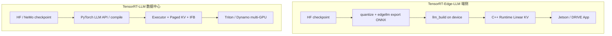

---

## 8. 和 Chameleon / pi05 的关系（简要）

- Edge-LLM 的 **Alpamayo VLA**（详见 **§5**）与 Chameleon 的 **vit → llm_prefix → action_expert** 拆分同类，但 Edge 是 **官方 export/build/runtime 一条龙**。
- pi05 若走 Edge 路径：可参考其 **分 engine + 链式 runtime**，而非 TRT-LLM 的 LLM serving 栈。
- Edge-LLM **不提供** TRT-LLM 级别的通用 `LLM()` Python API、paged batching；**提供** 更小 footprint 的 C++ 与 Orin 定制 kernel。

---

## 9. 关键路径索引

| 仓库 | 路径 |
|------|------|
| Edge 总览 | `TensorRT-Edge-LLM/docs/source/overview.md` |
| C++ Runtime | `docs/.../cpp-runtime-overview.md`、`llm-inference-runtime.md`、`cpp/runtime/kvCacheManager.{h,cpp}` |
| **Shared context memory（§3.2）** | `cpp/runtime/llmEngineRunner.{h,cpp}`、`llmInferenceSpecDecodeRuntime.cpp`、`cpp/multimodal/multimodalRunner.{h,cpp}` |
| **AttentionPlugin workspace 布局** | `cpp/plugins/attentionPlugin/attentionPlugin.cpp`（`getAttentionWorkspaceSize`） |
| **MoE plugin workspace** | `cpp/plugins/nvfp4MoePlugin/`、`cpp/plugins/int4MoePlugin/` |
| **VLA 推理（§5）** | `cpp/runtime/llmInferenceRuntime.cpp`、`cpp/action/alpamayo1ActionRunner.cpp`、`examples/multimodal/action_inference.cpp` |
| Checkpoint 导出 | `docs/.../checkpoint-export.md`、`tensorrt_edgellm/scripts/export.py` |
| Checkpoint / Repack | `tensorrt_edgellm/checkpoint/loader.py`、`checkpoint/repacking.py` |
| CuTe DSL / kernelSrcs | `kernelSrcs/`、`kernelSrcs/build_cutedsl.py`、各组 `README.md` |
| FMHA / XQA cubin | `kernelSrcs/fmha_v2/`、`kernelSrcs/xqa/` |
| VLA 示例 / 工作流 | `docs/.../examples/vla.md` |
| Alpamayo export | `tensorrt_edgellm/models/alpamayo/`、`export.py` 中 `_export_action` |
| TRT-LLM 总览 | `TensorRT-LLM/docs/source/overview.md` |
| TRT-LLM 特性 | paged attention、disagg、parallel、speculative-decoding 等 `docs/source/features/` |
